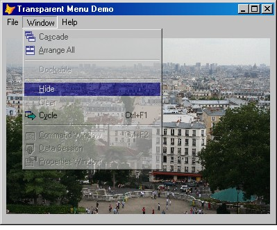

[ Home ](https://github.com/VFPX/Win32API)  

# Testing Transparent Menu Class with top-level form (requires VFP9)

## Note that this document contains some links to the old news2news website which does not work at the moment. This material will be available sometime in the future.

## Before you begin:
The code creates top-level form with a menu. An instance of the [MenuManager class](sample_496.md) is used to make this menu semi-transparent. The form records menu-related window messages to a cursor and displays them in a listbox.  

  

Before testing the following code, save another code sample, [MenuManager class](sample_496.md), to MenuManager.prg module.

  
***  


## Code:
```foxpro  
oForm = CREATEOBJECT("Tform")
oForm.Visible=.T.
READ EVENTS

DEFINE CLASS Tform As Form
PROTECTED hOrigProc, hWindow
	hOrigProc=0
	hWindow=0
	Width=450
	Height=400
	Autocenter=.T.
	ShowWindow=2
	Caption="Transparent Menu Demo"
	menumanager=0

	ADD OBJECT lst As ListBox WITH;
	Left=5, Top=5, Width=440, Height=326,;
	FontName="Courier", FontSize=8
	
	ADD OBJECT chRecord As CheckBox WITH Value=.F.,;
	Left=16, Top=344, Autosize=.T., BackStyle=0,;
	Caption="Record Messages"

	ADD OBJECT cmdClearList As CommandButton WITH;
	Left=350, Top=340, Width=80, Height=27, Caption="Clear List"
	
PROCEDURE Init
	THIS.menumanager = NEWOBJECT("MenuManager", "MenuManager.prg")
	THIS.menumanager.SetAlphaOpacity(156)
*!*	*	THIS.menumanager.DisableAlphaOpacity
*!*		THIS.menumanager.EnableTransparentColor(THIS.BackColor)

	_screen.Visible=.F.
	THIS.DefineMenu

PROCEDURE Destroy
	CLEAR EVENTS
	_screen.Visible=.T.

PROCEDURE Activate
	IF THIS.hWindow=0
		THIS.hWindow=THIS.HWnd
		THIS.menumanager.SetHook(THIS.hWindow)

		THIS.CreateCursor
		= BINDEVENT(THIS.menumanager, "OnWindowProc",;
			THIS, "OnWindowMessage")
		
		WITH THIS.lst
			.ColumnCount=4
			.ColumnWidths="60,160,100,100"
		ENDWITH

		DECLARE INTEGER SetForegroundWindow IN user32 INTEGER hwnd
		SetForegroundWindow(THIS.hWindow)
	ENDIF

PROCEDURE OnWindowMessage(hWindow as Integer, nMsgID as Integer,;
	wParam as Integer, lParam as Integer)
#DEFINE WM_DRAWITEM 0x002B
#DEFINE WM_COMMAND 0x0111
#DEFINE WM_MENUSELECT 0x011F
#DEFINE WM_ENTERMENULOOP 0x0211
#DEFINE WM_EXITMENULOOP 0x0212
#DEFINE WM_INITMENU 0x0116
#DEFINE WM_INITMENUPOPUP 0x0117
#DEFINE WM_UNINITMENUPOPUP 0x0125

	IF NOT THIS.chRecord.Value
		RETURN
	ENDIF

	LOCAL cMsgName, cIdx
	
	DO CASE
	CASE nMsgId=WM_DRAWITEM
		cMsgName="WM_DRAWITEM"
	CASE nMsgId=WM_COMMAND
		cMsgName="WM_COMMAND"
	CASE nMsgId=WM_MENUSELECT
		cMsgName="WM_MENUSELECT"
	CASE nMsgId=WM_ENTERMENULOOP
		cMsgName="WM_ENTERMENULOOP"
	CASE nMsgId=WM_EXITMENULOOP
		cMsgName="WM_EXITMENULOOP"
	CASE nMsgId=WM_INITMENU
		cMsgName="WM_INITMENU"
	CASE nMsgId=WM_INITMENUPOPUP
		cMsgName="WM_INITMENUPOPUP"
	CASE nMsgId=WM_UNINITMENUPOPUP
		cMsgName="WM_UNINITMENUPOPUP"
	OTHERWISE
		cMsgName=TRANSFORM(nMsgId,"@0")
	ENDCASE

	INSERT INTO csMessages VALUES (cMsgName,;
		TRANSFORM(m.wParam,"@0"), TRANSFORM(m.lParam,"@0"))

	cIdx = PADL(TRANSFORM(RECCOUNT("csMessages")),6,"0")
	
	WITH THIS.lst
		.AddItem(m.cIdx,1)
		.List(1,2)=m.cMsgName
		.List(1,3)=csMessages.wParam
		.List(1,4)=csMessages.lParam
	ENDWITH

PROCEDURE cmdClearList.Click
	ThisForm.lst.Clear
	ThisForm.CreateCursor

PROCEDURE CreateCursor
	CREATE CURSOR csMessages (msgname C(20),;
		wparam C(12), lparam C(12))

PROTECTED PROCEDURE DefineMenu
	DEFINE MENU SampleMenu BAR IN WINDOW (THISFORM.Name)

	DEFINE PAD p1 OF SampleMenu PROMPT "\<File"
	DEFINE PAD pp OF SampleMenu PROMPT "\<Reports"
	DEFINE PAD p2 OF SampleMenu PROMPT "\<Tools"
	DEFINE PAD p3 OF SampleMenu PROMPT "\<Window"
	DEFINE PAD p4 OF SampleMenu PROMPT "\<Help"

	ON PAD p1 OF SampleMenu ACTIVATE POPUP _MSM_FILE
	ON PAD pp OF SampleMenu ACTIVATE POPUP popupReports
	ON PAD p2 OF SampleMenu ACTIVATE POPUP _MSM_TOOLS
	ON PAD p3 OF SampleMenu ACTIVATE POPUP _MSM_WINDO
	ON PAD p4 OF SampleMenu ACTIVATE POPUP _MSM_SYSTM

	DEFINE POPUP popupReports MARGIN RELATIVE SHADOW COLOR SCHEME 4
	DEFINE BAR 1 OF popupReports PROMPT "Production"
	DEFINE BAR 2 OF popupReports PROMPT "Accounting"
	DEFINE BAR 3 OF popupReports PROMPT "HR"
	ON BAR 1 OF popupReports ACTIVATE POPUP popupProduction
	ON BAR 3 OF popupReports ACTIVATE POPUP hr

	DEFINE POPUP popupProduction MARGIN RELATIVE SHADOW COLOR SCHEME 4
	DEFINE BAR 1 OF popupProduction PROMPT "Daily"
	DEFINE BAR 2 OF popupProduction PROMPT "Weekly"
	DEFINE BAR 3 OF popupProduction PROMPT "Monthly"
	ON BAR 1 OF popupProduction ACTIVATE POPUP daily

	DEFINE POPUP daily MARGIN RELATIVE SHADOW COLOR SCHEME 4
	DEFINE BAR 1 OF daily PROMPT "Orders received"
	DEFINE BAR 2 OF daily PROMPT "Pre-shipping list"
	DEFINE BAR 3 OF daily PROMPT "Orders Shipped"

	DEFINE POPUP hr MARGIN RELATIVE SHADOW COLOR SCHEME 4
	DEFINE BAR 1 OF hr PROMPT "Attendance"
	DEFINE BAR 2 OF hr PROMPT "Attendance by departments"

	ACTIVATE MENU SampleMenu NOWAIT

ENDDEFINE  
```  
***  


## Listed functions:
[SetForegroundWindow](../libraries/user32/SetForegroundWindow.md)  

## Comment:
Transparency settings (*crKey* and *bAlpha* parameters in SetLayeredWindowAttributes call) should be carefully picked to ensure menu readability.  
  
<!-- Anatoliy -->
***  
<a href="?solution=4&src=x497" style="color:#008000;">ContextMenu Control</a>

Designed for generating and displaying shortcut menus on VFP forms. A generated menu is object-oriented: menu items are accessible during runtime, can be modified, added and deleted. A menu can be exported to XML string, as well as loaded from a XML string.  
<a href="?solution=4&src=x497img"></a>  
  
***   

