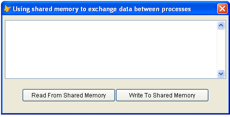

[ Home ](https://github.com/VFPX/Win32API)  

# Using shared memory to exchange data between applications (processes)

## Before you begin:
Presented below the *SharedMemory* class uses FileMapping API calls to allocate a block of memory accessible from any FoxPro application that can instantiate this class. All applications share the name of this memory buffer, for example "MYAPPSHAREDMEMORY".  

  

To test this class, start two or more VFP executables and run this code in each session:  

```foxpro
LOCAL oForm As TForm  
oForm = CREATEOBJECT("Tform")  
oForm.Show(1)  
* end of main  

DEFINE CLASS Tform As Form  
	Width=460  
	Height=200  
	Caption="Using shared memory to exchange " +;  
		"data between processes"  
	smObject=NULL  

	ADD OBJECT txtSharedMemory As EditBox WITH;  
	Left=5, Top=10, Width=450, Height=120  

	ADD OBJECT cmdReadFromMemory As CommandButton WITH;  
	Left=40, Top=150, Width=190, Height=27,;  
	Caption="Read From Shared Memory"  

	ADD OBJECT cmdWriteToMemory As CommandButton WITH;  
	Left=230, Top=150, Width=190, Height=27,;  
	Caption="Write To Shared Memory"  

PROCEDURE Init  
	THIS.smObject = CREATEOBJECT("SharedMemory",;  
		"MYAPPSHAREDMEMORY", 1024)  

PROCEDURE cmdReadFromMemory.Click  
	ThisForm.txtSharedMemory.Value =;  
		ThisForm.smObject.ReadFromSharedMemory()  

PROCEDURE cmdWriteToMemory.Click  
	LOCAL cBuffer  
	cBuffer = PADR(ThisForm.txtSharedMemory.Value,;  
		ThisForm.smObject.GetSharedMemorySize())  
	ThisForm.smObject.WriteToSharedMemory(m.cBuffer)  
ENDDEFINE
```
See also:

* [Using a Semaphore object to prevent VFP application from running more than one instance](sample_147.md)  
* [Using Windows Clipboard for passing data records between VFP applications](sample_346.md)  
  
***  


## Code:
```foxpro  
#DEFINE ERROR_ALREADY_EXISTS 183
#DEFINE INVALID_HANDLE_VALUE -1
#DEFINE PAGE_READWRITE 4
#DEFINE WAIT_OBJECT_0 0
#DEFINE SECTION_QUERY 1
#DEFINE SECTION_MAP_WRITE 2
#DEFINE SECTION_MAP_READ 4
#DEFINE SECTION_MAP_EXECUTE 8
#DEFINE SECTION_EXTEND_SIZE 0x10
#DEFINE STANDARD_RIGHTS_REQUIRED 0xF0000
#DEFINE FILE_MAP_ALL_ACCESS BITOR(STANDARD_RIGHTS_REQUIRED,;
	SECTION_QUERY, SECTION_MAP_WRITE, SECTION_MAP_READ,;
	SECTION_MAP_EXECUTE, SECTION_EXTEND_SIZE)

DEFINE CLASS SharedMemory As Session
PROTECTED hSyncObject, hMapping, hBuffer, MappingName, bufsize
	hSyncObject=0
	hMapping=0
	hBuffer=0
	errorcode=0

PROCEDURE Init(cMappingName, nBufsize)
	THIS.declare
	THIS.MappingName=cMappingName
	THIS.bufsize=m.nBufsize
	THIS.InitMapping

PROCEDURE Destroy
	THIS.ReleaseMapping

FUNCTION GetSharedMemorySize
RETURN THIS.bufsize

PROTECTED FUNCTION LockAccess
* request ownership of mutex
	LOCAL nResult
	nResult = WaitForSingleObject(THIS.hSyncObject, 5000)
RETURN (m.nResult=0)

PROTECTED PROCEDURE ReleaseAccess
* release ownership of mutex
	= ReleaseMutex(THIS.hSyncObject)

FUNCTION WriteToSharedMemory(cBuffer, nOffset)
* nOffset is zero-based
	IF THIS.hBuffer=0
		RETURN 0
	ENDIF
	IF VARTYPE(nOffset) <> "N"
		nOffset=0
	ENDIF

	LOCAL nBytesToWrite

	IF THIS.LockAccess()
		nBytesToWrite = MIN(THIS.bufsize-nOffset, LEN(cBuffer))
		= StrToMem(THIS.hBuffer+nOffset, @cBuffer, nBytesToWrite)
		THIS.ReleaseAccess
	ELSE
		nBytesToWrite=0
	ENDIF
RETURN m.nBytesToWrite

FUNCTION ReadFromSharedMemory(nBytesToRead, nOffset)
* nOffset is zero-based
	IF THIS.hBuffer=0
		RETURN ""
	ENDIF
	IF VARTYPE(nOffset) <> "N"
		nOffset=0
	ENDIF
	IF VARTYPE(nBytesToRead) <> "N"
		nBytesToRead=THIS.bufsize
	ELSE
		nBytesToRead=MIN(nBytesToRead, THIS.bufsize)
	ENDIF

	LOCAL cBuffer

	IF THIS.LockAccess()
		cBuffer = REPLICATE(CHR(0), nBytesToRead)
		= MemToStr(@cBuffer, THIS.hBuffer+nOffset, nBytesToRead)
		THIS.ReleaseAccess
	ELSE
		cBuffer=0
	ENDIF
RETURN m.cBuffer

PROTECTED PROCEDURE InitMapping
* create synch and shared memory objects
	THIS.hSyncObject = CreateMutex(0,0, "sync_"+THIS.MappingName)

	IF THIS.hSyncObject=0
		THIS.errorcode = GetLastError()
		RETURN
	ENDIF

	* give different names to the synch object
	* and the shared memory object
	THIS.hMapping = CreateFileMapping(INVALID_HANDLE_VALUE,;
		0, PAGE_READWRITE, 0, THIS.bufsize, THIS.MappingName)

	IF INLIST(THIS.hMapping,0,INVALID_HANDLE_VALUE)
		THIS.errorcode = GetLastError()
	ELSE
		THIS.hBuffer = MapViewOfFile(THIS.hMapping,;
			FILE_MAP_ALL_ACCESS, 0,0,THIS.bufsize)

		IF THIS.hBuffer = 0
			THIS.errorcode = GetLastError()
		ENDIF
	ENDIF

PROTECTED PROCEDURE ReleaseMapping
* release synch and shared memory objects
	IF THIS.hBuffer <> 0
		= UnmapViewOfFile(THIS.hBuffer)
		THIS.hBuffer=0
	ENDIF
	IF NOT INLIST(THIS.hMapping,0,INVALID_HANDLE_VALUE)
		= CloseHandle(THIS.hMapping)
		THIS.hMapping=0
	ENDIF
	IF THIS.hSyncObject<>0
		THIS.ReleaseAccess
		= CloseHandle(THIS.hSyncObject)
		THIS.hSyncObject=0
	ENDIF

PROTECTED PROCEDURE declare
* RtlMoveMemory is declared with two aliases -- VFP8+ required
* in older VFP versions declare it immediately before calling
	DECLARE INTEGER CloseHandle IN kernel32 INTEGER hObject
	DECLARE INTEGER UnmapViewOfFile IN kernel32 LONG lpBaseAddress
	DECLARE INTEGER GetLastError IN kernel32
	DECLARE INTEGER ReleaseMutex IN kernel32 INTEGER hMutex

	DECLARE INTEGER CreateFileMapping IN kernel32;
		INTEGER hFile, INTEGER lpAttributes, INTEGER flProtect,;
		LONG dwMaximumSizeHi, LONG dwMaximumSizeLo, STRING lpName

	DECLARE LONG MapViewOfFile IN kernel32;
		INTEGER hFileMappingObject, INTEGER dwDesiredAccess,;
		LONG dwFileOffsetHi, LONG dwFileOffsetLo,;
		LONG dwNumberOfBytesToMap

	DECLARE RtlMoveMemory IN kernel32 As StrToMem;
		INTEGER, STRING @, INTEGER

	DECLARE RtlMoveMemory IN kernel32 As MemToStr;
		STRING @, INTEGER, INTEGER

	DECLARE INTEGER CreateMutex IN kernel32;
		INTEGER lpMutexAttributes, INTEGER bInitialOwner, STRING lpName

	DECLARE INTEGER WaitForSingleObject IN kernel32;
		INTEGER hHandle, INTEGER dwMilliseconds

ENDDEFINE  
```  
***  


## Listed functions:
[CloseHandle](../libraries/kernel32/CloseHandle.md)  
[CreateFileMapping](../libraries/kernel32/CreateFileMapping.md)  
[CreateMutex](../libraries/kernel32/CreateMutex.md)  
[GetLastError](../libraries/kernel32/GetLastError.md)  
[MapViewOfFile](../libraries/kernel32/MapViewOfFile.md)  
[ReleaseMutex](../libraries/kernel32/ReleaseMutex.md)  
[UnmapViewOfFile](../libraries/kernel32/UnmapViewOfFile.md)  
[WaitForSingleObject](../libraries/kernel32/WaitForSingleObject.md)  

## Comment:
Mutex object is used to synchronize access to the shared memory block.  
  
***  

