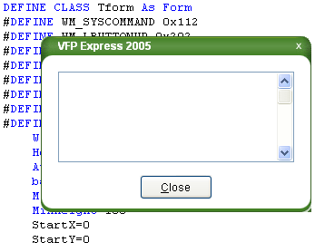
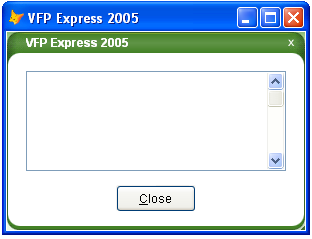

[ Home ](https://github.com/VFPX/Win32API)  

# How to draw custom Window Caption on FoxPro form

## Short description:
This code sample shows how to hide the Caption and the border of FoxPro form and replace them with eight Image controls and one Label control. The form is resizable, closable and can be clicked on its caption and dragged.
  
***  


## Before you begin:
The following code sample shows how to hide the Caption and the border of FoxPro form and replace them with eight Image controls and one Label control. The form is resizable, closable and can be clicked on its caption and dragged.  

  

Basically what is done: the caption and the border of VFP form are mercilessly :) cut off using GDI Region function. The following picture shows the form with all parts visible:  

  

Download the images prior to testing this code:  

<table border=1 cellpadding=3 cellspacing=0 bgcolor=#e0e0e0><tr valign=top><td></td><td align=center></td><td align=right></td></tr><tr valign=top><td></td><td width=100 align=center><a href="../downloads/customcaption.zip">zip file</a></td><td align=right></td><tr valign=bottom><td></td><td align=center></td><td align=right></td></tr></table>  


See also:

* [Customizing the frame of top-level form](sample_574.md)  
* [How to make a VFP form fading out when released (GDI version)](sample_528.md)  
* [A way to make a transparent area in a form -- a hole in the form](sample_126.md)  
* [Round FoxPro form](sample_143.md)  
* [Creating irregularly shaped FoxPro form using transparency color key](sample_033.md)  
* [Semi-transparent Form](sample_453.md)  
* [How to print FoxPro Form](sample_158.md)  
  
***  


## Code:
```foxpro  
PUBLIC oForm As MyForm
oForm = CREATEOBJECT("MyForm")
oForm.Visible=.T.

DEFINE CLASS MyForm As Tform
	Width=300
	Height=200
	Caption = "VFP Express 2005"
	Autocenter=.T.
	BackColor=RGB(255,255,255)

	ADD OBJECT lst As ListBox WITH;
	Left=20, Top=40, Width=260, Height=100
	
	ADD OBJECT cmdClose As CommandButton WITH;
	Left=110, Top=154, Width=80, Height=27, Caption="\<Close"

PROCEDURE Init
	Tform::Init("e2005_lefttopcorner.bmp",;
		"e2005_topbar.bmp",;
		"e2005_righttopcorner.bmp",;
		"e2005_rightsidebar.bmp",;
		"e2005_rightbottomcorner.bmp",;
		"e2005_bottombar.bmp",;
		"e2005_leftbottomcorner.bmp",;
		"e2005_leftsidebar.bmp")
*	THIS.BorderStyle=2
ENDDEFINE

DEFINE CLASS Tform As Form
#DEFINE WM_SYSCOMMAND 0x112
#DEFINE WM_LBUTTONUP 0x202
#DEFINE SC_CLOSE 0xf060
#DEFINE MOUSE_MOVE 0xf012
#DEFINE SM_CYCAPTION 4
#DEFINE SM_CXFRAME 32
#DEFINE SM_CYFRAME 33
#DEFINE RGN_XOR 3
#DEFINE RGN_OR 2
	ProxyBorderStyle=3
	StartX=0
	StartY=0
	
	ADD OBJECT img1 As TImage  && left top corner
	ADD OBJECT img2 As TImage  && top bar
	ADD OBJECT img3 As TImage  && right top corner
	ADD OBJECT img4 As TImage WITH MousePointer=9  && right bar
	ADD OBJECT img5 As TImage WITH MousePointer=8  && bottom right corner
	ADD OBJECT img6 As TImage WITH MousePointer=7  && bottom bar
	ADD OBJECT img7 As TImage  && bottom left corner
	ADD OBJECT img8 As TImage  && left bar
	ADD OBJECT ProxyCaption As TFormCaption

PROCEDURE Init(imgfile1, imgfile2, imgfile3, imgfile4,;
		imgfile5, imgfile6, imgfile7, imgfile8)
	THIS.declare
	THIS.img1.Picture=m.imgfile1
	THIS.img2.Picture=m.imgfile2
	THIS.img3.Picture=m.imgfile3
	THIS.img4.Picture=m.imgfile4
	THIS.img5.Picture=m.imgfile5
	THIS.img6.Picture=m.imgfile6
	THIS.img7.Picture=m.imgfile7
	THIS.img8.Picture=m.imgfile8
	THIS.Resize
	THIS.ProxyCaption.ZOrder(0)

PROCEDURE Caption_ASSIGN(cCaption)
* project regular caption to the proxy caption
	THIS.Caption=m.cCaption
	THIS.ProxyCaption.Caption = m.cCaption

PROCEDURE BorderStyle_ASSIGN(nValue)
	THIS.ProxyBorderStyle=m.nValue
	THIS.BorderStyle=3  && always
	IF m.nValue=3  && change to Size mouse pointers
		THIS.img4.MousePointer=9
		THIS.img5.MousePointer=8
		THIS.img6.MousePointer=7
	ELSE
		THIS.img4.MousePointer=0
		THIS.img5.MousePointer=0
		THIS.img6.MousePointer=0
	ENDIF
	THIS.CutFrame

PROCEDURE Resize
	THIS.CutFrame
	THIS.PositionImages

PROCEDURE OnMouseDownMove
LPARAMETERS nButton, nShift, nXCoord, nYCoord
* emulate the ability to drag the form using mouse
	IF nButton = 1
		= ReleaseCapture()
		= SendMessage(THIS.HWnd, WM_SYSCOMMAND, MOUSE_MOVE, 0)
		= SendMessage(THIS.HWnd, WM_LBUTTONUP, 0, 0)
	ENDIF

PROCEDURE BeforeMouseDownResize
LPARAMETERS nButton, nShift, nXCoord, nYCoord
* store coordinates of the inital click
	IF nButton=1
		ThisForm.StartX = m.nXCoord
		ThisForm.StartY = m.nYCoord
	ENDIF

PROCEDURE AfterMouseDownResize
LPARAMETERS nButton, nShift, nXCoord, nYCoord
* resize the form to the position of the mouse cursor
	IF nButton=1 AND THIS.ProxyBorderStyle=3
		ThisForm.Width = ThisForm.Width + nXCoord - ThisForm.StartX
		ThisForm.Height = ThisForm.Height + nYCoord - ThisForm.StartY
		ThisForm.StartX=nXCoord
		ThisForm.StartY=nYCoord
	ENDIF

PROCEDURE ProxyCaption.MouseDown
LPARAMETERS nButton, nShift, nXCoord, nYCoord
	ThisForm.OnMouseDownMove(nButton, nShift, nXCoord, nYCoord)

PROCEDURE img1.MouseDown
LPARAMETERS nButton, nShift, nXCoord, nYCoord
#DEFINE SC_MOUSEMENU 0xf090
	ThisForm.OnMouseDownMove(nButton, nShift, nXCoord, nYCoord)

PROCEDURE img2.MouseDown
LPARAMETERS nButton, nShift, nXCoord, nYCoord
	ThisForm.OnMouseDownMove(nButton, nShift, nXCoord, nYCoord)

PROCEDURE img3.Click
* emulate the Close button click
	IF ThisForm.Closable
	* close the form and raise the QueryUnload
		= SendMessage(ThisForm.HWnd, WM_SYSCOMMAND, SC_CLOSE, 0)
	ENDIF

PROCEDURE img4.MouseDown
LPARAMETERS nButton, nShift, nXCoord, nYCoord
	ThisForm.BeforeMouseDownResize(nButton, nShift, nXCoord, nYCoord)

PROCEDURE img5.MouseDown
LPARAMETERS nButton, nShift, nXCoord, nYCoord
	ThisForm.BeforeMouseDownResize(nButton, nShift, nXCoord, nYCoord)

PROCEDURE img6.MouseDown
LPARAMETERS nButton, nShift, nXCoord, nYCoord
	ThisForm.BeforeMouseDownResize(nButton, nShift, nXCoord, nYCoord)

PROCEDURE img4.MouseMove
LPARAMETERS nButton, nShift, nXCoord, nYCoord
	ThisForm.AfterMouseDownResize(nButton, nShift, nXCoord, ThisForm.StartY)

PROCEDURE img5.MouseMove
LPARAMETERS nButton, nShift, nXCoord, nYCoord
	ThisForm.AfterMouseDownResize(nButton, nShift, nXCoord, nYCoord)

PROCEDURE img6.MouseMove
LPARAMETERS nButton, nShift, nXCoord, nYCoord
	ThisForm.AfterMouseDownResize(nButton, nShift, ThisForm.StartX, nYCoord)

PROTECTED PROCEDURE CutFrame
* cut off the caption and the border of the form
	LOCAL nCaptionHeight, nFrameWidth, nFrameHeight

	* you can use SYSMETRIC() instead
	nCaptionHeight = GetSystemMetrics(SM_CYCAPTION)
	nFrameWidth = GetSystemMetrics(SM_CXFRAME)
	nFrameHeight = GetSystemMetrics(SM_CYFRAME)

	LOCAL cRect, BaseWidth, BaseHeight,;
		x1, y1, x2, y2, hRgnBase,;
		ra1, ra2, ra3, ra4,;
		rb1, rb2, rb3, rb4, nRd

	* Retrieve the dimensions of the bounding rectangle of the form
	BaseWidth=THIS.Width + nFrameWidth*2
	BaseHeight=THIS.Height + nCaptionHeight + nFrameHeight*2

	* cut off the caption and the border of the form
	x1 = nFrameWidth
	y1 = nFrameHeight+nCaptionHeight
	x2 = BaseWidth-nFrameWidth-1
	y2 = BaseHeight-nFrameHeight-1

	hRgnBase = CreateRectRgn(x1, y1, x2, y2)

	* round the corners of the form
	nRd=8  && a radius used to round corners, pixels

	* left top corner
	THIS.RoundCorner(hRgnBase, x1, y1, x1 + nRd, y1 + nRd,;
		x1, y1, x1 + nRd*2, y1 + nRd*2)

	* right top corner
	THIS.RoundCorner(hRgnBase, x2-nRd, y1, x2, y1 + nRd,;
		x2-nRd*2, y1, x2, y1 + nRd*2)

	* right bottom corner
	IF THIS.ProxyBorderStyle <> 3
		THIS.RoundCorner(hRgnBase, x2-nRd, y2-nRd, x2, y2,;
			x2-nRd*2, y2-nRd*2, x2, y2)
	ENDIF

	* left bottom corner
	THIS.RoundCorner(hRgnBase, x1, y2-nRd, x1 + nRd, y2,;
		x1, y2-nRd*2, x1 + nRd*2, y2)

	* apply resulting region to the form
	= SetWindowRgn(THIS.HWnd, hRgnBase, 1)
	= DeleteObject(hRgnBase)

PROTECTED PROCEDURE RoundCorner(hRgnTarget, xr1,yr1,xr2,yr2,;
	xe1, xe2, ye1, ye2)
	LOCAL hRrnRectangle, hRgnEllipse
	hRrnRectangle=CreateRectRgn(xr1,yr1,xr2,yr2)
	hRgnEllipse=CreateEllipticRgn(xe1, xe2, ye1, ye2)
	= CombineRgn(hRgnTarget, hRgnTarget, hRrnRectangle, RGN_XOR)
	= CombineRgn(hRgnTarget, hRgnTarget, hRgnEllipse, RGN_OR)
	= DeleteObject(hRrnRectangle)
	= DeleteObject(hRgnEllipse)

PROTECTED PROCEDURE PositionImages
* position frame images when the form is resizing
	WITH THIS.img2  && top bar
		.Left = THIS.img1.Width
		.Width = THIS.Width - THIS.img1.Width - THIS.img3.Width - 1
	ENDWITH
	
	WITH THIS.img3  && right corner
		.Left = THIS.Width - .Width - 1
	ENDWITH

	WITH THIS.img4  && right side bar
		.Left = THIS.Width - .Width - 1
		.Top = THIS.img3.Height
		.Height = THIS.Height - THIS.img3.Height - THIS.img5.Height - 1
	ENDWITH

	WITH THIS.img5  && right bottom corner
		.Left = THIS.Width - .Width - 1
		.Top = THIS.Height - .Height - 1
	ENDWITH

	WITH THIS.img6  && bottom bar
		.Left=THIS.img7.Width
		.Width = THIS.Width - THIS.img5.Width - THIS.img7.Width - 1
		.Top = THIS.Height - .Height - 1
	ENDWITH

	WITH THIS.img7  && left bottom corner
		.Top = THIS.Height - .Height - 1
	ENDWITH

	WITH THIS.img8  && left side bar
		.Top = THIS.img1.Height
		.Height = THIS.Height - THIS.img1.Height - THIS.img7.Height - 1
	ENDWITH

	THIS.MinWidth=MAX(THIS.img1.Width+THIS.img3.Width,;
		THIS.img5.Width+THIS.img7.Width)+50

	THIS.MinHeight=MAX(THIS.img3.Height+THIS.img5.Height,;
		THIS.img1.Height+THIS.img7.Height)+50

	WITH THIS.ProxyCaption
		.Width = THIS.Width-.Left-THIS.img3.Width-10
	ENDWITH

PROTECTED PROCEDURE declare
	DECLARE INTEGER GetSystemMetrics IN user32 INTEGER nIndex
	DECLARE INTEGER DeleteObject IN gdi32 INTEGER hObject
	DECLARE INTEGER ReleaseCapture IN user32

	DECLARE SetWindowRgn IN user32;
		INTEGER hWindow, INTEGER hRgn, SHORT bRedraw

	DECLARE INTEGER CreateRectRgn IN gdi32;
		INTEGER nLeftRect, INTEGER nTopRect,;
		INTEGER nRightRect, INTEGER nBottomRect

	DECLARE INTEGER CreateEllipticRgn IN gdi32;
		INTEGER nLeftRect, INTEGER nTopRect,;
		INTEGER nRightRect, INTEGER nBottomRect

	DECLARE INTEGER CombineRgn IN gdi32;
		INTEGER hrgnDest, INTEGER hrgnSrc1, INTEGER hrgnSrc2,;
		INTEGER fnCombineMode

	DECLARE INTEGER SendMessage IN user32;
		INTEGER hWindow, INTEGER Msg,;
		INTEGER wParam, INTEGER lParam
ENDDEFINE

DEFINE CLASS TImage As Image
	Left=0
	Top=0
	BackStyle=0
PROCEDURE Picture_ASSIGN(cFile)
	THIS.Stretch=0
	THIS.Picture=m.cFile
	THIS.Stretch=2
	THIS.ZOrder(0) && always on top of other controls
ENDDEFINE

DEFINE CLASS TFormCaption As Label
	Left=20
	Top=4
	FontName="Arial"
	ForeColor=RGB(255,255,255)
	FontSize=9
	FontBold=.F.
	BackStyle=0
PROCEDURE Init
	THIS.Caption=ThisForm.Caption
ENDDEFINE  
```  
***  


## Listed functions:
[CombineRgn](../libraries/gdi32/CombineRgn.md)  
[CreateEllipticRgn](../libraries/gdi32/CreateEllipticRgn.md)  
[CreateRectRgn](../libraries/gdi32/CreateRectRgn.md)  
[DeleteObject](../libraries/gdi32/DeleteObject.md)  
[GetSystemMetrics](../libraries/user32/GetSystemMetrics.md)  
[ReleaseCapture](../libraries/user32/ReleaseCapture.md)  
[SendMessage](../libraries/user32/SendMessage.md)  
[SetWindowRgn](../libraries/user32/SetWindowRgn.md)  

## Comment:
Note:  Visual FoxPro stores a single image in memory internally. If you use that image multiple times, Visual FoxPro renders it the same way regardless of RotateFlip.   
  
If you want to display the same image multiple times in various rotations, rename each copy of the image that you use. If you issue the CLEAR...RESOURCES command, Visual FoxPro reloads the image into memory and loses any prior GDI+ settings.  
  
See also:
* [VFPSkin](https://vfpskin-version-3-0-single.jaleco.com/) *(Pablo J. Molina and Daniel Diaz)* 

The WM_NCACTIVATE message is sent to a window when its nonclient area needs to be changed to indicate an active or inactive state. FoxPro form receives this message only when it is top-level form (ShowWindow=2) -- ?  
  
The WM_NCPAINT message is sent to a window when its frame must be painted.   
  
***  

