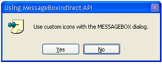
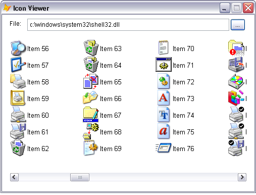
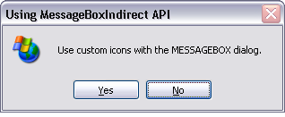
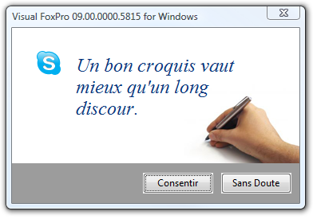

[ Home ](https://github.com/VFPX/Win32API)  

# How to display a user-defined icon in the MessageBox dialog

## Note that this document contains some links to the old news2news website which does not work at the moment. This material will be available sometime in the future.

## Before you begin:
Download [ResourceContainer.dll](../downloads/ResourceContainer.dll) before testing this code. This DLL is nothing more but a resource storage containing five icons. It does not require any installation procedure; just copy it to your FoxPro directory.

<!-- Anatoliy -->
<a href="http://www.news2news.com/vfp/?solution=3"></a>  
See also:

* [How to change font name and size in the MessageBox dialog](sample_434.md)  
* [Extended MessageBox Class](sample_418.md)  
* [Storing registration key in the resources of an executable file](sample_401.md)  
* [Icon Viewer](sample_019.md)  
  
***  


## Code:
```foxpro  
#DEFINE MB_YESNO 4
#DEFINE MB_USERICON 0x80
#DEFINE MB_DEFBUTTON2 0x100
#DEFINE LOAD_LIBRARY_AS_DATAFILE 2
#DEFINE MSGBOXPARAMS_SIZE 40

DO declare

LOCAL hResource, cBuffer, oText, oCaption

hResource = LoadLibraryEx("ResourceContainer.dll",;
	0, LOAD_LIBRARY_AS_DATAFILE)

IF hResource = 0
* 2=ERROR_FILE_NOT_FOUND
* 193=ERROR_BAD_EXE_FORMAT
	? "Could not load resource file: ", GetLastError()
	RETURN
ENDIF

oText = CREATEOBJECT("PChar",;
	"Use custom icons with the MESSAGEBOX dialog.     ")

oCaption = CREATEOBJECT("PChar",;
	"Using MessageBoxIndirect API")

* Populate the MSGBOXPARAMS structure
* Note: the resource file used in this code sample
* contains five icons, resource ids from 101 to 105
cBuffer = num2dword(MSGBOXPARAMS_SIZE) +;
	num2dword(_screen.HWnd) +;
	num2dword(hResource) +;
	num2dword(oText.GetAddr()) +;
	num2dword(oCaption.GetAddr()) +;
	num2dword(MB_USERICON+MB_YESNO+MB_DEFBUTTON2) +;
	num2dword(105) +;
	num2dword(0) +;
	num2dword(0) +;
	num2dword(VAL(SYS(3004)))

= MessageBoxIndirect(@cBuffer)
= FreeLibrary(hResource)
* end of main

PROCEDURE declare
	DECLARE INTEGER MessageBoxIndirect IN user32 STRING @lpMsgBoxParams
	DECLARE INTEGER FreeLibrary IN kernel32 INTEGER hLibModule
	DECLARE INTEGER GetLastError IN kernel32

	DECLARE INTEGER LoadLibraryEx IN kernel32;
		STRING lpFileName, INTEGER hFile, INTEGER dwFlags

FUNCTION num2dword(lnValue)
#DEFINE m0 0x0000100
#DEFINE m1 0x0010000
#DEFINE m2 0x1000000
	IF lnValue < 0
		lnValue = 0x100000000 + lnValue
	ENDIF
	LOCAL b0, b1, b2, b3
	b3 = Int(lnValue/m2)
	b2 = Int((lnValue - b3*m2)/m1)
	b1 = Int((lnValue - b3*m2 - b2*m1)/m0)
	b0 = Mod(lnValue, m0)
RETURN Chr(b0)+Chr(b1)+Chr(b2)+Chr(b3)

DEFINE CLASS PChar As Session
PROTECTED hMem

PROCEDURE Init(lcString)
	THIS.hMem = 0
	THIS.setValue(lcString)

PROCEDURE Destroy
	THIS.ReleaseString

FUNCTION GetAddr
RETURN THIS.hMem

FUNCTION GetValue
	LOCAL lnSize, lcBuffer
	lnSize = THIS.getAllocSize()
	lcBuffer = SPACE(lnSize)

	IF THIS.hMem <> 0
		DECLARE RtlMoveMemory IN kernel32 As MemToStr;
			STRING @, INTEGER, INTEGER
		= MemToStr(@lcBuffer, THIS.hMem, lnSize)
	ENDIF
RETURN lcBuffer

FUNCTION GetAllocSize
	DECLARE INTEGER GlobalSize IN kernel32 INTEGER hMem
RETURN Iif(THIS.hMem=0, 0, GlobalSize(THIS.hMem))

PROCEDURE SetValue(lcString)
#DEFINE GMEM_FIXED 0
	THIS.ReleaseString

	DECLARE INTEGER GlobalAlloc IN kernel32 INTEGER, INTEGER
	DECLARE RtlMoveMemory IN kernel32 As StrToMem;
		INTEGER, STRING @, INTEGER

	LOCAL lnSize
	lcString = lcString + Chr(0)
	lnSize = Len(lcString)
	THIS.hMem = GlobalAlloc(GMEM_FIXED, lnSize)
	IF THIS.hMem <> 0
		= StrToMem(THIS.hMem, @lcString, lnSize)
	ENDIF

PROCEDURE ReleaseString
	IF THIS.hMem <> 0
		DECLARE INTEGER GlobalFree IN kernel32 INTEGER
		= GlobalFree (THIS.hMem)
		THIS.hMem = 0
	ENDIF

ENDDEFINE  
```  
***  


## Listed functions:
[FreeLibrary](../libraries/kernel32/FreeLibrary.md)  
[GetLastError](../libraries/kernel32/GetLastError.md)  
[GlobalAlloc](../libraries/kernel32/GlobalAlloc.md)  
[GlobalFree](../libraries/kernel32/GlobalFree.md)  
[GlobalSize](../libraries/kernel32/GlobalSize.md)  
[LoadLibraryEx](../libraries/kernel32/LoadLibraryEx.md)  
[MessageBox](../libraries/user32/MessageBox.md)  
[MessageBoxIndirect](../libraries/user32/MessageBoxIndirect.md)  

## Comment:
A <a href="http://msdn.microsoft.com/library/default.asp?url=/library/en-us/vccore/html/_core_Create_a_Resource.2d.Only_DLL.asp">resource-only DLL</a> can be created in VC++. It contains virtually no executable code but resources, such as icons, bitmaps, strings, and dialog boxes. The file created with the /NOENTRY linker option is always light-weighted with an overhead below 3K (Portable Executable headers).  
  
Any other file containing compatible icon resources can be used, for example Shell32.dll. Normally this file locates in System32 directory and contains plenty colorful icons the system readily uses itself.  
  
[](sample_019.md)

Change the code sample as shown below:  
  
```foxpro
hResource = LoadLibraryEx(GETENV("windir") + "\system32\shell32.dll",;  
	0, LOAD_LIBRARY_AS_DATAFILE)  
...  
cBuffer = num2dword(MSGBOXPARAMS_SIZE) +;  
	num2dword(_screen.HWnd) +;  
	num2dword(hResource) +;  
	num2dword(oText.GetAddr()) +;  
	num2dword(oCaption.GetAddr()) +;  
	num2dword(MB_USERICON+MB_YESNO+MB_DEFBUTTON2) +;  
	num2dword(47) +;  
	num2dword(0) +;  
	num2dword(0) +;  
	num2dword(VAL(SYS(3004)))
```
which should provide  this or similar result  
  

  
* * *  
Changing the dialog icon by sending the STM_SETICON message to the icon window is another approach (requires extra programming in C++). The STM_SETICON is usually sent before the dialog activates. The WMPARAM in this message is the HICON handle.   
  
There are several ways of obtaining the HICON: loading icon from ICO file (call LoadIcon or LoadImage ), get an icon resource from executable or DLL (call LoadLibrary and then LoadImage). The SHGetFileInfo returns HICON handles for the file or for the file type specified.   
  
On the screenshot below, the icon inside the MessageBox is retrieved from the Skype executable by calling the SHGetFileInfo. Such functionality can be programmed in FLL or DLL library.  
  
<a href="http://www.news2news.com/vfp/?solution=3"></a>  
  
***  

