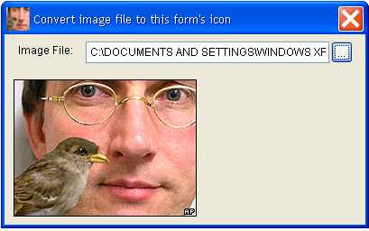

[ Home ](https://github.com/VFPX/Win32API)  

# Converting image file to .ICO file

## Short description:
This code sample shows how to load an image file (BMP, GIF, JPEG, PNG, TIFF), scale it and save as .ICO file. It creates a simple icon file containing one 32x32 icon in 32 bit per pixel format and assigns the new icon to the Icon property.  
***  


## Before you begin:
This code sample shows how to load an image file (BMP, GIF, JPEG, PNG, TIFF), scale it and save as .ICO file. It creates a simple icon file containing one 32x32 icon in 32 bit per pixel format and assigns the new icon to the Icon property.  

The code instantiates objects defined in [custom GDI+ class](sample_450.md). Download the class module first and save it in **gdiplus.prg** file.   

  

See also:

* [How to extract icon resources from EXE or DLL and save them in image files](sample_501.md)  
* [How to extract icon resources from EXE or DLL and save them in .ICO files](sample_502.md)  
* [GDI+ function](../libraries/gdiplus/GdipCreateHICONFromBitmap.md)  

  
***  


## Code:
```foxpro  
LOCAL oForm
oForm = CREATEOBJECT("Tform")
oForm.Show(1)
* end of main

DEFINE CLASS Tform As Form  && testing form
	Width=400
	Height=300
	Autocenter=.T.
	MinButton=.F.
	MaxButton=.F.
	Caption="Convert image file to this form"s icon"

	ADD OBJECT lbl As Label WITH Caption="Image File:", Left=15, Top=10
	ADD OBJECT txt As TextBox WITH Left=90, Top=8, Height=24, Width=270

	ADD OBJECT cmd As CommandButton WITH Caption="...",;
	Top=8, Left=362, Width=24, Height=24

	ADD OBJECT img As Image WITH Left=10, Top=50,;
	Width=380, Height=230

PROCEDURE GetIcon
	THIS.txt.Value=""
	THIS.Icon = ""
	CLEAR RESOURCES

	LOCAL cSourceFile, cIconFile
	cSourceFile = GETFILE("BMP;JPG;GIF;PNG;TIF")
	IF EMPTY(cSourceFile)
		RETURN
	ENDIF
	
	THIS.txt.Value=cSourceFile
	THIS.img.Picture = cSourceFile
	cIconFile = FULLPATH("testicon.ico")
	
	IF ImageToIcon(cSourceFile, cIconFile, 32)
		THIS.Icon = cIconFile
	ENDIF

PROCEDURE cmd.Click
	ThisForm.GetIcon

ENDDEFINE

PROCEDURE ImageToIcon
PARAMETERS cImageFile, cIconFile, nIconSize
#DEFINE BITMAP_STRU_SIZE 24
#DEFINE BITMAPINFOHEADER_SIZE 40
#DEFINE ICONINFO_SIZE 20
#DEFINE DEFAULT_BPP 32  && bits per pixel

	SET PROCEDURE TO gdiplus ADDITIVE
	DO declare

	PRIVATE nWidth, nHeight
	STORE 0 TO nWidth, nHeight

	LOCAL hIcon, cIconInfo, cAndBits, cXorBits,;
		cIconDir, cIconImage, cBIHeader, cIconEntry

	* use GDI+ functions to create HICON from the image file
	hIcon = GetHICON()
	IF hIcon = 0
		= MESSAGEBOX("Could not create HICON handle " +;
			"from " + cImageFile + ".     ",;
			48, "Error")
		RETURN .F.
	ENDIF

	cIconInfo = REPLICATE(CHR(0), ICONINFO_SIZE)
	= GetIconInfo(hIcon, @cIconInfo)

	* HBITMAP hbmMask, 1 bpp
	cAndBits = GetBits(buf2dword(SUBSTR(cIconInfo, 13,4)), 1)

	* HBITMAP hbmColor
	cXorBits = GetBits(buf2dword(SUBSTR(cIconInfo, 17,4)), DEFAULT_BPP)

	* ICONDIR structure
	cIconDir = num2word(0) + num2word(1) + num2word(1)

	* BITMAPINFOHEADER structure; note the double height
	cBIHeader = num2dword(BITMAPINFOHEADER_SIZE) +;
		num2dword(nWidth) + num2dword(nHeight*2) +;
		num2word(1) + num2word(DEFAULT_BPP) + num2dword(0) +;
		num2dword(Len(cAndBits)+Len(cXorBits)) +;
		num2dword(0) + num2dword(0) +;
		num2dword(0) + num2dword(0)

	* ICONIMAGE structure
	cIconImage = cBiHeader + cXorBits + cAndBits

	* ICONDIRENTRY structure
	cIconEntry = CHR(nWidth) + CHR(nHeight) + CHR(0) + CHR(0) +;
		num2word(1) + num2word(DEFAULT_BPP) +;
		num2dword(BITMAPINFOHEADER_SIZE + Len(cAndBits) + Len(cXorBits))

	cIconEntry = cIconEntry +;
		num2dword(LEN(cIconDir) + LEN(cIconEntry) + 4)
	
	* create .ICO file
	LOCAL ex As Exception

	SET SAFETY OFF
	TRY
		= STRTOFILE(cIconDir + cIconEntry + cIconImage,;
			cIconFile)
	CATCH TO ex
		= MESSAGEBOX(TRANSFORM(ex.ErrorNo) + ". " +;
			ex.Message + ".     ", 48, "Error")
	FINALLY
		= DestroyIcon(hIcon)
		SET SAFETY ON
	ENDTRY
RETURN VARTYPE(m.ex) <> "O"

FUNCTION GetBits(hBitmap, nBitsPerPixel)
* retrieves Device Independent Bitmap (DIB) bits
* of the bitmap and returns them in a string
	LOCAL hMemDC, cBitmap, nBytesPerScan, nBitmapDataSize,;
		cBIHeader, cBits
	
	hMemDC = CreateCompatibleDC(0)
	= SelectObject(hMemDC, hBitmap)

	cBitmap = REPLICATE(CHR(0), BITMAP_STRU_SIZE)
	= GetObjectA(hBitmap, BITMAP_STRU_SIZE, @cBitmap)
	nWidth  = buf2dword(SUBSTR(cBitmap, 5,4))
	nHeight = buf2dword(SUBSTR(cBitmap, 9,4))

	* calculate bytes per scan line value
	nBytesPerScan = nWidth * nBitsPerPixel/8
	IF INT(nBytesPerScan) < nBytesPerScan
		nBytesPerScan = INT(nBytesPerScan) + 1
	ENDIF

	* round to the next 4-byte boundary
	IF MOD(nBytesPerScan, 4) <> 0
		nBytesPerScan = nBytesPerScan + 4 - MOD(nBytesPerScan, 4)
	ENDIF

	* calculate bitmap binary data size
	nBitmapDataSize = nHeight * nBytesPerScan

	* populate BITMAPINFOHEADER structure
	cBIHeader = PADR(num2dword(BITMAPINFOHEADER_SIZE) +;
		num2dword(nWidth) + num2dword(nHeight) +;
		num2word(1) + num2word(nBitsPerPixel) +;
		num2dword(0) + num2dword(nBitmapDataSize),;
		BITMAPINFOHEADER_SIZE, CHR(0))

	* retrieve bitmap binary data
	cBits = REPLICATE(CHR(0), nBitmapDataSize)
	= GetDIBits(hMemDC, hBitmap, 0, nHeight,;
		@cBits, @cBIHeader, 1)

	= DeleteDC(hMemDC)
RETURN m.cBits

FUNCTION GetHICON
* Loads image file, scales and creates HICON handle.
* GDI+ library is required

	LOCAL gdip As gdiplusinit, oSrc As gdiimage,;
		oDst As gdiimage

	gdip = CREATEOBJECT("gdiplusinit")
	oSrc = CREATEOBJECT("gdiimage", cImageFile)
	
	IF oSrc.imgwidth = nIconSize;
		AND oSrc.imgheight = nIconSize
		hIcon = oSrc.CreateHICON()
	ELSE
		oDst = CREATEOBJECT("gdibitmap",;
			nIconSize, nIconSize)

		oDst.graphics.DrawImage(oSrc, 0,0,;
			nIconSize, nIconSize)

		hIcon = oDst.CreateHICON()
	ENDIF
RETURN m.hIcon

PROCEDURE declare
	DECLARE INTEGER DestroyIcon IN user32 INTEGER hIcon
	DECLARE INTEGER CreateCompatibleDC IN gdi32 INTEGER hdc
	DECLARE INTEGER DeleteObject IN gdi32 INTEGER hObject
	DECLARE INTEGER SelectObject IN gdi32 INTEGER hdc, INTEGER hObject
	DECLARE INTEGER DeleteDC IN gdi32 INTEGER hdc

	DECLARE INTEGER GetIconInfo IN user32;
		INTEGER hIcon, STRING @piconinfo

	DECLARE INTEGER GetObject IN gdi32 AS GetObjectA;
		INTEGER hgdiobj, INTEGER cbBuffer, STRING @lpvObject

	DECLARE INTEGER GetDIBits IN gdi32;
		INTEGER hdc, INTEGER hbmp, INTEGER uStartScan,;
		INTEGER cScanLines, STRING @lpvBits,;
		STRING @lpbi, INTEGER uUsage  
```  
***  


## Listed functions:
[CreateCompatibleDC](../libraries/gdi32/CreateCompatibleDC.md)  
[DeleteDC](../libraries/gdi32/DeleteDC.md)  
[DeleteObject](../libraries/gdi32/DeleteObject.md)  
[DestroyIcon](../libraries/user32/DestroyIcon.md)  
[GetDIBits](../libraries/gdi32/GetDIBits.md)  
[GetIconInfo](../libraries/user32/GetIconInfo.md)  
[GetObject](../libraries/gdi32/GetObject.md)  
[SelectObject](../libraries/gdi32/SelectObject.md)  

## Comment:
As I can find, VFP supports only 16x16 and 32x32 icons. Also note that CLEAR RESOURCES is required in case an icon file is overwritten with new content while linked to the Icon property of a form or of the main VFP screen.  
  
* * *  
Worthy to read:  
[Icons in Win32](https://msdn.microsoft.com/en-us/library/ms997538.aspx) by John Hornick, Microsoft Corp.  
  
* * *  
The *bWidth* and *bHeight* members of the ICONDIRENTRY structure occupy 1 byte each. This effectively restricts sizes of icons to 1..255 pixels range. While there are no other restrictions, common icon sizes include 16, 32, and 48 pixels *square*.  
  
Use GDI+ library to load an image file. If needed, scale it to a common icon size or to any size within 255 pixels.   
  
The GdipCreateHICONFromBitmap function creates HICON handle from the Bitmap GDI+ object. Use the GetIconInfo to obtain the ICONINFO structure, and the GetDIBits to retrieve the AND mask and XOR mask DIB bits.  
  
Calculate several other members of the ICONDIR, ICONDIRENTRY, BITMAPINFOHEADER and ICONIMAGE structures and save them to a .ICO file.  
  
* * *  
2007: .NET System.Drawing.Icon.Save method produces rather poor (should I say lousy) results, saving icons in something like 4 bpp format. Things might have changed since then.  
  
***  

