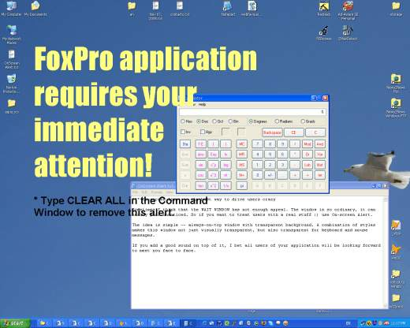

[ Home ](https://github.com/VFPX/Win32API)  

# Placing On-screen Alert on top of all windows

## Short description:
Sometimes I think that the WAIT WINDOW has insufficient appeal. Too ordinary look may cause the message passed unnoticed. So if one wants to treat the users with a real stuff, he should use the On-screen Alert.

The idea is simple -- the always-on-top window with transparent background. A combination of window styles makes it not just visually transparent, but also transparent for the keyboard and mouse messages.  
***  


## Before you begin:
Sometimes I think that the WAIT WINDOW has insufficient appeal. Too ordinary look may cause the message passed unnoticed. So if one wants to treat the users with a real stuff, he should use the On-screen Alert.  

The idea is simple -- the *always-on-top* window with *transparent* background. A combination of window styles makes it not just visually transparent, but also transparent for the keyboard and mouse messages.  

  

Adding a good sound on top makes the whole thing totally unbearable. I bet all users of your application will be looking forward to meet you face to face.  

See also:


* [Shaking VFP form controls](sample_526.md)  
* [Flashing caption of a VFP application in the Windows task bar using FlashWindowEx](sample_271.md)  
* [How to play a waveform sound](sample_251.md)  
* [Playing WAV sounds simultaneously](sample_523.md)  
  
***  


## Code:
```foxpro  
PUBLIC oAlert1 As TAlert, oAlert2 As TAlert

oAlert1 = CREATEOBJECT("TAlert")
WITH oAlert1
	.Left=100
	.Top=100
	.Width=800
	.Height=500
	.FontName="Impact"
	.FontSize=-92
	.FontBold=.F.
	.ForeColor=0x80ffff
	.alertmessage="FoxPro application requires " +;
		"your immediate attention!"
	.ShowAlert
ENDWITH

oAlert2 = CREATEOBJECT("TAlert")
WITH oAlert2
	.Left=100
	.Top=580
	.Width=600
	.Height=200
	.FontName=_screen.FontName
	.FontSize=-32
	.FontBold=.T.
	.ForeColor=0
	.alertmessage="* Type CLEAR ALL in the Command Window " +;
		"to remove this alert."
	.ShowAlert
ENDWITH
* end of main

DEFINE CLASS TAlert As Custom
#DEFINE SW_HIDE 0
#DEFINE SW_SHOWNA 8
#DEFINE WS_DISABLED 0x08000000
#DEFINE WS_EX_TOPMOST 8
#DEFINE WS_EX_TRANSPARENT 0x00000020
#DEFINE WS_EX_LAYERED 0x80000
#DEFINE WS_EX_NOACTIVATE 0x8000000
#DEFINE SM_CXSCREEN 0
#DEFINE SM_CYSCREEN 1
#DEFINE SM_CYCAPTION 4
#DEFINE SM_CXFRAME 32
#DEFINE SM_CYFRAME 33
#DEFINE DT_WORDBREAK 16
#DEFINE FW_NORMAL 400
#DEFINE FW_BOLD 700
#DEFINE ANSI_CHARSET 0
#DEFINE OUT_DEVICE_PRECIS 5
#DEFINE OUT_OUTLINE_PRECIS 8
#DEFINE CLIP_STROKE_PRECIS 2
#DEFINE PROOF_QUALITY 2
#DEFINE DEFAULT_PITCH 0
#DEFINE ANTIALIASED_QUALITY 4
#DEFINE LWA_COLORKEY 1
	Left=0
	Top=0
	Width=300
	Height=60
	FontName="Arial"
	FontSize=24
	FontBold=.T.
	ForeColor=0
	alertmessage="Alert!"
	hFont=0
	hWindow=0
	
	ADD OBJECT Timer1 As Timer WITH Interval=1000

PROCEDURE Init
	THIS.declare

PROCEDURE Destroy
	THIS.ClearAlert

PROCEDURE ClearAlert
	THIS.ReleaseFont
	THIS.ReleaseWindow

PROCEDURE HideAlert
	= ShowWindowA(THIS.hWindow, SW_HIDE)
	THIS.Timer1.Interval=0

PROCEDURE ShowAlert
	THIS.RefreshAlert
	THIS.Timer1.Interval=1000

PROCEDURE Timer1.Timer
	THIS.Parent.RefreshAlert

PROCEDURE RefreshAlert
	IF THIS.hWindow = 0
		THIS.CreateWindow
		THIS.CreateFont
	ENDIF

	= ShowWindowA(THIS.hWindow, SW_SHOWNA)

	LOCAL hDC
	hDC = GetDC(THIS.hWindow)
	= SelectObject(hDC, THIS.hFont)
	
	THIS.DrawText(THIS.alertmessage, hDC,;
		3, 3, THIS.Width-10, THIS.Height-10,;
		THIS.ForeColor)

	= ReleaseDC(THIS.hWindow, hDC)

PROCEDURE DrawText(cMessage, hDC, nLeft, nTop,;
	nWidth, nHeight, nColor)
	LOCAL oRect As RECT

	oRect = CREATEOBJECT("RECT",;
		nLeft, nTop, nWidth, nHeight)

	= SetBkMode(hDC, 1)  && transparent
	= SetTextColor(hDC, nColor)
	= DrawText(hDC, cMessage,;
		LEN(cMessage), oRect.ToString(), DT_WORDBREAK)

PROCEDURE ReleaseWindow
	IF THIS.hWindow <> 0
		= DestroyWindow(THIS.hWindow)
		THIS.hWindow=0
	ENDIF

PROCEDURE CreateWindow
	THIS.ReleaseWindow

	LOCAL hParent, cClass, nExStyle, nStyle
	hParent = _screen.HWnd
	cClass = THIS.GetWinClass(hParent)

	* window styles
	nStyle = WS_DISABLED
	nExStyle = BITOR(WS_EX_TOPMOST, WS_EX_LAYERED,;
		WS_EX_TRANSPARENT, WS_EX_NOACTIVATE)

	THIS.hWindow = CreateWindowEx(nExStyle, cClass,;
		"Alert", nStyle, THIS.Left, THIS.Top,;
		THIS.Width, THIS.Height, hParent, 0, 0, 0)

	* create region and apply it to the window;
	* this cuts the caption and the frame off the window
	LOCAL nCaptionHeight, nFrameWidth, nFrameHeight,;
		x1, y1, x2, y2, hRgnBase

	nCaptionHeight = GetSystemMetrics(SM_CYCAPTION)
	nFrameWidth = GetSystemMetrics(SM_CXFRAME)
	nFrameHeight = GetSystemMetrics(SM_CYFRAME)

	x1 = nFrameWidth
	y1 = nFrameHeight+nCaptionHeight
	x2 = THIS.Width-nFrameWidth-1
	y2 = THIS.Height-nFrameHeight-1

	hRgnBase = CreateRectRgn(x1, y1, x2, y2)
	= SetWindowRgn(THIS.hWindow, hRgnBase, 1)
	= DeleteObject(hRgnBase)

	* set window transparency -- white
	= SetLayeredWindowAttributes(THIS.hWindow,;
		RGB(255,255,255), 0, LWA_COLORKEY)

PROCEDURE ReleaseFont
	IF THIS.hFont <> 0
		= DeleteObject(THIS.hFont)
		THIS.hFont=0
	ENDIF

PROCEDURE CreateFont
	THIS.ReleaseFont
	THIS.hFont = CreateFont(THIS.FontSize, 0, 0, 0,;
		IIF(THIS.FontBold, FW_BOLD, FW_NORMAL), 0,0,0,;
		ANSI_CHARSET, OUT_DEVICE_PRECIS, CLIP_STROKE_PRECIS,;
		PROOF_QUALITY, DEFAULT_PITCH, THIS.FontName)

PROTECTED PROCEDURE GetWinClass(hParent)
	LOCAL cClass, nSize
	cClass = REPLICATE(CHR(0), 250)
	nSize = RealGetWindowClass(hParent, @cClass , Len(cClass ))
RETURN STRTRAN(SUBSTR(cClass, 1, nSize), Chr(0),"")

PROTECTED PROCEDURE declare
	DECLARE INTEGER DestroyWindow IN user32 INTEGER hWindow
	DECLARE INTEGER DeleteObject IN gdi32 INTEGER hObject
	DECLARE INTEGER SelectObject IN gdi32 INTEGER hdc, INTEGER hObject
	DECLARE INTEGER SetTextColor IN gdi32 INTEGER hdc, INTEGER crColor
	DECLARE INTEGER GetDC IN user32 INTEGER hWindow
	DECLARE INTEGER ReleaseDC IN user32 INTEGER hWindow, INTEGER hdc
	DECLARE INTEGER GetSystemMetrics IN user32 INTEGER nIndex

	DECLARE INTEGER RealGetWindowClass IN user32;
		INTEGER hWindow, STRING @pszType, INTEGER cchType

	DECLARE INTEGER ShowWindow IN user32 AS ShowWindowA;
		INTEGER hWindow, INTEGER nCmdShow

	DECLARE INTEGER CreateWindowEx IN user32;
		INTEGER dwExStyle, STRING lpClassName, STRING lpWindowName,;
		INTEGER dwStyle, INTEGER x, INTEGER y,;
		INTEGER nWidth, INTEGER nHeight, INTEGER hWndParent,;
		INTEGER hMenu, INTEGER hInstance, INTEGER lpParam

	DECLARE INTEGER SetLayeredWindowAttributes IN user32;
		INTEGER hwnd, INTEGER crKey,;
		SHORT bAlpha, INTEGER dwFlags

	DECLARE INTEGER CreateFont IN gdi32;
		INTEGER nHeight, INTEGER nWidth, INTEGER nEscapement,;
		INTEGER nOrientation, INTEGER fnWeight, INTEGER fdwItalic,;
		INTEGER fdwUnderline, INTEGER fdwStrikeOut, INTEGER fdwCharSet,;
		INTEGER fdwOutputPrec, INTEGER fdwClipPrec, INTEGER fdwQuality,;
		INTEGER fdwPitchAndFamily, STRING lpszFace

	DECLARE INTEGER CreateRectRgn IN gdi32;
		INTEGER nLeftRect, INTEGER nTopRect,;
		INTEGER nRightRect, INTEGER nBottomRect

	DECLARE INTEGER SetWindowRgn IN user32;
		INTEGER hWindow, INTEGER hRgn, SHORT bRedraw

	DECLARE INTEGER DrawText IN user32;
		INTEGER hDC, STRING lpString, INTEGER nCount,;
		STRING lpRect, INTEGER uFormat

	DECLARE INTEGER SetBkMode IN gdi32;
		INTEGER hdc, INTEGER iBkMode

ENDDEFINE

DEFINE CLASS RECT As Custom
	left=0
	top=0
	width=0
	height=0

PROCEDURE Init(nLeft, nTop, nWidth, nHeight)
	THIS.left=m.nLeft
	THIS.top=m.nTop
	THIS.width=m.nWidth
	THIS.height=m.nHeight

FUNCTION ToString As String
RETURN num2dword(THIS.left) +;
	num2dword(THIS.top) +;
	num2dword(THIS.left+THIS.width-1) +;
	num2dword(THIS.top+THIS.height-1)

ENDDEFINE

FUNCTION num2dword(lnValue)
#DEFINE m0 0x0000100
#DEFINE m1 0x0010000
#DEFINE m2 0x1000000
	IF lnValue < 0
		lnValue = 0x100000000 + lnValue
	ENDIF
	LOCAL b0, b1, b2, b3
	b3 = Int(lnValue/m2)
	b2 = Int((lnValue - b3*m2) / m1)
	b1 = Int((lnValue - b3*m2 - b2*m1) / m0)
	b0 = Mod(lnValue, m0)
RETURN Chr(b0)+Chr(b1)+Chr(b2)+Chr(b3)  
```  
***  


## Listed functions:
[CreateFont](../libraries/gdi32/CreateFont.md)  
[CreateRectRgn](../libraries/gdi32/CreateRectRgn.md)  
[CreateWindowEx](../libraries/user32/CreateWindowEx.md)  
[DeleteObject](../libraries/gdi32/DeleteObject.md)  
[DestroyWindow](../libraries/user32/DestroyWindow.md)  
[DrawText](../libraries/user32/DrawText.md)  
[GetDC](../libraries/user32/GetDC.md)  
[GetSystemMetrics](../libraries/user32/GetSystemMetrics.md)  
[RealGetWindowClass](../libraries/user32/RealGetWindowClass.md)  
[ReleaseDC](../libraries/user32/ReleaseDC.md)  
[SelectObject](../libraries/gdi32/SelectObject.md)  
[SetBkMode](../libraries/gdi32/SetBkMode.md)  
[SetLayeredWindowAttributes](../libraries/user32/SetLayeredWindowAttributes.md)  
[SetTextColor](../libraries/gdi32/SetTextColor.md)  
[SetWindowRgn](../libraries/user32/SetWindowRgn.md)  
[ShowWindow](../libraries/user32/ShowWindow.md)  

## Comment:
Even if the alert window is always-on-top, sometimes it needs to be redrawn. It happens -- rarely enough, not every time -- when switching between applications or when all windows on the Desktop are minimized. May be I have missed something when mixing together the styles for the alert window.  
  
To keep the code short and compatible not just with VFP9, I decided to add the Timer Control to redraw the window every second. Though I think it is possible to respond to WM_PAINT messages. I will check this opportunity later.  
  
Another option I want to investigate is using the FoxPro form window instead of creating one with the CreateWindow API. The style and the extended style of the form, I think, can be modified to make it look and behave appropriately. And then the form's Paint Event may come handy.  
  
* * *  
The image looks a bit weird on the screen of my Toshiba notebook. There are small white speckles around the letters; a kind of residual left after the white color has been removed by the SetLayeredWindowAttributes call. Interesting enough, the artefact disappears gradually after several seconds, read: after the alert window is redrawn several times.  
  
***  

