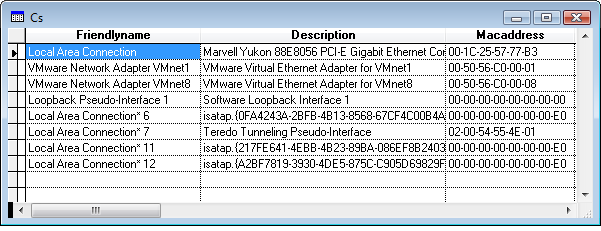

[ Home ](https://github.com/VFPX/Win32API)  

# Obtaining addresses for the adapters on the local computer (Win XP/2003/Vista)

## Before you begin:
  

See also:
* [SendARP function](../libraries/iphlpapi/SendARP.md)
* [How to retrieve adapter information for the local computer (including MAC address)](sample_347.md)  
* [Using NetWkstaTransportEnum to obtain MAC Address of remote server](sample_435.md)  
* [How to ping a remote site using IP Helper API calls](sample_382.md)  
* [How to ping a remote site using ICMP API calls](sample_486.md)  

  
***  


## Code:
```foxpro  
#DEFINE AF_UNSPEC 0
#DEFINE ERROR_SUCCESS 0
#DEFINE MAX_ADAPTER_ADDRESS_LENGTH 8
#DEFINE OFFSET_NEXT_STRUPTR 9

DO declare

PRIVATE hBuffer, cBuffer, nBufsize
nBufsize = 16384  && a sufficient one
hBuffer = GlobalAlloc(0, nBufsize)

nResult = GetAdaptersAddresses(AF_UNSPEC, 0, 0,;
	hBuffer, @nBufsize)

IF NOT nResult = ERROR_SUCCESS
* 111=ERROR_BUFFER_OVERFLOW
	? "Error:", nResult
ELSE
	cBuffer = REPLICATE(CHR(0), nBufsize)
	= MemToStr(@cBuffer, hBuffer, nBufsize)

*!*	typedef struct _IP_ADAPTER_ADDRESSES {
*!*	  union {
*!*	    ULONGLONG Alignment; 0:8
*!*	    struct {
*!*	          ULONG Length;
*!*	          DWORD IfIndex;
*!*	     };
*!*	  };
*!*	  struct _IP_ADAPTER_ADDRESSES* Next;
*!*	  PCHAR AdapterName;
*!*	  PIP_ADAPTER_UNICAST_ADDRESS FirstUnicastAddress;
*!*	  PIP_ADAPTER_ANYCAST_ADDRESS FirstAnycastAddress;
*!*	  PIP_ADAPTER_MULTICAST_ADDRESS FirstMulticastAddress;
*!*	  PIP_ADAPTER_DNS_SERVER_ADDRESS FirstDnsServerAddress;
*!*	  PWCHAR DnsSuffix;
*!*	  PWCHAR Description;
*!*	  PWCHAR FriendlyName;
*!*	  BYTE PhysicalAddress[MAX_ADAPTER_ADDRESS_LENGTH];
*!*	  DWORD PhysicalAddressLength;
*!*	  DWORD Flags;
*!*	  DWORD Mtu;
*!*	  DWORD IfType;
*!*	  IF_OPER_STATUS OperStatus;
*!*	  DWORD Ipv6IfIndex;
*!*	  DWORD ZoneIndices[16];
*!*	  PIP_ADAPTER_PREFIX FirstPrefix;
*!*	} IP_ADAPTER_ADDRESSES, *PIP_ADAPTER_ADDRESSES;

	LOCAL nOffs2Stru, nOffsNext, nMacAddressLen, cMacAddress,;
		nFlags, nMtu, nIftype, nOperStatus

	nOffs2Stru = OFFSET_NEXT_STRUPTR
	
	CREATE CURSOR cs (;
		adaptername C(50),;
		dnssuffix C(30),;
		description C(50),;
		friendlyname C(50),;
		macaddress C(30),;
		flags I, mtu I,;
		iftype I, operstatus I;
	)
	
	DO WHILE .T.

		cAdapterName = StrFromPtr(buf2dword(SUBSTR(;
			cBuffer, nOffs2Stru+4, 4)))
		
		cDnsSuffix = WStrFromPtr(buf2dword(SUBSTR(;
			cBuffer, nOffs2Stru+24, 4)))
		
		cDescription = WStrFromPtr(buf2dword(;
			SUBSTR(cBuffer, nOffs2Stru+28, 4)))

		cFriendlyName = WStrFromPtr(buf2dword(;
			SUBSTR(cBuffer, nOffs2Stru+32, 4)))

		nMacAddressLen = buf2dword(SUBSTR(cBuffer,;
			nOffs2Stru+36+MAX_ADAPTER_ADDRESS_LENGTH, 4))

		nMacAddressLen = IIF(nMacAddressLen=0,;
			MAX_ADAPTER_ADDRESS_LENGTH, nMacAddressLen)

		cMacAddress = Str2Hex(SUBSTR(cBuffer,;
			nOffs2Stru+36, nMacAddressLen))
			
		nFlags = buf2dword(SUBSTR(cBuffer,;
			nOffs2Stru+36+MAX_ADAPTER_ADDRESS_LENGTH+4, 4))

		nMtu = buf2dword(SUBSTR(cBuffer,;
			nOffs2Stru+36+MAX_ADAPTER_ADDRESS_LENGTH+8, 4))
			
		nIftype = buf2dword(SUBSTR(cBuffer,;
			nOffs2Stru+36+MAX_ADAPTER_ADDRESS_LENGTH+12, 4))

		nOperStatus = buf2dword(SUBSTR(cBuffer,;
			nOffs2Stru+36+MAX_ADAPTER_ADDRESS_LENGTH+16, 4))

		INSERT INTO cs VALUES (cAdapterName, cDnsSuffix,;
			cDescription, cFriendlyName, cMacAddress,;
			nFlags, nMtu, nIftype, nOperStatus)

		nOffsNext = buf2dword(SUBSTR(cBuffer, nOffs2Stru, 4))
		IF nOffsNext = 0
			EXIT
		ENDIF

		nOffs2Stru = nOffsNext - hBuffer + OFFSET_NEXT_STRUPTR
	ENDDO

ENDIF

= GlobalFree(hBuffer)
IF USED("cs")
	SELECT cs
	GO TOP
	BROWSE NORMAL NOWAIT
ENDIF
* end of main

FUNCTION Str2Hex(cStr)
	LOCAL cResult, nIndex, nAsc
	cResult=""
	FOR nIndex=1 TO LEN(cStr)
		nAsc = ASC(SUBSTR(cStr, nIndex, 1))
		cResult = cResult +;
			IIF(EMPTY(cResult), "", "-") +;
			RIGHT(TRANSFORM(nAsc, "@0"),2)
	NEXT
RETURN cResult

FUNCTION StrFromPtr(nPtr)
	IF nPtr = 0
		RETURN ""
	ENDIF
	
	LOCAL nOffset, ch, cResult
	nOffset = m.nPtr - hBuffer + 1
	cResult=""

	DO WHILE nOffset <= LEN(cBuffer)
		ch = SUBSTR(cBuffer, nOffset, 1)
		IF m.ch = CHR(0)
			EXIT
		ENDIF
		cResult = m.cResult + m.ch
		nOffset = nOffset + 1
	ENDDO
RETURN m.cResult

FUNCTION WStrFromPtr(nPtr)
	IF nPtr = 0
		RETURN ""
	ENDIF
	
	LOCAL nOffset, ch, cResult
	nOffset = m.nPtr - hBuffer + 1
	cResult=""

	DO WHILE nOffset <= LEN(cBuffer)
		ch = SUBSTR(cBuffer, nOffset, 2)
		IF m.ch = CHR(0)+CHR(0)
			EXIT
		ENDIF
		cResult = m.cResult + m.ch
		nOffset = nOffset + 2
	ENDDO
RETURN STRCONV(m.cResult,6)

PROCEDURE declare
	DECLARE INTEGER GlobalAlloc IN kernel32;
		INTEGER wFlags, INTEGER dwBytes

	DECLARE INTEGER GlobalFree IN kernel32 INTEGER hMem

	DECLARE RtlMoveMemory IN kernel32 As MemToStr;
		STRING @dst, INTEGER src, INTEGER nLength

	DECLARE INTEGER GetAdaptersAddresses IN Iphlpapi;
		LONG Family, LONG flgs, INTEGER Reserved,;
		INTEGER pAdapterAddresses, LONG @pOutBufLen

FUNCTION buf2dword(cBuffer)
RETURN Asc(SUBSTR(cBuffer, 1,1)) + ;
	BitLShift(Asc(SUBSTR(cBuffer, 2,1)),  8) +;
	BitLShift(Asc(SUBSTR(cBuffer, 3,1)), 16) +;
	BitLShift(Asc(SUBSTR(cBuffer, 4,1)), 24)  
```  
***  


## Listed functions:
[GetAdaptersAddresses](../libraries/iphlpapi/GetAdaptersAddresses.md)  
[GlobalAlloc](../libraries/kernel32/GlobalAlloc.md)  
[GlobalFree](../libraries/kernel32/GlobalFree.md)  

## Comment:

Christian Ehlscheid offered this code on UniversalThread as a solution for obtaining physical address (MAC address) for a given ip address:  
  
```foxpro
? IpToMacAddress("192.168.1.0")  
  
FUNCTION IpToMacAddress(lcIP)  
	DECLARE INTEGER inet_addr IN ws2_32.dll STRING cIP  
	DECLARE INTEGER SendARP IN iphlpapi.dll;  
		INTEGER destIP, INTEGER sourceIP,;  
		STRING @ pMacAddr, INTEGER @ PhyAddrLen  
	LOCAL lnHr, lnIpAddr, lcMacAddr, lnLen  
	lnIpAddr = inet_addr(lcIp)  
	lcMacAddr = REPLICATE(CHR(0),6)  
	lnLen = 6  
	lnHr = SendARP(lnIpAddr,0,@lcMacAddr,@lnLen)  
	RETURN BinaryToMac(lcMacAddr,lnLen)  
ENDFUNC  
  
FUNCTION BinaryToMac(lcMacAddr, lnLen)  
	LOCAL lcMac, xj  
	lcMac = ""  
	FOR xj = 1 TO lnLen - 1  
		lcMac = lcMac + RIGHT(TRANSFORM(ASC(;  
			SUBSTR(lcMacAddr,xj,1)),"@0"),2) + ":"  
	ENDFOR  
	lcMac = lcMac + RIGHT(TRANSFORM(ASC(;  
		SUBSTR(lcMacAddr,lnLen,1)),"@0"),2)  
	RETURN lcMac  
ENDFUNC
```
  
The Address Resolution Protocol (ARP) is a protocol used by the Internet Protocol (IP) [RFC826], specifically IPv4, to map IP network addresses to the hardware addresses used by a data link protocol.  
  
***  

