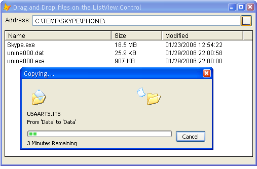

[ Home ](https://github.com/VFPX/Win32API)  

# Displaying standard progress dialog box when copying files

## Short description:
If you have ever thought about retiring ageing VFP commands COPY FILE and RENAME then give this code a try. 

The SHFileOperation copies, deletes and moves a file or multiple files. A variety of flags the fFlags member can take provides great flexibility. For example, in a single SHFileOperation call a group of files can be copied not to just one but to several destinations. The process is accompanied with familiar OS dialogs showing the progress or sending a reminder when existing file is about  to be replaced.  
***  


## Before you begin:
If you`ve been thinking about retiring ageing VFP commands COPY FILE and RENAME then give this code a try.  

  

See also:

* [How to remove a directory that is not empty](sample_541.md)  
  
***  


## Code:
```foxpro  
LOCAL oForm As Explorer
oForm = CREATEOBJECT("Explorer")
oForm.Visible=.T.
READ EVENTS
* end of main

DEFINE CLASS Explorer As Form
	Width=500
	Height=300
	BorderStyle=2
	AutoCenter=.T.
	Caption="Drag and Drop files on the ListView Control"
	ShowWindow=2
	defaultpath="c:\temp"  && replace with valid name

	ADD OBJECT lst As TListView WITH;
	Left=5, Top=35, Width=490, Height=250

	ADD OBJECT Label1 As TLabel WITH;
	Left=7, Top=7, Caption="Address:"
	
	ADD OBJECT txtFolder As TextBox WITH;
	Left=60, Top=5, Width=410, ControlSource="THIS.Parent.defaultpath"

	ADD OBJECT cmdFolder As CommandButton WITH;
	Left=470, Top=4, Width=24, Height=24, Caption=".."

PROCEDURE Init
	DECLARE STRING StrFormatByteSizeA IN Shlwapi;
		INTEGER dw, STRING @pszBuf, INTEGER cchBuf

	= BINDEVENT(THIS.cmdFolder, "Click", THIS, "GetFolder")
	THIS.populatelist(THIS.defaultpath)

PROCEDURE Destroy
	CLEAR EVENTS

PROCEDURE defaultpath_ASSIGN(cPath)
	IF THIS.PopulateList(@m.cPath)
		THIS.defaultpath = m.cPath
		THIS.Refresh
	ENDIF

PROTECTED PROCEDURE GetFolder
	LOCAL cStoredPath, cPath
	cStoredPath = SYS(5) + SYS(2003)
	cPath = GETDIR(THIS.defaultpath, "Folders:", "Select Folder")
	SET DEFAULT TO (m.cStoredPath)
	IF NOT EMPTY(m.cPath)
		THIS.defaultpath = m.cPath
	ENDIF

PROCEDURE lst.OLEDragDrop
LPARAMETERS oDataObject, nEffect, nButton, nShift, nXCoord, nYCoord
	THIS.Parent.onlist_oledragdrop(@oDataObject)

PROCEDURE onlist_oledragdrop
PARAMETERS oDataObject
	LOCAL oShell As SHFileOperation, oFiles, oFile
	
	oShell = CREATEOBJECT("SHFileOperation", THIS.HWnd)

	oFiles = oDataObject.Files
	FOR EACH oFile IN oFiles
		oShell.AddSourceFile(m.oFile)
	NEXT
	
	WITH oShell
		.TargetFolder = THIS.defaultpath
		.CopyFiles
		THIS.populatelist(THIS.defaultpath)
		
		IF .Aborted
			= MESSAGEBOX("The operation has been aborted " +;
				"by user.     ", 64, "Aborted by user")
		ENDIF
	ENDWITH

PROTECTED PROCEDURE PopulateList(cPath)
	cPath = ALLTRIM(m.cPath)
	THIS.lst.ListItems.Clear
	
	LOCAL nCount, nIndex, oItem

	nCount = ADIR(arrListOfFiles, m.cPath + "\*.*", "D", 1)
	FOR nIndex=1 TO nCount
		IF arrListOfFiles[nIndex, 1] = "."
			LOOP
		ENDIF
		
		IF DIRECTORY(m.cPath + "\" + arrListOfFiles[nIndex, 1])
			oItem = THIS.lst.ListItems.Add(,,arrListOfFiles[nIndex, 1])
			WITH oItem
				.Bold=1
				.Subitems(1) = "Folder"
				.Subitems(2) = DTOC(arrListOfFiles[nIndex, 3]) +;
					" " + arrListOfFiles[nIndex, 4]
			ENDWITH
		ENDIF
	NEXT
	RELEASE arrListOfFiles

	nCount = ADIR(arrListOfFiles, m.cPath + "\*.*", "A", 1)
	FOR nIndex=1 TO nCount
		IF NOT DIRECTORY(m.cPath + "\" + arrListOfFiles[nIndex, 1])
			oItem = THIS.lst.ListItems.Add(,,arrListOfFiles[nIndex, 1])
			WITH oItem
				.Subitems(1) = THIS.FormatFilesize(arrListOfFiles[nIndex, 2])
				.Subitems(2) = DTOC(arrListOfFiles[nIndex, 3]) +;
					" " + arrListOfFiles[nIndex, 4]
			ENDWITH
		ENDIF
	NEXT
	RELEASE arrListOfFiles

PROTECTED PROCEDURE FormatFilesize(nSize)
	LOCAL cBuffer
	cBuffer = REPLICATE(CHR(0), 128)
	= StrFormatByteSizeA(m.nSize, @cBuffer, LEN(m.cBuffer))
RETURN STRTRAN(m.cBuffer, CHR(0), "")

ENDDEFINE

DEFINE CLASS TLabel As Label
	Autosize=.T.
	BackStyle=0
ENDDEFINE

DEFINE CLASS TListView As OleControl
	OleClass="MSComctlLib.ListViewCtrl"

PROCEDURE Init
	WITH THIS
		.View=3
		.Appearance=0
		.BorderStyle=1
		.OleDropMode=1  && manual
		.Arrange=0
		.LabelEdit=1
		.FullRowSelect=0
		.AddColumnHeader("Name", 210)
		.AddColumnHeader("Size", 100)
		.AddColumnHeader("Modified", 160)
	ENDWITH

PROTECTED PROCEDURE AddColumnHeader(cCaption, nWidth)
	WITH THIS.ColumnHeaders.Add()
		.Text=cCaption
		.Width=nWidth
	ENDWITH
ENDDEFINE

DEFINE CLASS SHFileOperation As Custom
#DEFINE FO_MOVE 1
#DEFINE FO_COPY 2
#DEFINE FO_DELETE 3
#DEFINE FO_RENAME 4
#DEFINE FOF_ALLOWUNDO 64
	hwnd=0
	OperationMode=0
	SourceFiles=""
	TargetFolder=""
	OperationFlags=0
	errorcode=0
	aborted=.F.

PROCEDURE Init(hWindow)
	THIS.hwnd = m.hWindow

PROCEDURE AddSourceFile(cFilename)
	THIS.SourceFiles = THIS.SourceFiles + m.cFilename + CHR(0)

PROCEDURE CopyFiles
	THIS.DoVerb(FO_COPY, FOF_ALLOWUNDO)

PROCEDURE MoveFiles
	THIS.DoVerb(FO_MOVE, FOF_ALLOWUNDO)

PROCEDURE DeleteFiles
	THIS.DoVerb(FO_DELETE, FOF_ALLOWUNDO)

PROCEDURE DoVerb(nOperatioMode, nFlags)
	DECLARE INTEGER SHFileOperation IN Shell32 STRING @lpFileOp

	THIS.OperationMode = m.nOperatioMode

	IF VARTYPE(m.nFlags)="N"
		THIS.OperationFlags = m.nFlags
	ENDIF

	LOCAL cBuffer, oFrom, oTo

	oFrom = CREATEOBJECT("PChar", THIS.SourceFiles)

	IF NOT EMPTY(THIS.TargetFolder)
		oTo = CREATEOBJECT("PChar", THIS.TargetFolder)
	ENDIF

	cBuffer = num2dword(THIS.hwnd) +;
		num2dword(THIS.OperationMode) +;
		num2dword(oFrom.GetAddr()) +;
		num2dword(IIF(EMPTY(THIS.TargetFolder), 0, oTo.GetAddr())) +;
		num2word(THIS.OperationFlags) +;
		num2word(0) +;
		num2dword(0) + num2dword(0)

	THIS.errorcode = SHFileOperation(@cBuffer)
	THIS.aborted = (buf2word(SUBSTR(cBuffer, 19, 2)) <> 0)

ENDDEFINE

FUNCTION buf2word(lcBuffer)
RETURN Asc(SUBSTR(lcBuffer, 1,1)) + ;
       Asc(SUBSTR(lcBuffer, 2,1)) * 256

FUNCTION num2word(lnValue)
RETURN Chr(MOD(m.lnValue,256)) + CHR(INT(m.lnValue/256))

FUNCTION num2dword(lnValue)
#DEFINE m0 0x0000100
#DEFINE m1 0x0010000
#DEFINE m2 0x1000000
	IF lnValue < 0
		lnValue = 0x100000000 + lnValue
	ENDIF
	LOCAL b0, b1, b2, b3
	b3 = Int(lnValue/m2)
	b2 = Int((lnValue - b3*m2)/m1)
	b1 = Int((lnValue - b3*m2 - b2*m1)/m0)
	b0 = Mod(lnValue, m0)
RETURN Chr(b0)+Chr(b1)+Chr(b2)+Chr(b3)

FUNCTION buf2dword(cBuffer)
RETURN Asc(SUBSTR(cBuffer, 1,1)) + ;
	BitLShift(Asc(SUBSTR(cBuffer, 2,1)),  8) +;
	BitLShift(Asc(SUBSTR(cBuffer, 3,1)), 16) +;
	BitLShift(Asc(SUBSTR(cBuffer, 4,1)), 24)

DEFINE CLASS PChar As Session
PROTECTED hMem

PROCEDURE Init(lcString)
	THIS.hMem = 0
	THIS.setValue(lcString)

PROCEDURE Destroy
	THIS.ReleaseString

FUNCTION GetAddr
RETURN THIS.hMem

FUNCTION GetValue
	LOCAL lnSize, lcBuffer
	lnSize = THIS.getAllocSize()
	lcBuffer = SPACE(lnSize)

	IF THIS.hMem <> 0
		DECLARE RtlMoveMemory IN kernel32 As MemToStr;
			STRING @, INTEGER, INTEGER
		= MemToStr(@lcBuffer, THIS.hMem, lnSize)
	ENDIF
RETURN lcBuffer

FUNCTION GetAllocSize
	DECLARE INTEGER GlobalSize IN kernel32 INTEGER hMem
RETURN Iif(THIS.hMem=0, 0, GlobalSize(THIS.hMem))

PROCEDURE SetValue(lcString)
#DEFINE GMEM_FIXED 0
	THIS.ReleaseString

	DECLARE INTEGER GlobalAlloc IN kernel32 INTEGER, INTEGER
	DECLARE RtlMoveMemory IN kernel32 As StrToMem;
		INTEGER, STRING @, INTEGER

	LOCAL lnSize
	lcString = lcString + Chr(0)
	lnSize = Len(lcString)
	THIS.hMem = GlobalAlloc(GMEM_FIXED, lnSize)
	IF THIS.hMem <> 0
		= StrToMem(THIS.hMem, @lcString, lnSize)
	ENDIF

PROCEDURE ReleaseString
	IF THIS.hMem <> 0
		DECLARE INTEGER GlobalFree IN kernel32 INTEGER
		= GlobalFree (THIS.hMem)
		THIS.hMem = 0
	ENDIF
ENDDEFINE  
```  
***  


## Listed functions:
[GlobalAlloc](../libraries/kernel32/GlobalAlloc.md)  
[GlobalFree](../libraries/kernel32/GlobalFree.md)  
[GlobalSize](../libraries/kernel32/GlobalSize.md)  
[SHFileOperation](../libraries/shell32/SHFileOperation.md)  

## Comment:
The SHFileOperation copies, deletes and moves a file or multiple files. It requires a single parameter that points to a SHFILEOPSTRUCT structure. The structure has to be populated before calling the function.  
  
Most of the SHFILEOPSTRUCT members are easy to populate except may be *pFrom* and *pTo* since they are pointers to strings with no direct support in VFP for this kind of objects. Class PChar inside the code handles string pointers. It allocates and releases memory blocks and moves data between VFP strings and an address in memory.  
  
A variety of flags the *fFlags* member can take provides great flexibility. For example, in a single SHFileOperation call a group of files can be copied not to just one but to several destinations. The process is accompanied with familiar OS dialogs showing the progress or sending a reminder when existing file is about to be replaced.  
  
* * *  
The Shell is as usual brief and efficient. The following code copies all files from the source folder to the target folder. Test with care:  
  
```foxpro
LOCAL oShell, oSrcFolder, oDstFolder  
  
oShell = CREATEOBJECT("Shell.Application")  
oSrcFolder = oShell.NameSpace("c:\temp1")  
oDstFolder = oShell.NameSpace("c:\temp")  
  
IF VARTYPE(oDstFolder)="O" AND VARTYPE(oSrcFolder.Items)="O"  
	oDstFolder.CopyHere(oSrcFolder.Items)  
ENDIF
```

***  

