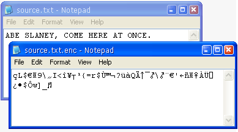

[ Home ](https://github.com/VFPX/Win32API)  

# A class that encrypts and decrypts files using Cryptography API Functions

## Short description:
This simple class uses several Cryptography API Functions to implement password-protected encryption and decryption of files.  
***  


## Before you begin:
The *EncryptDecrypt* class uses several Cryptography API Functions to implement password-protected encryption and decryption of files.  
  

Do you think there are some similarities?  
  

Here is an example of code that encrypts a file:  
```foxpro
LOCAL oEnc As EncryptDecrypt  
oEnc = CREATEOBJECT("EncryptDecrypt")  

WITH oEnc  
	IF NOT .GenerateKey("foxpro")  && a password  
		? .errorno, .errormessage  
	ELSE  
		IF NOT .EncryptFile("c:\myfiles\somefile.txt",;  
			"c:\myfiles\somefile.enc")  
			? .errorno, .errormessage  
		ENDIF  
	ENDIF  
ENDWITH
```
The decryption is same simple:  
```foxpro
WITH oEnc  
	IF NOT .GenerateKey("foxpro")  && use same password  
		? .errorno, .errormessage  
	ELSE  
		IF NOT .DecryptFile("c:\myfiles\somefile.enc",;  
			"c:\myfiles\somefile.enc.txt")  
			? .errorno, .errormessage  
		ENDIF  
	ENDIF  
ENDWITH
```
See also:

* [How to create MD-5 and SHA-1 hash values from a string](sample_483.md)  
* [CryptoAPI: Collection of Providers class](sample_463.md)  

  
***  


## Code:
```foxpro  
#DEFINE PROV_RSA_FULL 1
#DEFINE CRYPT_VERIFYCONTEXT 0xf0000000
#DEFINE KEYLENGTH 0x00800000
#DEFINE CRYPT_EXPORTABLE 1

#DEFINE ALG_CLASS_HASH BITLSHIFT(4, 13)
#DEFINE ALG_TYPE_ANY 0
#DEFINE ALG_SID_MD5 3
#DEFINE CALG_MD5 BITOR(ALG_CLASS_HASH, ALG_TYPE_ANY, ALG_SID_MD5)

#DEFINE ALG_CLASS_DATA_ENCRYPT BITLSHIFT(3, 13)
#DEFINE ALG_TYPE_STREAM BITLSHIFT(4, 9)
#DEFINE ALG_SID_RC4 1
#DEFINE CALG_RC4 BITOR(ALG_CLASS_DATA_ENCRYPT, ALG_TYPE_STREAM, ALG_SID_RC4)

#DEFINE CALG_3DES 0x6603 && Triple DES encryption algorithm.
#DEFINE CALG_DES 0x6601 && DES encryption algorithm.

DEFINE CLASS EncryptDecrypt As Session
PROTECTED hProvider, hKey, signature
	hProvider=0
	hKey=0
	signature="VFP_ENCRYPT_DECRYPT"
	errorno=0
	errormessage=""

PROCEDURE Init
	THIS.declare
	THIS.AcquireContext

PROCEDURE Destroy
	THIS.DestroyKey
	THIS.ReleaseContext

FUNCTION EncryptFile(cSourceFile, cTargetFile) As Boolean
RETURN THIS.ProcessFile(cSourceFile, cTargetFile, .T.)

FUNCTION DecryptFile(cSourceFile, cTargetFile) As Boolean
RETURN THIS.ProcessFile(cSourceFile, cTargetFile, .F.)

PROTECTED PROCEDURE ReleaseContext
	IF THIS.hProvider <> 0
		= CryptReleaseContext(THIS.hProvider, 0)
		THIS.hProvider=0
	ENDIF

PROTECTED PROCEDURE DestroyKey
	IF THIS.hKey <> 0
		= CryptDestroyKey(THIS.hKey)
		THIS.hKey=0
	ENDIF

PROTECTED PROCEDURE AcquireContext
	THIS.ReleaseContext
	THIS.ClearError

	LOCAL hProvider, nResult
	hProvider=0

	IF CryptAcquireContext(@hProvider, NULL, NULL,;
		PROV_RSA_FULL, CRYPT_VERIFYCONTEXT) = 0
		THIS.SetError(GetLastError(),;
			"Call to CryptAcquireContext failed.")
		RETURN .F.
	ELSE
		THIS.hProvider = m.hProvider
	ENDIF
RETURN .T.

PROCEDURE GenerateKey(cPassword)
	THIS.ClearError
	THIS.DestroyKey

	LOCAL hHash, hKey, lResult
	STORE 0 TO hHash, hKey

	IF CryptCreateHash(THIS.hProvider, CALG_MD5, 0, 0, @hHash)=0
		THIS.SetError(GetLastError(),;
			"Call to CryptCreateHash failed.")
		lResult=.F.
	ELSE
		IF CryptHashData(m.hHash, @cPassword, LEN(cPassword), 0)=0
			THIS.SetError(GetLastError(),;
				"Call to CryptHashData failed.")
			lResult=.F.
		ELSE
			IF CryptDeriveKey(THIS.hProvider, CALG_RC4,;
				m.hHash, KEYLENGTH, @hKey)=0
				THIS.SetError(GetLastError(),;
					"Call to CryptDeriveKey failed.")
				lResult=.F.
			ELSE
				THIS.hKey = m.hKey
				lResult=.T.
			ENDIF
		ENDIF
	ENDIF
	
	IF (m.hHash <> 0)
		= CryptDestroyHash(m.hHash)
	ENDIF
RETURN m.lResult

FUNCTION EncryptBuffer(cBuffer) As Boolean
	THIS.ClearError

	IF THIS.hProvider=0
		THIS.SetError(-1,;
			"Cryptographic Service Provider handle is invalid.")
		RETURN .F.
	ENDIF
	IF THIS.hKey=0
		THIS.SetError(-1,;
			"Cryptographic session key is invalid.")
		RETURN .F.
	ENDIF

	LOCAL nTextSize, nBufsize, lResult
	nTextSize = LEN(m.cBuffer)

	* call the function first time to determine
	* the correct buffer size
	= CryptEncrypt(THIS.hKey, 0, 1, 0,;
		NULL, @nTextSize, nBufsize)

	nBufsize = nTextSize
	nTextSize = LEN(m.cBuffer)
	cBuffer = PADR(cBuffer, nBufsize, CHR(0))

	IF CryptEncrypt(THIS.hKey, 0, 1, 0, @cBuffer,;
		@nTextSize, nBufsize)=0
		THIS.SetError(GetLastError(), "Call to CryptEncrypt failed.")
		RETURN .F.
	ENDIF
RETURN .T.

FUNCTION DecryptBuffer(cBuffer) As Boolean
	THIS.ClearError

	IF THIS.hProvider=0
		THIS.SetError(-1,;
			"Cryptographic Service Provider handle is invalid.")
		RETURN .F.
	ENDIF
	IF THIS.hKey=0
		THIS.SetError(-1,;
			"Cryptographic session key is invalid.")
		RETURN .F.
	ENDIF

	LOCAL nBufsize, lResult
	nBufsize = LEN(m.cBuffer)
	IF CryptDecrypt(THIS.hKey, 0, 1, 0,;
		@cBuffer, @nBufsize)=0
		THIS.SetError(GetLastError(),;
			"Call to CryptDecrypt failed.")
		RETURN .F.
	ENDIF
	cBuffer = PADR(m.cBuffer, m.nBufsize)
RETURN .T.

PROTECTED FUNCTION ProcessFile(cSourceFile,;
			cTargetFile, lEncrypt) As Boolean
	LOCAL cBuffer, ex As Exception, lResult
	TRY
		cBuffer = FILETOSTR(m.cSourceFile)
	CATCH TO ex
	ENDTRY
	
	IF VARTYPE(m.ex) = "O"
		THIS.SetError(ex.ErrorNo, ex.Message)
		RETURN .F.
	ENDIF

	IF m.lEncrypt
		cBuffer = THIS.signature + cBuffer
		lResult = THIS.EncryptBuffer(@cBuffer)
	ELSE
		lResult = THIS.DecryptBuffer(@cBuffer)
		IF lResult
			IF AT(THIS.signature, m.cBuffer) <> 1
				THIS.SetError(-1, "Invalid password")
				RETURN .F.
			ENDIF
			cBuffer = SUBSTR(cBuffer, LEN(THIS.signature)+1)
		ENDIF
	ENDIF

	IF m.lResult
		TRY
			STRTOFILE(m.cBuffer, m.cTargetFile)
		CATCH TO ex
		ENDTRY

		IF VARTYPE(m.ex) = "O"
			THIS.SetError(ex.ErrorNo, ex.Message)
			RETURN .F.
		ENDIF
		RETURN .T.
	ENDIF
RETURN .F.

PROTECTED PROCEDURE SetError(nError, cMsg)
	THIS.errorno = m.nError
	THIS.errormessage = m.cMsg

PROTECTED PROCEDURE ClearError
	THIS.SetError(0, "")

PROCEDURE declare
	DECLARE INTEGER GetLastError IN kernel32
	DECLARE INTEGER CryptDestroyHash IN advapi32 INTEGER hHash
	DECLARE INTEGER CryptDestroyKey IN advapi32 INTEGER hKey

	DECLARE INTEGER CryptCreateHash IN advapi32;
		INTEGER hProv, INTEGER Algid, INTEGER hKey,;
		INTEGER dwFlags, INTEGER @phHash

	DECLARE INTEGER CryptAcquireContext IN advapi32;
		INTEGER @hProvHandle, STRING cContainer, ;
		STRING cProvider, INTEGER nProvType, INTEGER nFlags

	DECLARE INTEGER CryptReleaseContext IN advapi32;
		INTEGER hProvHandle, INTEGER nReserved

	DECLARE INTEGER CryptHashData IN advapi32;
		INTEGER hHash, STRING @pbData,;
		LONG dwDataLen, LONG dwFlags

	DECLARE INTEGER CryptDeriveKey IN advapi32;
		INTEGER hProv, INTEGER Algid, INTEGER hBaseData,;
		LONG dwFlags, INTEGER @phKey

	DECLARE INTEGER CryptEncrypt IN advapi32;
		INTEGER hKey, INTEGER hHash, INTEGER Final,;
		LONG dwFlags, STRING @pbData,;
		LONG @pdwDataLen, LONG dwBufLen

	DECLARE INTEGER CryptDecrypt IN advapi32;
		INTEGER hKey, INTEGER hHash, INTEGER Final,;
		LONG dwFlags, STRING @pbData, LONG @pdwDataLen

ENDDEFINE  
```  
***  


## Listed functions:
[CryptAcquireContext](../libraries/advapi32/CryptAcquireContext.md)  
[CryptCreateHash](../libraries/advapi32/CryptCreateHash.md)  
[CryptDecrypt](../libraries/advapi32/CryptDecrypt.md)  
[CryptDeriveKey](../libraries/advapi32/CryptDeriveKey.md)  
[CryptDestroyHash](../libraries/advapi32/CryptDestroyHash.md)  
[CryptDestroyKey](../libraries/advapi32/CryptDestroyKey.md)  
[CryptEncrypt](../libraries/advapi32/CryptEncrypt.md)  
[CryptHashData](../libraries/advapi32/CryptHashData.md)  
[CryptReleaseContext](../libraries/advapi32/CryptReleaseContext.md)  
[GetLastError](../libraries/kernel32/GetLastError.md)  

## Comment:
Default cryptographic service provider (CSP) is used along with algorithms <a href="http://en.wikipedia.org/wiki/MD5">CALG_MD5</a> for hashing and <a href="http://en.wikipedia.org/wiki/RC4">CALG_RC4</a> for encryption/decryption.  
  
Before encrypting or decrypting files, user must provide a password using the *GenerateKey* method of the class. A cryptographic session key is created from the hash of this password.   
  
A file is processed as a single block.  
  
* * *  
Oct.29, 2008: the EncryptBuffer method now allocates correct buffer size in cases when encrypted data is larger than the original plain text.  
  
***  

