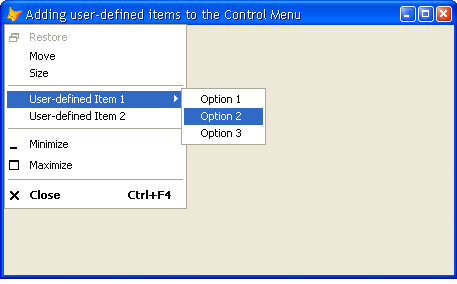

[ Home ](https://github.com/VFPX/Win32API)  

# Adding user-defined items to the Control Menu of VFP form (requires VFP9)

## Short description:
User-defined items can be added to the Control Menu of any VFP form. In VFP9 it is also possible to link such menu items to a method of the form.
  
***  


## Before you begin:
User-defined items can be added to the Control Menu of any VFP form. In VFP9 it is also possible to link such menu items to a method of the form.  

This code sample is a result of fast and productive discussion on UT. Many thanks to Carlos Alloatti.  

  

Note: *VFP9 SP1 is required*. I have found that on older VFP9 versions (e.g. 09.00.000.2412) the Close menu item may not close the form had the Control Menu been modified.  

For more VFP9 BINDEVENT() examples see also:  
* [Adding icon to the systray (requires VFP9)](sample_235.md)  
* [How to block the PrintScreen key](sample_489.md)  
* [Dragging files from Explorer window and dropping them on FoxPro control (requires VFP9)](sample_323.md)  
* [Transparent Menu Class (requires VFP9)](sample_496.md)  

See also:

* [How to hot-track menu item selection in top-level form](sample_521.md)  
* [Transparent Menu on top-level form](sample_496.md)  
* [Using FoxTray ActiveX control: System Tray Icon and menu attached to VFP form](sample_336.md)  
* [Adding icon to the systray (requires VFP9)](sample_235.md)  

  
***  


## Code:
```foxpro  
PUBLIC oForm As Tform
oForm = CREATEOBJECT("Tform")
oForm.Visible=.T.
* end of main

DEFINE CLASS Tform As Form
	Width=450
	Height=250
	Autocenter=.T.
	Caption="Adding user-defined items to the Control Menu"
	
	ADD OBJECT ctrlmenu As ControlMenu1
ENDDEFINE

DEFINE CLASS ControlMenu1 As ControlMenu
#DEFINE WM_UDFITEM_1 0x5000
#DEFINE WM_UDFITEM_2 0x5001

PROCEDURE AddMenuItems
	LOCAL hPopup
	hPopup = CreatePopupMenu()

	THIS.PopupAddMenuItem(m.hPopup, "Option 1",;
		1, WM_UDFITEM_1+101, 0)

	THIS.PopupAddMenuItem(m.hPopup, "Option 2",;
		2, WM_UDFITEM_1+102, 0)

	THIS.PopupAddMenuItem(m.hPopup, "Option 3",;
		3, WM_UDFITEM_1+103, 0)

	THIS.AddSeparator(3)
	THIS.AddMenuItem("User-defined Item 1", 4, WM_UDFITEM_1, m.hPopup)
	THIS.AddMenuItem("User-defined Item 2", 5, WM_UDFITEM_2, 0)
	THIS.AddSeparator(6)

PROCEDURE OnMenuItemClicked(nItemID)
	DO CASE

	CASE BETWEEN(nItemID, WM_UDFITEM_1+101, WM_UDFITEM_1+103)
		= MESSAGEBOX("User-defined menu item " +;
			TRANSFORM(m.nItemID, "@0") + " has been clicked.     ",;
			64, "UDF System Menu items")

	CASE nItemID = WM_UDFITEM_2
		ACTIVATE SCREEN
		? "User-defined menu item 2 clicked"

	OTHERWISE
		RETURN .F.
	ENDCASE
RETURN .T.

ENDDEFINE

DEFINE CLASS ControlMenu As Custom
PROTECTED hWindow, hOrigProc, hSysmenu
	hWindow=0
	hOrigProc=0
	hSysmenu=0

#DEFINE WM_SYSCOMMAND 0x0112
#DEFINE GWL_WNDPROC -4
#DEFINE MENUITEMINFO_SIZE 48
#DEFINE MFT_STRING 0
#DEFINE MFT_SEPARATOR 0x00000800
#DEFINE MIIM_STATE 1
#DEFINE MIIM_ID 2
#DEFINE MIIM_SUBMENU 4
#DEFINE MIIM_TYPE 16
#DEFINE MFS_ENABLED 0

PROCEDURE Init
	DECLARE INTEGER CreatePopupMenu IN user32

	DECLARE INTEGER GetWindowLong IN user32;
		INTEGER hWindow, INTEGER nIndex

	DECLARE INTEGER CallWindowProc IN user32;
		INTEGER lpPrevWndFunc, INTEGER hWindow, LONG Msg,;
		INTEGER wParam, INTEGER lParam

	DECLARE INTEGER GetSystemMenu IN user32;
		INTEGER hWindow, INTEGER bRevert

	DECLARE INTEGER InsertMenuItem IN user32;
		INTEGER hMenu, INTEGER uItem,;
		INTEGER fByPosition, STRING @lpmii

	THIS.hWindow = ThisForm.HWnd
	THIS.hSysmenu = GetSystemMenu(THIS.hWindow, 0)
	THIS.hOrigProc = GetWindowLong(THIS.hWindow, GWL_WNDPROC)
	THIS.AddMenuItemsInternal

PROCEDURE Destroy
	IF VERSION(5) >= 900  AND THIS.hWindow <> 0  && VFP9+
		= UNBINDEVENTS(THIS.hWindow, WM_SYSCOMMAND)
	ENDIF

PROCEDURE AddMenuItems  && virtual method

PROTECTED PROCEDURE AddMenuItemsInternal
	THIS.AddMenuItems
	IF VERSION(5) >= 900  && VFP9+
		= BINDEVENT(THIS.hWindow, WM_SYSCOMMAND,;
			THIS, "HookedWindowProc")
	ENDIF

PROCEDURE AddMenuItem(cCaption, nPosition, nUID, hPopup)
THIS.AddMenuItemInternal(THIS.hSysmenu, m.cCaption,;
	m.nPosition, m.nUID, m.hPopup)

PROCEDURE AddSeparator(nPosition)
THIS.AddSeparatorInternal(THIS.hSysmenu, nPosition)

PROCEDURE PopupAddMenuItem(hPopup, cCaption,;
	nPosition, nUID, hSubPopup)
THIS.AddMenuItemInternal(m.hPopup, m.cCaption,;
	m.nPosition, m.nUID, m.hSubPopup)

PROCEDURE PopupAddSeparator(hPopup, nPosition)
THIS.AddSeparatorInternal(m.hPopup, nPosition)

PROTECTED PROCEDURE AddSeparatorInternal(hMenu, nPosition)
	LOCAL cMask, cItemInfo
	cMask = MIIM_STATE + MIIM_ID + MIIM_TYPE + MIIM_SUBMENU

	* fill MENUITEMINFO structure
	cItemInfo = PADR(num2dword(MENUITEMINFO_SIZE) +;
		num2dword(cMask) + num2dword(MFT_SEPARATOR),;
		MENUITEMINFO_SIZE, CHR(0))

	= InsertMenuItem(hMenu, nPosition, 1, @cItemInfo)

PROTECTED PROCEDURE AddMenuItemInternal(hMenu, cCaption,;
	nPosition, nUID, hPopup)
	LOCAL cMask, cItemInfo, oCaption
	oCaption = CREATEOBJECT("PChar", cCaption)
	cMask = MIIM_STATE + MIIM_ID + MIIM_TYPE + MIIM_SUBMENU

	* fill MENUITEMINFO structure
	cItemInfo = num2dword(MENUITEMINFO_SIZE) +;
		num2dword(cMask) + num2dword(MFT_STRING) +;
		num2dword(MFS_ENABLED) + num2dword(m.nUID) +;
		num2dword(m.hPopup) + num2dword(0) +;
		num2dword(0) + num2dword(0) +;
		num2dword(oCaption.GetAddr()) +;
		num2dword(LEN(cCaption)) + num2dword(0)

	= InsertMenuItem(hMenu, nPosition, 1, @cItemInfo)

PROCEDURE OnMenuItemClicked(nItemID)
RETURN .F.

PROTECTED PROCEDURE HookedWindowProc(hWindow as Integer,;
	nMsgID as Integer, wParam as Integer, lParam as Integer)
* requires VFP9, otherwise ignored
* input parameters are predefined and should not be changed
* see WindowProc function for details

	IF nMsgID=WM_SYSCOMMAND AND THIS.OnMenuItemClicked(m.wParam)
		RETURN 0
	ELSE
		RETURN CallWindowProc(THIS.hOrigProc, THIS.hWindow,;
			m.nMsgID, m.wParam, m.lParam)
	ENDIF
	
ENDDEFINE

DEFINE CLASS PChar As Session
PROTECTED hMem

PROCEDURE Init(lcString)
	THIS.hMem = 0
	THIS.setValue(lcString)

PROCEDURE Destroy
	THIS.ReleaseString

FUNCTION GetAddr
RETURN THIS.hMem

FUNCTION GetValue
	LOCAL lnSize, lcBuffer
	lnSize = THIS.GetAllocSize()
	lcBuffer = SPACE(lnSize)

	IF THIS.hMem <> 0
		DECLARE RtlMoveMemory IN kernel32 As MemToStr;
			STRING @, INTEGER, INTEGER
		= MemToStr(@lcBuffer, THIS.hMem, lnSize)
	ENDIF
RETURN lcBuffer

FUNCTION GetAllocSize
	DECLARE INTEGER GlobalSize IN kernel32 INTEGER hMem
RETURN Iif(THIS.hMem=0, 0, GlobalSize(THIS.hMem))

PROCEDURE SetValue(lcString)
#DEFINE GMEM_FIXED 0
	THIS.ReleaseString

	DECLARE INTEGER GlobalAlloc IN kernel32 INTEGER, INTEGER
	DECLARE RtlMoveMemory IN kernel32 As StrToMem;
		INTEGER, STRING @, INTEGER

	LOCAL lnSize
	lcString = lcString + Chr(0)
	lnSize = Len(lcString)
	THIS.hMem = GlobalAlloc(GMEM_FIXED, lnSize)
	IF THIS.hMem <> 0
		= StrToMem(THIS.hMem, @lcString, lnSize)
	ENDIF

PROCEDURE ReleaseString
	IF THIS.hMem <> 0
		DECLARE INTEGER GlobalFree IN kernel32 INTEGER
		= GlobalFree (THIS.hMem)
		THIS.hMem = 0
	ENDIF

ENDDEFINE

FUNCTION num2dword(lnValue)
#DEFINE m0 0x0000100
#DEFINE m1 0x0010000
#DEFINE m2 0x1000000
	IF lnValue < 0
		lnValue = 0x100000000 + lnValue
	ENDIF
	LOCAL b0, b1, b2, b3
	b3 = Int(lnValue/m2)
	b2 = Int((lnValue - b3*m2)/m1)
	b1 = Int((lnValue - b3*m2 - b2*m1)/m0)
	b0 = Mod(lnValue, m0)
RETURN Chr(b0)+Chr(b1)+Chr(b2)+Chr(b3)  
```  
***  


## Listed functions:
[CallWindowProc](../libraries/user32/CallWindowProc.md)  
[CreatePopupMenu](../libraries/user32/CreatePopupMenu.md)  
[GetSystemMenu](../libraries/user32/GetSystemMenu.md)  
[GetWindowLong](../libraries/user32/GetWindowLong.md)  
[GlobalAlloc](../libraries/kernel32/GlobalAlloc.md)  
[GlobalFree](../libraries/kernel32/GlobalFree.md)  
[GlobalSize](../libraries/kernel32/GlobalSize.md)  
[InsertMenuItem](../libraries/user32/InsertMenuItem.md)  
[WindowProc](../libraries/kernel32/WindowProc.md)  

## Comment:
The InsertMenu function has been superseded by the InsertMenuItem function. You can still use InsertMenu, however, if you do not need any of the extended features of InsertMenuItem (e.g. inserting popups).   
  
Using very similar means, Control Menu items can be modified, disabled or removed.  
  
***  

