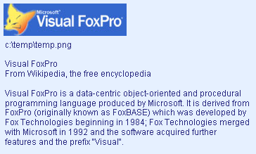

[ Home ](https://github.com/VFPX/Win32API)  

# GDI+: converting text strings to images and saving in a graphics file

## Short description:
In this code sample lines of text are printed on GDI+ bitmap object using a specified font. The result is saved in a graphics file. Such functionality can be used, for example, for displaying adhoc images on a web page.

Before creating the target bitmap, the GdipMeasureString function is used to calculate the bounding rectangle for the lines of text drawn with a specified font.  
***  


## Before you begin:
In this code sample lines of text are printed on GDI+ bitmap object using a specified font. The result is saved in a graphics file. Such functionality can be used, for example, for displaying adhoc images on a web page.  

  

Also an image is downloaded from VFP Home website and placed on the background before drawing the text.  

The code is based on [custom GDI+ class](sample_450.md). Download the class module first and save it in **gdiplus.prg** file.   
  
***  


## Code:
```foxpro  
* an instance of gdiplusinit should be created before
* and released after using any of gdi+ objects
SET PROCEDURE TO gdiplus ADDITIVE
PRIVATE oGdiplus
oGdiplus = CREATEOBJECT("gdiplusinit")

LOCAL cText, gr As graphics, fnt As gdifont, oRect,;
	cFilename, imagefile As gdiimage

* the name of the target file
cFilename = SYS(2023) + "\temp.png"

* this text is about to be converted to image
SET TEXTMERGE ON
TEXT TO m.cText NOSHOW
Visual FoxPro
From Wikipedia, the free encyclopedia

Visual FoxPro is a data-centric object-oriented and procedural
programming language produced by Microsoft. It is derived from
FoxPro (originally known as FoxBASE) which was developed by
Fox Technologies beginning in 1984; Fox Technologies merged
with Microsoft in 1992 and the software acquired further
features and the prefix "Visual".

<< LOWER(m.cFilename) >>
ENDTEXT
SET TEXTMERGE OFF

#DEFINE FONT_NAME "Arial"
#DEFINE FONT_SIZE 9
#DEFINE BACKGROUND_COLOR ARGB(230,240,255,255)
#DEFINE TEXT_COLOR ARGB(40,40,128,255)

* download image file from the Internet
LOCAL imagefile As gdiimage
= DownloadImageFile(@imagefile)

* create GDI+ Graphics and Font objects
gr = CREATEOBJECT("graphics", _screen.HWnd)
fnt = CREATEOBJECT("gdifont", FONT_NAME, FONT_SIZE, 0, TEXT_COLOR)

* calculate bounding rectangle for the text drawn with this font
oRect = gr.MeasureString(m.cText, m.fnt)

* create target bitmap making it slightly larger
* than the bounding rectangle;
* also add some vertical space for the image
bmp = CREATEOBJECT("gdibitmap",;
	MAX(imagefile.imgwidth, oRect.rwidth) + 10,;
	imagefile.imgheight+oRect.rheight + 20)

WITH bmp
	* fill the background of the bitmap with color
	.graphics.FillRectangle(BACKGROUND_COLOR, 0, 0, .imgwidth, .imgheight)
	
	* draw the image
	IF imagefile.imgwidth > 0
		.graphics.DrawImage(imagefile, 5, 5)
	ENDIF

	* draw the text on the bitmap below the image
	.graphics.DrawText(m.cText, fnt,;
		5, imagefile.imgheight+10,;
		.imgwidth, .imgheight)

	* save the bitmap to a file
	.SaveToFile(m.cFilename)
ENDWITH

* open the file using default application
DO OpenResultImage WITH m.cFilename
* end of main

PROCEDURE DownloadImageFile(imagefile As gdiimage)
* downloads image file from remote HTTP server
* it works while the url below is valid
#DEFINE VFP_ONLINE_IMAGE "http://msdn.microsoft.com/" +;
	"msdn-online/shared/graphics/right_bnr_vfoxpro.jpg"

	imagefile=NULL

	DECLARE INTEGER URLDownloadToCacheFile IN urlmon;
		INTEGER lpUnkcaller, STRING szURL, STRING @szFileName,;
		INTEGER dwBufLength, INTEGER dwReserved, INTEGER pBSC

	LOCAL cImageFile
	cImageFile = REPLICATE(CHR(0), 260)
	WAIT WINDOW NOWAIT "Downloading remote image file..."

	TRY
		= URLDownloadToCacheFile(0, VFP_ONLINE_IMAGE,;
			@cImageFile, LEN(cImageFile), 0,0)
	CATCH
	ENDTRY
	WAIT CLEAR

	cImageFile = STRTRAN(cImageFile, CHR(0), "")
	imagefile = CREATEOBJECT("gdiimage", m.cImageFile)

PROCEDURE OpenResultImage(cFilename)
	DECLARE INTEGER ShellExecute IN shell32;
		INTEGER hWindow, STRING lpOperation,;
		STRING lpFile, STRING lpParameters,;
		STRING lpDirectory, INTEGER nShowCmd

	= ShellExecute(0, "open", m.cFilename, "", "", 3)  
```  
***  


## Listed functions:
[ShellExecute](../libraries/shell32/ShellExecute.md)  
[URLDownloadToCacheFile](../libraries/urlmon/URLDownloadToCacheFile.md)  

## Comment:
Before creating the target bitmap, the GdipMeasureString function is used to calculate the bounding rectangle for the lines of text drawn with a specified font.   
  
***  

