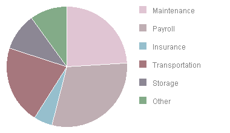

[ Home ](https://github.com/VFPX/Win32API)  

# GDI+: Drawing a Pie Chart

## Short description:
This code sample shows how to use PieChart GDI+ functions to build a simple chart and store it in a graphics file.  
***  


## Before you begin:
This code sample shows how to use PieChart GDI+ functions to build a simple chart and store it in a graphics file.  

  

The code is based on [custom GDI+ class](sample_450.md). Download the class module first and save it in **gdiplus.prg** file.   

  
***  


## Code:
```foxpro  
* an instance of gdiplusinit should be created before
* and released after using any of gdi+ objects
SET PROCEDURE TO gdiplus ADDITIVE
PRIVATE oGdiplus
oGdiplus = CREATEOBJECT("gdiplusinit")

LOCAL oChart As PieChart, cFilename
oChart = CREATEOBJECT("PieChart", 200, 200)
cFilename = "c:\temp\temp.png"

WITH oChart
	.AddPie(24, "Maintenance")  && percent, legend
	.AddPie(30, "Payroll")
	.AddPie(5, "Insurance")
	.AddPie(21, "Transportation")
	.AddPie(10, "Storage")
	.AddPie(10, "Other")

	* build a piechart and save result
	* to the specified graphics file
	.SaveToFile(cFilename)

	OpenResultImage(cFilename)
ENDWITH
* end of main

DEFINE CLASS PieChart As Session
	pieslices=NULL  && collection

	piewidth=0  && main rectangle
	pieheight=0

	startangle=-90  && degrees; starts from 12:00
	marginx=10
	marginy=10
	legendwidth=140
	legendheight=30

PROCEDURE Init(nWidth, nHeight)
	THIS.piewidth=m.nWidth
	THIS.pieheight=m.nHeight
	THIS.pieslices = CREATEOBJECT("Collection")

PROCEDURE AddPie(nPercent, cLegend)
	LOCAL oSlice As PieSlice, nSweepAngle
	nSweepAngle = (360 * nPercent)/100

	oSlice = CREATEOBJECT("PieSlice", THIS.startangle, m.nSweepAngle,;
		m.cLegend, THIS.pieslices.Count)

	THIS.pieslices.Add(m.oSlice)
	THIS.startangle = THIS.startangle + m.nSweepAngle
	oSlice=NULL

PROCEDURE SaveToFile(cFilename)
	DECLARE INTEGER GdipDrawPieI IN gdiplus;
		INTEGER graphics, INTEGER pen, INTEGER x,;
		INTEGER y, INTEGER width, INTEGER height,;
		SINGLE startAngle, SINGLE sweepAngle

	DECLARE INTEGER GdipFillPieI IN gdiplus;
		INTEGER graphics, INTEGER brush, INTEGER x,;
		INTEGER y, INTEGER width, INTEGER height,;
		SINGLE startAngle, SINGLE sweepAngle

	LOCAL objpen As gdipen, objbrush As gdisolidbrush,;
		objbitmap As gdibitmap, objslice As PieSlice,;
		nFillColor

	objbitmap = CREATEOBJECT("gdibitmap",;
		THIS.piewidth+THIS.marginx*4+THIS.legendwidth,;
		THIS.pieheight+THIS.marginy*2)

	* Pen and Font objects to be used for drawing the chart
	objpen = CREATEOBJECT("gdipen", ARGB(255,255,255,255), 1)
	objfont = CREATEOBJECT("gdifont", "Arial", 9, 0, ARGB(0,0,0,128))

	WITH objbitmap
		.graphics.FillRectangle(ARGB(255,255,255,255), 0, 0,;
			.imgwidth, .imgheight)
		
		FOR EACH objslice IN THIS.pieslices
			nFillColor = ARGB(64+INT(RAND()*128),;
				64+INT(RAND()*128), 64+INT(RAND()*128),;
				100+RAND()*155)

			* the Brush with random color is created for each pie slice
			objbrush = CREATEOBJECT("gdisolidbrush", m.nFillColor)

			LOCAL nLegendX, nLegendY
			nLegendX = THIS.piewidth+THIS.marginx*3
			nLegendY = objslice.sliceindex*THIS.legendheight+THIS.marginy
			
			.graphics.FillRectangle(m.nFillColor,;
				m.nLegendX, m.nLegendY, 12, 12)

			.graphics.DrawText(objslice.legend, objfont,;
				m.nLegendX+20, m.nLegendY,;
				THIS.legendwidth, THIS.legendheight)

			* draw the background of the pie slice
			= GdipFillPieI(.graphics.graphics, objbrush.brush,;
				THIS.marginx, THIS.marginy,;
				THIS.piewidth, THIS.pieheight,;
				objslice.startangle, objslice.sweepangle)

			* draw the contour of the pie slice
			= GdipDrawPieI(.graphics.graphics, objpen.hpen,;
				THIS.marginx, THIS.marginy,;
				THIS.piewidth, THIS.pieheight,;
				objslice.startangle, objslice.sweepangle)

			objbrush=NULL
		NEXT

		.SaveToFile(m.cFilename)
	ENDWITH
ENDDEFINE

DEFINE CLASS PieSlice As Session
* in C++ that would be a STRUCT
	startangle=0
	sweepangle=0
	legend=""
	sliceindex=0

PROCEDURE Init(nStartAngle, nSweepAngle, cLegend, nIndex)
	THIS.startangle=m.nStartAngle
	THIS.sweepangle=m.nSweepAngle
	THIS.legend=m.cLegend
	THIS.sliceindex=m.nIndex

ENDDEFINE

PROCEDURE OpenResultImage(cFilename)
* opens image file using default application
	DECLARE INTEGER ShellExecute IN shell32;
		INTEGER hWindow, STRING lpOperation,;
		STRING lpFile, STRING lpParameters,;
		STRING lpDirectory, INTEGER nShowCmd
	= ShellExecute(0, "open", m.cFilename, "", "", 3)  
```  
***  


## Listed functions:
[GdipDrawPieI](../libraries/gdiplus/GdipDrawPieI.md)  
[GdipFillPieI](../libraries/gdiplus/GdipFillPieI.md)  
[ShellExecute](../libraries/shell32/ShellExecute.md)  
