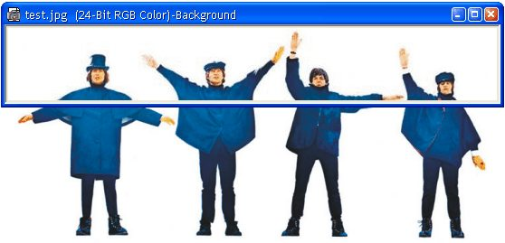

[ Home ](https://github.com/VFPX/Win32API)  

# GDI+: cropping images

## Short description:
This code sample explains how to load an image from a file, crop it using GdipDrawImageRectI GDI+ function and save result in another file.  
***  


## Before you begin:
The code is based on [custom GDI+ class](sample_450.md). Download the class module first and save it in **gdiplus.prg** file.   

  
See also:

* [GDI+: creating scaled copy of image file](sample_460.md)  
* [GDI+: rotating images](sample_525.md)  

  
***  


## Code:
```foxpro  
SET PROCEDURE TO gdiplus ADDITIVE

* an instance of gdiplusinit should be created before
* and released after using any of gdi+ objects
LOCAL gdip
gdip = CREATEOBJECT("gdiplusinit")

* source and target files
LOCAL cSrcFile, cDstFile
cSrcFile = "c:\windows\forest.bmp"
cDstFile = SYS(2023) + "\test.jpg"

*create Image object from the source file
LOCAL src As gdiimage
src = CREATEOBJECT("gdiimage", cSrcFile)
IF src.himage = 0
	? "Could not load source image file."
	RETURN
ENDIF

* set crop coordinates and dimensions
LOCAL cropLeft, cropTop, cropWidth, cropHeight
cropLeft = 10
cropTop = 80
cropWidth = src.imgwidth - m.cropLeft
cropHeight = 60

* create destination Bitmap object using crop dimensions
LOCAL dst As gdibitmap
dst = CREATEOBJECT("gdibitmap", m.cropWidth, m.cropHeight)

* draw source image on the target bitmap;
* note how coordinates and dimensions are set
dst.graphics.DrawImage(src, -m.cropLeft, -m.cropTop,;
	src.imgwidth, src.imgheight)

IF NOT dst.SaveToFile(cDstFile)
	? "Could not save file", cDstFile
ELSE
* open the file using default application
    DECLARE INTEGER ShellExecute IN shell32;
    	INTEGER hwnd, STRING lpOperation,;
    	STRING lpFile, STRING lpParameters,;
    	STRING lpDirectory, INTEGER nShowCmd

	= ShellExecute(0, "open", cDstFile, "", "", 3)
ENDIF  
```  
***  


## Listed functions:
[ShellExecute](../libraries/shell32/ShellExecute.md)  

## Comment:
Initially I used the GdipDrawImageI to draw a part of the source image on target bitmap. A difference in resolutions (DPI) between them often caused dimension issues. So finally I decided to use the GdipDrawImageRectI for cropping.  
  
***  

