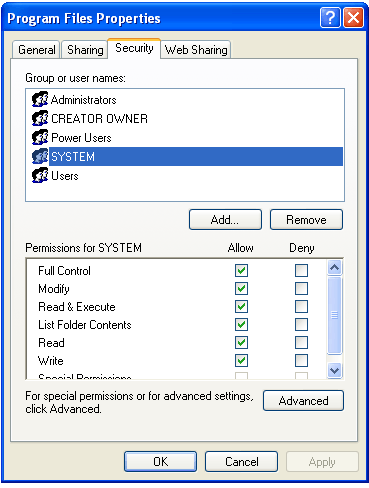
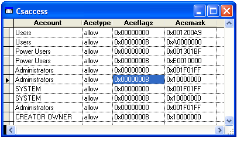

[ Home ](https://github.com/VFPX/Win32API)  

# Reading security permissions for NTFS files and folders

## Short description:
This code sample includes a set of classes implementing several NTFS access control objects. Through these objects, like Access Control List (ACL) and Access Control Entry (ACE) and others, the OS defines access rights to files, folders (in particular) for different users and user groups.  
***  


## Before you begin:
This code sample includes a set of classes implementing several NTFS access control objects. Through these objects, like Access Control List (ACL) and Access Control Entry (ACE) and others, the OS defines access rights to files, folders (in particular) for different users and user groups.  

The most familiar interface around NTFS access control objects is shown on the picture below.  

  

An output from the code sample looks much simpler. It retrieves Security Identifiers (SID) for all accounts having allowed/denied access rights to the specified file.   

  
The code also obtains Type, Flags and Mask values for each ACE. These values define access rights and properties like reading, writing, accessing attributes, taking ownership, inheritance and others.  

  
***  


## Code:
```foxpro  
LOCAL acl As FileAcl
*acl = CREATEOBJECT("FileAcl", GETENV("SystemRoot"))
acl = CREATEOBJECT("FileAcl", HOME())

CREATE CURSOR csAccess (account C(16), acetype C(6),;
	aceflags C(12), acemask C(12))

FOR EACH ace IN acl.aces
	INSERT INTO csAccess(account, acetype, aceflags, acemask);
	VALUES (ace.sid.accountname, IIF(ace.acetype=0, "allow", "deny"),;
		TRANSFORM(ace.aceflags, "@0"), TRANSFORM(ace.mask, "@0"))
NEXT

IF USED("csAccess")
	GO TOP
	BROWSE NORMAL NOWAIT
ENDIF
* end of main

DEFINE CLASS FileAcl As Session
* implements Discretionary Access Control List (DACL)
#DEFINE ACL_REVISION 2
#DEFINE ACL_SIZE_INFORMATION 2
#DEFINE ACCESS_ACE_SIZE 12
#DEFINE ACCESS_ALLOWED_ACE_TYPE 0
#DEFINE ACCESS_DENIED_ACE_TYPE 1
#DEFINE DACL_SECURITY_INFORMATION 0x0004
#DEFINE SECURITY_DESCRIPTOR_REVISION 1

* ACE control flags
#DEFINE OBJECT_INHERIT_ACE 1
#DEFINE CONTAINER_INHERIT_ACE 2
#DEFINE NO_PROPAGATE_INHERIT_ACE 4
#DEFINE INHERIT_ONLY_ACE 8
#DEFINE INHERITED_ACE 0x10
#DEFINE SUCCESSFUL_ACCESS_ACE_FLAG 0x40
#DEFINE FAILED_ACCESS_ACE_FLAG 0x80

	aces=NULL
	errorno=0
	errormessage=""

PROCEDURE Init(cFilename)
	THIS.declare
	THIS.GetFileSecurityInfo(m.cFilename)

PROCEDURE ResetError
	THIS.SetError(0, "")

PROCEDURE SetError(nError, cMessage)
	THIS.errorno=m.nError
	THIS.errormessage=m.cMessage

PROTECTED PROCEDURE GetFileSecurityInfo(cFilename)
	THIS.aces = CREATEOBJECT("Collection")

	LOCAL oSD, nBufsize, nPresent, hDacl, nDefaulted, cAclBuffer,;
		nAceIndex, nAceCount, oAce As AccessControlEntry
	oSD = CREATEOBJECT("LocalMem", 512)
	nBufsize = 0

	* obtain security descriptor for the file
	IF GetFileSecurity(m.cFilename, DACL_SECURITY_INFORMATION,;
		oSD.GetHandle(), oSD.GetSize(), @nBufsize) = 0
		THIS.SetError(GetLastError(), "GetFileSecurity failed")
		RETURN .F.
	ENDIF

	* retrieve a pointer to the discretionary access control list (DACL)
	* in this security descriptor
	STORE 0 TO nPresent, hDacl, nDefaulted
	IF GetSecurityDescriptorDacl(oSD.GetHandle(),;
		@nPresent, @hDacl, @nDefaulted) = 0
		THIS.SetError(GetLastError(), "GetSecurityDescriptorDacl failed")
		RETURN .F.
	ENDIF

	* retrieve ACL_SIZE_INFORMATION structure
	cAclBuffer = REPLICATE(CHR(0), 512)
	IF GetAclInformation(hDacl, @cAclBuffer,;
		LEN(cAclBuffer), ACL_SIZE_INFORMATION) = 0
		THIS.SetError(GetLastError(), "GetAclInformation failed")
		RETURN .F.
	ENDIF
	
	* number of access control entries (ACEs) in the ACL
	nAceCount = buf2dword(SUBSTR(cAclBuffer,1,4))

	* creating ACE objects
	FOR nAceIndex=0 TO nAceCount-1
		oAce = CREATEOBJECT("AccessControlEntry", m.hDacl, m.nAceIndex)
		THIS.aces.Add(m.oAce)
		oAce=NULL
	NEXT

PROCEDURE declare
	DECLARE INTEGER GetLastError IN kernel32
	DECLARE INTEGER LocalFree IN kernel32 INTEGER hMem
	DECLARE LONG LocalSize IN kernel32 INTEGER hMem
	DECLARE INTEGER IsValidSid IN advapi32 INTEGER pSid

	DECLARE INTEGER LocalAlloc IN kernel32;
		INTEGER uFlags, INTEGER uBytes

	DECLARE INTEGER GetFileSecurity IN advapi32;
		STRING lpFileName, INTEGER RequestedInformation,;
		INTEGER pSecurityDescriptor, INTEGER nLength,;
		INTEGER @lpnLengthNeeded

	DECLARE INTEGER GetSecurityDescriptorDacl IN advapi32;
		INTEGER pSecurityDescriptor, INTEGER @lpbDaclPresent,;
		INTEGER @pDacl, INTEGER @lpbDaclDefaulted

	DECLARE INTEGER GetAclInformation IN advapi32;
		INTEGER pAcl, STRING @pAclInformation,;
		LONG nAclInfoLen, INTEGER dwAclInfoClass

	DECLARE INTEGER LookupAccountSid IN advapi32;
		STRING @lpSystemName, INTEGER lpSid,;
		STRING @lpName, INTEGER @cchName,;
		STRING @lpRefdDomain, INTEGER @cchRefdDomain,;
		INTEGER @peUse

	DECLARE INTEGER GetAce IN advapi32;
		INTEGER pAcl, INTEGER dwAceIndex, INTEGER @pAce

	DECLARE RtlMoveMemory IN kernel32 As MemToStr;
		STRING @dst, INTEGER src, INTEGER nLength

	DECLARE RtlMoveMemory IN kernel32 As StrToMem;
		INTEGER dst, STRING @src, INTEGER nLength

ENDDEFINE

DEFINE CLASS AccessControlEntry As Session
* implements access control entry (ACE)
* ACCESS_ALLOWED_ACE structure and similar
PROTECTED hDacl, aceindex, hAce
	hDacl=0
	aceindex=0
	hAce=0
	errorno=0
	acetype=0
	aceflags=0
	acesize=0
	mask=0
	sid=NULL

PROCEDURE Init(hDacl, nAceIndex)
#DEFINE SID_START_OFFSET 8
	THIS.hDacl=m.hDacl
	THIS.aceindex=m.nAceIndex

	LOCAL hAce, cBuffer
	hAce=0

	IF GetAce(m.hDacl, m.nAceIndex, @hAce) = 0
		THIS.errorno = GetLastError()
	ELSE
		cBuffer = REPLICATE(CHR(0), ACCESS_ACE_SIZE)
		= MemToStr(@cBuffer, m.hAce, ACCESS_ACE_SIZE)
		THIS.hAce = m.hAce

		THIS.acetype = ASC(SUBSTR(cBuffer,1,1))
		THIS.aceflags = ASC(SUBSTR(cBuffer,2,1))
		THIS.acesize = buf2word(SUBSTR(cBuffer,3,2))
		THIS.mask = buf2dword(SUBSTR(cBuffer,5,4))
		
		* points at the first DWORD of a SID
		* in ACCESS_ALLOWED_ACE and similar structures
		THIS.sid = CREATEOBJECT("SecurityIdentifier",;
			m.hAce+SID_START_OFFSET)
	ENDIF

PROCEDURE IsMaskBitSet(nOffset)
RETURN IIF((BITAND(THIS.mask, BITLSHIFT(1, m.nOffset)) <> 0), 1, 0)

PROCEDURE IsFlagSet(nFlag)
RETURN IIF(BITAND(THIS.aceflags, m.nFlag) <> 0, 1, 0)

ENDDEFINE

DEFINE CLASS SecurityIdentifier As Session
* implements security identifier (SID)
PROTECTED hSid
	hSid=0
	accountname=""
	domainname=""
	errorno=0

PROCEDURE Init(hSid)
	THIS.hSid = m.hSid

	IF IsValidSid(THIS.hSid) = 0
		THIS.errorno = GetLastError()
	ELSE
		LOCAL nType, cSystemName, nAccountLen, nDomainLen,;
			cAccount, cDomain

		nType=0
		cSystemName = CHR(0)
		STORE 255 TO nAccountLen, nDomainLen
		STORE REPLICATE(CHR(0),nDomainLen) TO cAccount, cDomain

		IF LookupAccountSid(@cSystemName, THIS.hSid, @cAccount,;
			@nAccountLen, @cDomain, @nDomainLen, @nType) = 0
			THIS.errorno = GetLastError()
		ELSE
			THIS.accountname = SUBSTR(cAccount, 1, nAccountLen)
			THIS.domainname = SUBSTR(cDomain, 1, nDomainLen)
		ENDIF
	ENDIF
ENDDEFINE

DEFINE CLASS LocalMem As Session
* implements locally allocated memory block
#DEFINE LMEM_ZEROINIT 0x0040
PROTECTED hMem, bufsize
	hMem=0
	bufsize=0

PROCEDURE Init(nBufsize)
	THIS.bufsize = m.nBufsize
	THIS.hMem = LocalAlloc(LMEM_ZEROINIT, THIS.bufsize)

PROCEDURE Destroy
	IF THIS.hMem <> 0
		= LocalFree(THIS.hMem)
		THIS.hMem=0
	ENDIF

FUNCTION GetHandle
RETURN THIS.hMem

FUNCTION GetSize
RETURN THIS.bufsize

ENDDEFINE

FUNCTION buf2dword(cBuffer)
RETURN Asc(SUBSTR(cBuffer, 1,1)) + ;
	BitLShift(Asc(SUBSTR(cBuffer, 2,1)),  8) +;
	BitLShift(Asc(SUBSTR(cBuffer, 3,1)), 16) +;
	BitLShift(Asc(SUBSTR(cBuffer, 4,1)), 24)

FUNCTION buf2word(lcBuffer)
RETURN Asc(SUBSTR(lcBuffer, 1,1)) + ;
       Asc(SUBSTR(lcBuffer, 2,1)) * 256  
```  
***  


## Listed functions:
[GetAce](../libraries/advapi32/GetAce.md)  
[GetAclInformation](../libraries/advapi32/GetAclInformation.md)  
[GetFileSecurity](../libraries/advapi32/GetFileSecurity.md)  
[GetLastError](../libraries/kernel32/GetLastError.md)  
[GetSecurityDescriptorDacl](../libraries/advapi32/GetSecurityDescriptorDacl.md)  
[IsValidSid](../libraries/advapi32/IsValidSid.md)  
[LocalAlloc](../libraries/kernel32/LocalAlloc.md)  
[LocalFree](../libraries/kernel32/LocalFree.md)  
[LocalSize](../libraries/kernel32/LocalSize.md)  
[LookupAccountSid](../libraries/advapi32/LookupAccountSid.md)  

## Comment:
Read also:  
<a href="http://www.windowsecurity.com/articles/Understanding-Windows-NTFS-Permissions.html">Understanding Windows NTFS Permissions</a>, by Derek Melber.  
  
* * *  
As you know, VFP strings are widely used instead of pointers in many API calls. Here is an example of GetFileSecurity API function being declared and called using such string as the third parameter passed by reference.  
  
```foxpro
DECLARE INTEGER GetFileSecurity IN advapi32;  
	STRING lpFileName, INTEGER RequestedInformation,;  
	STRING @pSecurityDescriptor, INTEGER nLength,;  
	INTEGER @lpnLengthNeeded  
  
LOCAL cDescriptor, nBufsize  
cDescriptor=REPLICATE(Chr(0), 256)  
nBufsize=0  
  
= GetFileSecurity(cFile, OWNER_SECURITY_INFORMATION,;  
	@cDescriptor, LEN(cDescriptor), @nBufsize)
```

The code returns no error and the cDescriptor contains meaningful data on exit. But under certain circumstances, the cDescriptor fails while used in subsequent API calls like, for instance, GetSecurityDescriptorDacl.  
  
I have found it far more reliable for this particular function to be declared with pSecurityDescriptor parameter set as Integer.  
  
```foxpro
DECLARE INTEGER GetFileSecurity IN advapi32;  
	STRING lpFileName, INTEGER RequestedInformation,;  
	INTEGER pSecurityDescriptor, INTEGER nLength,;  
	INTEGER @lpnLengthNeeded
```
Of course, it adds some extra code before and after the call. A memory block must be allocated and eventually released. A very simple LocalMem class handles this with no glitch.  
  
***  

