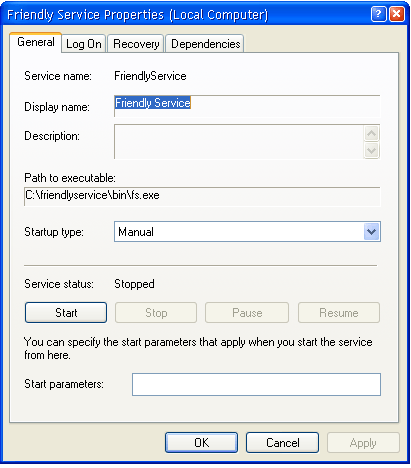

[ Home ](https://github.com/VFPX/Win32API)  

# How to create a service object

## Before you begin:
This code sample shows how to create a record in the Service Control Manager database and link it to the specified executable file.  

Properties dialog for the newly created service object  opened from Miscrosoft Common Console window:  

  

See also:

* [How to delete a service object](sample_518.md)  
* [Encapsulating access to the Windows Services in a class](sample_476.md)  

  
***  


## Code:
```foxpro  
#DEFINE SC_MANAGER_CREATE_SERVICE 2
#DEFINE SERVICE_WIN32_OWN_PROCESS 0x00000010
#DEFINE SERVICE_ALL_ACCESS 0xF01FF
#DEFINE SERVICE_DEMAND_START 0x00000003
#DEFINE SERVICE_ERROR_NORMAL 0x00000001

DO declare

LOCAL hManager, hService

hManager = OpenSCManager(NULL, NULL, SC_MANAGER_CREATE_SERVICE)
IF hManager = 0
	? "OpenSCManager failed with error", GetLastError()
	RETURN
ENDIF

LOCAL cServiceName, cDisplayName, nDesiredAccess, nServiceType,;
	nStartType, nErrorControl, cPathToExe
	
cServiceName="FriendlyService"
cDisplayName="Friendly Service"
nDesiredAccess=SERVICE_ALL_ACCESS
nServiceType=SERVICE_WIN32_OWN_PROCESS
nStartType=SERVICE_DEMAND_START
nErrorControl=SERVICE_ERROR_NORMAL
cPathToExe="C:\friendlyservice\bin\fs.exe"

* note that a new service will be created
* uncomment the following lines before testing

*!*	hService = CreateService(m.hManager, m.cServiceName, m.cDisplayName,;
*!*		m.nDesiredAccess, m.nServiceType, m.nStartType, m.nErrorControl,;
*!*		m.cPathToExe, NULL, 0, NULL, NULL, NULL)
	
IF hService = 0
* 1073=ERROR_SERVICE_EXISTS
	? "CreateService failed with error", GetLastError()
ELSE
	? "hService:", hService
	= CloseServiceHandle(m.hService)
ENDIF

= CloseServiceHandle(m.hManager)
* end of main

PROCEDURE declare
	DECLARE INTEGER GetLastError IN kernel32
	DECLARE INTEGER CloseServiceHandle IN advapi32 INTEGER hSCObject

	DECLARE INTEGER CreateService IN advapi32;
		INTEGER hSCManager, STRING lpServiceName, STRING lpDisplayName,;
		LONG dwDesiredAccess, LONG dwServiceType, LONG dwStartType,;
		LONG dwErrorControl, STRING lpBinaryPathName,;
		STRING lpLoadOrderGroup, LONG lpdwTagId, STRING lpDependencies,;
		STRING lpServiceStartName, STRING lpPassword

	DECLARE INTEGER OpenSCManager IN advapi32;
		STRING lpMachineName, STRING lpDatabaseName,;
		LONG dwDesiredAccess  
```  
***  


## Listed functions:
[CloseServiceHandle](../libraries/advapi32/CloseServiceHandle.md)  
[CreateService](../libraries/advapi32/CreateService.md)  
[GetLastError](../libraries/kernel32/GetLastError.md)  
[OpenSCManager](../libraries/advapi32/OpenSCManager.md)  

## Comment:
Windows Registry entry for the newly created service:  
  


***  

