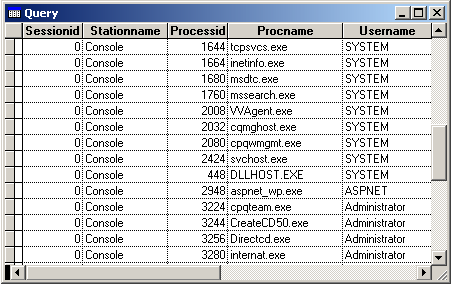

[ Home ](https://github.com/VFPX/Win32API)  

# How to enumerate sessions and processes on a specified terminal server

## Before you begin:
  

See also:

* [How to enumerate terminal servers within the specified Windows domain](sample_520.md)  
* [How to enumerate logon sessions on local computer](sample_591.md)  
  
***  


## Code:
```foxpro  
DO declare

PRIVATE cServer, hServer
cServer = "\\YOURSERVER"  && replace with valid server name

hServer = WTSOpenServer(m.cServer)
IF hServer = 0
* 5=Access is denied
* 1722=The RPC Server is unavailable
	? "WTSOpenServer failed with error:", GetLastError()
	RETURN
ENDIF

DO EnumSessions
DO EnumProcesses
= WTSCloseServer(hServer)

* select into final cursor
IF USED("csSession") AND USED("csProcess")
	SELECT prc.sessionid, ssn.stationname,;
		prc.processid, prc.procname, prc.username;
	FROM csProcess prc INNER JOIN csSession ssn;
		ON prc.sessionid=ssn.sessionid
ENDIF
* end of main

PROCEDURE EnumProcesses
	LOCAL hBuffer, nIndex, nCount, nBufsize, cBuffer, nSessionId,;
		nProcessId, cProcName, nSid, cUserName, nAddress

	STORE 0 TO hBuffer, nCount

	IF WTSEnumerateProcesses(hServer, 0, 1, @hBuffer, @nCount) = 0
		? "WTSEnumerateProcesses failed with error:", GetLastError()
		RETURN .F.
	ENDIF

	nBufsize = GlobalSize(hBuffer)
	cBuffer = REPLICATE(CHR(0), nBufsize)
	= MemToStr(@cBuffer, hBuffer, nBufsize)

	CREATE CURSOR csProcess (sessionid I, processid I,;
		procname C(64), username C(200))

*!*		typedef struct _WTS_PROCESS_INFO {
*!*		  DWORD SessionId;
*!*		  DWORD ProcessId;
*!*		  LPTSTR pProcessName;
*!*		  PSID pUserSid;
*!*		} WTS_PROCESS_INFO,  *PWTS_PROCESS_INFO;

	#DEFINE WTS_PROCESS_INFO_SIZE 16

	FOR nIndex=0 TO nCount-1
		nSessionId = buf2dword(SUBSTR(cBuffer,;
			nIndex*WTS_PROCESS_INFO_SIZE+1, 4))

		nProcessId = buf2dword(SUBSTR(cBuffer,;
			nIndex*WTS_PROCESS_INFO_SIZE+5, 4))

		nAddress = buf2dword(SUBSTR(cBuffer,;
			nIndex*WTS_PROCESS_INFO_SIZE+9, 4))

		cProcName = SUBSTR(cBuffer, nAddress - hBuffer+1)
		cProcName = SUBSTR(m.cProcName, 1, AT(CHR(0),cProcName)-1)

		nSid = buf2dword(SUBSTR(cBuffer,;
			nIndex*WTS_PROCESS_INFO_SIZE+13, 4))

		cUserName = GetUserName(m.nSid)

		INSERT INTO csProcess VALUES (m.nSessionId,;
			m.nProcessId, m.cProcName, m.cUserName)
	NEXT

	= WTSFreeMemory(hBuffer)

FUNCTION GetUserName(nSid) As String
	LOCAL cSystemName, cAccount, nAccountLen,;
		cDomain, nDomainLen, nType

	cSystemName = CHR(0)
	cSystemName = m.cServer
	STORE 255 TO nAccountLen, nDomainLen
	STORE REPLICATE(CHR(0),nDomainLen) TO cAccount, cDomain
	nType=0

	nResult = LookupAccountSid(@cSystemName, m.nSid,;
		@cAccount, @nAccountLen, @cDomain, @nDomainLen, @nType)

RETURN STRTRAN(m.cAccount, CHR(0), "")

PROCEDURE EnumSessions
	LOCAL hBuffer, nIndex, nCount, nBufsize, cBuffer,;
		nSessionId, cStnName, nConnectState, nAddress

	STORE 0 TO hBuffer, nCount
	IF WTSEnumerateSessions(hServer, 0, 1, @hBuffer, @nCount) = 0
		? "WTSEnumerateSessions failed with error:", GetLastError()
		RETURN .F.
	ENDIF

	nBufsize = GlobalSize(hBuffer)
	cBuffer = REPLICATE(CHR(0), nBufsize)
	= MemToStr(@cBuffer, hBuffer, nBufsize)

	*!*	typedef struct _WTS_SESSION_INFO {
	*!*	  DWORD SessionId;
	*!*	  LPTSTR pWinStationName;
	*!*	  WTS_CONNECTSTATE_CLASS State;
	*!*	} WTS_SESSION_INFO,  *PWTS_SESSION_INFO;

	#DEFINE WTS_SESSION_INFO_SIZE 12

	CREATE CURSOR csSession (sessionid I,;
		stationname C(24), connectstate I)

	FOR nIndex=0 TO nCount-1
		nSessionId = buf2dword(SUBSTR(cBuffer,;
			nIndex*WTS_SESSION_INFO_SIZE+1, 4))

		nConnectState = buf2dword(SUBSTR(cBuffer,;
			nIndex*WTS_SESSION_INFO_SIZE+9, 4))

		nAddress = buf2dword(SUBSTR(cBuffer,;
			nIndex*WTS_SESSION_INFO_SIZE+5, 4))

		cStnName = SUBSTR(cBuffer, nAddress-hBuffer+1)
		cStnName = SUBSTR(m.cStnName, 1, AT(CHR(0),cStnName)-1)
		
		INSERT INTO csSession;
		VALUES (nSessionId, cStnName, nConnectState)
	NEXT

	= WTSFreeMemory(hBuffer)

PROCEDURE declare
	DECLARE INTEGER GetLastError IN kernel32
	DECLARE INTEGER WTSOpenServer IN Wtsapi32 STRING pServerName
	DECLARE INTEGER GlobalSize IN kernel32 INTEGER hMem
	DECLARE WTSCloseServer IN Wtsapi32 INTEGER hServer
	DECLARE WTSFreeMemory IN Wtsapi32 INTEGER pMemory

	DECLARE INTEGER IsWellKnownSid IN Advapi32;
		INTEGER pSid, INTEGER WellKnownSidType

	DECLARE INTEGER WTSEnumerateSessions IN Wtsapi32;
		INTEGER hServer, LONG Reserved, LONG RqVersion,;
		LONG @ppSessionInfo, LONG @SICount

	DECLARE INTEGER WTSEnumerateProcesses IN Wtsapi32;
		INTEGER hServer, LONG Reserved, LONG RqVersion,;
		LONG @ppProcessInfo, LONG @PICount

	DECLARE RtlMoveMemory IN kernel32 As MemToStr;
		STRING @dst, INTEGER src, INTEGER ByteCount

	DECLARE INTEGER LookupAccountSid IN advapi32;
		STRING @lpSystemName, INTEGER lpSid,;
		STRING @lpName, INTEGER @cchName,;
		STRING @lpRefdDomain, INTEGER @cchRefdDomain,;
		INTEGER @peUse

FUNCTION buf2dword(lcBuffer)
RETURN Asc(SUBSTR(lcBuffer, 1,1)) + ;
	BitLShift(Asc(SUBSTR(lcBuffer, 2,1)),  8) +;
	BitLShift(Asc(SUBSTR(lcBuffer, 3,1)), 16) +;
	BitLShift(Asc(SUBSTR(lcBuffer, 4,1)), 24)  
```  
***  


## Listed functions:
[GetLastError](../libraries/kernel32/GetLastError.md)  
[GlobalSize](../libraries/kernel32/GlobalSize.md)  
[IsWellKnownSid](../libraries/advapi32/IsWellKnownSid.md)  
[LookupAccountSid](../libraries/advapi32/LookupAccountSid.md)  
[WTSCloseServer](../libraries/wtsapi32/WTSCloseServer.md)  
[WTSEnumerateProcesses](../libraries/wtsapi32/WTSEnumerateProcesses.md)  
[WTSEnumerateSessions](../libraries/wtsapi32/WTSEnumerateSessions.md)  
[WTSFreeMemory](../libraries/wtsapi32/WTSFreeMemory.md)  
[WTSOpenServer](../libraries/wtsapi32/WTSOpenServer.md)  
