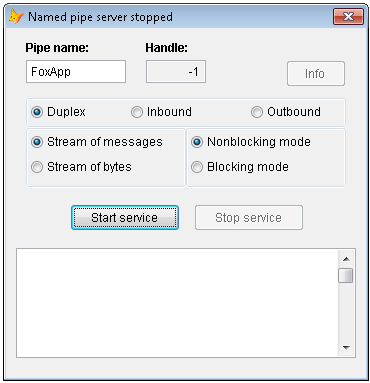

[ Home ](https://github.com/VFPX/Win32API)  

# Using named pipes for interprocess communication

## Short description:
This code sample contains definitions of two classes, NamedPipeServer and NamedPipeClient, encapsulating named pipes API functionality. The Pipes, as well as mailslots, can be used for transferring data between processes running on same computer or on different computers.  
***  


## Before you begin:
This code sample contains definitions of two classes, NamedPipeServer and NamedPipeClient, encapsulating named pipes API functionality.  

The Pipes, as well as mailslots, can be used for transferring data between processes running on same computer or on different computers.  

See also:

* [Peer-to-peer LAN messenger built with Mailslot API functions](sample_410.md)  
* [Using mailslots to send messages on the network ](sample_269.md)  
* [Using WM_COPYDATA for interprocess communication](sample_536.md)  
  
***  


## Code:
```foxpro  
#DEFINE INVALID_HANDLE_VALUE -1
#DEFINE PIPE_ACCESS_DUPLEX 3
#DEFINE PIPE_TYPE_MESSAGE 4
#DEFINE PIPE_READMODE_MESSAGE 2
#DEFINE PIPE_WAIT 0
#DEFINE NMPWAIT_USE_DEFAULT_WAIT 0

#DEFINE GENERIC_WRITE 0x40000000
#DEFINE GENERIC_READ 0x80000000
#DEFINE OPEN_EXISTING 3
#DEFINE FILE_SHARE_READ 1
#DEFINE FILE_SHARE_WRITE 2
#DEFINE PIPE_READMODE_MESSAGE 2

#DEFINE ERROR_PIPE_BUSY 231
#DEFINE ERROR_MORE_DATA 234

DEFINE CLASS NamedPipeServer As Session
PROTECTED pipename, hPipe, hConnect, outbufsize, inbufsize
	pipname=""
	outbufsize=0x1000
	inbufsize=0x1000
	hPipe=INVALID_HANDLE_VALUE
	hConnect=0
	errorcode=0
	errormsg=""

PROCEDURE Init(cPipeName As String)
	THIS.pipename = m.cPipeName
	THIS.declare

	THIS.hPipe = CreateNamedPipe(THIS.pipename,;
		PIPE_ACCESS_DUPLEX,;
		BITOR(PIPE_TYPE_MESSAGE, PIPE_READMODE_MESSAGE, PIPE_WAIT),;
		1, THIS.outbufsize, THIS.inbufsize,;
		NMPWAIT_USE_DEFAULT_WAIT, 0)

	IF THIS.hPipe = INVALID_HANDLE_VALUE
		THIS.errorcode=GetLastError()
		THIS.errormsg="CreateNamedPipe failed."
	ENDIF

PROCEDURE Destroy
	THIS.ReleasePipe

PROCEDURE Listen
	IF THIS.hPipe = INVALID_HANDLE_VALUE
		THIS.errorcode=-1
		THIS.errormsg="Invalid pipe handle."
		RETURN .F.
	ENDIF

	THIS.hConnect = ConnectNamedPipe(THIS.hPipe, 0)
	IF THIS.hConnect = 0
		THIS.errorcode=GetLastError()
		THIS.errormsg="ConnectNamedPipe failed."
		RETURN .F.
	ENDIF
	
	LOCAL nResult, cRequest, cInBuffer, nBytesRead,;
		cOutBuffer, nBytesWritten
	cRequest=""

	DO WHILE .T.
		cInBuffer = REPLICATE(CHR(0), THIS.inbufsize)
		nBytesRead=0

		nResult = ReadFile(THIS.hPipe, @cInBuffer,;
			THIS.inbufsize, @nBytesRead, 0)

		IF nBytesRead > 0
			cRequest = cRequest + SUBSTR(m.cInBuffer, 1, nBytesRead)
		ENDIF

		IF nResult = 0
			THIS.errorcode=GetLastError()
			IF THIS.errorcode = ERROR_MORE_DATA
				LOOP
			ENDIF
		ENDIF

		EXIT
	ENDDO

	? "Bytes received: " + TRANSFORM(LEN(m.cRequest))

	* MSDN: Named pipe write operations across a network
	* are limited to 65,535 bytes
	
	cOutBuffer = VERSION() + " | " + TRANSFORM(DATETIME())
	nBytesWritten=0
	nResult = WriteFile(THIS.hPipe, @cOutBuffer,;
		LEN(m.cOutBuffer), @nBytesWritten, 0)

	= FlushFileBuffers(THIS.hPipe)
	= DisconnectNamedPipe(THIS.hPipe)
	= CloseHandle(THIS.hPipe)

PROCEDURE ReleasePipe
	IF THIS.hPipe <> INVALID_HANDLE_VALUE
		= CloseHandle(THIS.hPipe)
		THIS.hPipe = INVALID_HANDLE_VALUE
	ENDIF

PROCEDURE declare
	DECLARE INTEGER GetLastError IN kernel32
	DECLARE INTEGER CloseHandle IN kernel32 INTEGER hObject
	DECLARE INTEGER FlushFileBuffers IN kernel32 INTEGER hFile

	DECLARE INTEGER CreateNamedPipe IN kernel32;
		STRING lpName, LONG dwOpenMode, LONG dwPipeMode,;
		LONG nMaxInstances, LONG nOutBufferSize,;
		LONG nInBufferSize, LONG nDefaultTimeOut,;
		INTEGER lpSecurityAttributes

	DECLARE INTEGER ConnectNamedPipe IN kernel32;
		INTEGER hNamedPipe, INTEGER lpOverlapped

	DECLARE INTEGER DisconnectNamedPipe IN kernel32;
		INTEGER hNamedPipe

	DECLARE INTEGER WriteFile IN kernel32;
		INTEGER hFile, STRING @lpBuffer, INTEGER nBt2Write,;
		INTEGER @lpBtWritten, INTEGER lpOverlapped

	DECLARE INTEGER ReadFile IN kernel32;
		INTEGER hFile, STRING @lpBuffer, INTEGER nBytesToRead,;
		INTEGER @lpBytesRead, INTEGER lpOverlapped

ENDDEFINE

DEFINE CLASS NamedPipeClient As Session
PROTECTED pipename
	pipname=""
	errorcode=0
	errormsg=""

PROCEDURE Init(cPipeName As String)
	THIS.pipename = m.cPipeName
	THIS.declare

PROCEDURE SendMessage(cMessage)
	LOCAL hPipe, nPipeMode, nResult, nBytesWritten,;
		cInBuffer, nBytesRead
	
	hPipe = CreateFile(THIS.pipename,;
		BITOR(GENERIC_WRITE, GENERIC_READ),;
		BITOR(FILE_SHARE_WRITE, FILE_SHARE_READ),;
		0, OPEN_EXISTING, 0, 0)

	IF hPipe = INVALID_HANDLE_VALUE
		THIS.errorcode=GetLastError()
		THIS.errormsg="CreateFile failed."
		RETURN .F.
	ENDIF

	nPipeMode = PIPE_READMODE_MESSAGE
	nResult = SetNamedPipeHandleState(m.hPipe,;
		@nPipeMode, 0, 0)
	
	IF nResult = 0
		THIS.errorcode=GetLastError()
		THIS.errormsg="SetNamedPipeHandleState failed."
		RETURN .F.
	ENDIF
	
	nBytesWritten=0
	nResult = WriteFile(m.hPipe, @cMessage,;
		LEN(cMessage), @nBytesWritten, 0)

	IF nResult = 0
		THIS.errorcode=GetLastError()
		THIS.errormsg="WriteFile failed."
	ELSE
		cInBuffer = REPLICATE(CHR(0), 0x1000)
		nBytesRead = 0
		nResult = ReadFile(m.hPipe, @cInBuffer,;
			LEN(cInBuffer), @nBytesRead, 0)

		IF nResult = 0
			THIS.errorcode=GetLastError()
			THIS.errormsg="ReadFile failed."
		ELSE
			? "Response received: [" +;
				SUBSTR(cInBuffer, 1, nBytesRead) + "]"
		ENDIF
	ENDIF

	= CloseHandle(m.hPipe)

PROCEDURE declare
	DECLARE INTEGER GetLastError IN kernel32
	DECLARE INTEGER CloseHandle IN kernel32 INTEGER hObject

	DECLARE INTEGER CreateFile IN kernel32;
		STRING lpFileName, INTEGER dwDesiredAccess,;
		INTEGER dwShareMode, INTEGER lpSecurityAttr,;
		INTEGER dwCreationDisp, INTEGER dwFlagsAndAttr,;
		INTEGER hTplFile

	DECLARE INTEGER SetNamedPipeHandleState IN kernel32;
		INTEGER hNamedPipe, LONG @lpMode,;
		LONG lpMaxCollectionCount, LONG lpCollectDataTimeout

	DECLARE INTEGER WriteFile IN kernel32;
		INTEGER hFile, STRING @lpBuffer, INTEGER nBt2Write,;
		INTEGER @lpBtWritten, INTEGER lpOverlapped

	DECLARE INTEGER ReadFile IN kernel32;
		INTEGER hFile, STRING @lpBuffer, INTEGER nBytesToRead,;
		INTEGER @lpBytesRead, INTEGER lpOverlapped

ENDDEFINE  
```  
***  


## Listed functions:
[CloseHandle](../libraries/kernel32/CloseHandle.md)  
[ConnectNamedPipe](../libraries/kernel32/ConnectNamedPipe.md)  
[CreateFile](../libraries/kernel32/CreateFile.md)  
[CreateNamedPipe](../libraries/kernel32/CreateNamedPipe.md)  
[DisconnectNamedPipe](../libraries/kernel32/DisconnectNamedPipe.md)  
[FlushFileBuffers](../libraries/kernel32/FlushFileBuffers.md)  
[GetLastError](../libraries/kernel32/GetLastError.md)  
[ReadFile](../libraries/kernel32/ReadFile.md)  
[SetNamedPipeHandleState](../libraries/kernel32/SetNamedPipeHandleState.md)  
[WriteFile](../libraries/kernel32/WriteFile.md)  

## Comment:
Use the following code to run pipe server.  
  
```foxpro
LOCAL oServer As NamedPipeServer  
oServer = CREATEOBJECT("NamedPipeServer", "\\.\pipe\tpipe")  
WITH oServer  
	IF NOT .Listen()  
		? .errorcode, .errormsg  
	ENDIF  
ENDWITH
```
Starting the pipe server switches current VFP session to a waiting state. Thus it stays frozen until receiving a request from a pipe client.   
  
This is a sample client code.  
  
```foxpro
LOCAL oClient As NamedPipeClient  
oClient = CREATEOBJECT("NamedPipeClient", "\\.\pipe\tpipe")  
  
WITH oClient  
	IF NOT .SendMessage(SYS(0))  
		? .errorcode, .errormsg  
	ENDIF  
ENDWITH
```
Normally a pipe server application, written in programming language other than FoxPro, would create a separate threads for listening and for processing incoming requests.  
  
If the pipe client code runs on a different computer than the pipe server, in the pipe client code substitute the dot "." in the pipe name with the computer name or ip address of the pipe server.  
  
Pipe server accepts connections on TCP port 139 (NetBIOS).  
  


***  

