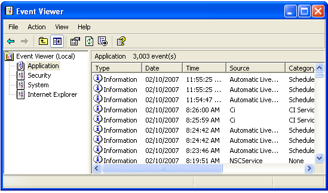

[ Home ](https://github.com/VFPX/Win32API)  

# Reading entries from Event logs

## Before you begin:
With Event Viewer, users can monitor events recorded in the Application, Security, and System logs.  

  

See also:

* [How to register custom Event Log source](sample_563.md)  
* [Writing entries to custom Event Log](sample_564.md)  
* [Reading from INI files](sample_133.md)  
* [Writing to INI files](sample_137.md)  
  
***  


## Code:
```foxpro  
#DEFINE EVENTLOG_SEQUENTIAL_READ 1
#DEFINE EVENTLOG_FORWARDS_READ 4
#DEFINE ERROR_INSUFFICIENT_BUFFER 122
#DEFINE WE_START_DATETIME {^1970/01/01 00:00:00}
#DEFINE ERROR_HANDLE_EOF 38
#DEFINE EVENTLOGRECORD_SIZE 56
#DEFINE MAX_BUFFER_SIZE 0x7ffff
#DEFINE EVENTLOG_FULL_INFO 0
#DEFINE FACILITY_NULL 0

DEFINE CLASS WindowsEventLog As Session
PROTECTED servername, logname, hEventLog
	WindowEventRecords=NULL
	servername=NULL
	logname=NULL
	hEventLog=0
	errorno=0
	errormessage=""

PROCEDURE Init(cServerName As String, cLogName As String)
	THIS.declare
	THIS.logname = m.cLogName
	THIS.servername = m.cServerName
	THIS.WindowEventRecords = CREATEOBJECT("Collection")

PROCEDURE Destroy
	THIS.CloseLog

PROCEDURE ResetError
	THIS.SetError(0, "")

PROCEDURE SetError(nErrorNo, cErrorMessage)
	THIS.errorno=m.nErrorNo
	THIS.errormessage=m.cErrorMessage

FUNCTION GetNumberOfRecords() As Number
	IF NOT THIS.OpenLog()
		RETURN -1
	ENDIF

	LOCAL nRecno, nResult
	nRecno=0
	
	nResult = GetNumberOfEventLogRecords(;
		THIS.hEventLog, @nRecno)

	IF nResult = 0
		THIS.SetError(GetLastError(),;
			"Call to GetNumberOfEventLogRecords() failed.")
		nRecno = -1
	ENDIF

	THIS.CloseLog
RETURN m.nRecno

FUNCTION IsLogFull() As Boolean
* indicates whether the event log is full
	LOCAL nResult, nLogFull, nBufsize
	STORE 0 TO nLogFull, nBufsize

	IF NOT THIS.OpenLog()
		RETURN .F.
	ENDIF

	nResult = GetEventLogInformation(THIS.hEventLog,;
		EVENTLOG_FULL_INFO, @nLogFull, 4, @nBufsize)

	IF nResult = 0
		THIS.SetError(GetLastError(),;
			"Call to GetEventLogInformation() failed.")
	ENDIF
	THIS.CloseLog
RETURN (m.nLogFull <> 0)

FUNCTION ClearLog(cBackupFile As String) As Boolean
	IF NOT THIS.OpenLog()
		RETURN .F.
	ENDIF

	IF EMPTY(m.cBackupFile)
		cBackupFile=NULL
	ENDIF
	
	LOCAL nResult, nError
	nResult = ClearEventLog(THIS.hEventLog, m.cBackupFile)

	IF m.nResult = 0
		THIS.SetError(GetLastError(),;
			"Call to ClearEventLog() failed.")
	ENDIF
	THIS.CloseLog
RETURN (m.nResult <> 0)

PROCEDURE ReadLogRecords
	DO WHILE THIS.WindowEventRecords.Count > 0
		THIS.WindowEventRecords.Remove(1)
	ENDDO
	
	THIS.CloseLog
	THIS.hEventLog = OpenEventLog(THIS.servername, THIS.logname)

	IF THIS.hEventLog = 0
		THIS.SetError(GetLastError(), "Call to OpenEventLog() failed.")
		RETURN 0
	ENDIF

	LOCAL nRecno, nReccount, nIndex, oBuffer As PChar, nBufsize,;
		nBytesRead, hBuffer, nBytesNeeded, nResult, nLastError,;
		nReadCount

	STORE 0 TO nRecno, nReccount
	= GetOldestEventLogRecord(THIS.hEventLog, @nRecno)
	= GetNumberOfEventLogRecords(THIS.hEventLog, @nReccount)

	nBufsize = MAX_BUFFER_SIZE
	oBuffer = CREATEOBJECT("PChar", REPLICATE(CHR(0), nBufsize))

	DO WHILE .T.
		oBuffer.SetValue(REPLICATE(CHR(0), nBufsize))
		hBuffer = oBuffer.GetAddr()
		STORE 0 TO nBytesRead, nBytesNeeded

		nResult = ReadEventLog(THIS.hEventLog,;
			BITOR(EVENTLOG_SEQUENTIAL_READ, EVENTLOG_FORWARDS_READ), 0,;
			m.hBuffer, nBufsize, @nBytesRead, @nBytesNeeded)

		IF nResult <> 0
			THIS.ProcessBuffer(@oBuffer, m.nBytesRead)
			LOOP
		ENDIF

		nLastError = GetLastError()
		DO CASE
		CASE nLastError = ERROR_HANDLE_EOF
			EXIT
		OTHERWISE
			THIS.SetError(m.nLastError, "ReadEventLog call failed.")
			EXIT
		ENDCASE
	ENDDO

	THIS.CloseLog
RETURN THIS.WindowEventRecords.Count

PROTECTED PROCEDURE ProcessBuffer(oBuffer As PChar, nBytesRead As Number)
	LOCAL hBuffer, cMBuffer, cBuffer, nOffset, nRecordLength,;
		werecord As WindowsEventRecord, cStrings

	hBuffer = oBuffer.GetAddr()
	cMBuffer = SUBSTR(oBuffer.GetValue(), 1, m.nBytesRead)
	nOffset=1

	DO WHILE .T.
		nRecordLength = buf2dword(SUBSTR(m.cMBuffer, nOffset, 4))
		cBuffer = SUBSTR(m.cMBuffer, nOffset, nRecordLength)

		werecord = CREATEOBJECT("WindowsEventRecord")
		WITH werecord
			.eventbuffer = m.cBuffer
			.recordnumber = buf2dword(SUBSTR(cBuffer, 9,4))
			.timegenerated = buf2dword(SUBSTR(cBuffer, 13,4))
			.timewritten = buf2dword(SUBSTR(cBuffer, 17,4))
			.eventid = buf2dword(SUBSTR(cBuffer, 21,4))
			.eventtype = buf2word(SUBSTR(cBuffer, 25,2))
			.numstrings = buf2word(SUBSTR(cBuffer, 27,2))
			.eventcategory = buf2word(SUBSTR(cBuffer, 29,2))
			.stringoffset = buf2dword(SUBSTR(cBuffer, 37,4))
			.datalength = buf2dword(SUBSTR(cBuffer, 49,4))
			.dataoffset = buf2dword(SUBSTR(cBuffer, 53,4))
			
			IF .numstrings > 0
				cStrings = SUBSTR(cBuffer, .stringoffset+1)
				.strings = SUBSTR(cStrings, 1,;
					AT(CHR(0), cStrings, .numstrings))
			ENDIF
			
			IF .datalength > 0
				.eventdata = SUBSTR(cBuffer, .dataoffset+1, .datalength)
			ENDIF
			
			cStrings = SUBSTR(cBuffer, EVENTLOGRECORD_SIZE+1)
			.source = SUBSTR(cStrings, 1, AT(CHR(0), cStrings)-1)
			.sysname = SUBSTR(cStrings, AT(CHR(0), cStrings)+1)
			.sysname = SUBSTR(.sysname, 1, AT(CHR(0), .sysname)-1)
		ENDWITH

		THIS.WindowEventRecords.Add(werecord)
		werecord=NULL

		nOffset = m.nOffset + m.nRecordLength
		IF nOffset > LEN(m.cMBuffer) - EVENTLOGRECORD_SIZE
			EXIT
		ENDIF
	ENDDO

PROTECTED FUNCTION OpenLog() As Boolean
	IF THIS.hEventLog = 0
		THIS.hEventLog = OpenEventLog(;
			THIS.servername, THIS.logname)
	ENDIF
RETURN (THIS.hEventLog <> 0)

PROTECTED PROCEDURE CloseLog
	IF THIS.hEventLog <> 0
		= CloseEventLog(THIS.hEventLog)
		THIS.hEventLog = 0
	ENDIF

PROTECTED PROCEDURE declare
	DECLARE INTEGER GetLastError IN kernel32
	DECLARE INTEGER CloseEventLog IN advapi32 INTEGER hEventLog

	DECLARE INTEGER OpenEventLog IN advapi32;
		STRING lpUNCServerName, STRING lpSourceName

	DECLARE INTEGER GetOldestEventLogRecord IN advapi32;
		INTEGER hEventLog, LONG @OldestRecord

	DECLARE INTEGER GetNumberOfEventLogRecords IN advapi32;
		INTEGER hEventLog, LONG @NumberOfRecords

	DECLARE INTEGER ReadEventLog IN advapi32;
		INTEGER hEventLog, LONG dwReadFlags, LONG dwRecordOffset,;
		INTEGER lpBuffer, LONG nNumberOfBytesToRead,;
		LONG @pnBytesRead, LONG @pnMinNumberOfBytesNeeded

	DECLARE INTEGER ClearEventLog IN advapi32;
		INTEGER hEventLog, STRING lpBackupFileName

	DECLARE INTEGER GetEventLogInformation IN advapi32;
		INTEGER hEventLog, LONG dwInfoLevel, LONG @lpBuffer,;
		LONG cbBufSize, LONG @pcbBytesNeeded

ENDDEFINE

DEFINE CLASS WindowsEventRecord As Session
	eventbuffer=""
	recordnumber=0
	timegenerated=0
	timewritten=0
	eventid=0
	eventtype=0
	numstrings=0
	eventcategory=0
	stringoffset=0
	datalength=0
	dataoffset=0
	strings=""
	eventdata=""
	source=""
	sysname=""

FUNCTION GetString(nIndex As Number) As String
* returns a string from event record data
* specified by string index
	IF THIS.numstrings < nIndex
		RETURN ""
	ENDIF

	LOCAL nPosStart, nPosEnd
	nPosEnd = AT(CHR(0), THIS.strings, nIndex)
	nPosStart = IIF(m.nIndex=1, 1, AT(CHR(0), THIS.strings, nIndex-1)+1)
RETURN SUBSTR(THIS.strings, nPosStart, nPosEnd-nPosStart)

FUNCTION UtcSecondsToDateTime(nSeconds As Number) As Datetime
RETURN WE_START_DATETIME + m.nSeconds

ENDDEFINE

DEFINE CLASS PChar As Session  && pointer to string
PROTECTED hMem

PROCEDURE Init(lcString)
	THIS.hMem = 0
	THIS.setValue(lcString)

PROCEDURE Destroy
	THIS.ReleaseString

FUNCTION GetAddr
RETURN THIS.hMem

FUNCTION GetValue
	LOCAL lnSize, lcBuffer
	lnSize = THIS.getAllocSize()
	lcBuffer = SPACE(lnSize)

	IF THIS.hMem <> 0
		DECLARE RtlMoveMemory IN kernel32 As MemToStr;
			STRING @, INTEGER, INTEGER
		= MemToStr(@lcBuffer, THIS.hMem, lnSize)
	ENDIF
RETURN lcBuffer

FUNCTION GetAllocSize
	DECLARE INTEGER GlobalSize IN kernel32 INTEGER hMem
RETURN Iif(THIS.hMem=0, 0, GlobalSize(THIS.hMem))

PROCEDURE SetValue(lcString)
#DEFINE GMEM_FIXED 0
	THIS.ReleaseString

	DECLARE INTEGER GlobalAlloc IN kernel32 INTEGER, INTEGER
	DECLARE RtlMoveMemory IN kernel32 As StrToMem;
		INTEGER, STRING @, INTEGER

	LOCAL lnSize
	lcString = lcString + Chr(0)
	lnSize = Len(lcString)
	THIS.hMem = GlobalAlloc(GMEM_FIXED, lnSize)
	IF THIS.hMem <> 0
		= StrToMem(THIS.hMem, @lcString, lnSize)
	ENDIF

PROCEDURE ReleaseString
	IF THIS.hMem <> 0
		DECLARE INTEGER GlobalFree IN kernel32 INTEGER
		= GlobalFree (THIS.hMem)
		THIS.hMem = 0
	ENDIF
ENDDEFINE

FUNCTION buf2dword(cBuffer)
RETURN Asc(SUBSTR(cBuffer, 1,1)) + ;
	BitLShift(Asc(SUBSTR(cBuffer, 2,1)),  8) +;
	BitLShift(Asc(SUBSTR(cBuffer, 3,1)), 16) +;
	BitLShift(Asc(SUBSTR(cBuffer, 4,1)), 24)

FUNCTION buf2word(lcBuffer)
RETURN Asc(SUBSTR(lcBuffer, 1,1)) + ;
       Asc(SUBSTR(lcBuffer, 2,1)) * 256  
```  
***  


## Listed functions:
[ClearEventLog](../libraries/advapi32/ClearEventLog.md)  
[CloseEventLog](../libraries/advapi32/CloseEventLog.md)  
[GetEventLogInformation](../libraries/advapi32/GetEventLogInformation.md)  
[GetLastError](../libraries/kernel32/GetLastError.md)  
[GetNumberOfEventLogRecords](../libraries/advapi32/GetNumberOfEventLogRecords.md)  
[GetOldestEventLogRecord](../libraries/advapi32/GetOldestEventLogRecord.md)  
[GlobalAlloc](../libraries/kernel32/GlobalAlloc.md)  
[GlobalFree](../libraries/kernel32/GlobalFree.md)  
[GlobalSize](../libraries/kernel32/GlobalSize.md)  
[OpenEventLog](../libraries/advapi32/OpenEventLog.md)  
[ReadEventLog](../libraries/advapi32/ReadEventLog.md)  

## Comment:
Test as follows:
```foxpro
LOCAL welog As WindowsEventLog,;  
	werecord As WindowsEventRecord, nReccount  
  
welog = CREATEOBJECT("WindowsEventLog",;  
	NULL, "Application")  
  
WAIT WINDOW NOWAIT "Reading log records..."  
nReccount = welog.ReadLogRecords()  
WAIT CLEAR  
  
CREATE CURSOR csResult ( recordnumber I,;  
	timegenerated T, timewritten T,;  
	eventid I, eventtype I, numstrings I,;  
	eventcategory I, stringoffset I,;  
	datalength I, dataoffset I, strings M,;  
	eventdata M, eventbuffer M,;  
	sysname C(32), source C(200))  
  
FOR EACH werecord IN welog.WindowEventRecords  
	WITH werecord  
		INSERT INTO csResult VALUES (.recordnumber,;  
			WE_START_DATETIME+.timegenerated,;  
			WE_START_DATETIME+.timewritten,;  
			.eventid, .eventtype, .numstrings,;  
			.eventcategory, .stringoffset,;  
			.datalength, .dataoffset,;  
			.strings, .eventdata, .eventbuffer,;  
			.sysname, .source)  
	ENDWITH  
NEXT
```

***  
 
  
***  

