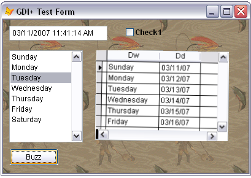
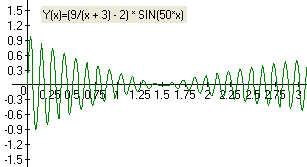

[ Home ](https://github.com/VFPX/Win32API)  

# GDI+: how to make VFP controls visually shake and shudder

## Note that this document contains some links to the old news2news website which does not work at the moment. This material will be available sometime in the future.

## Short description:
Shuddering control may appear a good way to get user`s immediate attention. For example, when Purchase Order form opens, and the shipping date is not entered or overdue, the textbox hosting this value may start vibrate and thus can be easily spotted by the user.  
***  


## Before you begin:
The code is based on [custom GDI+ class](sample_450.md). Download the class module first and save it in **gdiplus.prg** file.   

Shuddering control may appear a good way to get user`s immediate attention. For example, when Purchase Order form opens, and the shipping date is not entered or overdue, the textbox hosting this value may start vibrate and thus can be easily spotted by the user.  

It starts with creating a sequence of frames and storing them in memory. Each frame is an image of the control rotated by a certain small angle. When a shaking time comes, the actual control becomes hidden and a timer starts drawing frames upon its location. In this way, an illusion is created of the control shaking with the amplitude fading in a few seconds.  

<!-- Anatoliy -->
<table border=0 cellspacing=0 cellpadding=0 class=fdescr><tr><td valign=top>  
<a href="http://www.news2news.com/vfp/images/swf/buzzer/buzzer.html" target=_blank></a><a href="http://www.news2news.com/vfp/images/swf/buzzer/buzzer.html" target=_blank></a>See a short demo displaying <a href="http://www.news2news.com/vfp/images/swf/buzzer/buzzer.html" target=_blank>a form with several controls</a>

[Adobe Flash Player](http://www.adobe.com/products/flashplayer/) is required to view this demo.    

Note that the demo is slower and less dynamic comparing to the actual form appearance.  
</td></tr></table>  

See also:

* [Placing On-screen Alert on top of all windows](sample_504.md)  
* [Flashing caption of a VFP application in the Windows task bar using FlashWindowEx](sample_271.md)  
* [Scrolling text on the form horizontally (a newsreel)](sample_352.md)  
* [Scrolling text on the form vertically (a movie cast)](sample_354.md)  
* [Playing AVI on _screen](sample_430.md)  
* [Displaying animated images](sample_355.md)  
* [Form Magnifier](sample_414.md)  
  
***  


## Code:
```foxpro  
SET PROCEDURE TO gdiplus ADDITIVE

PUBLIC oForm As Tform
oForm = CREATEOBJECT("Tform")
oForm.Visible=.T.
* end of main

DEFINE CLASS Tform As Form
	Width=400
	Height=250
	Autocenter=.T.
	Caption="GDI+ Test Form"
	Picture="C:\windows\Gone Fishing.bmp"

	ADD OBJECT Text1 As TextBox WITH Left=10, Top=10,;
	Width=160, Height=24, Value=DATETIME()
	
	ADD OBJECT lst1 As ListBox WITH Left=10, Top=50,;
	Width=120, height=150
	
	ADD OBJECT check1 As CheckBox WITH Left=200, Top=12,;
	Autosize=.T., Backstyle=0, FontBold=.T.,;
	Caption="Use Local Settings"
	
	ADD OBJECT edit1 As EditBox WITH Left=150, Top=50,;
	Width=220, Height=150, Value=VERSION()+CHR(13)+SYS(0)
	
	ADD OBJECT cmd As CommandButton WITH Left=10, Top=210,;
	Width=80, Height=27, Caption="Buzz"

	ADD OBJECT buzz As Tbuzzer
	buzzindex=0

PROCEDURE lst1.Init
	WITH THIS
		.AddItem("Sunday")
		.AddItem("Monday")
		.AddItem("Tuesday")
		.AddItem("Wednesday")
		.AddItem("Thursday")
		.AddItem("Friday")
		.AddItem("Saturday")
		.ListIndex=3
	ENDWITH

PROCEDURE Click
	THIS.buzz.StopBuzzing

PROCEDURE cmd.Click
	ThisForm.buzzindex = ThisForm.buzzindex + 1
	IF ThisForm.buzzindex > ThisForm.ControlCount
		ThisForm.buzzindex=1
	ENDIF
	LOCAL oCtrl
	oCtrl = ThisForm.Controls[ThisForm.buzzindex]
	IF LOWER(oCtrl.Name) $ "text1;lst1;check1;edit1;"
		ThisForm.buzz.buzz(oCtrl)
	ENDIF
ENDDEFINE

DEFINE CLASS Tbuzzer As Custom
#DEFINE SRCCOPY 0xCC0020
#DEFINE SM_CXSCREEN 0
#DEFINE SM_CYSCREEN 1
#DEFINE SM_CYCAPTION 4
#DEFINE SM_CXFRAME 32
#DEFINE SM_CYFRAME 33

	gdiplus=NULL
	hGraphics=NULL
	hBackground=NULL
	ctrl=NULL
	hWindow=0  && HWND of the form
	frames=NULL

	maxangle=7  && degree
	secondspercycle=5
	TimerInterval=15  && ms
	starttime=0

	absctrlleft=0
	absctrltop=0
	leftmargin=0
	rightmargin=0
	topmargin=0
	bottommargin=0
	bmpwidth=0
	bmpheight=0

	ADD OBJECT tm As Timer WITH Interval=0

PROCEDURE Init
	THIS.declare
	THIS.gdiplus = CREATEOBJECT("gdiplusinit")
	THIS.frames = CREATEOBJECT("Tframes")

PROCEDURE Destroy
	THIS.StopBuzzing
	THIS.frames.ReleaseFrames
	THIS.frames=NULL
	THIS.gdiplus=NULL

PROCEDURE tm.Timer
	THIS.Parent.OnTimer

PROCEDURE StartBuzzing
	WITH THIS
		.hGraphics = CREATEOBJECT("graphics", .hWindow)
		.starttime = GetTickCount()
		.tm.Interval = THIS.TimerInterval
	ENDWITH

PROCEDURE StopBuzzing
	THIS.tm.Interval=0

	IF NOT ISNULL(THIS.hBackground)
		THIS.RestoreBackground
		THIS.hBackground=NULL
	ENDIF
	IF NOT ISNULL(THIS.hGraphics)
		THIS.hGraphics=NULL
	ENDIF
	IF NOT ISNULL(THIS.ctrl)
		THIS.ctrl.Visible=.T.
	ENDIF

PROCEDURE RestoreBackground
	IF NOT ISNULL(THIS.ctrl)
		THIS.hGraphics.drawimage(THIS.hBackground,;
			THIS.ctrl.left-THIS.leftmargin+1,;
			THIS.ctrl.top-THIS.topmargin+1,;
			THIS.bmpwidth, THIS.bmpheight)
	ENDIF

PROCEDURE Buzz(oControl As Control)
	IF VARTYPE(m.oControl) = "O"
		THIS.StopBuzzing
		THIS.PrepareBuzzing(oControl)
	ENDIF
	THIS.StartBuzzing

PROCEDURE PrepareBuzzing(oControl As Control)
	THIS.frames.ReleaseFrames

	THIS.ctrl = oControl
	THIS.hWindow = ThisForm.HWND
	THIS.GetAbsCoords
	
	LOCAL ctrlBitmap As gdibitmap, hdc
	hdc = GetWindowDC(THIS.hWindow)

	* saving an image of the control (rectangle area)
	ctrlBitmap = CREATEOBJECT("gdibitmap",;
		THIS.ctrl.Width, THIS.ctrl.Height)
	WITH ctrlBitmap
		.graphics.GetDC
		= BitBlt(.graphics.hdc, 0,0, .imgwidth, .imgheight,;
			m.hdc, THIS.absctrlleft,THIS.absctrltop, SRCCOPY)
		.graphics.ReleaseDC
	ENDWITH

	* saving the background image while the control is hidden
	THIS.ctrl.Visible=.T.
	= INKEY(0.1)  && a small delay is required
	THIS.hBackground = CREATEOBJECT("gdibitmap",;
		THIS.bmpwidth, THIS.bmpheight)
	WITH THIS.hBackground
		.graphics.GetDC
		= BitBlt(.graphics.hdc, 0,0,;
			THIS.bmpwidth, THIS.bmpheight,;
			m.hdc, THIS.absctrlleft-THIS.leftmargin+1,;
			THIS.absctrltop-THIS.topmargin+1, SRCCOPY)
		.graphics.ReleaseDC
	ENDWITH

	= ReleaseDC(THIS.hWindow, m.hdc)

	LOCAL nAngle, oMatrix As gdimatrix, oFrame As Tframe

	* creating a sequence of frames displaying the control
	* rotated by a specified angle
	FOR nAngle=-THIS.maxangle TO THIS.maxangle STEP 0.05
		oMatrix = CREATEOBJECT("gdimatrix")
		WITH oMatrix
			* centering the axis of rotation
			.Translate(THIS.bmpwidth/2, THIS.bmpheight/2)
			.Rotate(m.nAngle)
		ENDWITH

		oFrame = THIS.frames.AddFrame(THIS.bmpwidth,;
			THIS.bmpheight, m.nAngle)

		WITH oFrame.bitmap
			* drawing the background
			.graphics.drawimage(THIS.hBackground, 0,0)
			* applying rotation transformation
			.graphics.SetTransform(oMatrix)
			* drawing the control
			.graphics.drawimage(m.ctrlBitmap,;
				THIS.leftmargin-THIS.bmpwidth/2,;
				THIS.topmargin-THIS.bmpheight/2)
		ENDWITH
	NEXT

PROCEDURE OnTimer
	LOCAL nElapsedTime
	nElapsedTime = (GetTickCount() - THIS.starttime)/1000

	IF nElapsedTime > THIS.secondspercycle
		THIS.starttime = GetTickCount()
		RETURN
	ENDIF
	
	* calculating the amplitude, fading from 1 to zero
	LOCAL nArgument, nAngle
	nArgument = ((6/(nElapsedTime+3))-1) * SIN(120*nElapsedTime)
	nAngle = nArgument * THIS.maxangle
	THIS.DrawImage(m.nAngle)

PROCEDURE DrawImage(nAngle)
* draws a frame specified by angle
	LOCAL oFrame As Tframe
	oFrame = THIS.frames.GetFrameByAngle(m.nAngle * 1000)
	THIS.hGraphics.drawimage(oFrame.bitmap,;
		THIS.ctrl.left-THIS.leftmargin+1,;
		THIS.ctrl.top-THIS.topmargin+1,;
		THIS.bmpwidth-2, THIS.bmpheight-2)

PROCEDURE GetAbsCoords
* calculates coordinates and margins for the frames
* displaying rotated control
	LOCAL oCtrl As Control, nLeft, nTop
	oCtrl = THIS.ctrl
	nLeft = oCtrl.Left
	nTop = oCtrl.Top

	DO WHILE oCtrl.Parent <> ThisForm
		IF TYPE("oCtrl.Parent.Left") = "N"
			nLeft = nLeft + oCtrl.Parent.Left
			nTop = nTop + oCtrl.Parent.Top
		ENDIF
		oCtrl = oCtrl.Parent
	ENDDO

	LOCAL nCaptionHeight, nFrameWidth, nFrameHeight
	nCaptionHeight = GetSystemMetrics(SM_CYCAPTION)
	nFrameWidth = GetSystemMetrics(SM_CXFRAME)
	nFrameHeight = GetSystemMetrics(SM_CYFRAME)

	THIS.absctrlleft = m.nLeft + m.nFrameWidth
	THIS.absctrltop = m.nTop + m.nCaptionHeight + m.nFrameHeight

	STORE 5 TO THIS.leftmargin, THIS.rightmargin,;
		THIS.topmargin, THIS.bottommargin

	THIS.bmpwidth=THIS.ctrl.Width + THIS.leftmargin + THIS.rightmargin
	THIS.bmpheight=THIS.ctrl.Height + THIS.topmargin + THIS.bottommargin

PROCEDURE declare
	DECLARE INTEGER GetSystemMetrics IN user32 INTEGER nIndex
	DECLARE INTEGER GetWindowDC IN user32 INTEGER hWindow
	DECLARE INTEGER ReleaseDC IN user32 INTEGER hwindow, INTEGER hdc
	DECLARE INTEGER GetTickCount IN kernel32

	DECLARE INTEGER BitBlt IN gdi32;
		INTEGER hDestDC, INTEGER x, INTEGER y,;
		INTEGER nWidth, INTEGER nHeight, INTEGER hSrcDC,;
		INTEGER xSrc, INTEGER ySrc, INTEGER dwRop

ENDDEFINE

DEFINE CLASS Tframes As Collection  && collection of frames

PROCEDURE Destroy
	THIS.ReleaseFrames

PROCEDURE AddFrame(nWidth, nHeight, nAngle)
	LOCAL obj As Tframe
	obj = CREATEOBJECT("Tframe", nWidth, nHeight, nAngle)
	THIS.Add(obj)
	obj=NULL
RETURN THIS.GetLastFrame()

PROCEDURE ReleaseFrames
	DO WHILE THIS.Count > 0
		THIS.Remove(1)
	ENDDO

FUNCTION GetLastFrame() As Tframe
RETURN THIS.GetFrame(THIS.Count)

FUNCTION GetFrame(nIndex) As Tframe
RETURN IIF(BETWEEN(m.nIndex, 1,THIS.Count), THIS.Item(m.nIndex), NULL)

FUNCTION GetFrameByAngle(nAngle As Number) As Tframe
	LOCAL nIndex, nDiff, nMinDiff, nResult
	nMinDiff=999
	nResult=1

	FOR nIndex=1 TO THIS.Count
		nDiff = ABS(THIS.Item(nIndex).angle - m.nAngle)
		IF nDiff < m.nMinDiff
			nMinDiff = m.nDiff
			nResult = m.nIndex
			IF m.nMinDiff <= 5
				EXIT
			ENDIF
		ENDIF
	NEXT
RETURN THIS.GetFrame(m.nResult)

ENDDEFINE

DEFINE CLASS Tframe As Relation
	angle=0  && rotation angle
	bitmap=NULL  && gdibitmap

PROCEDURE Init(nWidth, nHeight, nAngle)
	THIS.bitmap = CREATEOBJECT("gdibitmap", m.nWidth, m.nHeight)
	THIS.angle = m.nAngle * 1000  && to eliminate decimals

ENDDEFINE  
```  
***  


## Listed functions:
[BitBlt](../libraries/gdi32/BitBlt.md)  
[GetSystemMetrics](../libraries/user32/GetSystemMetrics.md)  
[GetTickCount](../libraries/kernel32/GetTickCount.md)  
[GetWindowDC](../libraries/user32/GetWindowDC.md)  
[ReleaseDC](../libraries/user32/ReleaseDC.md)  

## Comment:


Math function similar to this is used to form a shaking pattern for control.  
  
***  

