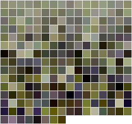
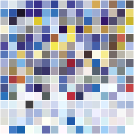

[ Home ](https://github.com/VFPX/Win32API)  

# Displaying the color palette stored in an image file

## Short description:
Depending on its bit per pixel mode, an image file can store a color palette inside its data. GDI+ functions GdipGetImagePalette and GdipGetImagePaletteSize allow to retrieve the palette in a form of ColorPalette structure.
  
***  


## Before you begin:
The code is based on [custom GDI+ class](sample_450.md) custom GDI+ class</a>. Download the class module first and save it in **gdiplus.prg** file.  

Depending on its bit per pixel mode, an image file can store a color palette inside its data. GDI+ functions GdipGetImagePalette and GdipGetImagePaletteSize allow to retrieve the palette in a form of ColorPalette structure.

```txt
typedef struct {  
	UINT Flags;  
	UINT Count;  
	ARGB Entries[1];  
} ColorPalette;
```
 

The palettes below are retrieved from various image files:  

  

  

  

  

  
***  


## Code:
```foxpro  
SET PROCEDURE TO gdiplus ADDITIVE

* an instance of gdiplusinit must be created before
* and released after using any of gdi+ objects
PRIVATE gdiplus
gdiplus = CREATEOBJECT("gdiplusinit")

DO declare

LOCAL imgfile As gdiimage, nPaletteSize, cBuffer,;
	nResult, nEntryCount

imgfile = CREATEOBJECT("gdiimage", "c:\windows\FeatherTexture.bmp")

nPaletteSize=0
nResult = GdipGetImagePaletteSize(imgfile.himage, @nPaletteSize)

IF nResult <> 0
	= MESSAGEBOX("GdipGetImagePaletteSize call failed: " +;
		TRANSFORM(m.nResult))
	RETURN
ENDIF

cBuffer = REPLICATE(CHR(0), nPaletteSize)
nResult = GdipGetImagePalette(imgfile.himage, @cBuffer, nPaletteSize)

IF nResult <> 0
	= MESSAGEBOX("GdipGetImagePalette call failed: " +;
		TRANSFORM(m.nResult))
	RETURN
ENDIF

* number of entries in the palette
nEntryCount = buf2dword(SUBSTR(cBuffer,5,4))
IF nEntryCount = 0
	= MESSAGEBOX("The palette is empty.")
	RETURN
ENDIF

* creating a rectangle to draw the palette on
#DEFINE ENTRY_SIDE_PIXEL 16
#DEFINE BORDER_WIDTH_PIXEL 1
#DEFINE ENTRIES_PER_ROW 16
#DEFINE OFFSET_TO_ENTRIES 9

LOCAL oPalettePane As gdibitmap, nPaneWidth, nPaneRows, nPaneHeight,;
	nColIndex, nRowIndex, nEntryIndex, nArgb, nLeft, nTop

* calculate the size of a rectangle required to display the palette
nPaneWidth = BORDER_WIDTH_PIXEL +;
	(ENTRY_SIDE_PIXEL+BORDER_WIDTH_PIXEL) * ENTRIES_PER_ROW

nPaneRows = CEILING(nEntryCount/ENTRIES_PER_ROW)

nPaneHeight = BORDER_WIDTH_PIXEL +;
	(ENTRY_SIDE_PIXEL+BORDER_WIDTH_PIXEL) * m.nPaneRows

* create a bitmap to draw the palette on
oPalettePane = CREATEOBJECT("gdibitmap", nPaneWidth, nPaneHeight)

* fill the bitmap with white color
oPalettePane.graphics.FillRectangle(ARGB(255,255,255,255),;
	0, 0, nPaneWidth, nPaneHeight)

* drawing pallete entries on the bitmap
FOR nRowIndex=1 TO nPaneRows
	nTop = BORDER_WIDTH_PIXEL +;
		(ENTRY_SIDE_PIXEL+BORDER_WIDTH_PIXEL) * (nRowIndex-1)

	FOR nColIndex=1 TO ENTRIES_PER_ROW
		nEntryIndex = (nRowIndex-1) * ENTRIES_PER_ROW + nColIndex

		IF nEntryIndex <= nEntryCount
			nLeft = BORDER_WIDTH_PIXEL +;
				(ENTRY_SIDE_PIXEL+BORDER_WIDTH_PIXEL) * (nColIndex-1)

			nArgb = buf2dword(SUBSTR(cBuffer, OFFSET_TO_ENTRIES +;
				(nEntryIndex-1)*4, 4))

			oPalettePane.graphics.FillRectangle(nArgb, nLeft,nTop,;
				ENTRY_SIDE_PIXEL, ENTRY_SIDE_PIXEL)
		ENDIF
	NEXT
NEXT

* saving the rectangle to a file
oPalettePane.savetofile("palette.png")
* end of main

PROCEDURE declare
	DECLARE INTEGER GdipGetImagePalette IN gdiplus;
		INTEGER img, STRING @imgpalette, INTEGER palettesize

	DECLARE INTEGER GdipSetImagePalette IN gdiplus;
		INTEGER img, INTEGER imgpalette

	DECLARE INTEGER GdipGetImagePaletteSize IN gdiplus;
		INTEGER img, INTEGER @palettesize  
```  
***  


## Listed functions:
[GdipGetImagePalette](../libraries/gdiplus/GdipGetImagePalette.md)  
[GdipGetImagePaletteSize](../libraries/gdiplus/GdipGetImagePaletteSize.md)  
[GdipSetImagePalette](../libraries/gdiplus/GdipSetImagePalette.md)  

## Comment:
Palette entries obtained from an image files are drawn on a gdi+ bitmap object, which saves itself in a file  
  
***  

