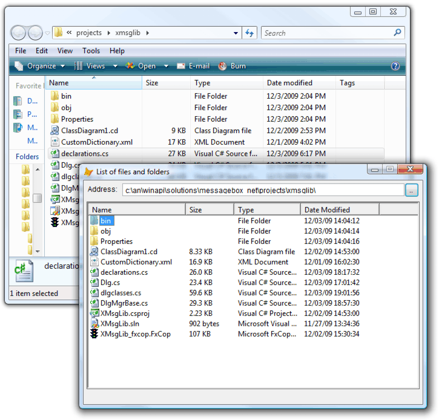
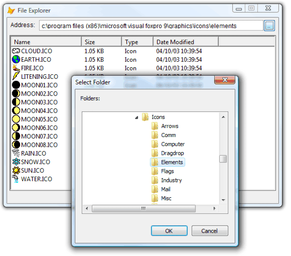
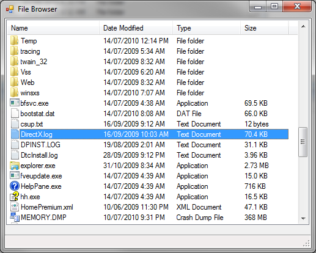
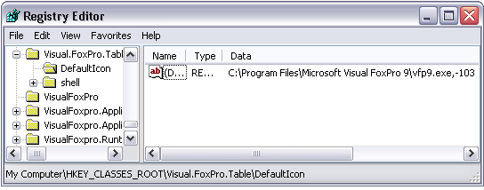
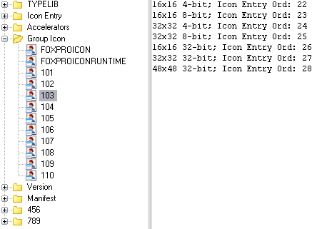

[ Home ](https://github.com/VFPX/Win32API)  

# Displaying the associated icons and descriptions for files and folders

## Short description:
When the list of files and folders is to be displayed inside a VFP form, the ListBox VFP control and the ListView ActiveX control are probably the first two candidates for the job. 

The ListBox`s presentation style can only be described as the minimalistic :) , while the ListView shows items in much fancier manner, and can even accompany each file and folder with an icon.


And an imminent question arises: where are those icons stored and how to put them to work?  
***  


## Before you begin:
When the list of files and folders is to be displayed inside a VFP form, the ListBox VFP control and the ListView ActiveX control are probably the first two candidates for the job.   

The ListBox`s presentation style can only be described as the minimalistic :) , while the ListView shows items in much fancier manner, and can even accompany each file and folder with an icon.  

  
And then one start thinking, where are those icons stored and how to put them to work?  

  

See also:

* [System Image List Viewer](sample_021.md)  
* [System Image List Viewer II](sample_021.md)  
* [ How to view system icons for the classes installed on the local machine ](sample_544.md)  
* [How to find an application associated with the file name](sample_138.md)  
* [How to obtain Content-Type value for a file type from the System Registry](sample_468.md)  
* [Finding the application, icon and friendly names associated with a file name](sample_584.md)  
  
***  


## Code:
```foxpro  
PUBLIC oForm As Explorer
oForm = CREATEOBJECT("Explorer")
oForm.Visible=.T.
* end of main

DEFINE CLASS Explorer As Form
#DEFINE LVM_FIRST 0x1000
#DEFINE LVM_GETIMAGELIST (LVM_FIRST + 2)
#DEFINE LVM_SETIMAGELIST (LVM_FIRST + 3)
#DEFINE LVM_SETITEM (LVM_FIRST + 6)
#DEFINE LVIF_IMAGE 0x0002

#DEFINE LVSIL_SMALL 1
#DEFINE LVS_SHAREIMAGELISTS 0x0040
#DEFINE GWL_STYLE -16
#DEFINE MAX_PATH 260

#DEFINE SHGFI_SYSICONINDEX 0x000004000
#DEFINE SHGFI_SMALLICON 0x000000001
#DEFINE SHGFI_ICON 0x000000100
#DEFINE SHGFI_TYPENAME 0x000000400
#DEFINE SHGFI_USEFILEATTRIBUTES 0x000000010

#DEFINE FILE_ATTRIBUTE_NORMAL 0x00000080
#DEFINE FILE_ATTRIBUTE_DIRECTORY 0x00000010

	Width=560
	Height=370
	MaxButton=.F.
	BorderStyle=2
	AutoCenter=.T.
	Caption="File Explorer"
	ShowWindow=2

	ADD OBJECT lst As TListViewFiles WITH;
	Left=5, Top=35, Width=550, Height=310

	ADD OBJECT Label1 As Label WITH Autosize=.T.,;
	BackStyle=0, Left=7, Top=7, Caption="Address:"
	
	ADD OBJECT txtFolder As TextBox WITH;
	Left=64, Top=5, Width=466,;
	ControlSource="THIS.Parent.lst.defaultpath"

	ADD OBJECT cmdFolder As CommandButton WITH;
	Left=530, Top=4, Width=24, Height=24, Caption=".."

PROCEDURE Init
	= BINDEVENT(THIS.cmdFolder, "Click", THIS, "GetFolder")
	THIS.lst.populatelist

PROCEDURE GotFocus
	THIS.lst.SwitchToSystemList

PROCEDURE GetFolder
	LOCAL cStoredPath, cPath
	cStoredPath = SYS(5) + SYS(2003)
	cPath = GETDIR(THIS.lst.defaultpath,;
		"Folders:", "Select Folder")
	SET DEFAULT TO (m.cStoredPath)
	IF NOT EMPTY(m.cPath)
		THIS.lst.defaultpath = LOWER(m.cPath)
		THIS.Refresh
	ENDIF

ENDDEFINE

DEFINE CLASS TListViewFiles As OleControl
	OleClass="MSComctlLib.ListViewCtrl"
	defaultpath=JUSTPATH(_vfp.ServerName)

PROCEDURE Init
	THIS.declare
	WITH THIS
		.View=3
		.LabelEdit=1
		.AddColumnHeader("Name", 200)
		.AddColumnHeader("Size", 80)
		.AddColumnHeader("Type", 110)
		.AddColumnHeader("Date Modified", 130)
		
		LOCAL oMsgFont As SystemMessageFont
		oMsgFont=CREATEOBJECT("SystemMessageFont")
		.Font.Name=oMsgFont.lfFaceName &&"Segoe UI"
		.Font.Size=oMsgFont.GetFontSize()  &&9
	ENDWITH

PROCEDURE defaultpath_ASSIGN(cPath As String)
	cPath=LOWER(ALLTRIM(JUSTPATH(m.cPath)))
	IF RIGHT(m.cPath,1)="\" AND LEN(m.cPath) > 3
		cPath=SUBSTR(m.cPath,1,LEN(m.cPath)-1)
	ENDIF
	THIS.defaultpath=m.cPath
	THIS.PopulateList

PROCEDURE ColumnClick
LPARAMETERS columnheader
	THIS.PopulateList

PROCEDURE AddColumnHeader(cCaption, nWidth)
	WITH THIS.ColumnHeaders.Add()
		.Text=cCaption
		.Width=nWidth
	ENDWITH

PROCEDURE SwitchToSystemList
	LOCAL nWStyle, hSysImageList, nResult, cBuffer

	* check if the list is already assigned
	IF SendMessage(THIS.HWND, LVM_GETIMAGELIST,;
		LVSIL_SMALL, 0) <> 0
		RETURN
	ENDIF

	WITH THIS
		nWStyle = GetWindowLong(.HWND, GWL_STYLE)
		nWStyle = BITOR(m.nWStyle, LVS_SHAREIMAGELISTS)
		SetWindowLong(.HWND, GWL_STYLE, nWStyle)

		cBuffer = REPLICATE(CHR(0), 1024)
		hSysImageList = SHGetFileInfo("", FILE_ATTRIBUTE_NORMAL,;
			@cBuffer, LEN(cBuffer),;
			BITOR(SHGFI_SYSICONINDEX, SHGFI_SMALLICON,;
				SHGFI_ICON, SHGFI_TYPENAME,;
				SHGFI_USEFILEATTRIBUTES))

		= SendMessage(.HWND, LVM_SETIMAGELIST, LVSIL_SMALL, 0)
		= INKEY(0.1)
		= SendMessage(.HWND, LVM_SETIMAGELIST, LVSIL_SMALL, hSysImageList)

	ENDWITH

PROCEDURE PopulateList
* scans current directory and populates the ListView
	THIS.ListItems.Clear
	
	LOCAL nCount, nIndex

	nCount = ADIR(arrListOfFiles,;
		THIS.defaultpath + "\*.*", "D", 1)

	FOR nIndex=1 TO nCount
		IF arrListOfFiles[nIndex, 1] = "."
			LOOP
		ENDIF
		IF DIRECTORY(THIS.defaultpath + "\" +;
			arrListOfFiles[nIndex, 1])
			THIS.AddLstItem(@arrListOfFiles, nIndex, .T.)
		ENDIF
	NEXT

	nCount = ADIR(arrListOfFiles,;
		THIS.defaultpath + "\*.*", "A", 1)

	FOR nIndex=1 TO nCount
		IF NOT DIRECTORY(THIS.defaultpath + "\" +;
			arrListOfFiles[nIndex, 1])
			THIS.AddLstItem(@arrListOfFiles, nIndex, .F.)
		ENDIF
	NEXT
	RELEASE arrListOfFiles

PROCEDURE AddLstItem(arr, nIndex, lDirectory)
* adds new ListItem to the ListView control
	LOCAL cFilename, nTypeIndex, cFiletype, oItem

	cFilename = arr[nIndex, 1]
	nTypeIndex=0
	cFiletype=""
	
	THIS.GetFileTypeInfo(THIS.defaultpath+"\"+m.cFilename,;
		@nTypeIndex, @cFiletype,;
		IIF(lDirectory, FILE_ATTRIBUTE_DIRECTORY,;
			FILE_ATTRIBUTE_NORMAL))
	
	oItem = THIS.ListItems.Add(,,cFilename)
	THIS.SetIcon(oItem.Index, m.nTypeIndex)

	WITH oItem
		IF NOT lDirectory
			.Subitems(1) = THIS.FormatFilesize(arr[nIndex, 2])
		ENDIF
		.Subitems(2) = m.cFiletype
		.Subitems(3) = THIS.FormatDT(arr[nIndex, 3], arr[nIndex, 4])
	ENDWITH

PROCEDURE SetIcon(nItemIndex, nImageIndex)
* sets the icon for the specified ListItem
    LOCAL cItemBuffer  && LVITEM structure

    cItemBuffer = num2dword(LVIF_IMAGE) +;
    	num2dword(nItemIndex-1) + num2dword(0) + num2dword(0) +;
    	num2dword(0) + num2dword(0) + num2dword(0) +;
    	num2dword(nImageIndex) + num2dword(0)

    = SendMessageS(THIS.hWnd , LVM_SETITEM, 0, @cItemBuffer)

FUNCTION FormatDT(dDate, cTime) As String
	LOCAL cResult
	cResult = DTOC(dDate) + " " + cTime
RETURN m.cResult

FUNCTION FormatFilesize(nSize) As String
	LOCAL cBuffer
	cBuffer = REPLICATE(CHR(0), 128)
	= StrFormatByteSizeA(m.nSize, @cBuffer, LEN(m.cBuffer))
RETURN STRTRAN(m.cBuffer, CHR(0), "")

PROCEDURE GetFileTypeInfo(cFilename, nTypeIndex,;
	cFileType, nFileAttr)
* obtains the icon and description associated
* with the specified file type
	LOCAL nBufsize, cBuffer, nFlags, hIcon, nTypeIndex

	nBufsize=0x200
	cBuffer = REPLICATE(CHR(0), nBufsize)

	nFlags = BITOR(SHGFI_SYSICONINDEX,;
		SHGFI_SMALLICON, SHGFI_ICON, SHGFI_TYPENAME,;
		SHGFI_USEFILEATTRIBUTES)

	= SHGetFileInfo(m.cFilename, m.nFileAttr,;
		@cBuffer, nBufsize, nFlags)
	
	hIcon = buf2dword(SUBSTR(cBuffer, 1, 4))
	nTypeIndex = buf2dword(SUBSTR(cBuffer,5, 4))
	cFileType = STRTRAN(SUBSTR(m.cBuffer,13+MAX_PATH), CHR(0),"")

	IF hIcon <> 0
		= DestroyIcon(hIcon)
	ENDIF

PROCEDURE declare
	DECLARE INTEGER DestroyIcon IN user32 INTEGER hIcon

	DECLARE STRING StrFormatByteSizeA IN Shlwapi;
		INTEGER dw, STRING @pszBuf, INTEGER cchBuf

	DECLARE INTEGER SHGetFileInfo IN shell32;
		STRING pszPath, LONG dwFileAttributes,;
		STRING @psfi, LONG cbFileInfo, LONG uFlags

	DECLARE INTEGER SendMessage IN user32;
		INTEGER hWindow, INTEGER Msg,;
		INTEGER wParam, INTEGER lParam

	DECLARE INTEGER SendMessage IN user32 AS SendMessageS;
		INTEGER hWindow, INTEGER Msg,;
		INTEGER wParam, STRING @lParam

	DECLARE INTEGER SetWindowLong IN user32;
		INTEGER hWindow, INTEGER nIndex, INTEGER dwNewLong

	DECLARE INTEGER GetWindowLong IN user32;
		INTEGER hWindow, INTEGER nIndex

	DECLARE INTEGER GetWindowDC IN user32 INTEGER hWindow

	DECLARE INTEGER SystemParametersInfo IN user32;
		INTEGER uiAction, INTEGER uiParam,;
		STRING @pvParam, INTEGER fWinIni

	DECLARE INTEGER GetDeviceCaps IN gdi32;
		INTEGER hdc, INTEGER nIndex

	DECLARE INTEGER ReleaseDC IN user32;
		INTEGER hWindow, INTEGER hDC

ENDDEFINE

DEFINE CLASS SystemMessageFont As Custom
#DEFINE SPI_GETNONCLIENTMETRICS 0x0029
#DEFINE NONCLIENTMETRICS_SIZE 0x0154
#DEFINE LOGFONT_SIZE 0x003c
#DEFINE LOGPIXELSY 0x005a
	lfHeight=12
	lfFaceName="Arial"

PROCEDURE Init
	LOCAL cNonClientMetrics, cBuffer
	cNonClientMetrics=num2dword(NONCLIENTMETRICS_SIZE)
	cNonClientMetrics=PADR(cNonClientMetrics,;
		NONCLIENTMETRICS_SIZE, CHR(0))

	IF SystemParametersInfo(SPI_GETNONCLIENTMETRICS,;
		NONCLIENTMETRICS_SIZE, @cNonClientMetrics, 0) <> 0
		cBuffer=SUBSTR(cNonClientMetrics, 281, LOGFONT_SIZE)
		WITH THIS
			.lfHeight=buf2dword(SUBSTR(cBuffer,1,4))
			.lfFaceName=STRTRAN(SUBSTR(cBuffer,29,32), CHR(0),"")
		ENDWITH
	ENDIF

FUNCTION GetFontSize() As Number
	LOCAL hWindow, hDC, nPxPerInchY
	hWindow=_screen.HWnd
	hDC=GetWindowDC(hWindow)
	nPxPerInchY = GetDeviceCaps(hDC, LOGPIXELSY)
	ReleaseDC(hWindow, hDC)
RETURN ROUND((ABS(THIS.lfHeight) * 72) / nPxPerInchY, 0)

ENDDEFINE

FUNCTION buf2dword(lcBuffer)
RETURN Asc(SUBSTR(lcBuffer, 1,1)) + ;
	BitLShift(Asc(SUBSTR(lcBuffer, 2,1)),  8) +;
	BitLShift(Asc(SUBSTR(lcBuffer, 3,1)), 16) +;
	BitLShift(Asc(SUBSTR(lcBuffer, 4,1)), 24)

FUNCTION num2dword(lnValue)
#DEFINE m0 256
#DEFINE m1 65536
#DEFINE m2 16777216
	IF lnValue < 0
		lnValue = 0x100000000 + lnValue
	ENDIF
	LOCAL b0, b1, b2, b3
	b3 = Int(lnValue/m2)
	b2 = Int((lnValue - b3*m2)/m1)
	b1 = Int((lnValue - b3*m2 - b2*m1)/m0)
	b0 = Mod(lnValue, m0)
RETURN Chr(b0)+Chr(b1)+Chr(b2)+Chr(b3)  
```  
***  


## Listed functions:
[DestroyIcon](../libraries/user32/DestroyIcon.md)  
[GetDeviceCaps](../libraries/gdi32/GetDeviceCaps.md)  
[GetWindowDC](../libraries/user32/GetWindowDC.md)  
[GetWindowLong](../libraries/user32/GetWindowLong.md)  
[ReleaseDC](../libraries/user32/ReleaseDC.md)  
[SHGetFileInfo](../libraries/shell32/SHGetFileInfo.md)  
[SendMessage](../libraries/user32/SendMessage.md)  
[SetWindowLong](../libraries/user32/SetWindowLong.md)  
[SystemParametersInfo](../libraries/user32/SystemParametersInfo.md)  

## Comment:
Ouput produced by C# version of  this code:  
  


* * *  
The associated icon and the description for each file type are stored in the Registry.   
  
To get these associates for DBF files, for example, the first step is to locate "HKEY_CLASSES_ROOT\.dbf" registry key. The default value for this key is "Visual.FoxPro.Table". Which means "HKEY_CLASSES_ROOT\Visual.FoxPro.Table" key must be located next.  
  
The latter has the default value "Microsoft Visual FoxPro Table", which is the actual description that the OS sticks to DBF file type.  
  
The "DefaultIcon" subkey for this key has value "C:\Program Files\Microsoft Visual FoxPro 9\vfp9.exe,-103". That means that Group Icon #103 resource exists in VFP9 executable.   
  


This resource contains several icons that the OS uses for representing Visual FoxPro DBF files whenever required; for example, when displaying list of files in Explorer window.  
  
A Resource Viewer shows this and other resources stored in VFP9 executable.  
  


In a similar way any other file type (read "file extension") can be traced to an icon+description pair.   
  
There is no single rule, and the ways of finding associations are tricky if not messy. Going this way would require rather extensive coding. Luckily, MS had bothered to hide the complexity of the process inside the SHGetFileInfo API call.  
  
```foxpro
nBufsize=1024  
cBuffer = REPLICATE(CHR(0), nBufsize)  
  
nFlags = BITOR(SHGFI_SYSICONINDEX, SHGFI_SMALLICON,;  
		SHGFI_ICON, SHGFI_TYPENAME,   
		SHGFI_USEFILEATTRIBUTES)  
  
	nResult = SHGetFileInfo(m.cFilename,;  
		FILE_ATTRIBUTE_NORMAL,;  
		@cBuffer, nBufsize, nFlags)
```

For the specified cFilename, the call above populates the SHFILEINFO structure with valuable information. That includes the description for the file type as well as the associated icon presented as the index in the System Image List.  
  
The OS creates the System Image List for each running process, with the process mainly responsible for populating the list with ListImage items via SHGetFileInfo calls and may be by some other means.  
  
This is how the handle to the System Image List (HIMAGELIST) can be obtained.  
  
```foxpro
cBuffer = REPLICATE(CHR(0), 1024)  
hSysImageList = SHGetFileInfo("", FILE_ATTRIBUTE_NORMAL,;  
	@cBuffer, LEN(cBuffer),;  
	BITOR(SHGFI_SYSICONINDEX, SHGFI_SMALLICON,;  
		SHGFI_ICON, SHGFI_TYPENAME,;  
		SHGFI_USEFILEATTRIBUTES))
```

Such System Image List is very similar if not identical to the ImageList ActiveX control. That is why the list can be linked to Icons or SmallIcons property of a MS Common Control (ListView or TreeView) placed on VFP form, which hence allows this control to display images found in the System Image List.  
  
* * *  
As stated in MSDN, the SHGetFileInfo may not be the best way, even if the simplest, for retrieving associated icons.   
  
The [ExtractIcon Interface](https://msdn.microsoft.com/en-us/library/windows/desktop/bb761854%28v=vs.85%29.aspx?f=255&MSPPError=-2147217396)  performs this task better. The Shell uses nothing else bu the the IExtractIcon for retrieving icons when displaying the contents of a folder.  
  
* * *  
Calling AssocQueryString API provides yet another way of obtaining the path to the associated icon as well as so called friendly names for the application and the file.   
  
[](sample_584.md)

***  

