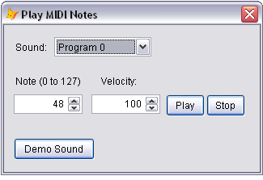

[ Home ](https://github.com/VFPX/Win32API)  

# How to play MIDI notes

## Short description:
Set the note in 0 to 127 range and the velocity (how hard the key is pressed) in 20 to 200+ range and press Enter.  
***  


## Before you begin:
Set the note in 0-127 range and the velocity (how hard the key is pressed) in 20-200+ range and press Enter. Also you can select a program -- an emultaion of a musical instrument the note to be played with.  

The "Demo Sound" button shows how simple custom MIDI sounds can be used in VFP application.  

  
See also:

* [Using Multimedia Command Strings to play MIDI files](sample_538.md)  
* [How to play a waveform sound](sample_251.md)  
* [Playing WAV sounds simultaneously](sample_523.md)  
* [WAV file player](sample_417.md)  
* [Controlling master audio volume by sending WM_APPCOMMAND messages](sample_592.md)  
  
***  


## Code:
```foxpro  
oForm = CREATEOBJECT("Tform")
oForm.Show(1)
* end of main

DEFINE CLASS Tform AS form
PROTECTED midi
	midi=NULL
	Height=182
	Width=316
	AutoCenter=.T.
	Caption="Play MIDI Notes"
	MaxButton=.F.
	MinButton=.F.

	ADD OBJECT Label1 AS Label WITH AutoSize=.T.,;
		BackStyle=0, Caption="Sound:", Height=17,;
		Left=14, Top=20, Width=31

	ADD OBJECT cmbProgram As ComboBox WITH Left=62,;
		Top=15, Width=120, Height=24, Style=2

	ADD OBJECT Label2 AS Label WITH AutoSize=.T.,;
		BackStyle=0, Caption="Note (0 to 127)", Height=17,;
		Left=14, Top=62, Width=31

	ADD OBJECT txtNote AS Spinner WITH Height=24,;
		KeyboardHighValue=127, KeyboardLowValue=0, Left=12,;
		SpinnerHighValue=127, SpinnerLowValue=0,;
		Top=86, Width=85, Value=48

	ADD OBJECT Label3 AS Label WITH AutoSize=.T.,;
		BackStyle=0, Caption="Velocity:", Height=17,;
		Left=120, Top=62, Width=46

	ADD OBJECT txtVelocity AS Spinner WITH Height=24,;
		KeyboardHighValue=200, KeyboardLowValue=20, Left=108,;
		SpinnerHighValue=200, SpinnerLowValue=20, Top=86,;
		Width=85, Value=100

	ADD OBJECT cmdPlay AS CommandButton WITH Top=86,;
		Left=200, Height=27, Width=48,;
		Caption="Play", Default=.T.

	ADD OBJECT cmdStop AS CommandButton WITH Top=86,;
		Left=250, Height=27, Width=48,;
		Caption="Stop", Default=.T.

	ADD OBJECT cmdDemo AS CommandButton WITH Top=140,;
		Left=12, Height=27, Width=100,;
		Caption="Demo Sound", Default=.T.

PROCEDURE Init
	THIS.midi = CREATEOBJECT("TMidiNote")
	ThisForm.ChangePatch

PROCEDURE cmbProgram.Init
	LOCAL nIndex
	FOR nIndex=0 TO 127
		THIS.AddItem("Program " + LTRIM(STR(nIndex)))
	NEXT
	THIS.ListIndex=1

PROCEDURE cmbProgram.InteractiveChange
	ThisForm.ChangePatch

PROCEDURE cmdDemo.Click
	ThisForm.PlayDemoSound

PROCEDURE cmdPlay.Click
	ThisForm.PlayNote

PROCEDURE cmdStop.Click
	ThisForm.StopNote

PROCEDURE PlayDemoSound
	THIS.midi.ChangePatch(117)
	THIS.midi.PlayNote(54, 100)
	Sleep(150)
	THIS.midi.PlayNote(50, 100)
	Sleep(100)
	THIS.midi.PlayNote(48, 100)
	Sleep(70)
	THIS.midi.PlayNote(44, 100)
	
	DOEVENTS
	THIS.ChangePatch
	
PROCEDURE ChangePatch
	LOCAL nProgram
	nProgram = THIS.cmbProgram.ListIndex-1
	THIS.midi.ChangePatch(m.nProgram)

PROCEDURE StopNote
	LOCAL nNote
	nNote = THIS.txtNote.Value
	THIS.midi.StopNote(m.nNote)

PROCEDURE PlayNote
	LOCAL nNote, nVelocity
	nNote = THIS.txtNote.Value
	nVelocity = THIS.txtVelocity.Value
	THIS.midi.PlayNote(nNote, nVelocity)

ENDDEFINE

DEFINE CLASS TMidiNote As Session
#DEFINE MIDI_STATUS_PLAYNOTE 9
#DEFINE MIDI_STATUS_PATCH 12
PROTECTED hDevice, channel
	hDevice=0
	channel=0

PROCEDURE Init(lDeclare)
	THIS.declare
	IF NOT THIS.OpenDevice()
		RETURN .F.
	ENDIF

PROCEDURE Destroy
	THIS.CloseDevice

PROTECTED FUNCTION OpenDevice() As Boolean
	IF midiOutGetNumDevs() = 0
		MESSAGEBOX("No Midi Devices found.",;
			48, "MIDI Error")
		RETURN .F.
	ENDIF

	LOCAL hDevice, nResult
	hDevice=0
	nResult = midiOutOpen(@hDevice, 0,0,0,0)
	THIS.hDevice = m.hDevice
	IF nResult <> 0
		MESSAGEBOX("Call to midiOutOpen failed: " +;
			TRANSFORM(nResult), 48, "MIDI Error")
	ENDIF
RETURN (m.nResult=0)

PROTECTED PROCEDURE CloseDevice
	IF THIS.hDevice <> 0
		= midiOutReset(THIS.hDevice)
		= midiOutClose(THIS.hDevice)
		THIS.hDevice = 0
	ENDIF

PROCEDURE SendMIDICommand(b1, b2, b3, b4)
	IF THIS.hDevice <> 0
		LOCAL nMsg, nResult
		nMsg = THIS.channel + BITLSHIFT(m.b1,4) +;
			BITLSHIFT(m.b2,8) +;
			BITLSHIFT(m.b3,16) + BITLSHIFT(m.b4,24)

		nResult = midiOutShortMsg(THIS.hDevice, m.nMsg)
		IF nResult <> 0
			MESSAGEBOX("Call to midiOutShortMsg failed: " +;
				TRANSFORM(nResult), 48, "MIDI Error")
		ENDIF
	ENDIF

PROCEDURE PlayNote(nNote, nVelocity)
	THIS.SendMIDICommand(MIDI_STATUS_PLAYNOTE,;
		nNote, nVelocity, 0)

PROCEDURE StopNote(nNote)
	THIS.SendMIDICommand(MIDI_STATUS_PLAYNOTE,;
		m.nNote, 0, 0)

PROCEDURE ChangePatch(nPatchNo)
	THIS.SendMIDICommand(MIDI_STATUS_PATCH,;
		nPatchNo, 0, 0)

PROCEDURE declare
	DECLARE INTEGER midiOutGetNumDevs IN Winmm
	DECLARE INTEGER midiOutClose IN Winmm INTEGER hmo
	DECLARE INTEGER midiOutReset IN Winmm INTEGER hmo
	DECLARE Sleep IN kernel32 INTEGER dwMilliseconds

	DECLARE INTEGER midiOutOpen IN Winmm;
		INTEGER @lphmo, INTEGER uDeviceID, INTEGER dwCallback,;
		INTEGER dwCallbackInstance, INTEGER dwFlags

	DECLARE INTEGER midiOutShortMsg IN Winmm;
		INTEGER hmo, LONG dwMsg

ENDDEFINE  
```  
***  


## Listed functions:
[Sleep](../libraries/kernel32/Sleep.md)  
[midiOutClose](../libraries/winmm/midiOutClose.md)  
[midiOutGetNumDevs](../libraries/winmm/midiOutGetNumDevs.md)  
[midiOutOpen](../libraries/winmm/midiOutOpen.md)  
[midiOutReset](../libraries/winmm/midiOutReset.md)  
[midiOutShortMsg](../libraries/winmm/midiOutShortMsg.md)  

## Comment:
This is a list of MIDI instruments (a.k.a. voices, timbres, programs and patches):  

```txt
0. AcousticGrandPiano  
1. BrightAcousticPiano  
2. ElectricGrandPiano  
3. HonkyTonkPiano  
4. ElectricPiano1  
5. ElectricPiano2  
6. Harpsichord  
7. Clavi  
8. Celesta  
9. Glockenspiel  
10. MusicBox  
11. Vibraphone  
12. Marimba  
13. Xylophone  
14. TubularBells  
15. Dulcimer  
16. DrawbarOrgan  
17. PercussiveOrgan  
18. RockOrgan  
19. ChurchOrgan  
20. ReedOrgan  
21. Accordion  
22. Harmonica  
23. TangoAccordion  
24. AcousticGuitarNylon  
25. AcousticGuitarSteel  
26. ElectricGuitarJazz  
27. ElectricGuitarClean  
28. ElectricGuitarMuted  
29. OverdrivenGuitar  
30. DistortionGuitar  
31. GuitarHarmonics  
32. AcousticBass  
33. ElectricBassFinger  
34. ElectricBassPick  
35. FretlessBass  
36. SlapBass1  
37. SlapBass2  
38. SynthBass1  
39. SynthBass2  
40. Violin  
41. Viola  
42. Cello  
43. Contrabass  
44. TremoloStrings  
45. PizzicatoStrings  
46. OrchestralHarp  
47. Timpani  
48. StringEnsemble1  
49. StringEnsemble2  
50. SynthStrings1  
51. SynthStrings2  
52. ChoirAahs  
53. VoiceOohs  
54. SynthVoice  
55. OrchestraHit  
56. Trumpet  
57. Trombone  
58. Tuba  
59. MutedTrumpet  
60. FrenchHorn  
61. BrassSection  
62. SynthBrass1  
63. SynthBrass2  
64. SopranoSax  
65. AltoSax  
66. TenorSax  
67. BaritoneSax  
68. Oboe  
69. EnglishHorn  
70. Bassoon  
71. Clarinet  
72. Piccolo  
73. Flute  
74. Recorder  
75. PanFlute  
76. BlownBottle  
77. Shakuhachi  
78. Whistle  
79. Ocarina  
80. Lead1Square  
81. Lead2Sawtooth  
82. Lead3Calliope  
83. Lead4Chiff  
84. Lead5Charang  
85. Lead6Voice  
86. Lead7Fifths  
87. Lead8BassPluslead  
88. Pad1NewAge  
89. Pad2Warm  
90. Pad3Polysynth  
91. Pad4Choir  
92. Pad5Bowed  
93. Pad6Metallic  
94. Pad7Halo  
95. Pad8Sweep  
96. FX1Rain  
97. FX2Soundtrack  
98. FX3Crystal  
99. FX4Atmosphere  
100. FX5Brightness  
101. FX6Goblins  
102. FX7Echoes  
103. FX8SciFi  
104. Sitar  
105. Banjo  
106. Shamisen  
107. Koto  
108. Kalimba  
109. Bagpipe  
110. Fiddle  
111. Shanai  
112. TinkleBell  
113. Agogo  
114. SteelDrums  
115. Woodblock  
116. TaikoDrum  
117. MelodicTom  
118. SynthDrum  
119. ReverseCymbal  
120. GuitarFretNoise  
121. BreathNoise  
122. Seashore  
123. BirdTweet  
124. TelephoneRing  
125. Helicopter  
126. Applause  
127. Gunshot
```

  
***  

