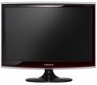

[ Home ](https://github.com/VFPX/Win32API)  

# How to adjust monitor brightness (Vista, monitor with DDC support)

## Short description:
The Monitor Configuration API was first made available in Windows Vista. These functions are applicable only if the monitor supports the Display Data Channel (DDC/CI) connection with the graphics adapter.  
***  


## Before you begin:
  

The Monitor Configuration API was first made available in Windows Vista. These functions are applicable only if the monitor supports the [Display Data Channel](http://en.wikipedia.org/wiki/Display_Data_Channel) (DDC/CI) connection with the graphics adapter.  

At least thirteen Monitor Configuration functions exist. Those include GETs and/or SETs for brightness, color temperature, contrast, display area position & size, factory defaults and more. Some models may have limited Monitor Configuration support.  

The following code sample includes calls to several Monitor Configuration functions, in particular those reading and changing the brightness of a monitor.  

See also:

* [How to change display settings: screen resolution, screen refresh rate](sample_374.md)  
* [How to detect if additional monitor is connected and active](sample_542.md)  
  
***  


## Code:
```foxpro  
#DEFINE MONITOR_DEFAULTTONEAREST 2
DO declare

LOCAL hMonitor, cMonitorName, hPhysMonitor,;
	nPhysMonitorCount, cPhysMonitorArray, nResult

* find out on which monitor
* the main VFP window resides
hMonitor = MonitorFromWindow(_vfp.hWnd,;
	MONITOR_DEFAULTTONEAREST)

* find out the number of physical monitors
* associated with the hMonitor handle
nPhysMonitorCount=0
= GetNumberOfPhysicalMonitorsFromHMONITOR(hMonitor,;
	@nPhysMonitorCount)

IF nPhysMonitorCount = 0
	? "No physical monitor detected."
	RETURN
ENDIF

* allocate space for the array
* of PHYSICAL_MONITOR structures
cPhysMonitorArray = REPLICATE(CHR(0), 4096)

* retrieves the physical monitors data
nResult = GetPhysicalMonitorsFromHMONITOR(hMonitor,;
	nPhysMonitorCount, @cPhysMonitorArray)

IF nResult = 0
	? "GetPhysicalMonitorsFromHMONITOR() failed:",;
		GetLastError()
	RETURN
ENDIF

* this pseudo-handle starts with 0 and increments
* for each following physical monitor
hPhysMonitor = buf2dword(SUBSTR(cPhysMonitorArray, 1,4))
? "Physical Monitor handle:", hPhysMonitor

cMonitorName = SUBSTR(cPhysMonitorArray, 5)
cMonitorName = SUBSTR(m.cMonitorName, 1,;
	AT(CHR(0)+CHR(0), cMonitorName))
? "Monitor name:", STRCONV(cMonitorName,6)

LOCAL capMonitor, capColorTemp
STORE 0 TO capMonitor, capColorTemp

* takes about a second to return
IF GetMonitorCapabilities(hPhysMonitor,;
	@capMonitor, @capColorTemp) <> 0
	? "Monitor Cap flags:", capMonitor
	? "Monitor Color Temp flags:", capColorTemp
ENDIF

LOCAL minBrightness, curBrightness, maxBrightness
STORE 0 TO minBrightness, curBrightness, maxBrightness

* retrieving the brightness value (%) for the monitor
IF GetMonitorBrightness(hPhysMonitor,;
	@minBrightness, @curBrightness, @maxBrightness) <> 0

	? "Brightness min, current, max:",;
		minBrightness, curBrightness, maxBrightness
		
	* setting the brightness
	* uncomment to try
	* = SetMonitorBrightness(hPhysMonitor, 100)
ELSE
	? "GetMonitorBrightness() failed:",;
		GetLastError()
ENDIF

* this is the must on exit: closes the array of open
* physical monitor handles
= DestroyPhysicalMonitors(nPhysMonitorCount,;
	@cPhysMonitorArray)

* end of main

PROCEDURE declare
	DECLARE INTEGER MonitorFromWindow IN user32;
		INTEGER hWindow, INTEGER dwFlags

	DECLARE INTEGER GetLastError IN kernel32

	DECLARE INTEGER GetMonitorCapabilities IN dxva2;
		INTEGER hMonitor, LONG @pdwMonitorCapabilities,;
		LONG @pdwSupportedColorTemperatures

	DECLARE INTEGER GetPhysicalMonitorsFromHMONITOR IN dxva2;
		INTEGER hMonitor, LONG dwPhysicalMonitorArraySize,;
		STRING @pPhysicalMonitorArray

	DECLARE INTEGER GetNumberOfPhysicalMonitorsFromHMONITOR IN dxva2;
		INTEGER hMonitor, LONG @pdwNumberOfPhysicalMonitors

	DECLARE INTEGER DestroyPhysicalMonitors IN dxva2;
		LONG dwPhysicalMonitorArraySize, STRING @pPhysicalMonitorArray

	DECLARE INTEGER GetMonitorBrightness IN dxva2;
		INTEGER hMonitor, LONG @pdwMinimumBrightness,;
		LONG @pdwCurrentBrightness, LONG @pdwMaximumBrightness

	DECLARE INTEGER SetMonitorBrightness IN dxva2;
		INTEGER hMonitor, LONG dwNewBrightness

FUNCTION buf2dword(cBuffer)
RETURN Asc(SUBSTR(cBuffer, 1,1)) + ;
	BitLShift(Asc(SUBSTR(cBuffer, 2,1)),  8) +;
	BitLShift(Asc(SUBSTR(cBuffer, 3,1)), 16) +;
	BitLShift(Asc(SUBSTR(cBuffer, 4,1)), 24)  
```  
***  


## Listed functions:
[DestroyPhysicalMonitors](../libraries/dxva2/DestroyPhysicalMonitors.md)  
[GetLastError](../libraries/kernel32/GetLastError.md)  
[GetMonitorBrightness](../libraries/dxva2/GetMonitorBrightness.md)  
[GetMonitorCapabilities](../libraries/dxva2/GetMonitorCapabilities.md)  
[GetNumberOfPhysicalMonitorsFromHMONITOR](../libraries/dxva2/GetNumberOfPhysicalMonitorsFromHMONITOR.md)  
[GetPhysicalMonitorsFromHMONITOR](../libraries/dxva2/GetPhysicalMonitorsFromHMONITOR.md)  
[MonitorFromWindow](../libraries/user32/MonitorFromWindow.md)  
[SetMonitorBrightness](../libraries/dxva2/SetMonitorBrightness.md)  

## Comment:
Code sample tested on Vista Business 64-bit SP1. The video card was *NVIDIA Quadro FX 570* with two monitors connected: *Samsung SyncMaster T240* and *VisionQuest VQL-24WSHD*.  
  
***  

