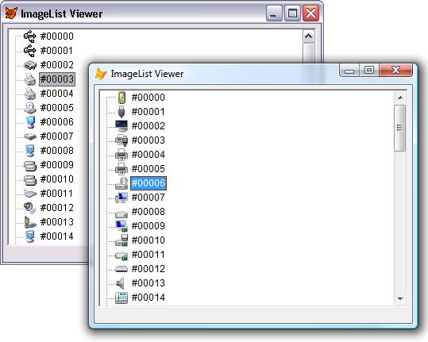

[ Home ](https://github.com/VFPX/Win32API)  

# How to view system icons for the classes installed on the local machine

## Short description:
The bitmap images for the classes installed on the machine are stored in some system area. These images are more of a general kind and illustrate functionality groups rather than individual classes. With a few API calls VFP application can access these images and display them in TreeView and ListView controls as icons.  
***  


## Before you begin:
The bitmap images for the classes installed on the machine are stored in some system area. These images are more of a general kind and illustrate functionality groups rather than individual classes.   

With a few API calls VFP application can access these images and display them in TreeView and ListView controls as icons.  

  
As the picture above shows, the list is definitely OS and machine configuration specific.  

See also:

* [System Image List Viewer](sample_021.md)  
* [Displaying the associated icons and descriptions for files and folders](sample_530.md)  
* [How to find an application associated with the file name](sample_138.md)  
* [How to obtain Content-Type value for a file type from the System Registry](sample_468.md)  
  
***  


## Code:
```foxpro  
LOCAL oForm As TImageListViewer
oForm = CREATEOBJECT("TImageListViewer")
oForm.Visible=.T.
READ EVENTS
* end of main

DEFINE CLASS TImageListViewer As Form
#DEFINE TV_FIRST 0x1100
#DEFINE TVM_GETIMAGELIST (TV_FIRST + 8)
#DEFINE TVM_SETIMAGELIST (TV_FIRST + 9)
#DEFINE TVM_GETNEXTITEM (TV_FIRST + 10)
#DEFINE TVM_SETITEM (TV_FIRST + 13)

#DEFINE TVSIL_NORMAL 0
#DEFINE TVIF_IMAGE 0x0002
#DEFINE TVIF_SELECTEDIMAGE 0x0020
#DEFINE TVIF_HANDLE 0x0010
#DEFINE TVGN_CARET 9

#DEFINE SP_CLASSIMAGELIST_DATA_SIZE 12

	Width=400
	Height=300
	AutoCenter=.T.
	Caption="ImageList Viewer"
	imagelistdata=""

	ADD OBJECT tree As Ttree WITH Left=5, Top=5

PROCEDURE Init
	THIS.declare
	THIS.SwitchToSystemList
	THIS.AddNodes
	THIS.Resize

PROCEDURE Destroy
* releases system resources
	= SetupDiDestroyClassImageList(THIS.imagelistdata)
	CLEAR EVENTS

PROCEDURE SwitchToSystemList
* assigns the imagelist to the TreeView

	LOCAL cClassImageListData, hSysImageList

	* allocate space for the SP_CLASSIMAGELIST_DATA structure;
	* the first byte contains the size of the structure
	cClassImageListData = PADR(CHR(SP_CLASSIMAGELIST_DATA_SIZE),;
		SP_CLASSIMAGELIST_DATA_SIZE, CHR(0))

	* the call populates the SP_CLASSIMAGELIST_DATA structure
	= SetupDiGetClassImageListEx(;
		@cClassImageListData, NULL, 0)  && local machine

	* save the value to be used for releasing
	* the image list when the form closes
	THIS.imagelistdata = cClassImageListData

	* the handle to the image list
	hSysImageList = buf2dword(SUBSTR(THIS.imagelistdata, 5, 4))

	* sets the normal image list for the TreeView control
	= SendMessage(THIS.tree.HWnd, TVM_SETIMAGELIST,;
		TVSIL_NORMAL, hSysImageList)

PROCEDURE AddNodes
* adds a node per each image found in the image list
* for classes installed on the local machine
	LOCAL hSysImageList, nImageCount, nImageIndex, oNode, cKey
	hSysImageList = buf2dword(SUBSTR(THIS.imagelistdata, 5, 4))
	nImageCount = ImageList_GetImageCount(hSysImageList)
	
	FOR nImageIndex=0 TO nImageCount-1
		cKey = " # " + STRTRAN(STR(nImageIndex,5)," ","0")
		oNode = THIS.tree.Nodes.Add(,, cKey, cKey)

		* selecting the node forces the following
		* TVM_GETNEXTITEM & TVGN_CARET message
		* picking its handle
		oNode.Selected=.T.
		THIS.SetIcon(nImageIndex)
	NEXT

PROCEDURE SetIcon(nImageIndex)
* sets the icon for the currently selected node
    LOCAL hItem, nFlags, cItemBuffer

    * get the handle for the currently select node
    hItem = SendMessage(THIS.tree.hWnd,;
    	TVM_GETNEXTITEM, TVGN_CARET, 0);

	* the flags value indicates that the node handle is valid
	* and that the bitmaps for the normal & selected images
	* are to be set
    nFlags = BITOR(TVIF_HANDLE, TVIF_IMAGE,;
    	TVIF_SELECTEDIMAGE)

	* assemble the TVITEM structure
    cItemBuffer = num2dword(nFlags) + num2dword(hItem) +;
    	num2dword(0) + num2dword(0) + num2dword(0) +;
    	num2dword(0) + num2dword(nImageIndex) +;
    	num2dword(nImageIndex) + num2dword(0) +;
    	num2dword(0)

	* the TVM_SETITEM message updates all or some
	* parameters of the selected node
    = SendMessageS(THIS.tree.hWnd, TVM_SETITEM,;
    	0, @cItemBuffer)

PROCEDURE Resize
	WITH THIS.tree
		.Width = THIS.Width - .Left*2
		.Height = MAX(60, THIS.Height - .Top - 20)
		TRY
			.SelectedItem.EnsureVisible()
			RAISEEVENT(THIS, "OnNodeClick", .SelectedItem)
		CATCH
		ENDTRY
	ENDWITH

PROCEDURE declare
	DECLARE INTEGER ImageList_GetImageCount IN comctl32;
		INTEGER himl

	DECLARE INTEGER SetupDiGetClassImageListEx IN setupapi;
		STRING @ClassImageListData, STRING MachineName,;
		INTEGER Reserved

	DECLARE INTEGER SetupDiDestroyClassImageList IN setupapi;
		STRING ClassImageListData

	DECLARE INTEGER SetupDiGetClassImageIndex IN setupapi;
		STRING ClassImageListData, STRING ClassGuid,;
		LONG @ImageIndex

	DECLARE INTEGER SendMessage IN user32;
		INTEGER hWindow, INTEGER Msg,;
		INTEGER wParam, INTEGER lParam

	DECLARE INTEGER SendMessage IN user32 AS SendMessageS;
		INTEGER hWindow, INTEGER Msg,;
		INTEGER wParam, STRING @lParam

ENDDEFINE

DEFINE CLASS Ttree As OleControl
	OleClass="MSComctlLib.TreeCtrl"

PROCEDURE Init
	WITH THIS
		.HideSelection=.F.
		.PathSeparator="\"
		.Style=7
		.LineStyle=1
		.LabelEdit=1
		.Indentation=48
	ENDWITH
ENDDEFINE

************************ static library *****************************
FUNCTION buf2dword(cBuffer)
RETURN Asc(SUBSTR(cBuffer, 1,1)) + ;
	BitLShift(Asc(SUBSTR(cBuffer, 2,1)),  8) +;
	BitLShift(Asc(SUBSTR(cBuffer, 3,1)), 16) +;
	BitLShift(Asc(SUBSTR(cBuffer, 4,1)), 24)

FUNCTION num2dword(lnValue)
#DEFINE m0 0x0000100
#DEFINE m1 0x0010000
#DEFINE m2 0x1000000
	IF lnValue < 0
		lnValue = 0x100000000 + lnValue
	ENDIF
	LOCAL b0, b1, b2, b3
	b3 = Int(lnValue/m2)
	b2 = Int((lnValue - b3*m2)/m1)
	b1 = Int((lnValue - b3*m2 - b2*m1)/m0)
	b0 = Mod(lnValue, m0)
RETURN Chr(b0)+Chr(b1)+Chr(b2)+Chr(b3)  
```  
***  


## Listed functions:
[ImageList_GetImageCount](../libraries/comctl32/ImageList_GetImageCount.md)  
[SendMessage](../libraries/user32/SendMessage.md)  
[SetupDiDestroyClassImageList](../libraries/setupapi/SetupDiDestroyClassImageList.md)  
[SetupDiGetClassImageIndex](../libraries/setupapi/SetupDiGetClassImageIndex.md)  
[SetupDiGetClassImageListEx](../libraries/setupapi/SetupDiGetClassImageListEx.md)  

## Comment:
For me the most interesting part in this code is not the getting access to the image list but the way the bitmaps from it are made icons in the TreeView control.  
  
***  

