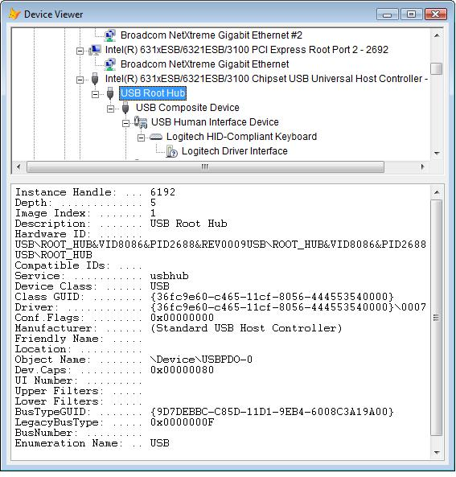

[ Home ](https://github.com/VFPX/Win32API)  

# Enumerating devices installed on the local machine

## Note that this document contains some links to the old news2news website which does not work at the moment. This material will be available sometime in the future.

## Short description:
The PnP manager maintains a device tree that keeps track of the devices in the system.

The device tree contains information about the devices present on the system. The PnP manager builds this tree when the machine boots, using information from drivers and other components, and updates the tree as devices are added or removed.  
***  


## Before you begin:
The PnP manager maintains a device tree that keeps track of the devices in the system.  

  
See also:

* [Disconnecting USB Mass Storage Device programmatically](sample_553.md)  
* [Simple Window Viewer ](sample_057.md)  
  
***  


## Code:
```foxpro  
LOCAL oForm As TDeviceViewer
oForm = CREATEOBJECT("TDeviceViewer")
IF VARTYPE(oForm)="O"
	oForm.Visible=.T.
	READ EVENTS
ENDIF
* end of main

DEFINE CLASS TDeviceViewer As Form
#DEFINE CRLF CHR(13)+CHR(10)
#DEFINE CR_SUCCESS 0
#DEFINE MAX_PATH 260
#DEFINE MAX_DEVICE_ID_LEN 200
#DEFINE TV_FIRST 0x1100
#DEFINE TVM_GETIMAGELIST (TV_FIRST + 8)
#DEFINE TVM_SETIMAGELIST (TV_FIRST + 9)
#DEFINE TVM_SETITEM (TV_FIRST + 13)
#DEFINE TVM_GETNEXTITEM (TV_FIRST + 10)
#DEFINE TVSIL_NORMAL 0
#DEFINE TVSIL_STATE 2
#DEFINE TVIF_IMAGE 0x0002
#DEFINE TVIF_SELECTEDIMAGE 0x0020
#DEFINE TVIF_HANDLE 0x0010
#DEFINE TVGN_ROOT 0
#DEFINE TVGN_CARET 9
#DEFINE SP_CLASSIMAGELIST_DATA_SIZE 12

	Width=600
	Height=600
	AutoCenter=.T.
	Caption="Device Viewer"
	oRoot=NULL
	hMachine=0
	MachineName=""
	hRoot=0
	devices=NULL
	imagelistdata=""

	ADD OBJECT tree As Ttree WITH Left=5, Top=5
	ADD OBJECT g As EditBox WITH Left=5,;
		FontName="Courier", FontSize=9

PROCEDURE Init(cMachine As String)
	THIS.declare
	THIS.devices = CREATEOBJECT("Collection")

	IF EMPTY(cMachine)
		cMachine = SUBSTR(SYS(0), 1, AT(" ",SYS(0))-1)
	ENDIF
	IF SUBSTR(THIS.MachineName,1,2) <> "\\"
		THIS.MachineName = "\\"+m.cMachine
	ENDIF
	
	LOCAL hMachine, nResult
	hMachine=0
	
	nResult = CM_Connect_Machine(THIS.MachineName, @hMachine)
	IF m.nResult <> CR_SUCCESS
		= MESSAGEBOX("CM_Connect_Machine failed: "+;
			TRANSFORM(nResult))
		RETURN .F.
	ENDIF
	THIS.hMachine = m.hMachine

	THIS.SwitchToSystemList

	LOCAL hRoot
	hRoot=0
	= CM_Locate_DevNode_Ex(@hRoot, 0, 0, THIS.hMachine)
	THIS.hRoot=m.hRoot

	LOCAL oRootNode As Node
	oRootNode = THIS.tree.Nodes.Add(,,;
		THIS.KeyFromDevInst(THIS.hRoot), THIS.MachineName)

	WAIT WINDOW NOWAIT "Enumerating devices..."
	THIS.oRoot = CREATEOBJECT("TDevice",;
		THIS, THIS.hRoot, 0)
	WAIT CLEAR  && enumeration completed

	WITH oRootNode
		.Tag = THIS.hRoot
		.Selected=.T.
		THIS.SetIcon(THIS.oRoot.imageindex)
	ENDWITH

	THIS.Resize
	= BINDEVENT(THIS.tree, "NodeClick", THIS, "OnNodeClick")
	
PROCEDURE Destroy
	WITH THIS
		= SetupDiDestroyClassImageList(.imagelistdata)
		= CM_Disconnect_Machine(.hMachine)
		.hMachine=0
	ENDWITH
	CLEAR EVENTS

PROTECTED PROCEDURE SwitchToSystemList
* links the system image list to the TreeView
	LOCAL cClassImageListData, hSysImageList,;
		nWStyle, hSysImageList, nResult, cBuffer

	* allocate space for the SP_CLASSIMAGELIST_DATA structure;
	* the first byte contains the size of the structure
	cClassImageListData = PADR(CHR(SP_CLASSIMAGELIST_DATA_SIZE),;
		SP_CLASSIMAGELIST_DATA_SIZE, CHR(0))

	* this call populates the SP_CLASSIMAGELIST_DATA structure
	= SetupDiGetClassImageListEx(;
		@cClassImageListData, THIS.MachineName, 0)

	* save the value to be used for releasing
	* the image list when the form closes
	THIS.imagelistdata = cClassImageListData

	* the handle to the system image list
	hSysImageList = buf2dword(SUBSTR(THIS.imagelistdata, 5, 4))

	* link the normal image list to the TreeView control
	= SendMessage(THIS.tree.HWnd, TVM_SETIMAGELIST,;
		TVSIL_NORMAL, hSysImageList)

PROCEDURE SetIcon(nImageIndex)
* sets the icon for the currently selected node
    LOCAL hItem, cItemBuffer, nFlags

    * get the handle for the currently select node
    hItem = SendMessage(THIS.tree.hWnd,;
    	TVM_GETNEXTITEM, TVGN_CARET, 0);

	* the flags value indicates that the node handle is valid
	* and that the bitmaps for the normal & selected images
	* are to be set
    nFlags = BITOR(TVIF_HANDLE, TVIF_IMAGE,;
    	TVIF_SELECTEDIMAGE)

	* assemble the TVITEM structure
    cItemBuffer = num2dword(nFlags) + num2dword(hItem) +;
    	num2dword(0) + num2dword(0) + num2dword(0) +;
    	num2dword(0) + num2dword(nImageIndex) +;
    	num2dword(nImageIndex) + num2dword(0) +;
    	num2dword(0)

	* the TVM_SETITEM message updates all or some
	* parameters of the selected node
    = SendMessageS(THIS.tree.hWnd, TVM_SETITEM,;
    	0, @cItemBuffer)

PROTECTED PROCEDURE OnNodeClick
PARAMETERS oNode
	THIS.g.Value=""
	LOCAL oDevice
	oDevice = THIS.GetDevice(oNode.Tag)
	IF VARTYPE(m.oDevice) = "O"
		THIS.g.Value = oDevice.PropertiesToString()
	ENDIF

PROTECTED PROCEDURE GetDevice(nDevInst) As TDevice
	LOCAL cKey, oDevice As TDevice
	cKey = "#" + TRANSFORM(m.nDevInst)
	TRY
		oDevice = THIS.devices.Item(m.cKey)
	CATCH
		oDevice=NULL
	ENDTRY
RETURN m.oDevice

PROCEDURE OnDeviceEnumerated(oDevice As TDevice)
	THIS.devices.Add(oDevice,;
		"#"+TRANSFORM(oDevice.devinst))

	LOCAL oParentNode As Node, oNode As Node
	oParentNode = THIS.NodeFromDevInst(oDevice.devparent)
	
	IF NOT ISNULL(oParentNode)
		WITH oDevice
			oNode = THIS.tree.Nodes.Add(oParentNode, 4,;
				THIS.KeyFromDevInst(.devinst),;
				THIS.GetNodeText(m.oDevice))

			oNode.Tag = .devinst
			oNode.Selected=.T.
			THIS.SetIcon(.imageindex)
		ENDWITH
	ENDIF

PROTECTED FUNCTION GetNodeText(oDevice As TDevice)
	WITH oDevice
		DO CASE
		CASE NOT EMPTY(.friendlyname)
			RETURN .friendlyname
		CASE NOT EMPTY(.description)
			RETURN .description
		OTHERWISE
			RETURN .enumname
		ENDCASE
	ENDWITH

PROTECTED FUNCTION KeyFromDevInst(nDevInst) As String
RETURN "#" + PADL(TRANSFORM(m.nDevInst),12,"0")

FUNCTION NodeFromDevInst(nDevInst) As Node
	LOCAL oNode As Node, cKey
	cKey=THIS.KeyFromDevInst(m.nDevInst)
	TRY
		oNode=THIS.tree.Nodes(m.cKey)
	CATCH
		oNode=NULL
	ENDTRY
RETURN m.oNode

PROCEDURE Resize
	WITH THIS.tree
		.Width = THIS.Width - .Left*2
		.Height = MAX(60, THIS.Height - .Top - 360)
		TRY
			.SelectedItem.EnsureVisible()
			RAISEEVENT(THIS, "OnNodeClick", .SelectedItem)
		CATCH
		ENDTRY
	ENDWITH
	WITH THIS.g
		.Width = THIS.Tree.Width
		.Top = THIS.Height-350
		.Height = 345
	ENDWITH

PROCEDURE declare
	DECLARE INTEGER CLSIDFromString IN ole32;
		STRING lpsz, STRING @pclsid

	DECLARE INTEGER StringFromGUID2 IN ole32;
		STRING rguid, STRING @lpsz, INTEGER cchMax

	DECLARE INTEGER CM_Connect_Machine IN cfgmgr32;
		STRING UNCServerName, INTEGER @phMachine

	DECLARE INTEGER CM_Disconnect_Machine IN cfgmgr32;
		INTEGER hMachine

	DECLARE INTEGER CM_Locate_DevNode_Ex IN cfgmgr32;
		INTEGER @pdnDevInst, INTEGER pDeviceID,;
		LONG ulFlags, INTEGER hMachine

	DECLARE INTEGER CM_Get_Sibling_Ex IN cfgmgr32;
		INTEGER @pdnDevInst, INTEGER DevInst,;
		LONG ulFlags, INTEGER hMachine

	DECLARE INTEGER CM_Get_Child_Ex IN cfgmgr32;
		INTEGER @pdnDevInst, INTEGER DevInst,;
		LONG ulFlags, INTEGER hMachine

	DECLARE INTEGER CM_Get_DevNode_Registry_Property_Ex IN cfgmgr32;
		INTEGER pdnDevInst, LONG ulProperty,;
		INTEGER pulRegDataType, STRING @outBuffer,;
		LONG @BufferLen, LONG ulFlags, INTEGER hMachine

	DECLARE INTEGER CM_Get_Depth_Ex IN cfgmgr32;
		LONG @pulDepth, INTEGER dnDevInst,;
		LONG ulFlags, INTEGER hMachine

	DECLARE INTEGER SetupDiGetClassImageListEx IN setupapi;
		STRING @ClassImageListData, STRING MachineName,;
		INTEGER Reserved

	DECLARE INTEGER SetupDiDestroyClassImageList IN setupapi;
		STRING ClassImageListData

	DECLARE INTEGER SetupDiGetClassImageIndex IN setupapi;
		STRING ClassImageListData, STRING ClassGuid,;
		LONG @ImageIndex

	DECLARE INTEGER SendMessage IN user32;
		INTEGER hWindow, INTEGER Msg,;
		INTEGER wParam, INTEGER lParam

	DECLARE INTEGER SendMessage IN user32 AS SendMessageS;
		INTEGER hWindow, INTEGER Msg,;
		INTEGER wParam, STRING @lParam

ENDDEFINE

DEFINE CLASS TDevice As Relation
	DevViewer=NULL
	devinst=0
	devparent=0
	depth=0
	description=""
	hardwareid=""
	compatiblesids=""
	unused0=""
	service=""
	unused1=""
	unused2=""
	devclass=""
	classguid=""
	driver=""
	configflags=""
	mfg=""
	friendlyname=""
	locationinfo=""
	devobjectname=""
	devcaps=""
	uinumber=""
	upperfilters=""
	lowerfilters=""
	bustypeguid=""
	legacybustype=""
	busnumber=""
	enumname=""
	imageindex=0

PROCEDURE Init(oDevViewer, hDevInst, hParent)
	LOCAL nDepth, nImageIndex

	WITH THIS
		.DevViewer=oDevViewer
		.devinst=m.hDevInst
		.devparent=m.hParent

		nDepth=0
		= CM_Get_Depth_Ex(@nDepth, .devinst,;
			0, .DevViewer.hMachine)

		.depth = m.nDepth  && the level in the device tree

		.description=.GetDeviceProperty(1)
		.hardwareid=.GetDeviceProperty(2)
		.compatiblesids=.GetDeviceProperty(3)
		.unused0=.GetDeviceProperty(4)
		.service=.GetDeviceProperty(5)
		.unused1=.GetDeviceProperty(6)
		.unused2=.GetDeviceProperty(7)
		.devclass=.GetDeviceProperty(8)
		.classguid=.GetDeviceProperty(9)
		.driver=.GetDeviceProperty(10)
		.configflags=.GetDeviceProperty(11)
		.mfg=.GetDeviceProperty(12)
		.friendlyname=.GetDeviceProperty(13)
		.locationinfo=.GetDeviceProperty(14)
		.devobjectname=.GetDeviceProperty(15)
		.devcaps=.GetDeviceProperty(16)
		.uinumber=.GetDeviceProperty(17)
		.upperfilters=.GetDeviceProperty(18)
		.lowerfilters=.GetDeviceProperty(19)
		.bustypeguid=.GetDeviceProperty(20)
		.legacybustype=.GetDeviceProperty(21)
		.busnumber=.GetDeviceProperty(22)
		.enumname=.GetDeviceProperty(23)
		
		* get the system image list index
		* for the class
		nImageIndex=0
		= SetupDiGetClassImageIndex(.DevViewer.imagelistdata,;
			StringToCLSID(.classguid), @nImageIndex)
		.imageindex = nImageIndex
		
		*** for debug purposes only
		*** otherwise turn the cursor population off
		IF NOT USED("devices")
			CREATE CURSOR devices (devinst I, devparent I, depth I,;
				p1 C(100), p2 C(100), p3 C(100), p4 C(100), p5 C(100),;
				p6 C(100), p7 C(100), p8 C(100), p9 C(100), p10 C(100),;
				p11 C(100), p12 C(100), p13 C(100), p14 C(100),;
				p15 C(100), p16 C(100), p17 C(100), p18 C(100),;
				p19 C(100), p20 C(100), p21 C(100), p22 C(100),;
				p23 C(100))
		ENDIF

		INSERT INTO devices VALUES (.devinst, .devparent, .depth,;
			.description, .hardwareid, .compatiblesids, .unused0,;
			.service, .unused1, .unused2, .devclass, .classguid,;
			.driver, .configflags, .mfg, .friendlyname,;
			.locationinfo, .devobjectname, .devcaps, .uinumber,;
			.upperfilters, .lowerfilters, .bustypeguid,;
			.legacybustype, .busnumber, .enumname)

		.DevViewer.OnDeviceEnumerated(THIS)
		.EnumChildren
	ENDWITH

PROCEDURE EnumChildren
	LOCAL hFirst, hCurrent, hNext
	hFirst=0
	IF CM_Get_Child_Ex(@hFirst, THIS.devinst,;
		0, THIS.DevViewer.hMachine) <> CR_SUCCESS
		RETURN
	ENDIF
	
	hCurrent = hFirst
	DO WHILE .T.
		LOCAL oChild As TDevice

		oChild = CREATEOBJECT("TDevice",;
			THIS.DevViewer, m.hCurrent, THIS.devinst)

		oChild=NULL

		hNext=0
		IF CM_Get_Sibling_Ex(@hNext, hCurrent, 0,;
			THIS.DevViewer.hMachine) <> CR_SUCCESS
			EXIT
		ENDIF
		hCurrent = hNext
	ENDDO

FUNCTION GetDeviceProperty(nIndex As Number) As String
	LOCAL nBuflen, cBuffer, nResult
	nBuflen=MAX_PATH + MAX_DEVICE_ID_LEN
	cBuffer=REPLICATE(CHR(0), nBuflen)
	
	nResult = CM_Get_DevNode_Registry_Property_Ex(;
		THIS.devinst, m.nIndex, 0, @cBuffer, @nBuflen,;
		0, THIS.DevViewer.hMachine)

	IF nResult = CR_SUCCESS
		cBuffer = SUBSTR(cBuffer, 1, nBuflen)
	ELSE
		cBuffer = ""
	ENDIF
RETURN ALLTRIM(STRTRAN(cBuffer, CHR(0),""))

FUNCTION PropertiesToString() As String
	LOCAL cReturn

	WITH THIS
		cReturn =;
		"Instance Handle: ... " +TRANSFORM(.devinst) + CRLF +;
		"Depth: ............. " +TRANSFORM(.depth) + CRLF +;
		"Image Index: ....... " +TRANSFORM(.imageindex) + CRLF +;
		"Description: ....... " +.description + CRLF +;
		"Hardware ID: ....... " +.hardwareid + CRLF +;
		"Compatible IDs: .... " +.compatiblesids + CRLF +;
		"Service: ........... " +.service + CRLF +;
		"Device Class: ...... " +.devclass + CRLF +;
		"Class GUID: ........ " +.classguid + CRLF +;
		"Driver: ............ " +.driver + CRLF +;
		"Conf.Flags: ........ " +;
			TRANSFORM(buf2dword(.configflags),"@0") + CRLF +;
		"Manufacturer: ...... " +.mfg + CRLF +;
		"Friendly Name: ..... " +.friendlyname + CRLF +;
		"Location: .......... " +.locationinfo + CRLF +;
		"Object Name: ....... " +.devobjectname + CRLF +;
		"Dev.Caps: .......... " +;
			TRANSFORM(buf2dword(.devcaps),"@0") + CRLF +;
		"UI Number: ......... " +.uinumber + CRLF +;
		"Upper Filters: ..... " +.upperfilters + CRLF +;
		"Lower Filters: ..... " +.lowerfilters + CRLF +;
		"BusTypeGUID: ....... " +GUIDToString(.bustypeguid) + CRLF +;
		"LegacyBusType: ..... " +;
			TRANSFORM(buf2dword(.legacybustype),"@0") + CRLF +;
		"BusNumber: ......... " +.busnumber + CRLF +;
		"Enumeration Name: .. " +.enumname + CRLF
	ENDWITH
RETURN m.cReturn

ENDDEFINE

DEFINE CLASS Ttree As OleControl
	OleClass="MSComctlLib.TreeCtrl"

PROCEDURE Init
	WITH THIS
		.HideSelection=.F.
		.PathSeparator="\"
		.Style=7
		.LineStyle=1
		.LabelEdit=1
		.Indentation=24
	ENDWITH
ENDDEFINE

************************ static library *****************************
FUNCTION StringToCLSID(cStr)
	LOCAL cBuffer
	cBuffer=REPLICATE(CHR(0),16)
	= CLSIDFromString(ToWideChar(cStr), @cBuffer)
RETURN m.cBuffer

FUNCTION ToWideChar(cStr)
RETURN STRCONV(m.cStr+CHR(0),5)

FUNCTION GUIDToString(cGUID)
	LOCAL cBuffer, nBufsize
	nBufsize=128
	cBuffer = REPLICATE(CHR(0), nBufsize*2)
	= StringFromGUID2(cGUID, @cBuffer, nBufsize)
	cBuffer = SUBSTR(cBuffer, 1, AT(CHR(0)+CHR(0), cBuffer))
RETURN STRCONV(cBuffer,6)

FUNCTION buf2dword(cBuffer)
RETURN Asc(SUBSTR(cBuffer, 1,1)) + ;
	BitLShift(Asc(SUBSTR(cBuffer, 2,1)),  8) +;
	BitLShift(Asc(SUBSTR(cBuffer, 3,1)), 16) +;
	BitLShift(Asc(SUBSTR(cBuffer, 4,1)), 24)

FUNCTION num2dword(lnValue)
#DEFINE m0 0x0000100
#DEFINE m1 0x0010000
#DEFINE m2 0x1000000
	IF lnValue < 0
		lnValue = 0x100000000 + lnValue
	ENDIF
	LOCAL b0, b1, b2, b3
	b3 = Int(lnValue/m2)
	b2 = Int((lnValue - b3*m2)/m1)
	b1 = Int((lnValue - b3*m2 - b2*m1)/m0)
	b0 = Mod(lnValue, m0)
RETURN Chr(b0)+Chr(b1)+Chr(b2)+Chr(b3)  
```  
***  


## Listed functions:
[CLSIDFromString](../libraries/ole32/CLSIDFromString.md)  
[CM_Connect_Machine](../libraries/cfgmgr32/CM_Connect_Machine.md)  
[CM_Disconnect_Machine](../libraries/cfgmgr32/CM_Disconnect_Machine.md)  
[CM_Get_Child_Ex](../libraries/cfgmgr32/CM_Get_Child_Ex.md)  
[CM_Get_Sibling_Ex](../libraries/cfgmgr32/CM_Get_Sibling_Ex.md)  
[CM_Locate_DevNode_Ex](../libraries/cfgmgr32/CM_Locate_DevNode_Ex.md)  
[SendMessage](../libraries/user32/SendMessage.md)  
[SetupDiDestroyClassImageList](../libraries/setupapi/SetupDiDestroyClassImageList.md)  
[SetupDiGetClassImageIndex](../libraries/setupapi/SetupDiGetClassImageIndex.md)  
[SetupDiGetClassImageListEx](../libraries/setupapi/SetupDiGetClassImageListEx.md)  
[StringFromGUID2](../libraries/ole32/StringFromGUID2.md)  

## Comment:
The device tree contains information about the devices present on the system. The PnP manager builds this tree when the machine boots, using information from drivers and other components, and updates the tree as devices are added or removed.  
  
<!-- Anatoliy --> 
The CM_Get_DevNode_Registry_Property_Ex function, while working perfectly fine, nevertheless is positioned as an outdated one by Microsoft recommending using the *<a href="http://www.news2news.com/vfp/?group=93">device installation functions</a>* (setupapi.dll) instead.   
  
* * *  
<a href="http://support.microsoft.com/kb/311272">The DevCon command-line utility</a> functions as an alternative to Device Manager. Using DevCon, you can enable, disable, restart, update, remove, and query individual devices or groups of devices.  
  
***  

