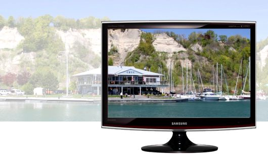
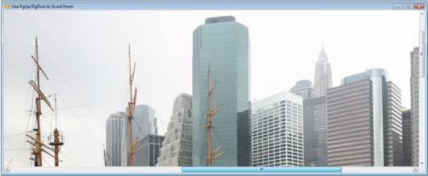

[ Home ](https://github.com/VFPX/Win32API)  

# GDI+: Scrolling through large image using the mouse

## Before you begin:
The code is based on [custom GDI+ class](sample_450.md). Download the class module first and save it in **gdiplus.prg** file.  

* * *  
The pictures taken with modern digital cameras are usually wider and taller than average display resolution.   

    
1920 by 1080 pixels, which requires fairly regular video card and monitor these days, is only 2 megapixel size. Uncropped 10.1 megapixel shot taken with Canon EOS is 3888 by 2592 pixels -- roughly two times taller and wider.  

To view so large picture in its original size you need a scrollable form. Normally it is programmed by setting the form`s ScrollBars to 3 and having the image control`s Stretch property set to 0 (default). The picture automatically stretches the image control. After that any part of it can be conveniently scrolled to with the form`s two scroll bars.  

  

An example demonstrating this approach (the picture above) is provided in the article [How To Programmatically Scroll a Visual FoxPro Form](https://jeffpar.github.io/kbarchive/kb/190/Q190818/) published on the Microsoft Help and Support web site. 
***  
Except with the scroll bars, I would also like scrolling the image by simply clicking on it and dragging (like in Picasa, for example). The example from Microsoft can certainly be modified to handle the MouseMove and MouseWheel events of the Image control.  

Finding less fun in improving someone else`s code I decided on programming similar functionality using the GDI+ library. The results came not bad indeed.  

See also:

* [Creating thumbnails to preview images in a directory](sample_547.md)  
* [Implementing image scrolling with inertia](sample_595.md)  
  
***  


## Code:
```foxpro  
cPath = GETENV("windir")+"\Web\Wallpaper"
nCount = ADIR(arr, m.cPath+"\*.jpg")
cFilename = cPath + "\"+arr[m.nCount,1]

LOCAL oForm As TImageViewer
oForm = CREATEOBJECT("TImageViewer", m.cFilename)
IF VARTYPE(oForm)="O"
	oForm.Show(1)
ENDIF
* end of main

DEFINE CLASS TImageViewer As Form
#DEFINE SRCCOPY 0x00CC0020
	Width=_screen.Width * 0.7
	Height=_screen.Height * 0.4
	MinButton=.F.
	MaxButton=.F.
	Autocenter=.T.
	gdiplus=0
	oImg=0
	hDC=0
	formgraphics=NULL
	OffsetX=0
	OffsetY=0
	SavedOffsetX=0
	SavedOffsetY=0
	ScrollStepX=10
	ScrollStepY=10

	ADD OBJECT sbar As Tbar

PROCEDURE Init(cImageFile As String)
	SET PROCEDURE TO gdiplus ADDITIVE

	WITH THIS
		.declare
		.gdiplus = CREATEOBJECT("gdiplusinit")
		.oImg = CREATEOBJECT("gdiimage", m.cImageFile)
		IF .oImg.imgwidth=0
			= MESSAGEBOX("The image file " + CHR(13) +;
				m.cImageFile + CHR(13) +;
				"is either invalid " +;
				"or missing.     ", 48, "Error!")
			RETURN .F.
		ENDIF
		.MaxWidth = MAX(.oImg.imgwidth,300)
		.MaxHeight = MAX(.oImg.imgheight, 140)
	ENDWITH
	
	* redraw the image upon changes in the main vfp window
	= BINDEVENT(_screen, "Activate", THIS, "Activate")
	= BINDEVENT(_screen, "Resize", THIS, "Resize")
	
	THIS.sbar.Panels(1).Text = m.cImageFile

PROCEDURE Destroy
	WITH THIS  && the order of release is important
		.formgraphics=NULL
		.oImg=NULL
		.gdiplus=NULL
		= ReleaseDC(.HWnd, .hDC)
	ENDWITH

PROCEDURE Activate
	THIS.AdjustClippingRegion
	THIS.DrawImage

PROCEDURE Resize
	THIS.AdjustClippingRegion
	THIS.DrawImage

PROCEDURE OffsetX_ASSIGN(nValue As Number)
* the X coordinate of the upper-left corner of the image
* the value is either zero (initial) or negative
	IF VARTYPE(THIS.oImg) <> "O";
		OR THIS.oImg.imgwidth <= THIS.Width;
		OR m.nValue > 0
		THIS.OffsetX=0
	ELSE
		THIS.OffsetX = MAX(m.nValue,;
			THIS.Width - THIS.oImg.imgwidth)
	ENDIF

PROCEDURE OffsetY_ASSIGN(nValue As Number)
* the Y coordinate of the upper-left corner of the image
* the value is either zero (initial) or negative
	IF VARTYPE(THIS.oImg) <> "O";
		OR THIS.oImg.imgheight <= THIS.Height;
		OR m.nValue > 0
		THIS.OffsetY=0
	ELSE
		THIS.OffsetY = MAX(m.nValue,;
			THIS.Height - THIS.oImg.imgheight)
	ENDIF

PROCEDURE AdjustClippingRegion
	WITH THIS
		.LockScreen=.F.

		IF .hDC <> 0
			.formgraphics=NULL
			= ReleaseDC(.HWnd, .hDC)
		ENDIF

		* create Graphics object from the device context
		* of the form; note that the GetDC is used (not GetWindowDC),
		* the output affects only the form`s client area
		.hDC = GetDC(.HWnd)
		.formgraphics = CREATEOBJECT("graphics", .hDC)

		* reset the upper-left corner to (0,0)
		STORE 0 TO .OffsetX, .OffsetY

		* the clipping is required only if the image
		* display area is smaller than the form`s client area
*!*			= GdipSetClipRectI(.formgraphics.graphics,;
*!*				0, 0, .Width, .Height, 0)

		* this prevents VFP from painting on the form
		.LockScreen=.T.
	ENDWITH

PROCEDURE DrawImage
	IF VARTYPE(THIS.oImg) <> "O"
		RETURN
	ENDIF

	THIS.Caption = "("+TRANSFORM(THIS.oImg.imgwidth) +;
		", " + TRANSFORM(THIS.oImg.imgheight) + ")" +;
		" offset (" + TRANSFORM(-THIS.OffsetX) +;
		", " + TRANSFORM(-THIS.OffsetY) + ")"

	* the offset is the point where the upper-left
	* corner of the image is positioned;
	* this is either zero (initial) or negative value
	THIS.formgraphics.DrawImage(THIS.oImg,;
		THIS.OffsetX, THIS.OffsetY)

PROCEDURE MouseDown
LPARAMETERS nButton, nShift, nXCoord, nYCoord
	IF nButton=1  && store the coordinates
		WITH THIS
			.SavedOffsetX=.OffsetX - m.nXCoord
			.SavedOffsetY=.OffsetY - m.nYCoord
		ENDWITH
	ENDIF

PROCEDURE MouseUp
LPARAMETERS nButton, nShift, nXCoord, nYCoord
	IF nButton=1  && store the coordinates
		WITH THIS
			.SavedOffsetX=.OffsetX - m.nXCoord
			.SavedOffsetY=.OffsetY - m.nYCoord
		ENDWITH
	ENDIF

PROCEDURE MouseMove
LPARAMETERS nButton, nShift, nXCoord, nYCoord
* the image is scrolled when the mouse is moved
* and the left button is pressed
	IF nButton = 1
		WITH THIS  && redraw the image at new offset
			IF m.nShift <> 2  && vertical only, when CTRL pressed
				.OffsetX = .SavedOffsetX + m.nXCoord
			ENDIF
			IF m.nShift <> 1  && horizontal only, when Shift pressed
				.OffsetY = .SavedOffsetY + m.nYCoord
			ENDIF
			.DrawImage
		ENDWITH
	ENDIF

PROCEDURE MouseWheel
LPARAMETERS nDirection, nShift, nXCoord, nYCoord
* The mouse wheel scrolls the image vertically or horizontally.
	IF nShift = 0  && vertical scroll
		THIS.OffsetY = THIS.OffsetY +;
			IIF(nDirection > 0, 1, -1) * THIS.ScrollStepX
	ELSE  && horizontal scroll if Shift|Ctrl|Alt pressed
		THIS.OffsetX = THIS.OffsetX +;
			IIF(nDirection > 0, 1, -1) * THIS.ScrollStepY
	ENDIF
	THIS.DrawImage

PROCEDURE KeyPress
LPARAMETERS nKeyCode, nShiftAltCtrl
	DO CASE
	CASE nKeyCode=19  && left
		THIS.OffsetX = THIS.OffsetX + THIS.ScrollStepX
	CASE nKeyCode=5  && up
		THIS.OffsetY = THIS.OffsetY + THIS.ScrollStepY
	CASE nKeyCode=4  && right
		THIS.OffsetX = THIS.OffsetX - THIS.ScrollStepX
	CASE nKeyCode=24  && down
		THIS.OffsetY = THIS.OffsetY - THIS.ScrollStepY
	ENDCASE
	THIS.DrawImage

PROCEDURE Moved
* the form can be dragged outside of the main window
* this event handler provides the image not to disappear
	THIS.DrawImage

PROCEDURE declare
	DECLARE INTEGER GetWindowDC IN user32 INTEGER hwnd
	DECLARE INTEGER GetDC IN user32 INTEGER hwnd
	DECLARE INTEGER ReleaseDC IN user32 INTEGER hwnd, INTEGER dc

	DECLARE INTEGER GdipSetClipRectI IN gdiplus;
		INTEGER graphics, INTEGER x, INTEGER y,;
		INTEGER nWidth, INTEGER nHeight,;
		INTEGER combineMode

ENDDEFINE

DEFINE CLASS Tbar As OleControl
	OleClass="MSComctlLib.SBarCtrl.2"
PROCEDURE Init
	THIS.Height=21
	THIS.Panels(1).Width = 2000
ENDDEFINE  
```  
***  


## Listed functions:
[GdipSetClipRectI](../libraries/gdiplus/GdipSetClipRectI.md)  
[GetDC](../libraries/user32/GetDC.md)  
[GetWindowDC](../libraries/user32/GetWindowDC.md)  
[ReleaseDC](../libraries/user32/ReleaseDC.md)  
