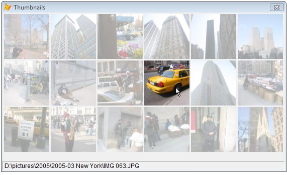
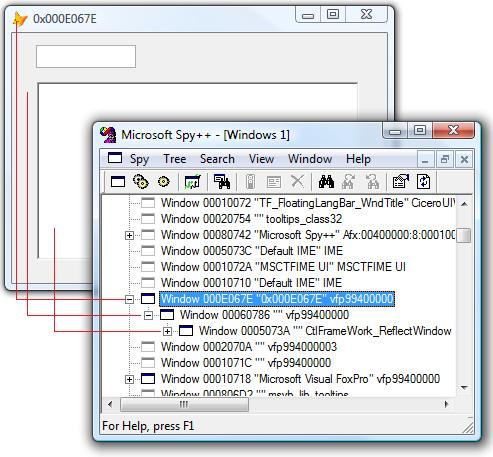

[ Home ](https://github.com/VFPX/Win32API)  

# GDI+: Creating thumbnails to preview images in a directory

## Short description:
This code sample displays thumbnails for JPEG images found in a specified directory. The thumbnails on the form are dynamically highlighted following the movements of the cursor.  
***  


## Before you begin:
The code is based on [custom GDI+ class](sample_450.md). Download the class module first and save it in **gdiplus.prg** file.   

  
This code sample displays thumbnails for JPEG images found in a specified directory. The thumbnails on the form are dynamically highlighted following the movements of the cursor.  

See also:

* [Scrolling through large image using the mouse](sample_546.md)  
* [Implementing image scrolling with inertia](sample_595.md)  
  
***  


## Code:
```foxpro  
CLEAR
LOCAL oForm
oForm = CREATEOBJECT("TForm")
oForm.Visible=.T.
READ EVENTS
* end of main

DEFINE CLASS TForm As Form
	Width=562
	Height=316
	Autocenter=.T.
	Caption="Thumbnails"
	MinButton=.F.
	MaxButton=.F.
	BorderStyle=3
	
	ADD OBJECT sbar As Tbar

	ADD OBJECT dcf As ThumbContainer WITH;
	Left=2, Top=2, Width=560, Height=280

PROCEDURE Init

PROCEDURE Activate
	IF THIS.dcf.thumbcontrols.Count = 0
		THIS.dcf.DisplayThumbnails("C:\WINDOWS\Web\Wallpaper")
	ENDIF

PROCEDURE Destroy
	CLEAR EVENTS

PROCEDURE dcf.OnThumbClicked(oCtrl As ThumbControl)
	WAIT WINDOW NOWAIT oCtrl.Name + CHR(13) +;
		oCtrl.SourceFile

PROCEDURE dcf.OnThumbHovered(oCtrl As ThumbControl)
	IF VARTYPE(oCtrl) = "O"
		ThisForm.sbar.Panels(1).Text = oCtrl.SourceFile
	ELSE
		ThisForm.sbar.Panels(1).Text = ""
	ENDIF

ENDDEFINE

DEFINE CLASS ThumbContainer As Container
#DEFINE CTRL_NAME "Thumbnail"
#DEFINE MAX_DIM 156
	BorderWidth=0
	hWindow=0
	hDC=0
	gdip=NULL
	formgraphics=NULL
	thumbcontrols=NULL
	CtrlNameSelected=""
	thumbsize=90  && thumbnail size in pixels

PROCEDURE Init
	DECLARE INTEGER GetWindowDC IN user32 INTEGER hwnd
	DECLARE INTEGER GetDC IN user32 INTEGER hwnd
	DECLARE INTEGER ReleaseDC IN user32;
		INTEGER hwnd, INTEGER dc
	SET PROCEDURE TO gdiplus ADDITIVE

	WITH THIS
		.gdip = CREATEOBJECT("gdiplusinit")
		.thumbcontrols = CREATEOBJECT("Collection")

		.hWindow = ThisForm.HWnd
		.hDC = GetDC(THIS.hWindow)
		.formgraphics = CREATEOBJECT("graphics", .hDC)
	ENDWITH
	= BINDEVENT(ThisForm, "MouseMove", THIS, "OnFormMouseMove")

PROCEDURE Destroy
	THIS.formgraphics=NULL
	THIS.gdip=NULL
	= ReleaseDC(THIS.hWindow, THIS.hDC)

PROCEDURE OnThumbClicked(oCtrl As ThumbControl)
PROCEDURE OnThumbHovered(oCtrl As ThumbControl)

PROCEDURE DisplayThumbnails(cPath As String)
	THIS.RemoveThumbControls

	LOCAL nCount, nIndex, nIndexX, cFilename,;
		nLeftPos, nTopPos, cCtrlName, nStepX, nStepY

	nCount = ADIR(arrThumbs, cPath+"\*.jpg")
	IF nCount = 0
		= MESSAGEBOX("No image files found " +;
			"in the specified folder     " + CHR(13) +;
			m.cPath + "     ", 48, "Empty list", 5000)
		RETURN
	ENDIF

	nStepX = THIS.thumbsize+3
	nStepY = THIS.thumbsize+3
	nTopPos = 3
	nIndexX=0

	FOR nIndex=1 TO nCount
		nIndexX = nIndexX + 1
		nLeftPos = 3 + nStepX * (nIndexX-1)

		IF nLeftPos + THIS.thumbsize > THIS.Width
			nTopPos = nTopPos + nStepY
			nIndexX=1
			nLeftPos = 3 + nStepX * (nIndexX-1)
		ENDIF
		IF nTopPos + THIS.thumbsize > THIS.Height
			EXIT
		ENDIF

		cFilename = m.cPath + "\" + arrThumbs[nIndex,1]
		THIS.CreateImageControl(cFilename, nLeftPos, nTopPos)
	NEXT
	RELEASE arrThumbs

PROCEDURE RemoveThumbControls
	LOCAL cCtrlName
	DO WHILE THIS.thumbcontrols.Count > 0
		cCtrlName = THIS.thumbcontrols.Item(1)
		THIS.RemoveObject(m.cCtrlName)
		THIS.thumbcontrols.Remove(1)
	ENDDO

FUNCTION CreateImageControl(cImageFile, nLeft, nTop)

	LOCAL oImage As gdiimage, oImageScaled As gdibitmap,;
		oImageDim As gdibitmap, gdibrush, nScaleX, nScaleY,;
		nWidth, nHeight

	* create GDI+ Image object from the original image
	oImage = CREATEOBJECT("gdiimage", m.cImageFile)

	nScaleX = oImage.imgwidth/THIS.thumbsize
	nScaleY = oImage.imgheight/THIS.thumbsize
	nWidth = oImage.imgwidth/MIN(nScaleX, nScaleY)
	nHeight = oImage.imgheight/MIN(nScaleX, nScaleY)

	* create canvas A
	oImageScaled = CREATEOBJECT("gdibitmap",;
		THIS.thumbsize, THIS.thumbsize)

	* fill canvas A with white color
	gdibrush=0
	= GdipCreateSolidFill(ARGB(255,255,255, 255), @gdibrush)

	= GdipFillRectangle(oImageScaled.graphics.graphics,;
		gdibrush, 0,0, oImageScaled.imgwidth,;
		oImageScaled.imgheight)

	= GdipDeleteBrush(gdibrush)

	* draw the scaled image on canvas A
	oImageScaled.graphics.DrawImage(oImage, 0,0,nWidth,nHeight)
	oImage=NULL

	* create canvas B
	oImageDim = CREATEOBJECT("gdibitmap",;
		THIS.thumbsize, THIS.thumbsize)

	* draw the scaled image on canvas B
	oImageDim.graphics.DrawImage(oImageScaled,;
		0,0, THIS.thumbsize, THIS.thumbsize)

	* dim the image by drawing on top of it
	* semi-transparent rectangle
	gdibrush=0
	= GdipCreateSolidFill(ARGB(255,255,255, MAX_DIM), @gdibrush)

	= GdipFillRectangle(oImageDim.graphics.graphics,;
		gdibrush, 0,0, nWidth, nHeight)

	= GdipDeleteBrush(gdibrush)
	
	* save the last image (canvas B) to a temporary file
	LOCAL cFilename, cCtrlName, oCtrl
	cFilename = SYS(2023) + "\img"+SYS(2015)+".jpg"
	oImageDim.SaveToFile(m.cFilename)
	oImageDim=NULL
	
	* create new Image control
	cCtrlName = CTRL_NAME +;
		TRANSFORM(THIS.thumbcontrols.Count+1)
	THIS.AddObject(m.cCtrlName, "ThumbControl")

	oCtrl = EVALUATE("THIS." + m.cCtrlName)
	WITH oCtrl
		.SourceFile = m.cImageFile
		.ParentContainer=THIS
		.oImg = oImageScaled  && canvas A
		.Left = m.nLeft
		.Top = m.nTop
		.Picture = m.cFilename && canvas B
		.Visible = .T.
	ENDWITH
	THIS.thumbcontrols.Add(cCtrlName, cCtrlName)

PROCEDURE CtrlNameSelected_ASSIGN(cCtrlName)
	IF EMPTY(cCtrlName)
		IF EMPTY(THIS.CtrlNameSelected)
			RETURN
		ENDIF
		THIS.CtrlNameSelected=""
		THIS.OnThumbHovered()
	ELSE
		IF UPPER(ALLTRIM(THIS.CtrlNameSelected)) <>;
		UPPER(ALLTRIM(m.cCtrlName))
			THIS.CtrlNameSelected=m.cCtrlName
			oCtrl = EVALUATE("THIS." + THIS.CtrlNameSelected)
			THIS.OnThumbHovered(oCtrl)
		ENDIF
	ENDIF

PROCEDURE OnFormMouseMove
LPARAMETERS nButton, nShift, nXCoord, nYCoord
* dim all images
	LOCAL cName, oCtrl
	FOR EACH cName IN THIS.thumbcontrols
		oCtrl = EVALUATE("THIS." + m.cName)
		oCtrl.dimmed = MAX_DIM
	NEXT
	THIS.CtrlNameSelected=""

PROCEDURE OnMouseMove(cCtrlName, nXCoord, nYCoord)
* highlight the image below the mouse cursor
* and dim all other images
	LOCAL cName, oCtrl, nX, nY, nDist
	FOR EACH cName IN THIS.thumbcontrols
		oCtrl = EVALUATE("THIS." + m.cName)

		IF UPPER(ALLTRIM(cName)) == UPPER(ALLTRIM(cCtrlName))
			nX = ABS(nXCoord - (oCtrl.Left+oCtrl.Width/2))
			nY = ABS(nYCoord - (oCtrl.Top+oCtrl.Height/2))
			THIS.CtrlNameSelected = m.cCtrlName

			nDist = SQRT(nX^2 + nY^2)/oCtrl.Width
			nDimmed = nDist * MAX_DIM
			IF nDimmed < 50
				nDimmed=0
			ENDIF
			
			oCtrl.dimmed = nDimmed
		ELSE
			oCtrl.dimmed = MAX_DIM
		ENDIF
	NEXT

ENDDEFINE

DEFINE CLASS ThumbControl As Image
	ParentContainer=NULL
	oImg=NULL
	oImgDim=NULL
	dimmed=MAX_DIM
	SourceFile=""

PROCEDURE Destroy
	THIS.OnDestroy

PROCEDURE oImg_ASSIGN(oImg)
	IF VARTYPE(m.oImg) <> "O"
		RETURN
	ENDIF
	THIS.oImg=m.oImg
	THIS.oImgDim=NULL

	THIS.oImgDim = CREATEOBJECT("gdibitmap",;
		THIS.oImg.imgwidth, THIS.oImg.imgheight)

PROCEDURE dimmed_ASSIGN(nNew)
* redraw the image if the dim value has changed
	IF THIS.dimmed <> m.nNew
		THIS.dimmed = m.nNew
		THIS.DrawImage
	ENDIF

PROCEDURE OnDestroy
* delete temporary image file
	THIS.oImgDim=NULL
	THIS.oImg=NULL

	LOCAL cFilename
	cFilename = THIS.Picture
	THIS.Picture=""

	IF FILE(m.cFilename)
		CLEAR RESOURCES (m.cFilename)
		TRY
			DELETE FILE (m.cFilename)
		CATCH
		ENDTRY
	ENDIF

PROCEDURE DrawImage
	IF VARTYPE(THIS.oImgDim) <> "O"
		RETURN
	ENDIF

	LOCAL gdibrush
	gdibrush=0
	= GdipCreateSolidFill(ARGB(255,255,255, THIS.dimmed), @gdibrush)

	WITH THIS
		.oImgDim.graphics.DrawImage(.oImg, 0,0,;
			.oImgDim.imgwidth, .oImgDim.imgheight)

		= GdipFillRectangle(.oImgDim.graphics.graphics, gdibrush,;
			0,0, .oImgDim.imgwidth, .oImgDim.imgheight)

		.ParentContainer.formgraphics.DrawImage(.oImgDim,;
			.Left+.ParentContainer.Left, .Top+.ParentContainer.Top)
	ENDWITH

PROCEDURE MouseMove
LPARAMETERS nButton, nShift, nXCoord, nYCoord
	THIS.ParentContainer.OnMouseMove(THIS.Name, nXCoord, nYCoord)

PROCEDURE Click
	THIS.ParentContainer.OnThumbClicked(THIS)

ENDDEFINE

DEFINE CLASS Tbar As OleControl
	OleClass="MSComctlLib.SBarCtrl.2"
PROCEDURE Init
	THIS.Height=21
	THIS.Panels(1).Width = 2000
ENDDEFINE  
```  
***  


## Listed functions:
[GetDC](../libraries/user32/GetDC.md)  
[GetWindowDC](../libraries/user32/GetWindowDC.md)  
[ReleaseDC](../libraries/user32/ReleaseDC.md)  

## Comment:
At run time the program creates multiple Image controls for each JPEG image found in the source directory. The Image controls display scaled and dimmed copies of the original images.  
  
The highlighting of images (more accurate would be calling it the *lowlighting*) is performed by drawing the original scaled image upon the Image control and finally drawing a semi-transparent rectangle on top.  
  
* * *  
For using with top-level forms (ShowWindow=2) the code must be slightly modified.   
  
A regular in-screen form is just a single window. But a top-level form always consists of two windows. The external window (ThisForm.hWnd) hosts a single child window. That child window is the working surface for a top-level form.  

  
That is why when creating a Graphics object from hWnd, the handle of the child window must be passed instead of the ThisForm.hWnd :  
```foxpro
THIS.hWindow = GetWindow(ThisForm.hWnd, GW_CHILD)
```

***  

