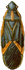

[ Home ](https://github.com/VFPX/Win32API)  

# GDI+ fun: roach-infested desktop

## Before you begin:
Bugs are frantically running for shelter in all directions all over the main VFP window. This hardly can scare a seasoned VFP developer. But unsuspecting user ought to beware.  

  
Download four files with images of bugs before testing this code sample.  
  

The code is based on [custom GDI+ class](sample_450.md). Download the class module first and save it in **gdiplus.prg** file.   
  
***  


## Code:
```foxpro  
CLEAR
CLEAR ALL

_screen.AddObject("World", "InsectWorld")
* end of main

DEFINE CLASS InsectWorld As Timer
	gdip=NULL
	insect1=NULL
	insect2=NULL
	insect3=NULL
	insect4=NULL
	insect5=NULL
	insect6=NULL
	insect7=NULL
	insect8=NULL
	insect9=NULL
	insect10=NULL
	activeinsect=1
	insectcount=5
	
PROCEDURE Init
	SET PROCEDURE TO gdiplus ADDITIVE
	THIS.gdip = CREATEOBJECT("gdiplusinit")
	THIS.declare

	WITH THIS
		LOCAL nIndex, cIndex, cImageFile
		FOR nIndex=1 TO THIS.insectcount
			DO CASE
			CASE MOD(nIndex,4)=0
				cImageFile="bug04.bmp"
			CASE MOD(nIndex,3)=0
				cImageFile="bug03.bmp"
			CASE MOD(nIndex,2)=0
				cImageFile="bug02.bmp"
			OTHERWISE
				cImageFile="bug01.bmp"
			ENDCASE
			cIndex = TRANSFORM(nIndex)
			.insect&cIndex = CREATEOBJECT("Insect",;
				THIS, "Insect"+cIndex, cImageFile)

			WITH .insect&cIndex
				.Angle=90
				.Left=20
				.Top = 5 + (nIndex-1) * (.Height+5)
			ENDWITH
		NEXT
		.Interval=10
	ENDWITH
	= BINDEVENT(_screen, "MouseUp", THIS, "OnMouseUp")
	
PROCEDURE Destroy
	THIS.Interval=0
	THIS.gdip=NULL

PROCEDURE Timer
* at each tick of the timer one insect moves
	LOCAL cIndex
	WITH THIS
		cIndex = TRANSFORM(.activeinsect)
		.insect&cIndex..DrawObject
		.activeinsect = .activeinsect+1
		IF .activeinsect > .insectcount
			.activeinsect=1
		ENDIF
	ENDWITH

PROCEDURE OnMouseUp
LPARAMETERS nButton, nShift, nXCoord, nYCoord
* forces all insects run to the specified point
	LOCAL nIndex, cIndex, cImageFile
	FOR nIndex=1 TO THIS.insectcount
		cIndex = TRANSFORM(nIndex)
		THIS.insect&cIndex..SetTarget(nXCoord, nYCoord)
	NEXT

PROCEDURE declare
	DECLARE INTEGER GetDC IN user32 INTEGER hWindow
	DECLARE LONG GetTickCount IN kernel32

	DECLARE INTEGER ReleaseDC IN user32;
		INTEGER hWindow, INTEGER dc

	DECLARE INTEGER GdipDrawLineI IN gdiplus;
		INTEGER graphics, INTEGER gdipen,;
		INTEGER x1, INTEGER y1, INTEGER x2, INTEGER y2
ENDDEFINE

DEFINE CLASS Insect As Form
	Width=100
	Height=100
	BorderStyle=0
	BackColor=RGB(255,255,255)
	AlwaysOnBottom=.T.
	Titlebar=0
	
	TheWorld=NULL
	hWindow=0
	hDC=0
	canvas=NULL
	backbrush=NULL
	backcanvas=NULL
	maincanvas=NULL
	tmpcanvas=NULL
	legs=NULL
	angle=0
	distance=0
	distanceonangle=0
	maxdistance=0
	sleepingticks=0
	speedrate=1
	TargetX=0
	TargetY=0
	
PROCEDURE Init(oWorld, cFormName, cImageFile)
	WITH THIS
		.TheWorld=m.oWorld
		STORE cFormName TO .Name, .Caption
		.hWindow = .hWnd
		.hDC = GetDC(.hWindow)
		.canvas = CREATEOBJECT("graphics", .hDC)
		.maxdistance = 300+RAND() * 500
		.speedrate = 0.75 + RAND()*3
		.legs = CREATEOBJECT("sixlegs", .speedrate)
		.Visible=.T.
		.DrawBody(cImageFile)
	ENDWITH
	
PROCEDURE Destroy
	THIS.backbrush=NULL
	THIS.tmpcanvas=NULL
	THIS.backcanvas=NULL
	THIS.maincanvas=NULL
	THIS.canvas=NULL
	= ReleaseDC(THIS.hWindow, THIS.hDC)

PROCEDURE sleepingticks_ASSIGN(vValue)
	IF THIS.IsOnTarget()  && no sleep while on target
		THIS.sleepingticks=0
	ELSE
		THIS.sleepingticks=vValue
	ENDIF

PROCEDURE distance_ASSIGN(vValue)
* distance passed since the last sleep
	IF vValue > THIS.maxdistance
		THIS.sleepingticks=50 * RAND()
		THIS.distance=0
		THIS.maxdistance=300 + RAND() * 500
	ELSE
		THIS.distance = vValue
	ENDIF

PROCEDURE angle_ASSIGN(vValue)
* direction angle, degrees
	DO CASE
	CASE vValue > 180
		vValue = vValue - 360
	CASE vValue < -180
		vValue = 360 + vValue
	ENDCASE
	IF THIS.angle <> vValue
		THIS.angle=vValue
		THIS.distanceonangle=0
	ENDIF

PROCEDURE distanceonangle_ASSIGN(vValue)
* distance passed since the last angle change
	IF vValue = 0
		THIS.distanceonangle = 0
	ELSE
		IF vValue > 50
		* shift direction a bit once in a while
			THIS.angle = THIS.angle + 5-RAND()*10
			THIS.distanceonangle = 0
		ELSE
			THIS.distanceonangle = vValue
		ENDIF
	ENDIF

PROCEDURE DrawBody(cImageFile)  && called once
	LOCAL oImage
	oImage = CREATEOBJECT("gdiimage", m.cImageFile)

	THIS.backbrush = CREATEOBJECT("gdisolidbrush",;
		ARGB(255,255,255,255)) && total white

	THIS.backcanvas = CREATEOBJECT("gdibitmap", 40, 70)
	THIS.tmpcanvas = CREATEOBJECT("gdibitmap",;
		THIS.backcanvas.imgwidth, THIS.backcanvas.imgheight)
	THIS.maincanvas = CREATEOBJECT("gdibitmap", 100, 100)

	WITH THIS.backcanvas
		= GdipFillRectangle(.graphics.graphics,;
			THIS.backbrush.brush,;
			0,0, .imgwidth,.imgheight)
		.graphics.DrawImage(oImage, 7, 0)
	ENDWITH

PROCEDURE SetTarget(nXCoord, nYCoord)
* forces the insect to home on the specified target
	THIS.TargetX=nXCoord
	THIS.TargetY=nYCoord
	THIS.sleepingticks=0  && no sleep while on target

FUNCTION IsOnTarget() As Boolean
RETURN (THIS.TargetX <> 0 OR THIS.TargetY <> 0)

PROCEDURE HomingToTarget
* select optimal direction angle which brings
* the insect closer to the target on the next step
	IF NOT THIS.IsOnTarget()
		RETURN
	ENDIF

	LOCAL BasePoint, TargetPoint, TmpPoint,;
		nDistance, nShortest, nShift, dAngle, dAngleOptimal

	BasePoint=CREATEOBJECT("TPoint",;
		THIS.Left+THIS.Width/2, THIS.Top+THIS.Height/2)

	TargetPoint=CREATEOBJECT("TPoint", THIS.TargetX, THIS.TargetY)

	nDistance=BasePoint.GetDistanceTo(TargetPoint)
	IF nDistance <= 100
	* the target is reached
		THIS.TargetX=0
		THIS.TargetY=0
		THIS.sleepingticks=25
		RETURN
	ENDIF

	nShift=MAX(nDistance*0.1, 10)
	nShortest=99999
	
	* a variety of angles is tested
	FOR dAngle=20 TO -20 STEP -2
		TmpPoint = BasePoint.GetPoint(THIS.Angle+dAngle, nShift)
		nDistance = TargetPoint.GetDistanceTo(TmpPoint)
		IF nShortest > nDistance
			nShortest=nDistance
			dAngleOptimal=dAngle
		ENDIF
	NEXT
	THIS.angle=THIS.angle + dAngleOptimal

PROCEDURE CollisionFound
	LOCAL nIndex
	FOR nIndex=1 TO _screen.FormCount
		IF THIS.IsCollided(_screen.Forms[nIndex])
			RETURN .T.
		ENDIF
	NEXT
RETURN .F.

PROCEDURE IsCollided(oForm)
	WITH THIS
		IF UPPER(ALLTRIM(oForm.Name))==UPPER(ALLTRIM(.Name));
			OR NOT "INSECT" $ UPPER(ALLTRIM(oForm.Name))
			RETURN .F.
		ENDIF
		IF .Top > oForm.Top+oForm.Height;
			OR .Left > oForm.Left+oForm.Width;
			OR oForm.Top > .Top+.Height;
			OR oForm.Left > .Left+.Width
			RETURN .F.
		ENDIF
	ENDWITH
RETURN .T.

PROCEDURE DrawObject
	WITH THIS
		IF .CollisionFound()
			.angle = .angle + RAND() * 15 *;
				IIF(MOD(.angle,2)=0, 1, -1) && sucks
		ELSE
			IF .sleepingticks > 0
				.sleepingticks = .sleepingticks - 1
				IF NOT .IsOnTarget()
					RETURN
				ENDIF
			ENDIF
		ENDIF
		.HomingToTarget
		.CalculateNextPosition
		.DrawObjectInternal
	ENDWITH

PROTECTED PROCEDURE DrawObjectInternal
	LOCAL oMatrix

	WITH THIS
		* draw the main image on the temp canvas
		.tmpcanvas.graphics.DrawImage(.backcanvas, 0, 0)

		* draw the legs on the temp canvas
		.legs.DrawObject(.tmpcanvas.graphics.graphics,;
			NOT .IsOnTarget() AND .sleepingticks>0)
		
		.maincanvas.graphics.ResetTransform

		* fill the background of the main canvas
		= GdipFillRectangle(.maincanvas.graphics.graphics,;
			.backbrush.brush, 0,0,;
			.maincanvas.imgwidth, .maincanvas.imgheight)

		* create rotating matrix
		oMatrix = CREATEOBJECT("gdimatrix")
		WITH oMatrix
			.Translate(50,50)
			.Rotate(THIS.angle)
		ENDWITH

		* apply rotation to the main canvas
		.maincanvas.graphics.SetTransform(oMatrix)

		* draw the content of the temp canvas on main canvas
		.maincanvas.graphics.DrawImage(.tmpcanvas, -20,-35,;
			.tmpcanvas.imgwidth, .tmpcanvas.imgheight)

		* draw the content of the main canvas on the form
		.canvas.DrawImage(.maincanvas, 0,0)
	ENDWITH

PROCEDURE CalculateNextPosition
	LOCAL nX, nY, stepX, stepY

	WITH THIS
		stepY=4 * .speedrate
		stepX=stepY * SYSMETRIC(1)/SYSMETRIC(2)

		nX = .Left + stepX * SIN(DTOR(.angle))
		nY = .Top - stepY * COS(DTOR(.angle))

		DO CASE
		CASE nX+.Width > _screen.Width
			.angle = -.angle + 15-RAND()*30
			.Left = _screen.Width - .Width
		CASE nX < 0
			.angle = -.angle + 15-RAND()*30
			.Left = 0
		OTHERWISE
			.Left = nX
		ENDCASE

		DO CASE
		CASE nY < -0
			.angle = IIF(.angle < 0,;
				-90+.angle, 90+.angle) + 15-RAND()*30
			.Top = 0
		CASE nY+.Height > _screen.Height
			.angle = IIF(.angle < 0,;
				90+.angle, .angle-90) + 15-RAND()*30
			.Top = _screen.Height - .Height
		OTHERWISE
			.Top = nY
		ENDCASE

		.distanceonangle=.distanceonangle +;
			ROUND(SQRT(StepX^2 + StepY^2),0)

		.distance=.distance +;
			ROUND(SQRT(StepX^2 + StepY^2),0)
	ENDWITH
ENDDEFINE

DEFINE CLASS sixlegs As Relation
	l1=NULL
	l2=NULL
	l3=NULL
	r1=NULL
	r2=NULL
	r3=NULL
	gdipen=NULL
	stage=0
	tickcount=0
	speedrate=0

PROCEDURE Init(nSpeedrate)
	THIS.gdipen = CREATEOBJECT("gdipen", ARGB(56,41,8,255), 2)
	THIS.l1=CREATEOBJECT("leg", 10, 25, -1)
	THIS.l2=CREATEOBJECT("leg", 10, 35, -1)
	THIS.l3=CREATEOBJECT("leg", 10, 45, -1)
	THIS.r1=CREATEOBJECT("leg", 30, 25, 1)
	THIS.r2=CREATEOBJECT("leg", 30, 35, 1)
	THIS.r3=CREATEOBJECT("leg", 30, 45, 1)
	THIS.speedrate = nSpeedrate

PROCEDURE DrawObject(graphics, lStatic)
* leg positions
#DEFINE L3_STAGES "01222334455667788888888888"
#DEFINE L2_STAGES "00012223344556677888888888"
#DEFINE L1_STAGES "00000122233445566778888888"
#DEFINE R3_STAGES "00000001222334455667788888"
#DEFINE R2_STAGES "00000000012223344556677888"
#DEFINE R1_STAGES "00000000000122233445566778"
#DEFINE STAGE_COUNT 26

	LOCAL nTickCount
	nTickCount = GetTickCount()

	IF THIS.tickcount=0
		THIS.stage=0
	ELSE
		IF NOT m.lStatic
			THIS.stage = THIS.stage + INT(((nTickCount -;
				THIS.tickcount)/20)*THIS.speedrate)
			DO WHILE THIS.stage > STAGE_COUNT
				THIS.stage = THIS.stage - STAGE_COUNT
			ENDDO
		ENDIF
	ENDIF

	WITH THIS
		.l3.stage = VAL(SUBSTR(L3_STAGES, .stage, 1))
		.l2.stage = VAL(SUBSTR(L2_STAGES, .stage, 1))
		.l1.stage = VAL(SUBSTR(L1_STAGES, .stage, 1))
		.r3.stage = VAL(SUBSTR(R3_STAGES, .stage, 1))
		.r2.stage = VAL(SUBSTR(R2_STAGES, .stage, 1))
		.r1.stage = VAL(SUBSTR(R1_STAGES, .stage, 1))
		.l3.DrawObject(graphics, .gdipen.hpen)
		.l2.DrawObject(graphics, .gdipen.hpen)
		.l1.DrawObject(graphics, .gdipen.hpen)
		.r3.DrawObject(graphics, .gdipen.hpen)
		.r2.DrawObject(graphics, .gdipen.hpen)
		.r1.DrawObject(graphics, .gdipen.hpen)
		.tickcount = m.nTickCount
	ENDWITH
ENDDEFINE

DEFINE CLASS leg As Relation
	x=0
	y=0
	stage=0
	side=0

PROCEDURE Init(nX, nY, nSide)
	THIS.x=nX
	THIS.y=nY
	THIS.side=nSide

PROCEDURE DrawObject(graphics, hpen)
	WITH THIS
		DO CASE
		CASE THIS.stage=2
			= GdipDrawLineI(graphics, hPen,;
				.x, .y, .x+7*.side, .y-7)
			= GdipDrawLineI(graphics, hPen,;
				.x+7*.side, .y-7, .x+10*.side, .y-10)
		CASE INLIST(THIS.stage, 1, 3)
			= GdipDrawLineI(graphics, hPen,;
				.x, .y, .x+7*.side, .y-3)
			= GdipDrawLineI(graphics, hPen,;
				.x+7*.side, .y-3, .x+9*.side, .y-2)
		CASE INLIST(THIS.stage, 0, 4, 8)
			= GdipDrawLineI(graphics, hPen,;
				.x, .y, .x+10*.side, .y)
			= GdipDrawLineI(graphics, hPen,;
				.x+10*.side, .y, .x+7*.side, .y+3)
		CASE INLIST(THIS.stage, 5, 7)
			= GdipDrawLineI(graphics, hPen,;
				.x, .y, .x+7*.side, .y+3)
			= GdipDrawLineI(graphics, hPen,;
				.x+7*.side, .y+3, .x+7*.side, .y+7)
		CASE THIS.stage=6
			= GdipDrawLineI(graphics, hPen,;
				.x, .y, .x+5*.side, .y+7)
			= GdipDrawLineI(graphics, hPen,;
				.x+5*.side, .y+7, .x+7*.side, .y+9)
		ENDCASE
	ENDWITH
ENDDEFINE

DEFINE CLASS TPoint As Relation
	X=0
	Y=0
PROCEDURE Init(nX,nY)
	THIS.X=m.nX
	THIS.Y=m.nY

FUNCTION GetDistanceTo(oPoint As TPoint)
RETURN SQRT((THIS.X-oPoint.X)^2+(THIS.Y-oPoint.Y)^2)

FUNCTION GetPoint(nAngle, nDistance) As TPoint
	LOCAL nX, nY, oPoint As TPoint
	nX = ROUND(nDistance * SIN(DTOR(nAngle)),0)
	nY = ROUND(-nDistance * COS(DTOR(nAngle)),0)
	oPoint=CREATEOBJECT("TPoint", THIS.X+nX,THIS.Y+nY)
RETURN m.oPoint

ENDDEFINE  
```  
***  


## Listed functions:
[GdipDrawLineI](../libraries/gdiplus/GdipDrawLineI.md)  
[GetDC](../libraries/user32/GetDC.md)  
[GetTickCount](../libraries/kernel32/GetTickCount.md)  
[ReleaseDC](../libraries/user32/ReleaseDC.md)  
[Sleep](../libraries/kernel32/Sleep.md)  

## Comment:
While walking is no brainer for any 6-legged chitin creature, the understanding of the process for a human poses quite a challenge.   
  
Thanks to Google, I found a diagram along with several nicely formulated rules of the <a href="http://chabin.laurent.free.fr/gaits.htm">Insect Locomotion</a> :

* A wave of protractions runs from posterior to anterior. No leg protracts until one behind is placed in a supporting position.  
* Contralateral legs of the same segment alternate in phase  
* Protraction time is constant  
* Frequency varies (retraction time decreases as frequency increases).  
* The intervals between steps of the hind leg and middle leg and between middle leg and foreleg are constant, while the interval between the foreleg hind leg steps varies inversely with frequency.  
* Understood ?  

So much fun as when coding this code sample I did not have for a while. Just a few of small tasks I have been working on. 
* The guys cannot keep running all the time, they need short breaks.   
* They cannot be identical in speed and endurance.  
* They do not run along straight lines, the direction angle must fluctuate.   
* I cannot allow them to escape outside of the main screen, what if they get lost in the display memory forever?  
* They collide -- still an open issue.  
* I wanted them to be able to home to a point on the screen where I click the mouse.  
* and more...  

It was hard to stop.  
  
***  
Each insect is a form inside the main VFP window -- no title, no border, white background, always on the bottom. An image of bug is drawn on the form -- legs positioned, the body rotated to certain angle -- via GDI+ calls.  
  
Child forms cannot be made transparent or partially transparent. This creates some visual issues when insects collide or run close to other windows.  
  
So far my guess that a better solution could be achieved through hosting insects in top-level forms; unless superimposing images will work...  
  
***  

