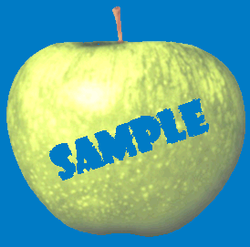
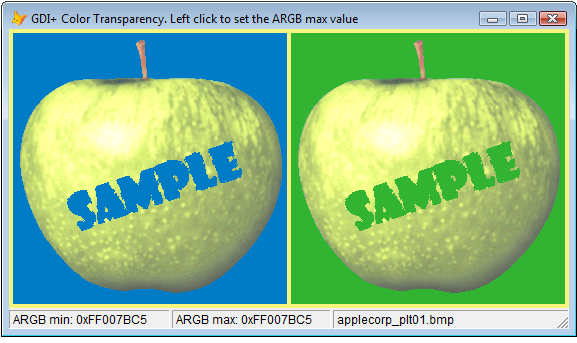

[ Home ](https://github.com/VFPX/Win32API)  

# GDI+: Color Transparency

## Short description:
With the GDI+, an image can be drawn on a Graphics object having a selected single color or a range of colors made transparent.  
***  


## Before you begin:
Download the original image file before testing this code sample. Otherwise use any image file, preferably with dimensions not exceeding 300 pixels.  

  

The code is based on [custom GDI+ class](sample_450.md). Download the class module first and save it in **gdiplus.prg** file. [custom GDI+ class](sample_450.md)  

* * *  
The source image on the left is displayed in VFP Image control. The image on the right is loaded from the same graphics file and drawn on the the form via GDI+ calls with a single color made transparent.   

The cursor position over the source image (*Image1.MouseMove*) specifies min ARGB value in the color transparent range. To assign the maximum value left click within the source image.  

  
  

See also:

* [Displaying the color palette stored in an image file](sample_529.md)  
* [Irregularly shaping FoxPro form via transparency color key](sample_033.md)  
* [Semi-transparent Form](sample_453.md)  
* [Displaying bitmap using the AlphaBlend function](sample_293.md)  
  
***  


## Code:
```foxpro  
LOCAL oForm As Tform
oForm=CREATEOBJECT("Tform")
oForm.Show(1)
* end of main

DEFINE CLASS Tform As Form
	Width=560
	Height=305
	Autocenter=.T.
	BackColor=RGB(245,245,128)
	Caption="GDI+ Color Transparency. "+;
		"Left click to set the ARGB max value"

	gdip=NULL
	hWindow=0
	hDC=0
	canvas=NULL
	oImage=NULL
	
	* transparent color range
	colorlow=-1
	colorhigh=-1
	
	colorback=RGB(50,180,50) && backs the image copy
	
	ADD OBJECT sbar As Tbar
	ADD OBJECT Image1 As Image WITH;
	Left=4, Top=4, Width=274, Height=274, Stretch=2

PROCEDURE Init
	SET PROCEDURE TO gdiplus ADDITIVE
	WITH THIS
		.declare
		.gdip = CREATEOBJECT("gdiplusinit")
		.hWindow=.HWnd
		.hDC=GetDC(THIS.hWindow)
		.canvas = CREATEOBJECT("graphics", .hDC)
		.Image1.Picture="applecorp_plt01.bmp"
	ENDWITH

PROCEDURE Destroy
	THIS.oImage=NULL
	THIS.canvas=NULL
	THIS.gdip=NULL
	= ReleaseDC(THIS.hWindow, THIS.hDC)

PROCEDURE Paint
	THIS.DrawCopy

PROCEDURE Moved
	THIS.DrawCopy

PROCEDURE colorlow_ASSIGN(vValue)
	THIS.colorlow=vValue
	ThisForm.sbar.Panels(1).Text=;
		"ARGB min: " + TRANSFORM(THIS.colorlow,"@0")
	IF THIS.colorhigh=-1
		THIS.colorhigh=THIS.colorlow
	ENDIF

PROCEDURE colorhigh_ASSIGN(vValue)
	THIS.colorhigh = vValue
	ThisForm.sbar.Panels(2).Text=;
		"ARGB max: " + TRANSFORM(THIS.colorhigh,"@0")

PROCEDURE Image1.Picture_ASSIGN(cImageFile)
	ThisForm.oImage=NULL
	ThisForm.oImage = CREATEOBJECT("gdiimage", cImageFile)
	STORE cImageFile TO THIS.Picture,;
		ThisForm.sbar.Panels(3).Text

PROCEDURE Image1.MouseDown
LPARAMETERS nButton, nShift, nXCoord, nYCoord
	WITH ThisForm
		LOCAL nColor
		nColor=0
		= GdipBitmapGetPixel(.oImage.hImage,;
			nXCoord-THIS.Left, nYCoord-THIS.Top, @nColor)

		ThisForm.colorhigh=nColor
		.DrawCopy
	ENDWITH

PROCEDURE Image1.MouseMove
LPARAMETERS nButton, nShift, nXCoord, nYCoord
	WITH ThisForm
		LOCAL nColor
		nColor=0
		= GdipBitmapGetPixel(.oImage.hImage,;
			nXCoord-THIS.Left, nYCoord-THIS.Top, @nColor)

		ThisForm.colorlow=nColor
		.DrawCopy
	ENDWITH

PROCEDURE DrawCopy
	IF VARTYPE(THIS.Image1) <> "O";
		OR THIS.oImage.hImage=0
		RETURN
	ENDIF

	LOCAL hImgAttr, oBrush, nLeft, nTop,;
		nWidth, nHeight, tmpbitmap

	WITH THIS.Image1
		nLeft=.Left+.Width+4
		nTop=.Top
		nWidth=.Width
		nHeight=.Height
	ENDWITH

	hImgAttr=0
	= GdipCreateImageAttributes(@hImgAttr)

	= GdipSetImageAttributesColorKeys(hImgAttr, 0, 1,;
		THIS.colorlow, THIS.colorhigh)

	oBrush = CREATEOBJECT("gdisolidbrush",;
		ColorToARGB(THIS.colorback, 255))

	* using interim canvas decreases flickers
	tmpbitmap = CREATEOBJECT("gdibitmap", nWidth,nHeight)

	tmpbitmap.graphics.FillRectangle(oBrush,;
		0,0,nWidth,nHeight)

	WITH THIS.oImage
		= GdipDrawImageRectRectI(tmpbitmap.graphics.graphics,;
			.himage, 0, 0, .imgwidth,.imgheight,;
			0, 0, .imgwidth, .imgheight,;
			2, hImgAttr, 0, 0)
	ENDWITH

	THIS.canvas.DrawImage(tmpbitmap, nLeft, nTop)
	= GdipDisposeImageAttributes(hImgAttr)

PROCEDURE declare
	DECLARE INTEGER GetDC IN user32 INTEGER hWindow

	DECLARE INTEGER ReleaseDC IN user32;
		INTEGER hWindow, INTEGER dc

	DECLARE INTEGER GdipCreateImageAttributes IN gdiplus;
		INTEGER @imageattr

	DECLARE INTEGER GdipDisposeImageAttributes IN gdiplus;
		INTEGER imageattr

	DECLARE INTEGER GdipSetImageAttributesColorKeys IN gdiplus;
		INTEGER imageattr, INTEGER ColorAdjustType,;
		INTEGER enableFlag, LONG colorLow, LONG colorHigh

	DECLARE INTEGER GdipDrawImageRectRectI IN gdiplus;
		INTEGER graphics, INTEGER gdiimage,;
		INTEGER dstx, INTEGER dsty,;
		INTEGER dstwidth, INTEGER dstheight,;
		INTEGER srcx, INTEGER srcy,;
		INTEGER srcwidth, INTEGER srcheight,;
		INTEGER srcUnit, INTEGER imageAttributes,;
		INTEGER callback, INTEGER callbackData

	DECLARE INTEGER GdipBitmapGetPixel IN gdiplus;
		INTEGER gdibitmap, INTEGER x,;
		INTEGER y, LONG @argbcolor

ENDDEFINE

DEFINE CLASS Tbar As OleControl
	OleClass="MSComctlLib.SBarCtrl.2"
PROCEDURE Init
	THIS.Height=21
	THIS.Panels(1).Width = 160
	THIS.Panels.Add
	THIS.Panels(2).Width = 160
	THIS.Panels.Add
	THIS.Panels(3).Width = 2000
ENDDEFINE  
```  
***  


## Listed functions:
[GdipBitmapGetPixel](../libraries/gdiplus/GdipBitmapGetPixel.md)  
[GdipCreateImageAttributes](../libraries/gdiplus/GdipCreateImageAttributes.md)  
[GdipDisposeImageAttributes](../libraries/gdiplus/GdipDisposeImageAttributes.md)  
[GdipDrawImageRectRectI](../libraries/gdiplus/GdipDrawImageRectRectI.md)  
[GdipSetImageAttributesColorKeys](../libraries/gdiplus/GdipSetImageAttributesColorKeys.md)  
[GetDC](../libraries/user32/GetDC.md)  
[ReleaseDC](../libraries/user32/ReleaseDC.md)  
