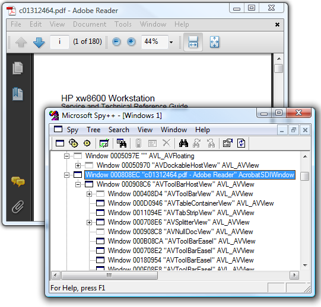

[ Home ](https://github.com/VFPX/Win32API)  

# How to control Adobe Reader 9.0 (SDI mode) from VFP application

## Short description:
Each Adobe Reader 9 window is created from window class AcrobatSDIWindow and parented by the Windows Desktop.  Enumeration of child windows of this class within the Desktop window returns the exact number of open Adobe Acrobat 9 documents.

The AdobeReaderSDIWindow class is able to virtually "click on" an item in the main menu of Adobe Reader 9 window and in this way to control some of the functionality.  
***  


## Before you begin:
Each Adobe Reader 9 window is created from window class *AcrobatSDIWindow* and parented by the Windows Desktop.  Enumeration of child windows of this class within the Desktop window returns the exact number of open Adobe Acrobat 9 documents.  

  

Each Adobe SDI window has a menu attached to it. It is possible to read the structure of the menu including the Ids of submenus and items.   

No captions can be retrieved though -- due to the fact that the menu has substantial dynamic (run-time) building part. That part hides, shows, disables and enables items on the fly. Same, for example, as VFP shell does with its main menu.  

From looking at the XML-formatted AdobeReader 9 menu structure and comparing it to the actual menu, some pretty obvious conclusions can be made.   

  
The most important things is the menu item Ids. If the Id of a menu item is known, as well as the handle of the window hosting the menu, then the menu item can be virtually "clicked on" by calling the SendMessage with specific parameters.  

```foxpro
= SendMessage(hWindow, WM_COMMAND, m.nItemId, 0)
```
The *hWindow* above is the handle to AdobeReader SDI window. The *nItemId* is a numeric value that can be recognized by this menu as a valid menu item id.   

For example, passing *nItemId=6019* will close the document open in the SDI window, leaving the window empty. And passing *nItemId=6033* will close a given SDI window.  

Still the menu item Ids are not documented, and probably change from version to version, which is a substantial obstacle when deciding to use this approach.  

See also:

* [Accessing Adobe Reader 7.0 main menu from VFP application](sample_495.md)  
* [Reading structure of a menu attached to the main VFP window](sample_337.md)  
  
***  


## Code:
```foxpro  
LOCAL oReader As AdobeReader9,;
	oWindow As AdobeReaderSDIWindow

oReader=CREATEOBJECT("AdobeReader9")

IF oReader.SDIWindows.Count = 0
	= MESSAGEBOX("No Adobe Reader windows are open.",;
		64,"AdobeReader9 control")
	RETURN
ENDIF

*oReader.OpenPDFDocument("c:\documents\c01312464.pdf")

*!*	oWindow=oReader.SDIWindows.Item(1)
*!*	oWindow.ExecMenu(6198) && ID_WINDOW_FULLSCREEN
*!*	RETURN

FOR EACH oWindow IN oReader.SDIWindows
	? oWindow.windowcaption

*!*		oWindow.CloseDocument
*!*		oWindow.CloseWindow
NEXT
* end of main

DEFINE CLASS AdobeReader9 As Session
#DEFINE ADOBEREADER_SDI_WINCLASS "AcrobatSDIWindow"
#DEFINE WM_COMMAND 0x0111
#DEFINE SW_SHOWNORMAL 1

#DEFINE ID_FILE_OPEN 6001
#DEFINE ID_FILE_CREATE_ADOBE_PDF 6008
#DEFINE ID_FILE_SAVE_COPY 6012
#DEFINE ID_FILE_SAVE_TEXT 6013
#DEFINE ID_FILE_ATTACH_EMAIL 6016 && returns error?
#DEFINE ID_FILE_CLOSE 6019
#DEFINE ID_FILE_PROPERTIES 6021
#DEFINE ID_FILE_DIGITAL_EDITIONS 6025
#DEFINE ID_FILE_PRINT_SETUP 6027
#DEFINE ID_FILE_PRINT 6028
#DEFINE ID_FILE_EXIT 6033

#DEFINE ID_EDIT_FIND 6052
#DEFINE ID_EDIT_SEARCH 6053
#DEFINE ID_EDIT_PREFERENCES 6062

#DEFINE ID_WINDOW_FULLSCREEN 6198

#DEFINE ID_HELP_UPDATES 6220
#DEFINE ID_HELP_PURCHASE 6222

	SDIWindows=NULL

PROCEDURE Init
	THIS.declare
	THIS.SDIWindows = CREATEOBJECT("Collection")
	THIS.EnumerateAdobeReaderWindows

PROCEDURE CloseAllAdobeReaderWindows
	LOCAL oWindow As AdobeReaderSDIWindow
	FOR EACH oWindow IN THIS.SDIWindows
		oWindow.CloseWindow
		DOEVENTS
	NEXT
	THIS.EnumerateAdobeReaderWindows

FUNCTION EnumerateAdobeReaderWindows() As Number
	DO WHILE THIS.SDIWindows.Count >= 1
		THIS.SDIWindows.Remove(1)
	ENDDO

	LOCAL hParent, hWindow, oWindow As AdobeReaderSDIWindow
	hParent = GetDesktopWindow()
	
	nCount=0
	DO WHILE .T.
		hWindow = FindWindowEx(hParent, hWindow,;
			ADOBEREADER_SDI_WINCLASS, NULL)

		IF hWindow = 0
			EXIT
		ENDIF
		oWindow=CREATEOBJECT("AdobeReaderSDIWindow", hWindow)
		THIS.SDIWindows.Add(oWindow)
		oWindow=NULL
	ENDDO
RETURN THIS.SDIWindows.Count

FUNCTION AdobeReaderIsRunning() As Boolean
RETURN (THIS.SDIWindows.Count > 0)

FUNCTION OpenPDFDocument(cPDFFile As String) As Boolean
	LOCAL nResult, nCount, nIndex
	nCount=THIS.SDIWindows.Count

	IF FILE(m.cPDFFile) AND ".pdf" $ LOWER(cPDFFile)
		nResult = ShellExecute(0, "open", m.cPDFFile,;
			"", "", SW_SHOWNORMAL)

		IF nResult <= 32
			RETURN .F.
		ENDIF

		* wait until the document opens
		FOR nIndex=1 TO 16
			= Sleep(250)
			IF THIS.EnumerateAdobeReaderWindows() <> m.nCount
				EXIT
			ENDIF
		NEXT
		RETURN .T.
	ELSE
		RETURN .F.
	ENDIF

PROCEDURE declare
	DECLARE INTEGER GetDesktopWindow IN user32
	DECLARE INTEGER GetMenu IN user32 INTEGER hWindow
	DECLARE INTEGER IsMenu IN user32 INTEGER hMenu
	DECLARE INTEGER IsWindow IN user32 INTEGER hWindow
	DECLARE Sleep IN kernel32 INTEGER dwMilliseconds

	DECLARE INTEGER SetForegroundWindow IN user32;
		INTEGER hWindow

	DECLARE SwitchToThisWindow IN user32;
		INTEGER hWindow, INTEGER fAltTab

	DECLARE INTEGER FindWindowEx IN user32;
		INTEGER hwndParent, INTEGER hwndChildAfter,;
		STRING lpszClass, STRING lpszWindow

	DECLARE INTEGER GetWindowText IN user32;
		INTEGER hWindow, STRING @lpString, INTEGER cch

	DECLARE INTEGER SendMessage IN user32;
		INTEGER hWindow, INTEGER Msg,;
		INTEGER wParam, INTEGER lParam

	DECLARE INTEGER ShellExecute IN shell32;
		INTEGER hWindow, STRING lpOperation,;
		STRING lpFile, STRING lpParameters,;
		STRING lpDirectory, INTEGER nShowCmd

ENDDEFINE

DEFINE CLASS AdobeReaderSDIWindow As Relation
	hWindow=0
	hMenu=0
	windowcaption=""

PROCEDURE Init(hWindow As Number)
	THIS.hWindow=m.hWindow
	THIS.hMenu = GetMenu(THIS.hWindow)

PROCEDURE windowcaption_ACCESS() As String
RETURN THIS.GetWinText(THIS.hWindow)

PROCEDURE ActivateWindow
*	= SetForegroundWindow(THIS.hWindow)
	= SwitchToThisWindow(THIS.hWindow, 1)
	DOEVENTS

FUNCTION GetWinText(hWindow As Number)
	LOCAL nBufsize, cBuffer
	nBufsize = 250
	cBuffer = REPLICATE(CHR(0), nBufsize)
	nBufsize = GetWindowText(hWindow, @cBuffer, nBufsize)
RETURN IIF(nBufsize=0, "", LEFT(cBuffer, nBufsize))

PROCEDURE CloseDocument
	THIS.ExecMenu(ID_FILE_CLOSE)

PROCEDURE CloseWindow
	THIS.ExecMenu(ID_FILE_EXIT)

PROCEDURE InitDlgOpenFile
* initiates Open File dialog
	IF IsWindow(THIS.hWindow) <> 0
		= SwitchToThisWindow(THIS.hWindow, 1)
		THIS.ExecMenu(ID_FILE_OPEN)
	ENDIF

PROCEDURE ExecMenu(nCommand As Number, lDoNotSwitch As Boolean)
* initiates application menu command
	IF IsWindow(THIS.hWindow)<>0 AND IsMenu(THIS.hMenu)<>0
		IF NOT m.lDoNotSwitch && :) double negation
			THIS.ActivateWindow
		ENDIF

		= SendMessage(THIS.hWindow,;
			WM_COMMAND, m.nCommand, 0)
		DOEVENTS
	ENDIF

ENDDEFINE  
```  
***  


## Listed functions:
[FindWindowEx](../libraries/user32/FindWindowEx.md)  
[GetDesktopWindow](../libraries/user32/GetDesktopWindow.md)  
[GetMenu](../libraries/user32/GetMenu.md)  
[GetWindowText](../libraries/user32/GetWindowText.md)  
[IsMenu](../libraries/user32/IsMenu.md)  
[IsWindow](../libraries/user32/IsWindow.md)  
[SendMessage](../libraries/user32/SendMessage.md)  
[SetForegroundWindow](../libraries/user32/SetForegroundWindow.md)  
[ShellExecute](../libraries/shell32/ShellExecute.md)  
[Sleep](../libraries/kernel32/Sleep.md)  
[SwitchToThisWindow](../libraries/user32/SwitchToThisWindow.md)  

## Comment:
The AdobeReaderSDIWindow class is able to virtually "click on" an item in the main menu of Adobe Reader 9 window. This is a part of what you can do:
* enumerate titles of all open Adobe documents  
* activate a document (the document moves to the front)  
* switch a document to Full Screen Mode  
* copy a document to the Clipboard  
* close a specified document or all documents  
* open Print Setup dialog for a document  
* open Print dialog for a document  
  
You can also open a PDF document either by a file name or by invoking File Open dialog.  
  
* * *  
Jan.26, 2009: Starting with version 9 of the Adobe Reader for Windows, may be even with an earlier 8+ version, the preference *"Show each document in its own window (requires restart)"* is no longer available.   
  
There is a <a href="http://kb.adobe.com/selfservice/viewContent.do?externalId=kb405108">TechNote from Adobe (kb405108)</a> explaining why such questionable decision was ever taken -- no more MDI.  
  
***  

