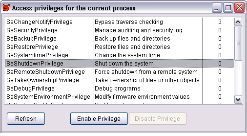

[ Home ](https://github.com/VFPX/Win32API)  

# Reading and setting system access privileges for the current process

## Before you begin:
A privilege is the right of an account, such as a user or group account, to perform various system-related operations on the local computer, such as shutting down the system, loading device drivers, or changing the system time.  

  
  
***  


## Code:
```foxpro  
LOCAL oForm As TForm
oForm=CREATEOBJECT("TForm")
oForm.Show(1)
* end of main

DEFINE CLASS TForm As Form
#DEFINE TOKEN_ADJUST_PRIVILEGES 0x0020
#DEFINE TOKEN_QUERY 0x0008
#DEFINE TOKEN_INFORMATION_TokenPrivileges 3
#DEFINE SE_PRIVILEGE_DISABLED 0
#DEFINE SE_PRIVILEGE_ENABLED_BY_DEFAULT 1
#DEFINE SE_PRIVILEGE_ENABLED 2

PROTECTED hToken
	Width=500
	Height=240
	BorderStyle=1
	Caption="Privileges for the current process"
	Autocenter=.T.
	hToken=0
	
	ADD OBJECT lst As ListBox WITH Left=5,;
	Top=5, Width=490, Height=180
	
	ADD OBJECT cmdRefresh As CommandButton WITH Left=10,;
	Top=200, Width=80, Height=27, Caption="Refresh"

	ADD OBJECT cmdEnable As CommandButton WITH Left=140,;
	Top=200, Width=120, Height=27, Caption="Enable Privilege"

	ADD OBJECT cmdDisable As CommandButton WITH Left=260,;
	Top=200, Width=120, Height=27, Caption="Disable Privilege"

PROCEDURE Init
	THIS.declare
	THIS.GetPrivileges

PROCEDURE Destroy
	THIS.ReleaseProcessToken

PROCEDURE cmdRefresh.Click
	ThisForm.GetPrivileges

PROCEDURE cmdEnable.Click
	ThisForm.SetSelectedPrivilege(.T.)

PROCEDURE cmdDisable.Click
	ThisForm.SetSelectedPrivilege(.F.)

PROCEDURE lst.InteractiveChange
	LOCAL nCurVal
	WITH THIS
		nCurVal = VAL(.List(.ListIndex, 3))
	ENDWITH
	IF BITAND(nCurVal, SE_PRIVILEGE_ENABLED)=0
		ThisForm.cmdEnable.Enabled=.T.
		ThisForm.cmdDisable.Enabled=.F.
	ELSE
		ThisForm.cmdEnable.Enabled=.F.
		ThisForm.cmdDisable.Enabled=.T.
	ENDIF

PROCEDURE SetSelectedPrivilege(lEnabled As Boolean)
	LOCAL cLuid, nCurVal
	WITH THIS.lst
		cLuid = STRCONV(.List(.ListIndex, 4),14)
		nCurVal = VAL(.List(.ListIndex, 3))
	ENDWITH

	IF THIS.SetPrivilege(m.cLuid, m.nCurVal, m.lEnabled)
		ThisForm.GetPrivileges
	ENDIF

PROCEDURE GetPrivileges
	LOCAL nIndex
	WITH THIS.lst
		nIndex = .ListIndex
		.RowSourceType=0
		.Clear
		THIS.PrivilegesToCursor

		.RowSourceType=2
		.RowSource="csPrivilege"
		.BoundTo=.T.
		.BoundColumn=1
		.ColumnCount=3
		.ColumnWidths="180,220,60"
		.ListIndex=MAX(m.nIndex, 1)
		.InteractiveChange
	ENDWITH

PROCEDURE ReleaseProcessToken
	IF THIS.hToken <> 0
		= CloseHandle(THIS.hToken)
	ENDIF

FUNCTION GetProcessToken() As Boolean
	THIS.ReleaseProcessToken

	LOCAL hToken
	hToken=0

	IF OpenProcessToken(GetCurrentProcess(),;
		BITOR(TOKEN_ADJUST_PRIVILEGES, TOKEN_QUERY), @hToken)=0
		THIS.hToken=0
		RETURN .F.
	ELSE
		THIS.hToken=m.hToken
		RETURN .T.
	ENDIF

PROCEDURE PrivilegesToCursor
	IF USED("csPrivilege")
		USE IN csPrivilege
	ENDIF

	IF NOT THIS.GetProcessToken()
		RETURN .F.
	ENDIF

	LOCAL nBufsize, cBuffer
	nBufsize=0
	= GetTokenInformation(THIS.hToken, 3, NULL, 0, @nBufsize)

	cBuffer=REPLICATE(CHR(0), nBufsize)
	nBufsize=0
	= GetTokenInformation(THIS.hToken,;
		TOKEN_INFORMATION_TokenPrivileges,;
		@cBuffer, LEN(cBuffer), @nBufsize)

	CREATE CURSOR csPrivilege (privilege_nme C(50),;
		privilege_dname C(50), privilege_value I, luid C(36))

	LOCAL nCount, nIndex, nAttribute, cLuid, cName, nNameSize,;
		cDName, nLangId

	nCount = buf2dword(SUBSTR(cBuffer,1,4))
	FOR nIndex=1 TO nCount
		cLuid = SUBSTR(cBuffer, 5+(nIndex-1)*12, 8)
		nAttribute = buf2dword(SUBSTR(cBuffer, 5+(nIndex-1)*12+8, 4))

		nNameSize=250
		cName=REPLICATE(CHR(0), nNameSize)
		= LookupPrivilegeName(0, @cLuid, @cName, @nNameSize)
		cName = SUBSTR(cName, 1, nNameSize)

		nNameSize=250
		cDName=REPLICATE(CHR(0), nNameSize)
		nLangId=0
		
		= LookupPrivilegeDisplayName(0, cName,;
			@cDName, @nNameSize, @nLangId)

		cDName = SUBSTR(cDName, 1, nNameSize)
		
		* cLuid may contain zero characters inside so I gather
		* it is better to have it scrambled with the base64 encryption
		INSERT INTO csPrivilege (privilege_nme,;
			privilege_dname, privilege_value, luid);
		VALUES (cName, cDName, nAttribute,;
			STRCONV(cLuid,13))
	NEXT

FUNCTION SetPrivilege(cLuid As String, nCurVal As Number,;
	lEnabled As Boolean) As Boolean
	LOCAL nPrivilegeCount, cTokenPrivileges,;
		nPrivilegeValue, nResult, nError

	* populate TOKEN_PRIVILEGES structure
	nPrivilegeCount=1
	IF m.lEnabled
		nPrivilegeValue = BITOR(m.nCurVal, SE_PRIVILEGE_ENABLED)
	ELSE
		nPrivilegeValue = BITAND(m.nCurVal, 0xfffffffd)
	ENDIF

	cTokenPrivileges = num2dword(nPrivilegeCount) +;
		m.cLuid + num2dword(nPrivilegeValue)

	nResult = AdjustTokenPrivileges(THIS.hToken, 0,;
		@cTokenPrivileges, 0,0,0)
		
	IF nResult = 0
		nError=GetLastError()
		= MESSAGEBOX("AdjustTokenPrivileges call failed: "+;
			TRANSFORM(m.nError,"@0"))
	ENDIF
RETURN (m.nResult <> 0)

PROCEDURE declare
	DECLARE INTEGER GetLastError IN kernel32
	DECLARE INTEGER GetCurrentProcess IN kernel32

	DECLARE INTEGER StringFromCLSID IN ole32;
		STRING rclsid, STRING @ppsz

	DECLARE INTEGER CloseHandle IN kernel32;
		INTEGER hObject

	DECLARE INTEGER OpenProcessToken IN advapi32;
		INTEGER ProcessHandle, LONG DesiredAccess,;
		INTEGER @TokenHandle

	DECLARE INTEGER GetTokenInformation IN advapi32;
		INTEGER TokenHandle, INTEGER TokenInformationClass,;
		STRING @TokenInformation, LONG TokenInformationLength,;
		LONG @ReturnLength

	DECLARE INTEGER LookupPrivilegeValue IN advapi32;
		INTEGER lpSystemName, STRING lpName,;
		STRING @lpLuid

	DECLARE INTEGER LookupPrivilegeName IN advapi32;
		INTEGER lpSystemName, STRING @lpLuid,;
		STRING @lpName, LONG @cchName

	DECLARE INTEGER LookupPrivilegeDisplayName IN advapi32;
		INTEGER lpSystemName, STRING lpName,;
		STRING @lpDisplayName, LONG @cchDisplayName,;
		LONG @lpLanguageId

	DECLARE INTEGER AdjustTokenPrivileges IN advapi32;
		INTEGER TokenHandle, INTEGER DisableAllPrivileges,;
		STRING @NewState, LONG BufferLength,;
		INTEGER PreviousState, INTEGER ReturnLength
ENDDEFINE

FUNCTION num2dword(lnValue)
#DEFINE m0 0x0000100
#DEFINE m1 0x0010000
#DEFINE m2 0x1000000
	IF lnValue < 0
		lnValue = 0x100000000 + lnValue
	ENDIF
	LOCAL b0, b1, b2, b3
	b3 = Int(lnValue/m2)
	b2 = Int((lnValue - b3*m2)/m1)
	b1 = Int((lnValue - b3*m2 - b2*m1)/m0)
	b0 = Mod(lnValue, m0)
RETURN Chr(b0)+Chr(b1)+Chr(b2)+Chr(b3)

FUNCTION buf2dword(cBuffer)
RETURN Asc(SUBSTR(cBuffer, 1,1)) + ;
	BitLShift(Asc(SUBSTR(cBuffer, 2,1)),  8) +;
	BitLShift(Asc(SUBSTR(cBuffer, 3,1)), 16) +;
	BitLShift(Asc(SUBSTR(cBuffer, 4,1)), 24)  
```  
***  


## Listed functions:
[AdjustTokenPrivileges](../libraries/advapi32/AdjustTokenPrivileges.md)  
[CloseHandle](../libraries/kernel32/CloseHandle.md)  
[GetCurrentProcess](../libraries/kernel32/GetCurrentProcess.md)  
[GetLastError](../libraries/kernel32/GetLastError.md)  
[GetTokenInformation](../libraries/advapi32/GetTokenInformation.md)  
[LookupPrivilegeDisplayName](../libraries/advapi32/LookupPrivilegeDisplayName.md)  
[LookupPrivilegeName](../libraries/advapi32/LookupPrivilegeName.md)  
[LookupPrivilegeValue](../libraries/advapi32/LookupPrivilegeValue.md)  
[OpenProcessToken](../libraries/advapi32/OpenProcessToken.md)  

## Comment:
Read about <a href="http://msdn.microsoft.com/en-us/library/aa379306(VS.85).aspx">Privileges</a> on MSDN.  
  
***  

