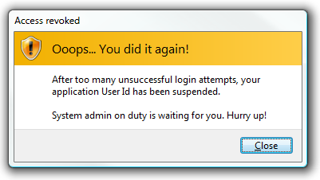

[ Home ](https://github.com/VFPX/Win32API)  

# How to display a Task Dialog (Vista)

## Before you begin:
The task dialog contains application-defined message text and title, icons, and any combination of predefined push buttons.  
  
The picture above is just an example. Your user credentials on this web site are intact :)  

See also:

[How to display advanced Task Dialog (Vista)](sample_558.md)  
  
***  


## Code:
```foxpro  
#DEFINE TDCBF_OK_BUTTON 1
#DEFINE TDCBF_YES_BUTTON 2
#DEFINE TDCBF_NO_BUTTON 4
#DEFINE TDCBF_CANCEL_BUTTON 8
#DEFINE TDCBF_RETRY_BUTTON 0x0010
#DEFINE TDCBF_CLOSE_BUTTON 0x0020

#DEFINE TDCBF_YES_BUTTON 2
#DEFINE TDCBF_NO_BUTTON 4
#DEFINE TDCBF_CANCEL_BUTTON 8

#DEFINE S_OK 0
#DEFINE TD_WARNING_ICON -1
#DEFINE TD_ERROR_ICON -2
#DEFINE TD_INFORMATION_ICON -3
#DEFINE TD_SHIELD_ICON -4
#DEFINE TD_SHIELD_GRADIENT_ICON -5
#DEFINE TD_SHIELD_WARNING_ICON -6
#DEFINE TD_SHIELD_ERROR_ICON -7
#DEFINE TD_SHIELD_OK_ICON -8
#DEFINE TD_SHIELD_GRAY_ICON -9
#DEFINE IDI_APPLICATION 0x00007f00
#DEFINE IDI_QUESTION 0x00007f02

DO declare

LOCAL nButtonId, cTitle, cInstruction, cContent,;
	nIcon, nButtons, nResult

cTitle = ToUnicode("Access revoked")
cInstruction = ToUnicode("Ooops... You did it again!")
cContent = ToUnicode("After too many unsuccessful login attempts, " +;
	"your application User Id has been suspended." + CHR(13) + CHR(13) +;
	"System admin on duty is waiting for you. Hurry up!")

* a substitute for the MAKEINTRESOURCE
nIcon = BITAND(0x0000ffff,;
	TD_SHIELD_WARNING_ICON)

*!*	nButtons = BITOR(TDCBF_YES_BUTTON, TDCBF_NO_BUTTON,;
*!*		TDCBF_CANCEL_BUTTON)

nButtons = TDCBF_CLOSE_BUTTON

nButtonId=0  && the must

nResult = TaskDialog(_screen.HWnd, 0,;
	cTitle, cInstruction, cContent,;
	nButtons, nIcon, @nButtonId)

IF nResult = S_OK
	? "ID of the pressed button:", nButtonId
ELSE
	? "TaskDialog call failed:", nResult
ENDIF
* end of main

FUNCTION ToUnicode(cStr)
RETURN STRCONV(cStr+CHR(0), 5)

PROCEDURE declare
	DECLARE SHORT TaskDialog IN comctl32;
		INTEGER hWndParent, INTEGER hInstance,;
		STRING pszWindowTitle, STRING pszMainInstruction,;
		STRING pszContent, INTEGER dwCommonButtons,;
		INTEGER pszIcon, INTEGER @pnButton  
```  
***  


## Listed functions:
[TaskDialog](../libraries/comctl32/TaskDialog.md)  

## Comment:
Minimum operating systems: Windows Vista  
  
All strings passed to this function must be in Unicode format.  
  
***  

