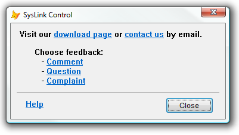
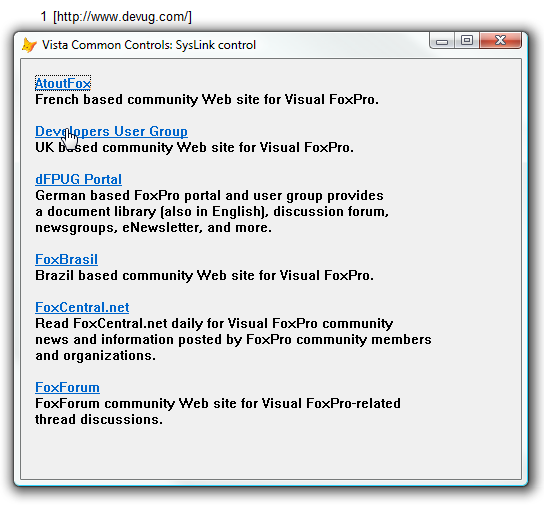

[ Home ](https://github.com/VFPX/Win32API)  

# Displaying hypertext links with the SysLink control (VFP9, Comctl32.dll)

## Before you begin:
The SysLink control provides a convenient way to embed hypertext links in a window. A SysLink control is a window that renders marked-up text and notifies the application when the user clicks an embedded link.   

  
The screenshot above shows VFP form with three syslink controls. One control can include multiple links mixed with regular text.   
  
***  


## Code:
```foxpro  
LOCAL oForm As Tform
oForm=CREATEOBJECT("Tform")
oForm.Show
READ EVENTS
* end of main

DEFINE CLASS Tform As Form
	Caption = "SysLink Control"
	Height=160
	Width=360
	Autocenter=.T.
	ShowWindow=2

	* add before adding first comctl32 control	
	ADD OBJECT Comctl32Manager1 As Comctl32Manager

	* the angled brackets are replaced with Chrs
	* for presentation purposes only, since they are
	* HTML special characters

	ADD OBJECT SysLink1 As SysLink WITH;
	Left=15, Top=10, Width=320,;
	LinkCaption=[Visit our ]+CHR(60)+;
		[a href="www.downloadpage.com"]+CHR(62)+;
		[download page]+CHR(60)+[/a]+CHR(62)+[ ] +;
		[or ]+CHR(60)+[a href="mailto:support@domain.com"]+;
		CHR(62)+[contact us]+CHR(60)+[/a]+CHR(62)+[ by email.]

	ADD OBJECT SysLink2 As SysLink WITH;
	Left=40, Top=40, Width=200,;
	LinkCaption=[Choose feedback:] + CHR(13) +;
		[   - ]+CHR(60)+[a ID="idComment"]+CHR(62)+;
			[Comment]+CHR(60)+[/a]+CHR(62)+[] + CHR(13) +;
		[   - ]+CHR(60)+[a ID="idQuestion"]+CHR(62)+;
			[Question]+CHR(60)+[/a]+CHR(62)+[] + CHR(13) +;
		[   - ]+CHR(60)+[a ID="idComplaint"]+CHR(62)+;
			[Complaint]+CHR(60)+[/a]+CHR(62)+[]

	ADD OBJECT SysLink3 As SysLink WITH;
	Left=25, Top=127, Width=100,;
	LinkCaption=CHR(60)+[a ID="idHelp"]+CHR(62)+;
		[Help]+CHR(60)+[/a]+CHR(62)

	ADD OBJECT shp As Shape WITH Left=10,;
		Top=116, Width=340, Height=1

	ADD OBJECT cmdClose As CommandButton WITH;
		Left=260, Top=124, Width=80, Height=27,;
		Caption="Close", Cancel=.T.

PROCEDURE Destroy
	CLEAR EVENTS

PROCEDURE cmdClose.Click
	ThisForm.Release

PROCEDURE SysLink1.OnClick
	ACTIVATE SCREEN
	WITH THIS.oNMLink
		? THIS.CtrlId, .litem_iLink,;
			.litem_szID, .litem_szUrl
	ENDWITH

PROCEDURE SysLink2.OnClick
	ACTIVATE SCREEN
	WITH THIS.oNMLink
		? THIS.CtrlId, .litem_iLink,;
			.litem_szID, .litem_szUrl
	ENDWITH

PROCEDURE SysLink3.OnClick
	ACTIVATE SCREEN
	WITH THIS.oNMLink
		? THIS.CtrlId, .litem_iLink,;
			.litem_szID, .litem_szUrl
	ENDWITH

ENDDEFINE

DEFINE CLASS Comctl32Manager As Custom
#DEFINE GWL_WNDPROC -4
#DEFINE GWL_HINSTANCE -6
#DEFINE WS_VISIBLE 0x10000000
#DEFINE WS_CHILD 0x40000000
#DEFINE HWND_TOP 0
#DEFINE SWP_NOSIZE 0x0001
#DEFINE SWP_NOMOVE 0x0002
#DEFINE SWP_SHOWWINDOW 0x0040
#DEFINE WM_NOTIFY 0x004e
#DEFINE WM_USER 0x0400
#DEFINE LM_GETIDEALSIZE WM_USER+0x0301
#DEFINE LWS_NOPREFIX 0x0004
#DEFINE LWS_TRANSPARENT 0x0001
#DEFINE LWS_USEVISUALSTYLE 0x0008
#DEFINE NM_FIRST 0
#DEFINE NM_CLICK (NM_FIRST-2)
#DEFINE NM_RETURN (NM_FIRST-4)
#DEFINE NM_SETFOCUS (NM_FIRST-7)
#DEFINE NM_CUSTOMDRAW (NM_FIRST-12)
#DEFINE MAX_LINKID_TEXT 48
#DEFINE L_MAX_URL_LENGTH 2084
#DEFINE NMHDR_SIZE 12
#DEFINE LITEM_SIZE 4280
#DEFINE NMLINK_SIZE NMHDR_SIZE+LITEM_SIZE

	Visible=.F.
	hParentHwnd=0
	hOrigProc=0
	Comctl32Controls=NULL

PROCEDURE Init
	WITH THIS
		.declare
		.hParentHwnd=ThisForm.hWnd
		.hOrigProc=GetWindowLong(.hParentHwnd, GWL_WNDPROC)
		.Comctl32Controls=CREATEOBJECT("Collection")

		* comctl32 messaging is conducted
		* via WM_NOTIFY messages
		BINDEVENT(THIS.hParentHwnd, WM_NOTIFY,;
			THIS, "WindowProc", 1)

		* release first
		BINDEVENT(ThisForm, "Destroy", THIS, "ReleaseControls", 1)
	ENDWITH

PROCEDURE Destroy
	IF THIS.hParentHwnd <> 0
		UNBINDEVENTS(THIS.hParentHwnd, WM_NOTIFY)
		THIS.hParentHwnd=0
		THIS.hOrigProc=0
	ENDIF

PROCEDURE ReleaseControls
	DO WHILE THIS.Comctl32Controls.Count > 0
		THIS.Comctl32Controls.Remove(1)
	ENDDO

PROTECTED PROCEDURE KeyFromCtrlId(nCtrlId As Number) As String
RETURN "c_" + PADL(TRANSFORM(m.nCtrlId),5,"0")

PROTECTED PROCEDURE ControlIsRegistered(nCtrlId As Number) As Boolean
	LOCAL oControl As Comctl32Control, lResult
	oControl=THIS.ControlFromCtrlId(nCtrlId)
	lResult=NOT ISNULL(m.oControl)
	oControl=NULL
RETURN m.lResult

PROTECTED PROCEDURE ControlFromCtrlId(nCtrlId As Number) As Comctl32Control
	LOCAL cCtrlKey, oControl As Comctl32Control,;
		ex As Exception
	cCtrlKey=THIS.KeyFromCtrlId(m.nCtrlId)
	TRY
		oControl=THIS.Comctl32Controls.Item(m.cCtrlKey)
	CATCH TO ex
		oControl=NULL
	ENDTRY
RETURN m.oControl

PROCEDURE RegisterControl(oControl As Comctl32Control)
	LOCAL cCtrlKey, ex As Exception
	IF EMPTY(oControl.CtrlId)
		oControl.CtrlId=0x1000 +;
			THIS.Comctl32Controls.Count
	ENDIF
	cCtrlKey=THIS.KeyFromCtrlId(oControl.CtrlId)
	TRY
		THIS.Comctl32Controls.Add(oControl, m.cCtrlKey)
	CATCH TO ex
	ENDTRY

PROTECTED PROCEDURE WindowProc
PARAMETERS hWindow as Integer, nMsgID as Integer,;
	wParam as Integer, lParam as Integer

	LOCAL nReturn, oNmhdr As NMHdrStruct

	oNmhdr=CREATEOBJECT("NMHdrStruct")
	oNmhdr.FromPtr(m.lParam)
	
	nReturn = CallWindowProc(THIS.hOrigProc, m.hWindow,;
		m.nMsgID, m.wParam, m.lParam)

	IF THIS.ControlIsRegistered( oNmhdr.idFrom )
		THIS.OnCtrlEvent(m.oNmhdr, m.hWindow,;
			m.nMsgID, m.wParam, m.lParam)
	ENDIF

RETURN m.nReturn

PROTECTED PROCEDURE OnCtrlEvent
PARAMETERS oNmhdr As NMHdrStruct, hWindow as Integer, nMsgID as Integer,;
	wParam as Integer, lParam as Integer

	LOCAL oControl As Comctl32Control
	oControl=THIS.ControlFromCtrlId( oNmhdr.idFrom )
	WITH oControl
		.EventId=oNmhdr.EventId
		.OnCtrlEvent(m.hWindow, m.nMsgID, m.wParam, m.lParam)
	ENDWITH

PROTECTED PROCEDURE declare
	DECLARE RtlMoveMemory IN kernel32 As MemToStr;
		STRING @, INTEGER, INTEGER

	DECLARE INTEGER DestroyWindow IN user32;
		INTEGER hWindow

	DECLARE INTEGER GetWindowLong IN user32;
		INTEGER hWindow, INTEGER nIndex

	DECLARE INTEGER CreateWindowEx IN user32 AS CreateWindow;
		INTEGER dwExStyle, STRING lpClassName,;
		STRING lpWindowName, INTEGER dwStyle,;
		INTEGER x, INTEGER y, INTEGER nWidth, INTEGER nHeight,;
		INTEGER hWndParent, INTEGER hMenu, INTEGER hInstance,;
		INTEGER lpParam
		
	DECLARE INTEGER SendMessage IN user32;
	AS SendMessageStr;
		INTEGER hWindow, INTEGER Msg,;
		INTEGER wParam, STRING @lParam

	DECLARE INTEGER SetWindowPos IN user32;
		INTEGER hWindow, INTEGER hWndInsertAfter,;
		INTEGER x, INTEGER y, INTEGER cx, INTEGER cy,;
		INTEGER wFlags

	DECLARE INTEGER CallWindowProc IN user32;
		INTEGER lpPrevWndFunc, INTEGER hWindow, LONG Msg,;
		INTEGER wParam, INTEGER lParam

ENDDEFINE

DEFINE CLASS Comctl32Control As Container && Container, TextBox
	hParentWindow=0
	hWindow=0
	EventId=0
	CtrlId=0

PROCEDURE Init
	WITH THIS
		.hParentWindow=ThisForm.Hwnd
		.RegisterControl
		.DisplayObject
	ENDWITH

PROCEDURE Destroy
	THIS.DestroyObject

PROTECTED PROCEDURE DestroyObject
	IF THIS.hWindow <> 0
		= DestroyWindow(THIS.hWindow)
		THIS.hWindow=0
	ENDIF

PROTECTED PROCEDURE RegisterControl
	ThisForm.Comctl32Manager1.RegisterControl(THIS)

PROCEDURE DisplayObject  && abstract

PROCEDURE OnCtrlEvent  && abstract
PARAMETERS hWindow as Integer, nMsgID as Integer,;
	wParam as Integer, lParam as Integer

ENDDEFINE

DEFINE CLASS SysLink As Comctl32Control
	oNMLink=NULL
	LinkCaption=""

PROCEDURE Init
	Comctl32Control::Init()
	THIS.oNMLink=CREATEOBJECT("oNMLinkStruct")

PROCEDURE OnCtrlEvent
PARAMETERS hWindow as Integer, nMsgID as Integer,;
	wParam as Integer, lParam as Integer
	Comctl32Control::OnCtrlEvent(m.hWindow, m.nMsgID,;
		m.wParam, m.lParam)

	WITH THIS
		DO CASE
		CASE .EventId=NM_CLICK
			.oNMLink.FromPtr(m.lParam)
			.OnClick
		ENDCASE
	ENDWITH

PROCEDURE OnClick  && abstract

PROCEDURE DisplayObject
	LOCAL nStyle, hApp, cSizeBuffer

	WITH THIS
		.DestroyObject
*!*			nStyle = BITOR(WS_VISIBLE, WS_CHILD,;
*!*				LWS_NOPREFIX, LWS_TRANSPARENT,;
*!*				LWS_USEVISUALSTYLE)

		nStyle = BITOR(WS_VISIBLE, WS_CHILD)

		hApp = GetWindowLong(.hParentWindow, GWL_HINSTANCE)

		.hWindow = CreateWindow(0, "SysLink",;
			.LinkCaption, nStyle, .Left, .Top,;
			.Width, .Height,;
			.hParentWindow, .CtrlId, hApp, 0)

		cSizeBuffer=REPLICATE(CHR(0), 8)

		= SendMessageStr(.hWindow, LM_GETIDEALSIZE,;
			.Width, @cSizeBuffer)

		.Height=buf2dword(SUBSTR(cSizeBuffer,5,4))

		= SetWindowPos(.hWindow, HWND_TOP,;
			0, 0, .Width, .Height,;
			BITOR(SWP_NOMOVE, SWP_SHOWWINDOW))
	ENDWITH

ENDDEFINE

DEFINE CLASS NMHdrStruct As Relation
	hwndFrom=0
	idFrom=0
	EventId=0

PROCEDURE FromPtr(nAddr As Number)
	LOCAL cBuffer
	cBuffer = REPLICATE(CHR(0), NMHDR_SIZE)
	MemToStr(@cBuffer, m.lParam, NMHDR_SIZE)
	WITH THIS
		.hwndFrom = buf2dword(SUBSTR(m.cBuffer,1,4))
		.idFrom = buf2dword(SUBSTR(m.cBuffer,5,4))
		.EventId = buf2dword(SUBSTR(m.cBuffer,9,4))
	ENDWITH

ENDDEFINE

DEFINE CLASS oNMLinkStruct As Relation
	NMHdr=NULL
	litem_iLink=0
	litem_szID=""
	litem_szUrl=""

PROCEDURE FromPtr(nAddr As Number)
	LOCAL cBuffer
	cBuffer = REPLICATE(CHR(0), NMLINK_SIZE)
	MemToStr(@cBuffer, m.lParam, NMLINK_SIZE)
	WITH THIS
		.NMHdr=CREATEOBJECT("NMHdrStruct")
		.NMHdr.FromPtr(m.nAddr)
		.litem_iLink = buf2dword(SUBSTR(m.cBuffer,17,4))
		.litem_szID = .GetStr(@cBuffer, 29, MAX_LINKID_TEXT)
		.litem_szUrl = .GetStr(@cBuffer, 29+MAX_LINKID_TEXT*2,;
			L_MAX_URL_LENGTH)
	ENDWITH

PROTECTED FUNCTION GetStr(cBuffer, nStart, nLength) As String
	LOCAL cResult
	cResult=STRCONV(SUBSTR(m.cBuffer, m.nStart, m.nLength*2), 6)
RETURN STRTRAN(m.cResult, CHR(0), "")

ENDDEFINE

FUNCTION buf2dword(cBuffer)
RETURN Asc(SUBSTR(cBuffer, 1,1)) + ;
	BitLShift(Asc(SUBSTR(cBuffer, 2,1)),  8) +;
	BitLShift(Asc(SUBSTR(cBuffer, 3,1)), 16) +;
	BitLShift(Asc(SUBSTR(cBuffer, 4,1)), 24)  
```  
***  


## Listed functions:
[CallWindowProc](../libraries/user32/CallWindowProc.md)  
[CreateWindowEx](../libraries/user32/CreateWindowEx.md)  
[DestroyWindow](../libraries/user32/DestroyWindow.md)  
[GetWindowLong](../libraries/user32/GetWindowLong.md)  
[SendMessage](../libraries/user32/SendMessage.md)  
[SetWindowPos](../libraries/user32/SetWindowPos.md)  

## Comment:
The SysLink control is able to parse properly formed anchor tags within a string. It recognizes http, ftp, and mailto protocols.  

  

The list of links on the screenshot above is formed with a *single string*:  
  
```foxpro
TEXT TO m.cCaption NOSHOW  
<a href="http://atoutfox.org/">AtoutFox</a>  
French based community Web site for Visual FoxPro.  
  
<a href="http://www.devug.com/">Developers User Group</a>  
UK based community Web site for Visual FoxPro.  
  
...  
TEXT
```
When a link is clicked, the control does not start an associated application (a browser, for example) to open the link. Instead it notifies the parent form. The form receives the url and the zero-based index of the link.  
  
Two alternatives to the SysLink that I could think of are the Web Browser Control and a chain of Label controls.  
  
Certain issues can be noticed (background color and transparency, font and font color, Z order) that may affect handling of the control in Visual FoxPro. Another drawback of this VFP implementation is inability to host the SysLink control within a container.  
  
***  

