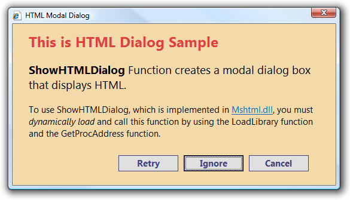

[ Home ](https://github.com/VFPX/Win32API)  

# Yet another modal dialog: now HTML-based

## Before you begin:
The ShowHTMLDialog displays modal dialog that is functionally similar to the dialogs created by MessageBox and TaskDialog functions.  

  
A very attractive feature of this dialog is its HTML-based content. The window title, and whole client part of the dialog are defined strictly in HTML terms. This is like a miniature IE window.  
  
***  


## Code:
```foxpro  
#DEFINE URL_MK_LEGACY 0
#DEFINE URL_MK_UNIFORM 1
DO declare

LOCAL cDlgDefinitionFile, cUrl, nUrlMoniker, cFeatures,;
	cArguments, cOutput, cDlgReturn

* the dialog definition is stored in local HTML file
cDlgDefinitionFile=LOWER(FULLPATH("dlgdefinition.html"))
IF NOT FILE(m.cDlgDefinitionFile)
	DO CreateDlgDefinitionFile WITH m.cDlgDefinitionFile
ENDIF

* create URL Moniker from the Url
cUrl=ToUnicode("file://" + m.cDlgDefinitionFile)
nUrlMoniker=0
IF CreateURLMonikerEx(0, cUrl, @nUrlMoniker, URL_MK_UNIFORM) <> 0
	RETURN  && failed
ENDIF

* ShowHTMLDialog input parameteres
cFeatures=ToUnicode("dialogWidth:340px;dialogHeight:130px;center:1;")
cArguments=ToUnicode("")
cOutput=REPLICATE(CHR(0), 256)
cDlgReturn=""

IF ShowHTMLDialog(_screen.HWnd, m.nUrlMoniker,;
		m.cArguments, m.cFeatures, @cOutput) = 0
	nAddr=buf2dword(SUBSTR(cOutput,9,4))
	IF m.nAddr <> 0
		cDlgReturn=FromUnicode( Mem2Str(nAddr) )
	ENDIF
ENDIF
? cDlgReturn
* end of main

PROCEDURE CreateDlgDefinitionFile(cFilename)
	LOCAL cHtml

* the HTML code is converted to base64 only because
* it is meant to be properly displayed on this web page;
* otherwise no need to do that
TEXT TO cHtml NOSHOW
PHRpdGxlPlVzaW5nIEhUTUwgRGlhbG9ncyBpbiBWaXN1
YWwgRm94UHJvPC90aXRsZT4NCjxzdHlsZT4NCi5EbGdC
b2R5IHsNCgliYWNrZ3JvdW5kLWNvbG9yOiAjZjVmNWQw
OyANCn0NCi5EbGdNc2cgew0KCWZvbnQtZmFtaWx5OiBT
ZWdvZSBVSSwgQXJpYWw7IA0KCWZvbnQtc2l6ZTogMTFw
dDsgDQoJY29sb3I6ICM2MDMwMzA7IA0KCXBvc2l0aW9u
OiBhYnNvbHV0ZTt0b3A6IDE1cHg7bGVmdDoyMHB4Ow0K
fQ0KLkRsZ0J1dHRvbnMgew0KICAgIHBvc2l0aW9uOiBh
YnNvbHV0ZTt0b3A6IDgwcHg7bGVmdDogMTYwcHg7DQp9
DQouRGxnQnRuIHsgDQoJZm9udC1mYW1pbHk6IFNlZ29l
IFVJLCBBcmlhbDsgDQoJZm9udC1zaXplOiAxMnB0OyAN
Cglmb250LXdlaWdodDogNzAwOw0KCWNvbG9yOiAjNzA0
MDQwOyANCgliYWNrZ3JvdW5kLWNvbG9yOiAjZDFhNWE1
OyANCglib3JkZXI6IDFweCBzb2xpZCAjOTA3MDYwOw0K
CXdpZHRoOiA3MHB4Ow0KCWhlaWdodDogMjdweDsNCn0N
Cjwvc3R5bGU+DQo8Ym9keSBjbGFzcz0iRGxnQm9keSI+
DQo8ZGl2IGNsYXNzPSJEbGdNc2ciPjxTdHJvbmc+U2hv
d0hUTUxEaWFsb2c8L1N0cm9uZz4gDQpGdW5jdGlvbiBj
cmVhdGVzIGEgbW9kYWwgZGlhbG9nIGJveCB0aGF0IGRp
c3BsYXlzIEhUTUwuPC9kaXY+DQo8ZGl2IGNsYXNzPSJE
bGdCdXR0b25zIj4NCjxpbnB1dCBjbGFzcz0iRGxnQnRu
IiBpZD0iYnRuT2siIHR5cGU9IlN1Ym1pdCIgdmFsdWU9
Ik9LIj4gDQo8aW5wdXQgY2xhc3M9IkRsZ0J0biIgaWQ9
ImJ0bkNhbmNlbCIgdHlwZT0iU3VibWl0IiB2YWx1ZT0i
Q2FuY2VsIj4gDQo8L2Rpdj4NCjxzY3JpcHQgZm9yPSJi
dG5PayIgZXZlbnQ9Im9uY2xpY2siPg0KCXdpbmRvdy5y
ZXR1cm5WYWx1ZT0iQWdyZWUiOw0KCXdpbmRvdy5jbG9z
ZSgpOw0KPC9zY3JpcHQ+DQo8c2NyaXB0IGZvcj0iYnRu
Q2FuY2VsIiBldmVudD0ib25jbGljayI+DQoJd2luZG93
LnJldHVyblZhbHVlPSJEaXNhZ3JlZSI7DQoJd2luZG93
LmNsb3NlKCk7DQo8L3NjcmlwdD4NCjwvYm9keT4=
ENDTEXT

	* converting back from base64 to normal text
	cHtml=STRCONV(m.cHtml,14)

	* saving to HTML file
	TRY
		SET SAFETY OFF
		STRTOFILE(m.cHtml, m.cFilename)
	CATCH
	FINALLY
		SET SAFETY ON
	ENDTRY

PROCEDURE declare
	DECLARE INTEGER CreateURLMonikerEx IN urlmon;
		INTEGER pMkCtx, STRING szURL,;
		INTEGER @ppmk, LONG dwFlags

	DECLARE INTEGER ShowHTMLDialog IN mshtml;
		INTEGER hwndParent, INTEGER pMk, STRING pvarArgIn,;
		STRING pchOptions, STRING @pvarArgOut

	DECLARE RtlMoveMemory IN kernel32 As MemToStr;
		STRING @, INTEGER, INTEGER

FUNCTION buf2dword(cBuffer)
RETURN Asc(SUBSTR(cBuffer, 1,1)) + ;
	BitLShift(Asc(SUBSTR(cBuffer, 2,1)),  8) +;
	BitLShift(Asc(SUBSTR(cBuffer, 3,1)), 16) +;
	BitLShift(Asc(SUBSTR(cBuffer, 4,1)), 24)

FUNCTION ToUnicode(cStr)
RETURN STRCONV(cStr+CHR(0), 5)

FUNCTION FromUnicode(cStr)
RETURN STRTRAN(STRCONV(cStr, 6), CHR(0), "")

FUNCTION Mem2Str(nBaseAddr As Number)
#DEFINE BUFFER_SIZE 16
#DEFINE EMPTY_BUFFER REPLICATE(CHR(0), BUFFER_SIZE)
* reads Unicode string from specified memory address

	IF nBaseAddr = 0
		RETURN ""
	ENDIF

	LOCAL nCurAddr, cResult, cBuffer, nPos
	nCurAddr=nBaseAddr
	cResult=""

	DO WHILE .T.
		cBuffer = EMPTY_BUFFER
		= MemToStr(@cBuffer, nCurAddr, BUFFER_SIZE)
		nPos = AT(CHR(0)+CHR(0), cBuffer)

		IF nPos > 0
			cResult = cResult + SUBSTR(cBuffer, 1, nPos)
			RETURN cResult
		ELSE
			cResult = cResult + cBuffer
			nCurAddr = m.nCurAddr + BUFFER_SIZE
		ENDIF
	ENDDO  
```  
***  


## Listed functions:
[CreateURLMonikerEx](../libraries/urlmon/CreateURLMonikerEx.md)  
[ShowHTMLDialog](../libraries/mshtml/ShowHTMLDialog.md)  
