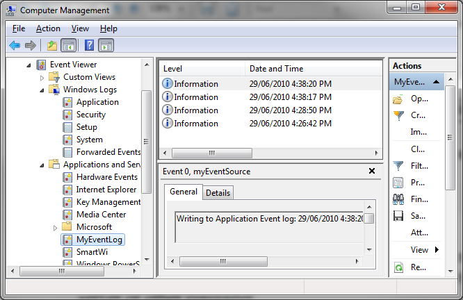

[ Home ](https://github.com/VFPX/Win32API)  

# Writing entries to custom Event Log

## Short description:
This code sample explains how to add entries to event logs using Event Logging API.  
***  


## Before you begin:
Before testing this code sample, [register custom event log](sample_563.md) **MyEventLog**. Without MyEventLog properly registered, the code will automatically target the Application log.  

  

See also:

* [Reading entries from Event logs](sample_524.md)  
* [Reading from INI files](sample_133.md)  
* [Writing to INI files](sample_137.md)  

  
***  


## Code:
```foxpro  
#DEFINE EVENTLOG_ERROR_TYPE 0x0001
#DEFINE EVENTLOG_WARNING_TYPE 0x0002
#DEFINE EVENTLOG_INFORMATION_TYPE 0x0004

LOCAL oEventWriter As EventWriter, cEventSource,;
	nEventType, nEventCategory, nEventId, cMessage

cEventSource = "MyEventSource"

oEventWriter = CREATEOBJECT("EventWriter",;
	m.cEventSource)

* make sure the custom event source is created;
* otherwise the Application will be targeted
? "Number of records in the log:",;
	oEventWriter.GetReccount()

* writing message to event log
nEventType = EVENTLOG_INFORMATION_TYPE
nEventCategory = 123
nEventId = 54321
cMessage = SYS(0) + " | " + VERSION() +;
	" | " + TRANSFORM(DATETIME())

IF oEventWriter.ReportEvent(nEventType,;
	nEventCategory, nEventId, cMessage)

	? "Event entry has been successfully added."
ELSE
	? "Error:", oEventWriter.errorcode
ENDIF
	
? "Number of records in the log:",;
	oEventWriter.GetReccount()
* end of main

DEFINE CLASS EventWriter As Session
PROTECTED EventSourceName, hEventLog
	EventSourceName=""
	hEventLog=0
	errorcode=0
	
PROCEDURE Init(cEventSourceName As String)
	WITH THIS
		.declare
		.EventSourceName = m.cEventSourceName
	ENDWITH

PROCEDURE Destroy
	THIS.CloseHandle

PROCEDURE GetHandle() As Number
RETURN THIS.hEventLog

PROCEDURE GetReccount() As Number
	LOCAL nReccount, nResult

	nReccount=0
	nResult = GetNumberOfEventLogRecords(;
		THIS.hEventLog, @nReccount)

	THIS.errorcode = IIF(m.nResult=0, GetLastError(), 0)
RETURN IIF(m.nResult=0, -1, m.nReccount)

PROCEDURE EventSourceName_ASSIGN(vValue As Variant)
	WITH THIS
		.EventSourceName = TRANSFORM(m.vValue)
		.OpenHandle
	ENDWITH

PROTECTED PROCEDURE CloseHandle
	IF THIS.hEventLog <> 0
		DeregisterEventSource(THIS.hEventLog)
		THIS.hEventLog = 0
	ENDIF

PROTECTED PROCEDURE OpenHandle
	WITH THIS
		.CloseHandle

		.hEventLog = RegisterEventSource(NULL,;
			.ToUnicode(.EventSourceName))

		.errorcode = IIF(.hEventLog=0, 0, GetLastError())
	ENDWITH

PROCEDURE ReportEvent(nEventType, nEventCategory,;
	nEventId, cMessage)
	
	LOCAL nResult, nMessageCount
	nMessageCount=1  && simplified: 1 row only
	
	LOCAL oMessage As PChar, oMessageArray As PChar

	* allocating the message in memory
	oMessage = CREATEOBJECT("PChar",;
		THIS.ToUnicode(m.cMessage))
	
	* storing the pointer to the message
	oMessageArray = CREATEOBJECT("PChar",;
		THIS.num2dword(oMessage.GetAddr()) )
	
	nResult = ReportEvent(THIS.hEventLog,;
		nEventType, nEventCategory, nEventId,;
		0, nMessageCount, 0,;
		oMessageArray.GetAddr(), 0 )
		
	THIS.errorcode = IIF(m.nResult=0, GetLastError(), 0)
RETURN (nResult != 0)

PROTECTED PROCEDURE declare
	DECLARE INTEGER GetLastError IN kernel32

	DECLARE INTEGER RegisterEventSourceW IN advapi32;
	AS RegisterEventSource;
		STRING lpUNCServerName,;
		STRING lpSourceName

	DECLARE INTEGER DeregisterEventSource IN advapi32;
		INTEGER hEventLog

	DECLARE INTEGER ReportEventW IN advapi32;
	AS ReportEvent;
		INTEGER hEventLog, INTEGER wType,;
		INTEGER wCategory, LONG dwEventID,;
		INTEGER lpUserSid, INTEGER wNumStrings,;
		LONG dwDataSize, INTEGER lpStrings,;
		INTEGER lpRawData

	DECLARE INTEGER GetNumberOfEventLogRecords IN advapi32;
		INTEGER hEventLog, LONG @NumberOfRecords

PROTECTED FUNCTION ToUnicode(cStr As String) As String
RETURN STRCONV(m.cStr + CHR(0), 5)

PROTECTED FUNCTION num2dword(lnValue)
#DEFINE m0 0x0000100
#DEFINE m1 0x0010000
#DEFINE m2 0x1000000
	IF lnValue < 0
		lnValue = 0x100000000 + lnValue
	ENDIF
	LOCAL b0, b1, b2, b3
	b3 = Int(lnValue/m2)
	b2 = Int((lnValue - b3*m2)/m1)
	b1 = Int((lnValue - b3*m2 - b2*m1)/m0)
	b0 = Mod(lnValue, m0)
RETURN Chr(b0)+Chr(b1)+Chr(b2)+Chr(b3)

ENDDEFINE

DEFINE CLASS PChar As Session
PROTECTED hMem

PROCEDURE Init(lcString)
	THIS.hMem = 0
	THIS.setValue(lcString)

PROCEDURE Destroy
	THIS.ReleaseString

FUNCTION GetAddr
RETURN THIS.hMem

FUNCTION GetValue
	LOCAL lnSize, lcBuffer
	lnSize = THIS.getAllocSize()
	lcBuffer = SPACE(lnSize)

	IF THIS.hMem <> 0
		DECLARE RtlMoveMemory IN kernel32 As MemToStr;
			STRING @, INTEGER, INTEGER
		= MemToStr(@lcBuffer, THIS.hMem, lnSize)
	ENDIF
RETURN lcBuffer

FUNCTION GetAllocSize
	DECLARE INTEGER GlobalSize IN kernel32 INTEGER hMem
RETURN Iif(THIS.hMem=0, 0, GlobalSize(THIS.hMem))

PROCEDURE SetValue(lcString)
#DEFINE GMEM_FIXED 0
#DEFINE GMEM_MOVEABLE 2
#DEFINE GMEM_ZEROINIT 0x0040

	THIS.ReleaseString

	DECLARE INTEGER GlobalAlloc IN kernel32;
		INTEGER, INTEGER

	DECLARE RtlMoveMemory IN kernel32 As StrToMem;
		INTEGER, STRING @, INTEGER

	LOCAL lnSize
	lcString = lcString + Chr(0)
	lnSize = Len(lcString)
	THIS.hMem = GlobalAlloc(0x0040, lnSize)
	IF THIS.hMem <> 0
		= StrToMem(THIS.hMem, @lcString, lnSize)
	ENDIF

PROCEDURE ReleaseString
	IF THIS.hMem <> 0
		DECLARE INTEGER GlobalFree IN kernel32 INTEGER
		= GlobalFree (THIS.hMem)
		THIS.hMem = 0
	ENDIF
ENDDEFINE  
```  
***  


## Listed functions:
[DeregisterEventSource](../libraries/advapi32/DeregisterEventSource.md)  
[GetLastError](../libraries/kernel32/GetLastError.md)  
[GetNumberOfEventLogRecords](../libraries/advapi32/GetNumberOfEventLogRecords.md)  
[GlobalAlloc](../libraries/kernel32/GlobalAlloc.md)  
[GlobalFree](../libraries/kernel32/GlobalFree.md)  
[GlobalSize](../libraries/kernel32/GlobalSize.md)  

***  

