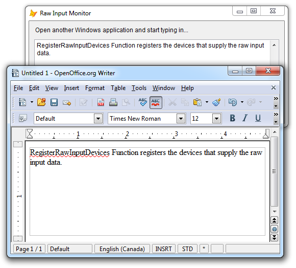

[ Home ](https://github.com/VFPX/Win32API)  

# Capturing keyboard activity of another application with the Raw Input API (VFP9)

## Note that this document contains some links to the old news2news website which does not work at the moment. This material will be available sometime in the future.

## Before you begin:
In this code sample, VFP form registers for receiving the [raw input](http://msdn.microsoft.com/en-us/library/ms645543(v=vs.85).aspx) from each and any keyboard type device connected to the computer. That includes keyboards, numeric keypads, keyboard wedge scanners and so on.  

The testing is simple. Any text typed in another Windows application (like text editor, spreadsheet, browser) will be duplicated in an EditBox on the VFP form.  
  
Note that this code sample requires VFP9 version of the <a href="http://msdn.microsoft.com/en-us/library/w42fek8t(VS.80).aspx">BINDEVENT()</a> function. The one that can handle [Windows messages](http://msdn.microsoft.com/en-us/library/ms644927(v=vs.85).aspx).  

See also:

<!-- Anatoliy --> 
* [LanguageBar ActiveX control](?solution=7)   
* [Enumerating raw input devices attached to the system](sample_571.md)  
* [Switching between keyboard layouts](sample_275.md)  
* [Disabling mouse and keyboard input for the main VFP window](sample_083.md)  
* [How to disable the Windows Clipboard](sample_488.md)  
* [Monitoring clipboard content changes](sample_601.md)  
  
***  


## Code:
```foxpro  
LOCAL oForm As RawInputMonitorForm
oForm = CREATEOBJECT("RawInputMonitorForm")
oForm.Visible=.T.
READ EVENTS
* end of main

DEFINE CLASS RawInputMonitorForm As Form
	Caption="Raw Input Monitor"
	Autocenter=.T.
	Width=500
	Height=200
	ShowWindow=2
	
	ADD OBJECT Label1 As Label WITH;
	Left=12, Top=10, Autosize=.T.,;
	Caption="Open another Windows application and start typing in..."

	ADD OBJECT txtInput As EditBox WITH;
	Left=10, Top=36, Width=480, Height=140

	ADD OBJECT InputDeviceMgr As RawInputDeviceManager

PROCEDURE Destroy
	CLEAR EVENTS

PROCEDURE InputDeviceMgr.OnKbdRawInput(lForeground As Boolean)
	IF m.lForeground
	* the VFP app is in foreground;
	* avoiding double input registering
		RETURN 1 && WM_INPUT not processed
	ENDIF

	ThisForm.txtInput.SetFocus

	* just a basic input processing
	* one may choose storing the raw input
	WITH THIS
		IF .kbdAsciiCode > 0
			DO CASE
			CASE .kbdAsciiCode = 8
				KEYBOARD "{BACKSPACE}"
			OTHERWISE
				KEYBOARD CHR(.kbdAsciiCode)
			ENDCASE
		ELSE
			DO CASE
			CASE .kbdVKey = 46
				KEYBOARD "{DEL}"
			ENDCASE
		ENDIF
	ENDWITH
RETURN 0  && WM_INPUT processed

ENDDEFINE

DEFINE CLASS RawInputDeviceManager As Custom
#DEFINE GWL_WNDPROC -4
#DEFINE WM_INPUT 0x00ff
#DEFINE RIDEV_INPUTSINK 0x00000100
#DEFINE RIM_INPUT 0
#DEFINE RIM_INPUTSINK 1
#DEFINE RID_HEADER 0x10000005
#DEFINE RID_INPUT 0x10000003
#DEFINE RIM_TYPEMOUSE 0
#DEFINE RIM_TYPEKEYBOARD 1
#DEFINE RIM_TYPEHID 2
#DEFINE RAWINPUTDEVICE_SIZE 12
#DEFINE RAWINPUTHEADER_SIZE 16
#DEFINE RAWINPUT_KEYBOARD_SIZE 32

PROTECTED devices, hOrigProc
	devices=NULL
	hWindow=0
	hOrigProc=0

	* RAWINPUTHEADER Structure
	dwType=0
	dwSize=0
	hDevice=0
	wParam=0

	* RAWKEYBOARD Structure
	kbdMakeCode=0
	kbdFlags=0
	kbdVKey=0
	kbdMessage=0
	kbdExtraInformation=0
	
	kbdAsciiCode=0

PROCEDURE Init
	WITH THIS
		.declare
		.devices = CREATEOBJECT("RawInputDevices")
		.hWindow = ThisForm.HWnd
		DOEVENTS

		* add keyboard device type
		.devices.AddDevice(1, 6, RIDEV_INPUTSINK, .hWindow)
		.RegisterDevices
	ENDWITH

PROCEDURE hWindow_ASSIGN( nHWnd As Number )
	WITH THIS
		.hWindow = m.nHWnd
		.hOrigProc = GetWindowLong(.hWindow, GWL_WNDPROC)
	ENDWITH

PROCEDURE Destroy
	IF THIS.hWindow <> 0
		= UNBINDEVENTS(THIS.hWindow)
	ENDIF

PROCEDURE RegisterDevices
	LOCAL nResult, nPointer, cBuffer

	cBuffer = THIS.devices.ToString()

	* registers raw input devices
	* with this application
	nResult = RegisterRawInputDevices(;
		@cBuffer, THIS.devices.Count,;
		RAWINPUTDEVICE_SIZE)

	IF VERSION(5) >= 900  && VFP9+
		= BINDEVENT( THIS.hWindow, WM_INPUT,;
			THIS, "WindowProc" )
	ENDIF

PROCEDURE WindowProc(hWindow as Integer, nMsgID as Integer,;
	wParam as Integer, lParam as Integer)
* requires VFP9, otherwise ignored
	LOCAL nReturn
	nReturn=0
	
	DO CASE
	CASE nMsgID = WM_INPUT
	* wParam: 0=app in foreground, 1=app not in foreground
	* lParam: a handle to the RAWINPUT structure
		IF THIS.ProcessRawInput( m.lParam )
			nReturn = THIS.OnKbdRawInput( wParam=0 )
		ELSE
			nReturn=1 && WM_INPUT not processed
		ENDIF

		IF m.nReturn <> 0
			nReturn = CallWindowProc(;
				THIS.hOrigProc, THIS.hWindow,;
				m.nMsgID, m.wParam, m.lParam)
		ENDIF

	OTHERWISE
	* pass control to the original window procedure
		nReturn = CallWindowProc(THIS.hOrigProc, THIS.hWindow,;
			m.nMsgID, m.wParam, m.lParam)
	ENDCASE
RETURN nReturn

PROCEDURE OnKbdRawInput(lForeground As Boolean)
* lForeground - the form is in foreground
* a placeholder
RETURN 1  && WM_INPUT not processed

PROCEDURE ProcessRawInput(hRawinput As Number)
	LOCAL nBufsize, cHeader, cRawdata

*!*		nBufsize=0
*!*		GetRawInputData(m.hRawinput, RID_INPUT,;
*!*			NULL, @nBufsize, RAWINPUTHEADER_SIZE)

	nBufsize=RAWINPUT_KEYBOARD_SIZE
	cRawdata = REPLICATE(CHR(0), nBufsize)

	= GetRawInputData(m.hRawinput, RID_INPUT,;
		@cRawdata, @nBufsize, RAWINPUTHEADER_SIZE)

	WITH THIS
		.dwType = buf2dword(SUBSTR(m.cRawdata,1,4))
		.dwSize = buf2dword(SUBSTR(m.cRawdata,5,4))
		.hDevice = buf2dword(SUBSTR(m.cRawdata,9,4))
		.wParam = buf2dword(SUBSTR(m.cRawdata,13,4))

		IF .dwType = RIM_TYPEKEYBOARD
			.kbdFlags = buf2word(SUBSTR(m.cRawdata,19,2))
			
			* Process keystrokes on KeyDown
			IF INLIST(.kbdFlags, 0, 2)
				.kbdMakeCode = buf2word(SUBSTR(m.cRawdata,17,2))
				.kbdVKey = buf2word(SUBSTR(m.cRawdata,23,2))
				.kbdMessage = buf2dword(SUBSTR(m.cRawdata,25,4))
				.kbdExtraInformation = buf2dword(SUBSTR(m.cRawdata,29,4))

				.kbdAsciiCode = VKeyToASCII(;
					.kbdVKey, .kbdMakeCode )
				RETURN .T.
			ENDIF
		ENDIF
	ENDWITH
RETURN .F.

PROCEDURE declare
	DECLARE INTEGER GetLastError IN kernel32

	DECLARE INTEGER GetWindowLong IN user32;
		INTEGER hWindow, INTEGER nIndex

	DECLARE INTEGER CallWindowProc IN user32;
		INTEGER lpPrevWndFunc, INTEGER hWindow,;
		LONG Msg, INTEGER wParam, INTEGER lParam

	DECLARE INTEGER RegisterRawInputDevices IN user32;
		STRING @pRawInputDevices, LONG uiNumDevices,;
		LONG cbSize

	DECLARE INTEGER GetRawInputData IN user32;
		INTEGER hRawInput, LONG uiCommand,;
		STRING @pData, LONG @pcbSize,;
		LONG cbSizeHeader

	DECLARE INTEGER GetKeyboardState IN user32;
		STRING @lpKeyState

	DECLARE INTEGER MapVirtualKey IN user32;
		LONG uCode, LONG uMapType

	DECLARE INTEGER ToAscii IN user32;
		LONG uVirtKey, LONG uScanCode,;
		STRING @lpKeyState, INTEGER @lpChar,;
		LONG uFlags

ENDDEFINE

DEFINE CLASS RawInputDevices As Collection

PROCEDURE AddDevice( usUsagePage As Number,;
	usUsage As Number, dwFlags As Number,;
	hWindow As Number)
	
	LOCAL cDeviceBuffer

	cDeviceBuffer = num2word(m.usUsagePage) +;
			num2word(m.usUsage) + num2dword(m.dwFlags) +;
			num2dword(m.hWindow)

	THIS.Add( m.cDeviceBuffer )

FUNCTION ToString() As String
	LOCAL cBuffer, cDeviceBuffer
	cBuffer=""
	FOR EACH cDeviceBuffer IN THIS
		cBuffer = m.cBuffer + m.cDeviceBuffer
	NEXT
RETURN m.cBuffer

ENDDEFINE

************** library functions **************

FUNCTION VKeyToASCII( nVirtKey As Number,;
	nScanCode As Number ) As Number
* converts virtual key to ASCII code
	nAsciiCode=0
	cKeyboardState = REPLICATE(CHR(0), 256)
	GetKeyboardState( @cKeyboardState )

	= ToAscii( m.nVirtKey, nScanCode,;
		@cKeyboardState, @nAsciiCode, 0)

RETURN m.nAsciiCode

FUNCTION buf2dword(cBuffer)
RETURN Asc(SUBSTR(cBuffer, 1,1)) + ;
	BitLShift(Asc(SUBSTR(cBuffer, 2,1)),  8) +;
	BitLShift(Asc(SUBSTR(cBuffer, 3,1)), 16) +;
	BitLShift(Asc(SUBSTR(cBuffer, 4,1)), 24)

FUNCTION buf2word(lcBuffer)
RETURN Asc(SUBSTR(lcBuffer, 1,1)) + ;
       Asc(SUBSTR(lcBuffer, 2,1)) * 256

FUNCTION num2dword(lnValue)
#DEFINE m0 0x0000100
#DEFINE m1 0x0010000
#DEFINE m2 0x1000000
	IF lnValue < 0
		lnValue = 0x100000000 + lnValue
	ENDIF
	LOCAL b0, b1, b2, b3
	b3 = Int(lnValue/m2)
	b2 = Int((lnValue - b3*m2)/m1)
	b1 = Int((lnValue - b3*m2 - b2*m1)/m0)
	b0 = Mod(lnValue, m0)
RETURN Chr(b0)+Chr(b1)+Chr(b2)+Chr(b3)

FUNCTION num2word(lnValue)
RETURN Chr(MOD(m.lnValue,256)) + CHR(INT(m.lnValue/256))  
```  
***  


## Listed functions:
[CallWindowProc](../libraries/user32/CallWindowProc.md)  
[GetKeyboardState](../libraries/user32/GetKeyboardState.md)  
[GetLastError](../libraries/kernel32/GetLastError.md)  
[GetRawInputData](../libraries/user32/GetRawInputData.md)  
[GetWindowLong](../libraries/user32/GetWindowLong.md)  
[MapVirtualKey](../libraries/user32/MapVirtualKey.md)  
[RegisterRawInputDevices](../libraries/user32/RegisterRawInputDevices.md)  
[ToAscii](../libraries/user32/ToAscii.md)  

## Comment:
By default, no application receives the <a href="http://msdn.microsoft.com/en-us/library/ms645543(v=vs.85).aspx">raw input</a>. To start receiving it, an application must register a device type it expects to get a data from. After registering, the application receives the raw input in the form of <a href="http://msdn.microsoft.com/en-us/library/ms645590(v=vs.85).aspx">WM_INPUT</a> messages.  
  
User input may come not just from the keyboard and the mouse, but also from joystick, touch screen, microphone, and other devices collectively known as <a href="http://en.wikipedia.org/wiki/Human_interface_device">Human Interface Devices</a> (HIDs).  
  
Similar functionality can be implemented via global keyboard and mouse hooks.   
  
In case of same type multiple input devices, the Raw Input API has means to *separate* the input (i.g. keystrokes, mouse events) by their source.  
  
***  

