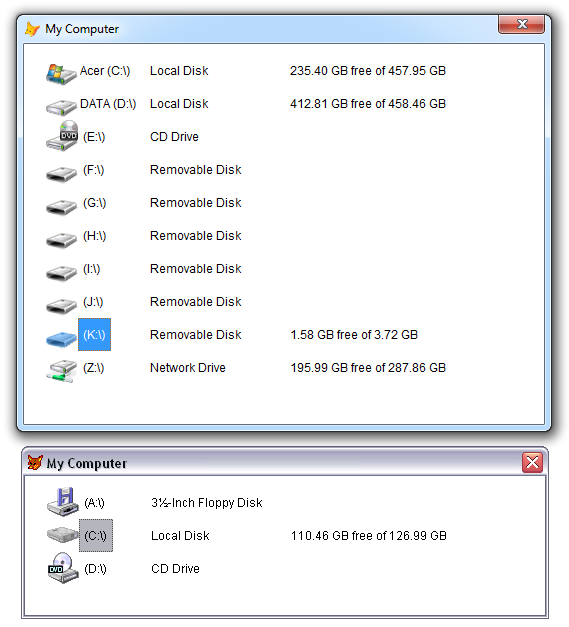
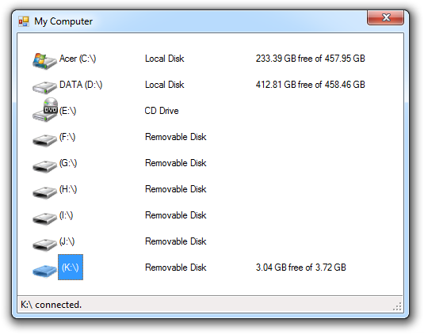

[ Home ](https://github.com/VFPX/Win32API)  

# Detecting changes in connections to removable drives (VFP9)

## Before you begin:
VFP application can receive system notifications when a disk drive gets connected or disconnected (USB, network drive).  

In this code sample, a ListView control on VFP form displays available disk drives using matching icons and descriptions.   
  
Note that this code sample requires VFP9 version of the [BINDEVENT()](http://msdn.microsoft.com/en-us/library/w42fek8t(VS.80).aspx) function. The one that can handle [Windows messages](http://msdn.microsoft.com/en-us/library/ms644927(v=vs.85).aspx).

See also:

* [Disconnecting USB Mass Storage Device programmatically](sample_553.md)  
* [Mapping and disconnecting network drives](sample_387.md)  
* [Enumerating Volumes and Volume Mounting Points](sample_087.md)  
  
***  


## Code:
```foxpro  
PUBLIC oForm As Explorer
oForm = CREATEOBJECT("MyComputerForm")
oForm.Visible=.T.
* end of main

DEFINE CLASS MyComputerForm As Form
	Width=520
	Height=380
	MinButton=.F.
	MaxButton=.F.
	AutoCenter=.T.
	Caption="My Computer"
	Backcolor=RGB(255,255,255)
	ShowWindow=2

	ADD OBJECT lst As StorageDeviceList WITH;
	Left=20, Top=10, Width=470, Height=340, Anchor=15
ENDDEFINE

DEFINE CLASS StorageDeviceList As OleControl
#DEFINE GWL_WNDPROC -4
#DEFINE GWL_STYLE -16
#DEFINE MAX_PATH 260
#DEFINE LVM_FIRST 0x1000
#DEFINE LVM_GETIMAGELIST (LVM_FIRST + 2)
#DEFINE LVM_SETIMAGELIST (LVM_FIRST + 3)
#DEFINE LVM_SETITEM (LVM_FIRST + 6)
#DEFINE LVIF_IMAGE 0x0002
#DEFINE LVS_SHAREIMAGELISTS 0x0040
#DEFINE LVSIL_SMALL 1
#DEFINE LVSIL_NORMAL 0
#DEFINE SHGFI_SMALLICON 0x000000001
#DEFINE SHGFI_LARGEICON 0
#DEFINE SHGFI_ICON 0x000000100
#DEFINE SHGFI_TYPENAME 0x000000400
#DEFINE SHGFI_SYSICONINDEX 0x000004000
#DEFINE SHGFI_USEFILEATTRIBUTES 0x000000010
#DEFINE FILE_ATTRIBUTE_NORMAL 0x00000080
#DEFINE WM_DEVICECHANGE 0x0219
#DEFINE DBT_DEVICEARRIVAL 0x8000
#DEFINE DBT_DEVICEREMOVECOMPLETE 0x8004
#DEFINE DBT_DEVTYP_VOLUME 0x0002

	OleClass="MSComctlLib.ListViewCtrl"
	IconMode=1  && 0=small, 1=large
	hWindow=0
	hOrigProc=0

PROCEDURE Init
	WITH THIS
		.View=3
		.LabelEdit=1
		.HideColumnHeaders=1
		.BorderStyle=0
		.Appearance=0
		.AddColumnHeader("Name", 100)
		.AddColumnHeader("Type", 140)
		.AddColumnHeader("Size", 180)
		.declare
		.hWindow = _vfp.HWnd
		.PopulateList
	ENDWITH
	= BINDEVENT(ThisForm, "GotFocus",;
		THIS, "SwitchToSystemList")

PROCEDURE hWindow_ASSIGN( nHWnd As Number )
	WITH THIS
		.hWindow = m.nHWnd
		.hOrigProc = GetWindowLong(.hWindow, GWL_WNDPROC)
		IF VERSION(5) >= 900  && VFP9+
			= BINDEVENT( .hWindow, WM_DEVICECHANGE, THIS, "WinProc" )
		ENDIF
	ENDWITH

PROCEDURE WinProc(hWindow as Integer, nMsgID as Integer,;
	wParam as Integer, lParam as Integer)
* requires VFP9, otherwise ignored
	LOCAL nReturn
	nReturn=0
	
	DO CASE
	CASE nMsgID = WM_DEVICECHANGE
		THIS.OnDeviceEvent( nMsgID, wParam, lParam )
		RETURN 1

	OTHERWISE
	* pass control to the original window procedure
		nReturn = CallWindowProc(THIS.hOrigProc, THIS.hWindow,;
			m.nMsgID, m.wParam, m.lParam)
	ENDCASE
RETURN nReturn

PROCEDURE OnDeviceEvent(nMsgID as Integer,;
	wParam as Integer, lParam as Integer)

	IF INLIST(wParam, DBT_DEVICEARRIVAL, DBT_DEVICEREMOVECOMPLETE )
		LOCAL oVolume As DEV_BROADCAST_VOLUME
		oVolume = CREATEOBJECT("DEV_BROADCAST_VOLUME", m.lParam)

		IF oVolume.dbcv_devicetype = DBT_DEVTYP_VOLUME
			WAIT WINDOW NOWAIT "Volume " +;
				oVolume.DriveLetter+":\ " +;
				IIF(wParam=DBT_DEVICEARRIVAL, "added", "removed")

			THIS.PopulateList
		ENDIF
	ENDIF

PROCEDURE AddColumnHeader(cCaption, nWidth)
	WITH THIS.ColumnHeaders.Add()
		.Text=cCaption
		.Width=nWidth
	ENDWITH

PROCEDURE SwitchToSystemList
	LOCAL nWStyle, hSysImgList, nResult,;
		cBuffer, nIconFlags, nImgListType
		
	nIconFlags = BITOR(SHGFI_SYSICONINDEX, SHGFI_ICON,;
		SHGFI_TYPENAME, SHGFI_USEFILEATTRIBUTES)

	WITH THIS
		IF .IconMode = 0
		* small icons
			nImgListType = LVSIL_SMALL
			nIconFlags = BITOR(nIconFlags, SHGFI_SMALLICON)
		ELSE
		* large icons
			nImgListType = LVSIL_NORMAL
			nIconFlags = BITOR(nIconFlags, SHGFI_LARGEICON)
		ENDIF

		* check if the system list is already assigned
		IF SendMessage(.HWND, LVM_GETIMAGELIST, nImgListType, 0) = 0
			nWStyle = GetWindowLong(.HWND, GWL_STYLE)
			SetWindowLong(.HWND, GWL_STYLE,;
				BITOR(m.nWStyle, LVS_SHAREIMAGELISTS))

			cBuffer = REPLICATE(CHR(0), 1024)
			hSysImgList = SHGetFileInfo("", FILE_ATTRIBUTE_NORMAL,;
				@cBuffer, LEN(cBuffer), nIconFlags)

			= SendMessage(.HWND, LVM_SETIMAGELIST, LVSIL_SMALL, 0)
			= INKEY(0.1) && a small delay is required
			= SendMessage(.HWND, LVM_SETIMAGELIST,;
				LVSIL_SMALL, hSysImgList)
		ENDIF
	ENDWITH

PROCEDURE PopulateList
	LOCAL nCount, nIndex
	THIS.ListItems.Clear
	FOR nIndex = ASC("A") TO ASC("Z")
		IF GetDriveType(CHR(m.nIndex) + ":") > 1
			THIS.AddLstItem( CHR(m.nIndex) )
		ENDIF
	NEXT

PROCEDURE AddLstItem( cDriveLetter )
	LOCAL cRootName, nTypeIndex, cDriveType, oItem,;
		oVolumeInfo As VolumeInfo

	cRootName=cDriveLetter+":\"
	nTypeIndex=0
	cDriveType=""
	oVolumeInfo = CREATEOBJECT("VolumeInfo",;
		m.cRootName)
	
	THIS.GetFileTypeInfo(m.cRootName, @nTypeIndex,;
		@cDriveType, FILE_ATTRIBUTE_NORMAL)

	oItem = THIS.ListItems.Add(,,oVolumeInfo.VolumeName +;
			" (" + cRootName + ")")

	WITH oItem
		THIS.SetIcon(.Index, m.nTypeIndex)
		.Subitems(1) = m.cDriveType
		.Subitems(2) = oVolumeInfo.FormatDriveSize()
	ENDWITH

PROCEDURE SetIcon(nItemIndex, nImgIndex)
* ListItem icon set by specified system image list index
    LOCAL cItemBuffer  && LVITEM structure

    cItemBuffer = num2dword(LVIF_IMAGE) +;
    	num2dword(nItemIndex-1) + num2dword(0) + num2dword(0) +;
    	num2dword(0) + num2dword(0) + num2dword(0) +;
    	num2dword(nImgIndex) + num2dword(0)

    = SendMessageS(THIS.hWnd , LVM_SETITEM, 0, @cItemBuffer)

PROCEDURE GetFileTypeInfo(cFilename, nTypeIndex,;
	cFileType, nFileAttr)
* Obtains icon and description for the specified file type
	LOCAL nBufsize, cBuffer, nFlags, hIcon, nTypeIndex

	nBufsize=0x200
	cBuffer = REPLICATE(CHR(0), nBufsize)
	nFlags = BITOR(SHGFI_SYSICONINDEX,;
		SHGFI_SMALLICON, SHGFI_ICON, SHGFI_TYPENAME,;
		SHGFI_USEFILEATTRIBUTES)

	= SHGetFileInfo(m.cFilename, m.nFileAttr,;
		@cBuffer, nBufsize, nFlags)
	
	hIcon = buf2dword(SUBSTR(cBuffer, 1, 4))
	nTypeIndex = buf2dword(SUBSTR(cBuffer,5, 4))
	cFileType = STRTRAN(SUBSTR(m.cBuffer,13+MAX_PATH), CHR(0),"")
	IF hIcon <> 0
		= DestroyIcon(hIcon)
	ENDIF

PROCEDURE declare
	DECLARE INTEGER DestroyIcon IN user32 INTEGER hIcon
	DECLARE INTEGER GetDriveType IN kernel32 STRING nDrive

	DECLARE INTEGER SHGetFileInfo IN shell32;
		STRING pszPath, LONG dwFileAttributes,;
		STRING @psfi, LONG cbFileInfo, LONG uFlags

	DECLARE INTEGER SendMessage IN user32;
		INTEGER hWindow, INTEGER Msg,;
		INTEGER wParam, INTEGER lParam

	DECLARE INTEGER SendMessage IN user32 AS SendMessageS;
		INTEGER hWindow, INTEGER Msg,;
		INTEGER wParam, STRING @lParam

	DECLARE INTEGER SetWindowLong IN user32;
		INTEGER hWindow, INTEGER nIndex, INTEGER dwNewLong

	DECLARE INTEGER GetWindowLong IN user32;
		INTEGER hWindow, INTEGER nIndex

	DECLARE INTEGER CallWindowProc IN user32;
		INTEGER lpPrevWndFunc, INTEGER hWindow,;
		LONG Msg, INTEGER wParam, INTEGER lParam

	DECLARE RtlMoveMemory IN kernel32 As MemToStr;
		STRING @, INTEGER, INTEGER

	DECLARE SHORT GetVolumeInformation IN kernel32;
		STRING lcRootPathName, STRING @lpVolumeNameBuffer,;
		INTEGER nVolumeNameSize, INTEGER @lpVolumeSerialNo,;
		INTEGER @lpMaxComponentLen, INTEGER @lpFlags,;
		STRING @lpFileSystemNameBuffer, INTEGER nFileSystemNameSize

	DECLARE SHORT GetDiskFreeSpace IN kernel32;
		STRING lpRootPathName, INTEGER @lpSectorsPerCluster,;
		INTEGER @lpBytesPerSector, INTEGER @lpFreeClusterCount,;
		INTEGER @lpTotalClusterCount
ENDDEFINE

DEFINE CLASS VolumeInfo As Relation
	VolumeName=""
	VolumeSerialNo=0
	DiskSize=0
	DiskFreeSpace=0

PROCEDURE Init( cRoot As String )
	LOCAL cVolumeName, nVolumeSerialNo, nMaxComponentLen,;
		nFileSystemFlags, cFileSystemName, nSectorsPerCluster,;
		nBytesPerSector, nFreeClusterCount, nTotalClusterCount

	STORE REPLICATE(CHR(0), 250) TO;
		cVolumeName, cFileSystemName

	STORE 0 TO nVolumeSerialNo, nMaxComponentLen,;
		nFileSystemFlags, nSectorsPerCluster, nBytesPerSector,;
		nFreeClusterCount, nTotalClusterCount

	IF GetVolumeInformation( m.cRoot, @cVolumeName,;
		LEN(cVolumeName), @nVolumeSerialNo,;
		@nMaxComponentLen, @nFileSystemFlags,;
		@cFileSystemName, LEN(cFileSystemName) ) <> 0

		= GetDiskFreeSpace( m.cRoot, @nSectorsPerCluster,;
			@nBytesPerSector, @nFreeClusterCount,;
			@nTotalClusterCount )
	ENDIF

	WITH THIS
		.VolumeName = STRTRAN(m.cVolumeName, CHR(0), "")
		.VolumeSerialNo = m.nVolumeSerialNo
		.DiskSize = nTotalClusterCount *;
			nSectorsPerCluster * nBytesPerSector
		.DiskFreeSpace = nFreeClusterCount *;
			nSectorsPerCluster * nBytesPerSector
	ENDWITH

FUNCTION FormatDriveSize() As String
	IF THIS.DiskSize = 0
		RETURN ""
	ELSE
		RETURN;
			LTRIM(STR(THIS.DiskFreeSpace/0x40000000,12,2)) +;
			" GB free of " +;
			LTRIM(STR(THIS.DiskSize/0x40000000,12,2)) + " GB"
	ENDIF

ENDDEFINE

DEFINE CLASS DEV_BROADCAST_VOLUME As Relation
#DEFINE DEV_BROADCAST_VOLUME_SIZE 22
	dbcv_size=0
	dbcv_devicetype=0
	dbcv_reserved=0
	dbcv_unitmask=0
	dbcv_flags=0
	DriveLetter=""

PROCEDURE Init(nPtr As Number)
	LOCAL cBuffer, nBitIndex
	cBuffer = REPLICATE(CHR(0), DEV_BROADCAST_VOLUME_SIZE)
	MemToStr( @cBuffer, m.nPtr, DEV_BROADCAST_VOLUME_SIZE )

	WITH THIS
		.dbcv_size = buf2dword(SUBSTR(m.cBuffer,1,4))
		.dbcv_devicetype = buf2dword(SUBSTR(m.cBuffer,5,4))
		.dbcv_reserved = buf2dword(SUBSTR(m.cBuffer,9,4))
		.dbcv_unitmask = buf2dword(SUBSTR(m.cBuffer,13,4))
		.dbcv_flags = buf2word(SUBSTR(m.cBuffer,17,2))
		FOR nBitIndex=0 TO 25
			IF BITTEST(.dbcv_unitmask, nBitIndex)
				.DriveLetter = CHR(ASC("A") + m.nBitIndex)
			ENDIF
		NEXT
	ENDWITH
ENDDEFINE

************** library functions **************
FUNCTION buf2dword(cBuffer)
RETURN Asc(SUBSTR(cBuffer, 1,1)) + ;
	BitLShift(Asc(SUBSTR(cBuffer, 2,1)),  8) +;
	BitLShift(Asc(SUBSTR(cBuffer, 3,1)), 16) +;
	BitLShift(Asc(SUBSTR(cBuffer, 4,1)), 24)

FUNCTION buf2word(lcBuffer)
RETURN Asc(SUBSTR(lcBuffer, 1,1)) + ;
       Asc(SUBSTR(lcBuffer, 2,1)) * 256

FUNCTION num2dword(lnValue)
#DEFINE m0 0x0000100
#DEFINE m1 0x0010000
#DEFINE m2 0x1000000
	IF lnValue < 0
		lnValue = 0x100000000 + lnValue
	ENDIF
	LOCAL b0, b1, b2, b3
	b3 = Int(lnValue/m2)
	b2 = Int((lnValue - b3*m2)/m1)
	b1 = Int((lnValue - b3*m2 - b2*m1)/m0)
	b0 = Mod(lnValue, m0)
RETURN Chr(b0)+Chr(b1)+Chr(b2)+Chr(b3)  
```  
***  


## Listed functions:
[CallWindowProc](../libraries/user32/CallWindowProc.md)  
[DestroyIcon](../libraries/user32/DestroyIcon.md)  
[GetDiskFreeSpace](../libraries/kernel32/GetDiskFreeSpace.md)  
[GetDriveType](../libraries/kernel32/GetDriveType.md)  
[GetVolumeInformation](../libraries/kernel32/GetVolumeInformation.md)  
[GetWindowLong](../libraries/user32/GetWindowLong.md)  
[SHGetFileInfo](../libraries/shell32/SHGetFileInfo.md)  
[SendMessage](../libraries/user32/SendMessage.md)  
[SetWindowLong](../libraries/user32/SetWindowLong.md)  

## Comment:
The <a href="http://msdn.microsoft.com/en-us/library/aa363480(v=vs.85).aspx">WM_DEVICECHANGE</a> message notifies an application of a change to the hardware configuration of the computer.  
  
Upon locking and ejection of removable storage devices (not limited to), the system broadcasts the WM_DEVICECHANGE message to notify applications and device drivers about changes in the configuration.   
  
Examples of events that trigger the broadcasting of WM_DEVICECHANGE message:  
  
* USB flash drive inserted or ejected  
* external hard drive connected to USB port, or ejected  
* network drive mapped or disconnected  
* CD inserted in CD drive, or ejected  
  
The main Visual FoxPro window ( <a href="http://msdn.microsoft.com/en-US/library/7cx3y946(v=VS.80).aspx">_vfp.HWnd</a> ) and any top-level form ( <a href="http://msdn.microsoft.com/en-US/library/h0ea0kz8(v=VS.80).aspx">ShowWindow=2</a>, ThisForm.HWnd ) normally receive WM_DEVICECHANGE messages.  
  
VFP application can also deny or grant system requests for device removal (*yet to be covered in this or another code sample*).  
  
* * *  
.NET version of this code sample:

***  
An installation CD/DVD disk may contain *Autorun.inf* file. Here is an example of the content.   
```txt
[AutoRun]  
open=Setup.exe  
icon=Setup.exe  
label=Linksys Router Setup  
action=@Setup.exe,-10001
```
  
It makes sense, *and Windows Explorer apparently behaves this way*, depicting a device using whenever available the *AutoRun.Label* string, and the icon retrieved from the file the *AutoRun.Open* points at.   
  
Use GetPrivateProfileString function for retrieving values from *.ini* and *.inf* files.  
  
***  
MIcrosoft Support, Article 163503. <a href="http://support.microsoft.com/kb/163503">How to receive notification of CD-ROM insertion or removal</a>  
  
***  

