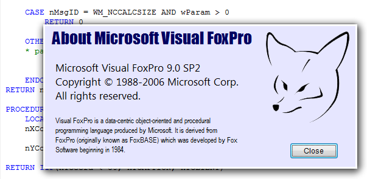

[ Home ](https://github.com/VFPX/Win32API)  

# Customizing the frame of top-level form: removing the standard frame (VFP9, Vista)

## Before you begin:
This minimalistic looking *About* form is created by calling the DwmExtendFrameIntoClientArea, and subsequent processing of the [WM_NCCALCSIZE](http://msdn.microsoft.com/en-us/library/ms632634(v=vs.85).aspx) and [WM_NCHITTEST](http://msdn.microsoft.com/en-us/library/ms645618(v=vs.85).aspx) windows messages.  

  

See also:

* [How to draw a custom Window Caption on FoxPro form](sample_499.md)  
* [Semi-transparent Form](sample_453.md)  
  
***  


## Code:
```foxpro  
LOCAL oForm As TestForm
oForm = CREATEOBJECT("AboutForm")
oForm.Visible=.T.
READ EVENTS
* end of main

DEFINE CLASS AboutForm As Form

#DEFINE GWL_WNDPROC -4
#DEFINE GW_CHILD 5

#DEFINE WM_NCHITTEST 0x0084
#DEFINE WM_NCCALCSIZE 0x0083

#DEFINE HTCLIENT 1
#DEFINE HTCAPTION 2

	Autocenter=.T.
	AlwaysOnTop=.T.
	ShowWindow=2
	Width=500
	Height=200
	Backcolor=RGB(230,230,255)

	hWindow=0
	hOrigProc=0
	hClientWindow=0

	ADD OBJECT Image1 As Image WITH;
	Left=360, Top=8, Picture="foxpro_transp.png";
	
	ADD OBJECT LabelAbout As Label WITH;
	Left=10, Top=5, Autosize=.T.,;
	Caption=" About Microsoft Visual FoxPro",;
	FontName="Impact", FontSize=20,;
	Backstyle=0, ForeColor=RGB(0,0,96)
	
	ADD OBJECT LabelCopyright As Label WITH;
	Left=20, Top=60, Width=500, Height=200,;
	Caption="Microsoft Visual FoxPro 9.0 SP2"+CHR(13)+;
		"Copyright � 1988-2006 Microsoft Corp."+CHR(13)+;
		"All rights reserved.",;
	FontName="Segoe UI", FontSize=13,;
	Backstyle=0, ForeColor=RGB(0,0,0)
	
	ADD OBJECT LabelInfo As Label WITH;
	Left=20, Top=150, Width=300, Height=200, WordWrap=.T.,;
	Caption="Visual FoxPro is a data-centric object-oriented " +;
		"and procedural programming language produced by Microsoft. " +;
		"It is derived from FoxPro (originally known as FoxBASE) " +;
		"which was developed by Fox Software beginning in 1984.",;
	FontName="Arial Narrow", FontSize=9,;
	Backstyle=0, ForeColor=RGB(0,0,0)

	ADD OBJECT cmdClose As CommandButton WITH;
	Left=405, Top=195, Width=80, Height=27,;
	Caption="Close", Default=.T.

PROCEDURE Init
	IF VAL(OS(3)) < 6  && Vista and up
		RETURN .F.
	ENDIF
	THIS.declare

PROCEDURE Destroy
	CLEAR EVENTS

PROCEDURE KeyPress
LPARAMETERS nKeyCode, nShiftAltCtrl
	IF nKeyCode = 27
		THIS.Release
	ENDIF

PROCEDURE Activate
	WITH THIS
		IF .hWindow = 0
			IF .ShowWindow = 2
				.hClientWindow = GetWindow(.HWnd, GW_CHILD)
			ENDIF
			.ExtendFrame
			.hWindow = .HWnd
			.Width = .Width + 1
			.Width = .Width - 1
		ENDIF
	ENDWITH

PROCEDURE cmdClose.Click
	ThisForm.Release

PROCEDURE hWindow_ASSIGN( nHWnd As Number )
	WITH THIS
		.hWindow = m.nHWnd
		
		* saving the address of the original
		* window procedure
		.hOrigProc = GetWindowLong(.hWindow, GWL_WNDPROC)

		IF VERSION(5) >= 900  && VFP9+
		* the following windows messages will be trapped
		* for the specified window handles
		
			= BINDEVENT( .hWindow, WM_NCCALCSIZE,;
				THIS, "WindowProc" )

			* note the difference between handling
			* the top-level forms and the child forms
			= BINDEVENT( IIF(.ShowWindow=2,;
				.hClientWindow, .hWindow),;
				WM_NCHITTEST, THIS, "WindowProc" )
		ENDIF
	ENDWITH

PROCEDURE ExtendFrame
* Extends the window frame behind the client area
	LOCAL cMargins
	
	* left, right, top, bottom
	cMargins =;
		num2dword(3) +;
		num2dword(3) +;
		num2dword(3) +;
		num2dword(3)

	nResult = DwmExtendFrameIntoClientArea(;
		THIS.HWnd, @cMargins)

PROCEDURE WindowProc(hWindow as Integer,;
	nMsgID as Integer, wParam as Integer, lParam as Integer)
* requires VFP9, otherwise ignored

	LOCAL nReturn
	nReturn=0
	
	DO CASE

	CASE nMsgID = WM_NCHITTEST
	* Sent to a window in order to determine
	* what part of the window corresponds
	* to a particular screen coordinate.
		RETURN THIS.ProcessHitTest(lParam)

	CASE nMsgID = WM_NCCALCSIZE AND wParam > 0
	* Sent when the size and position of the client area
	* must be calculated.
	
	* If wParam is TRUE and an application returns zero,
	* the old client area is preserved and is aligned
	* with the upper-left corner of the new client area.
		RETURN 0

	OTHERWISE
	* pass control to the original window procedure
		nReturn = CallWindowProc(THIS.hOrigProc, THIS.hWindow,;
			m.nMsgID, m.wParam, m.lParam)
	ENDCASE
RETURN nReturn

PROCEDURE ProcessHitTest(lParam as Integer)
	LOCAL nXCoord, nYCoord
	* low-order word: cursor x-coordinate
	nXCoord = BITAND(m.lParam, 0x0000ffff);
		- THIS.Left
	* high-order word: cursor y-coordinate
	nYCoord = BITRSHIFT(BITAND(m.lParam, 0xffff0000), 16);
		- THIS.Top
* top 30 pixels assumed to be a title bar - can drag by it
* the rest is the client area of the form
RETURN IIF(nYCoord < 30, HTCAPTION, HTCLIENT)

PROCEDURE declare
	DECLARE INTEGER DwmExtendFrameIntoClientArea IN Dwmapi;
		INTEGER hWindow, STRING @pMarInset

	DECLARE INTEGER GetWindowLong IN user32;
		INTEGER hWindow, INTEGER nIndex

	DECLARE INTEGER CallWindowProc IN user32;
		INTEGER lpPrevWndFunc, INTEGER hWindow, LONG Msg,;
		INTEGER wParam, INTEGER lParam

	DECLARE INTEGER GetWindow IN user32;
		INTEGER hWindow, INTEGER wFlag

ENDDEFINE

FUNCTION num2dword(lnValue)
#DEFINE m0 0x0000100
#DEFINE m1 0x0010000
#DEFINE m2 0x1000000
	IF lnValue < 0
		lnValue = 0x100000000 + lnValue
	ENDIF
	LOCAL b0, b1, b2, b3
	b3 = Int(lnValue/m2)
	b2 = Int((lnValue - b3*m2)/m1)
	b1 = Int((lnValue - b3*m2 - b2*m1)/m0)
	b0 = Mod(lnValue, m0)
RETURN Chr(b0)+Chr(b1)+Chr(b2)+Chr(b3)  
```  
***  


## Listed functions:
[CallWindowProc](../libraries/user32/CallWindowProc.md)  
[DwmExtendFrameIntoClientArea](../libraries/dwmapi/DwmExtendFrameIntoClientArea.md)  
[GetWindow](../libraries/user32/GetWindow.md)  
[GetWindowLong](../libraries/user32/GetWindowLong.md)  

## Comment:
Download transparent PNG file to be used with this code sample.  


***  

