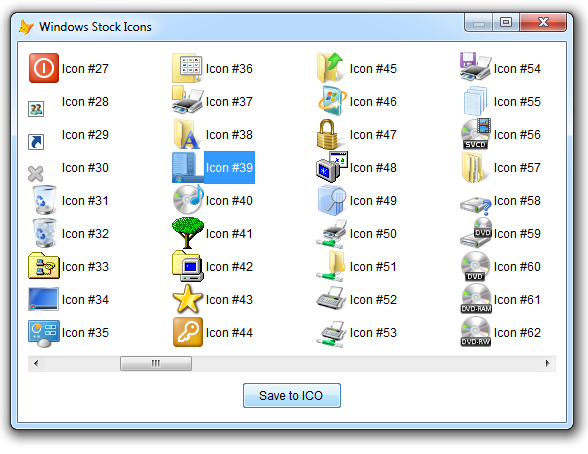
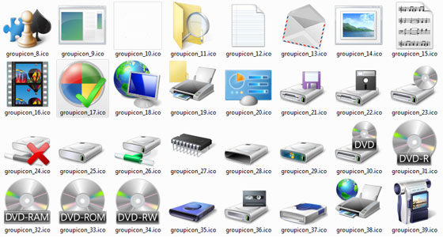

[ Home ](https://github.com/VFPX/Win32API)  

# Windows Shell Icons displayed and exported to ICO files (Vista)

## Before you begin:
This code sample employs SHGetStockIconInfo Shell API function for retrieving information about system-defined Shell icons.  

Here is a VFP form hosting ListView control with Windows Shell icons.  
  
ICO files are neither created or required to run this code sample. For icons, the ListView connects directly to the system image list using icon index obtained through SHGetStockIconInfo call.  

A Shell icon (actually any ICO resource from EXE or DLL file) can be stored to ICO file perfectly usable in VFP. Like this one, for example:  
  
The Comment part down this page has more on it.  

See also:

* [How to view icons stored in executable files](sample_019.md)  
* [Displaying the associated icons and descriptions for files and folders](sample_530.md)  
* [Converting image file to .ICO file](sample_503.md)  
* [Storing DLL icon resources in image files](sample_501.md)  
* [Storing DLL icon resources in .ICO files](sample_502.md)  
* [Displaying icons in the system tray](sample_235.md)  
  
***  


## Code:
```foxpro  
PUBLIC oForm As Explorer
oForm = CREATEOBJECT("MyComputerForm")
oForm.Visible=.T.
* end of main

DEFINE CLASS MyComputerForm As Form
	Width=520
	Height=380
	MinButton=.F.
	AutoCenter=.T.
	Caption="Windows Stock Icons"
	ShowTips=.T.
	Backcolor=RGB(255,255,255)
	ShowWindow=2

	ADD OBJECT lst As StockIconList WITH;
	Left=10, Top=10, Width=500, Height=320,;
	Anchor=15
	
	ADD OBJECT cmdSaveToICO As CommandButton WITH;
	Left=210, Top=340, Width=100, Height=27,;
	Caption="Save to ICO", Anchor=260,;
	ToolTipText="Saves selection to ICO file"

PROCEDURE cmdSaveToICO.Click
	ThisForm.lst.SaveSelectionToICO

ENDDEFINE

DEFINE CLASS StockIconList As OleControl
#DEFINE GWL_STYLE -16
#DEFINE MAX_PATH 260
#DEFINE LVM_FIRST 0x1000
#DEFINE LVM_GETIMAGELIST (LVM_FIRST + 2)
#DEFINE LVM_SETIMAGELIST (LVM_FIRST + 3)
#DEFINE LVM_SETITEM (LVM_FIRST + 6)
#DEFINE LVIF_IMAGE 0x0002
#DEFINE LVS_SHAREIMAGELISTS 0x0040
#DEFINE LVSIL_SMALL 1
#DEFINE LVSIL_NORMAL 0
#DEFINE SHGFI_SMALLICON 0x000000001
#DEFINE SHGFI_LARGEICON 0
#DEFINE SHGFI_SHELLICONSIZE 0x00000004
#DEFINE SHGFI_ICON 0x000000100
#DEFINE SHGFI_TYPENAME 0x000000400
#DEFINE SHGFI_SYSICONINDEX 0x000004000
#DEFINE SHGFI_LINKOVERLAY 0x00008000
#DEFINE SHGFI_USEFILEATTRIBUTES 0x000000010
#DEFINE SHGFI_PIDL 0x00000008
#DEFINE SHGFI_SELECTED 0x00010000
#DEFINE SHGSI_ICONLOCATION 0
#DEFINE SHGSI_ICON SHGFI_ICON
#DEFINE SHGSI_SYSICONINDEX SHGFI_SYSICONINDEX
#DEFINE SHGSI_LINKOVERLAY SHGFI_LINKOVERLAY
#DEFINE SHGSI_SELECTED SHGFI_SELECTED
#DEFINE SHGSI_LARGEICON SHGFI_LARGEICON
#DEFINE SHGSI_SMALLICON SHGFI_SMALLICON
#DEFINE SHGSI_SHELLICONSIZE SHGFI_SHELLICONSIZE
#DEFINE STOCKICON_MAXINDEX 175
#DEFINE SHSTOCKICONINFO_SIZE 16+MAX_PATH*2

	OleClass="MSComctlLib.ListViewCtrl"

PROCEDURE Init
	WITH THIS
		.View=2
		.LabelEdit=1
		.HideColumnHeaders=1
		.BorderStyle=0
		.Appearance=0
		.MultiSelect=.T.
		.AddColumnHeader("Icon", 100)
		.AddColumnHeader("Resource", 240)
		.AddColumnHeader("Index", 60)
		.declare
		.PopulateList
	ENDWITH
	= BINDEVENT(ThisForm, "GotFocus",;
		THIS, "SwitchToSystemList")

PROCEDURE AddColumnHeader(cCaption, nWidth)
	WITH THIS.ColumnHeaders.Add()
		.Text=cCaption
		.Width=nWidth
	ENDWITH

PROCEDURE SaveSelectionToICO
* saves selected icons to ICO files
	LOCAL ex As Exception, oListItem

	TRY
		SET PROCEDURE TO ResIconMgr ADDITIVE
	CATCH TO ex
		MESSAGEBOX("To enable saving resource icons " +;
			"to ICO files, download code sample #502 at " +;
			"https://github.com/VFPX/Win32API/blob/master/samples/sample_502.md" +;
			" and save it in ResIconMgr.PRG file.",;
			48,"Additional library required")
	ENDTRY

	IF VARTYPE(m.ex) = "O"
		RETURN
	ENDIF
	
	FOR EACH oListItem IN THIS.ListItems
		IF oListItem.Selected
			IF NOT THIS.SaveResourceToICO(;
				oListItem.Subitems(1),;
				VAL(oListItem.Subitems(2)) )
				EXIT
			ENDIF
		ENDIF
	NEXT

PROCEDURE SaveResourceToICO( cResourceFile, nResourceId )
	LOCAL oIconGroups As IconGroups,;
		oIconGroup As IconGroupResource, cICOFilename,;
		ex As Exception, nIndex, lResult

	TRY
		oIconGroups = CREATEOBJECT("IconGroups",;
			cResourceFile)
			
		nIndex = oIconGroups.AddIconGroupResource(;
			ABS(nResourceId) )

		IF nIndex > 0
			oIconGroup = oIconGroups.Item(m.nIndex)

			cICOFilename = LOWER(JUSTSTEM(cResourceFile)) +;
				"_" + TRANSFORM(ABS(nResourceId)) + ".ico"
				
			lResult = oIconGroup.SaveToFile(;
				cICOFilename )
		ENDIF

	CATCH TO ex
		= MESSAGEBOX( TRANSFORM(ex.ErrorNo) + ". " +;
			ex.Message + ".", 16,;
			"Saving to ICO failed!" )
		lResult=.F.
	FINALLY
		oIconGroup=NULL
		oIconGroups=NULL
	ENDTRY

	IF m.lResult
		WAIT WINDOW NOWAIT cICOFilename + " saved."
	ENDIF
RETURN m.lResult

PROCEDURE SwitchToSystemList
* switches ListItem control to using icons
* from the system image list
	LOCAL nWStyle, hSysImgList, nResult,;
		cBuffer, nIconFlags, nImgListType
		
	nIconFlags = BITOR(SHGFI_SYSICONINDEX, SHGFI_ICON,;
		SHGFI_TYPENAME, SHGFI_USEFILEATTRIBUTES)

	WITH THIS
		nImgListType = LVSIL_NORMAL
		nIconFlags = BITOR(nIconFlags, SHGFI_LARGEICON)

		* check if the system list is already assigned
		IF SendMessage(.HWND, LVM_GETIMAGELIST, nImgListType, 0) = 0
			nWStyle = GetWindowLong(.HWND, GWL_STYLE)
			SetWindowLong(.HWND, GWL_STYLE,;
				BITOR(m.nWStyle, LVS_SHAREIMAGELISTS))

			cBuffer = REPLICATE(CHR(0), 1024)
			hSysImgList = SHGetFileInfo("", 0,;
				@cBuffer, LEN(cBuffer), nIconFlags)

			= SendMessage(.HWND, LVM_SETIMAGELIST, LVSIL_SMALL, 0)
			= INKEY(0.1) && a small delay may be required
			= SendMessage(.HWND, LVM_SETIMAGELIST,;
				LVSIL_SMALL, hSysImgList)
		ENDIF
	ENDWITH

PROCEDURE PopulateList
	LOCAL nIconIndex
	FOR nIconIndex=0 TO STOCKICON_MAXINDEX
		THIS.AddLstItem( nIconIndex )
	NEXT

PROCEDURE AddLstItem( nIconIndex As Number )
	LOCAL oIcon As StockIconInfo, nIconFlags
	
	nIconFlags = BITOR( SHGSI_ICONLOCATION,;
		SHGSI_SYSICONINDEX, SHGSI_SHELLICONSIZE)

	oIcon = CREATEOBJECT(;
		"StockIconInfo", nIconIndex, nIconFlags )

	oItem = THIS.ListItems.Add(,,;
		"Icon #"+TRANSFORM(nIconIndex))

	WITH oItem
		THIS.SetIcon(.Index,;
			oIcon.SysImageIndex)
		.Subitems(1) = oIcon.IcoResPath
		.Subitems(2) = TRANSFORM(oIcon.IcoResIndex)
	ENDWITH

PROCEDURE SetIcon(nItemIndex, nImgIndex)
* makes ListItem #nItemIndex display an icon
* stored under index #nImgIndex
* in the system image list

    LOCAL cItemBuffer  && LVITEM structure

    cItemBuffer = num2dword(LVIF_IMAGE) +;
    	num2dword(nItemIndex-1) + num2dword(0) +;
    	num2dword(0) + num2dword(0) +;
    	num2dword(0) + num2dword(0) +;
    	num2dword(nImgIndex) + num2dword(0)

    = SendMessageS(THIS.hWnd, LVM_SETITEM,;
    	0, @cItemBuffer)

PROCEDURE declare
	DECLARE INTEGER DestroyIcon IN user32 INTEGER hIcon

	DECLARE INTEGER SHGetFileInfo IN shell32;
		STRING pszPath, LONG dwFileAttributes,;
		STRING @psfi, LONG cbFileInfo, LONG uFlags

	DECLARE INTEGER SHGetStockIconInfo IN shell32;
		INTEGER siid, LONG uFlags, INTEGER psii

	DECLARE INTEGER SendMessage IN user32;
		INTEGER hWindow, INTEGER Msg,;
		INTEGER wParam, INTEGER lParam

	DECLARE INTEGER SendMessage IN user32 AS SendMessageS;
		INTEGER hWindow, INTEGER Msg,;
		INTEGER wParam, STRING @lParam

	DECLARE INTEGER SetWindowLong IN user32;
		INTEGER hWindow, INTEGER nIndex, INTEGER dwNewLong

	DECLARE INTEGER GetWindowLong IN user32;
		INTEGER hWindow, INTEGER nIndex

ENDDEFINE

DEFINE CLASS StockIconInfo As Relation
* SHSTOCKICONINFO Structure
PROTECTED IconIndex, rawdata
	IconIndex=0
	IconFlags=0
	rawdata=NULL
	
	hIcon=0
	SysImageIndex=0
	IcoResIndex=0
	IcoResPath=""

PROCEDURE Init( nIconIndex, nIconFlags )
	WITH THIS
		.IconIndex = m.nIconIndex
		.IconFlags = nIconFlags
	ENDWITH

PROCEDURE IconFlags_ASSIGN( nFlags As Number )
	WITH THIS
		.IconFlags = m.nFlags
		.RetrieveIconData
	ENDWITH
	
PROTECTED PROCEDURE RetrieveIconData
	LOCAL cBuffer, nResult
	WITH THIS
		.rawdata=NULL
		IF .hIcon <> 0
			DestroyIcon(.hIcon)
			.hIcon = 0
		ENDIF
		.SysImageIndex=0
		.IcoResIndex=0
		.IcoResPath=""
		
		.rawdata = CREATEOBJECT("PChar",;
			PADR(num2dword(SHSTOCKICONINFO_SIZE),;
			SHSTOCKICONINFO_SIZE, CHR(0)) )
		
		nResult = SHGetStockIconInfo( .IconIndex,;
			.IconFlags, .rawdata.GetAddr() )

		IF m.nResult = 0

			cBuffer = .rawdata.GetValue()

			.hIcon = buf2dword(SUBSTR(m.cBuffer, 5, 4))
			.SysImageIndex = buf2dword(SUBSTR(m.cBuffer, 9, 4))
			.IcoResIndex = buf2dword(SUBSTR(m.cBuffer, 13, 4))

			.IcoResPath = SUBSTR(m.cBuffer, 17)
			.IcoResPath = SUBSTR(.IcoResPath,;
				1, AT(CHR(0)+CHR(0),.IcoResPath))
			.IcoResPath = STRCONV(.IcoResPath, 6)
		ENDIF
	ENDWITH

ENDDEFINE

DEFINE CLASS PChar As Session
PROTECTED hMem

PROCEDURE Init(cString As String)
	THIS.hMem = 0
	THIS.setValue(cString)

PROCEDURE Destroy
	THIS.ReleaseString

FUNCTION GetAddr
RETURN THIS.hMem

FUNCTION GetValue
	LOCAL nBufsize, cBuffer
	nBufsize = THIS.GetAllocSize()
	cBuffer = REPLICATE(CHR(0), m.nBufsize)

	IF THIS.hMem <> 0
		DECLARE RtlMoveMemory IN kernel32 As MemToStr;
			STRING @, INTEGER, INTEGER
		= MemToStr(@cBuffer, THIS.hMem, nBufsize)
	ENDIF
RETURN m.cBuffer

FUNCTION GetAllocSize
	DECLARE INTEGER GlobalSize IN kernel32 INTEGER hMem
RETURN Iif(THIS.hMem=0, 0, GlobalSize(THIS.hMem))

PROCEDURE SetValue(cString)
#DEFINE GMEM_FIXED 0
#DEFINE GMEM_MOVEABLE 2
#DEFINE GMEM_ZEROINIT 0x0040

	THIS.ReleaseString

	DECLARE INTEGER GlobalAlloc IN kernel32;
		INTEGER, INTEGER

	DECLARE RtlMoveMemory IN kernel32 As StrToMem;
		INTEGER, STRING @, INTEGER

	LOCAL nBufsize
	nBufsize = LEN(cString)
	THIS.hMem = GlobalAlloc(0x0040, nBufsize)
	IF THIS.hMem <> 0
		= StrToMem(THIS.hMem, @cString, nBufsize)
	ENDIF

PROCEDURE ReleaseString
	IF THIS.hMem <> 0
		DECLARE INTEGER GlobalFree IN kernel32 INTEGER
		= GlobalFree (THIS.hMem)
		THIS.hMem = 0
	ENDIF

ENDDEFINE

************** library functions **************
FUNCTION buf2dword(cBuffer)
RETURN Asc(SUBSTR(cBuffer, 1,1)) + ;
	BitLShift(Asc(SUBSTR(cBuffer, 2,1)),  8) +;
	BitLShift(Asc(SUBSTR(cBuffer, 3,1)), 16) +;
	BitLShift(Asc(SUBSTR(cBuffer, 4,1)), 24)

FUNCTION buf2word(lcBuffer)
RETURN Asc(SUBSTR(lcBuffer, 1,1)) + ;
       Asc(SUBSTR(lcBuffer, 2,1)) * 256

FUNCTION num2dword(lnValue)
#DEFINE m0 0x0000100
#DEFINE m1 0x0010000
#DEFINE m2 0x1000000
	IF lnValue < 0
		lnValue = 0x100000000 + lnValue
	ENDIF
	LOCAL b0, b1, b2, b3
	b3 = Int(lnValue/m2)
	b2 = Int((lnValue - b3*m2)/m1)
	b1 = Int((lnValue - b3*m2 - b2*m1)/m0)
	b0 = Mod(lnValue, m0)
RETURN Chr(b0)+Chr(b1)+Chr(b2)+Chr(b3)  
```  
***  


## Listed functions:
[DestroyIcon](../libraries/user32/DestroyIcon.md)  
[GetWindowLong](../libraries/user32/GetWindowLong.md)  
[GlobalAlloc](../libraries/kernel32/GlobalAlloc.md)  
[GlobalFree](../libraries/kernel32/GlobalFree.md)  
[GlobalSize](../libraries/kernel32/GlobalSize.md)  
[SHGetFileInfo](../libraries/shell32/SHGetFileInfo.md)  
[SHGetStockIconInfo](../libraries/shell32/SHGetStockIconInfo.md)  
[SendMessage](../libraries/user32/SendMessage.md)  
[SetWindowLong](../libraries/user32/SetWindowLong.md)  

## Comment:
When switched to *Report* mode (View=3), the ListView control displays the resource file and ICO resource index for each icon displayed (*szPath* and *iIcon* members of <a href="http://msdn.microsoft.com/en-us/library/bb759805(v=VS.85).aspx">SHSTOCKICONINFO</a> structure).  
  
That reveals that Windows 7 stores Shell icons in at least 4 files residing in System32 directory:  
* Shell32.dll  
* Imageres.dll  
* Imagesp1.dll  
* Mydocs.dll  

  
## *With known resource file and resource index, saving a Shell icon to ICO file is an easy task.*  

Here is [another code sample](sample_502.md) on this web site that explains how. It defines VFP classes *IconGroupResource* and *IconResource*. The former creates ICO files holding multiple versions of the same icon (size & color depth vary). The latter creates ICO files holding a single icon version, for example 48x48, 8 bit.  

[](downloads/imageres_selected_icons.zip) *Download a small selection of Windows icons from System32\Imageres.dll library.*
  

The code below stores *Imageres.dll* Icon resources to ICO files.  
```foxpro
oIconGroups = CREATEOBJECT("IconGroups",;  
	GETENV("SystemRoot") + "\system32\imageres.dll")  
  
oIconGroups.EnumIconGroupResources  
? "Icon groups:", oIconGroups.Count  
  
LOCAL cTargetPath, nGroupIndex, nIconIndex  
cTargetPath = GETDIR("", "Select ICO files destination folder.")  
  
IF NOT EMPTY(m.cTargetPath)  
	SET SAFETY OFF  
	nGroupIndex = 0  
  
	FOR EACH oIconGroup IN oIconGroups  
		oIconGroup.SaveToFile(cTargetPath +;  
			"groupicon_" + TRANSFORM(nGroupIndex) + ".ico")  
  
		nIconIndex = 0  
		FOR EACH oIcon IN oIconGroup.icons  
			oIcon.SaveToFile(cTargetPath +;  
				"icon_" +;  
				TRANSFORM(nGroupIndex) + "_" +;  
				TRANSFORM(nIconIndex) + "_" +;  
				TRANSFORM(oIcon.resid) + ".ico")  
  
			nIconIndex = nIconIndex + 1  
		NEXT  
		nGroupIndex = nGroupIndex + 1  
	NEXT  
	SET SAFETY ON  
ENDIF
```
[](sample_502.md)


***  
Another [Icon Viewer](sample_019.md) code sample on this web site reads icons directly from .EXE or .DLL file calling ExtractIcon and GetIconInfo functions. If pointed at Shell32.dll, that viewer displays even larger number of icons then the one presented.   
  
But the former has a deficiency. The Shell icons are retrieved based on their respective resource index in Shell32.dll. This index may fluctuate through OS versions. In contrast, the SHGetStockIconInfo uses OS-approved <a href="http://msdn.microsoft.com/en-us/library/bb762542(v=VS.85).aspx">SHSTOCKICONID enumeration</a>.  
  
***  

