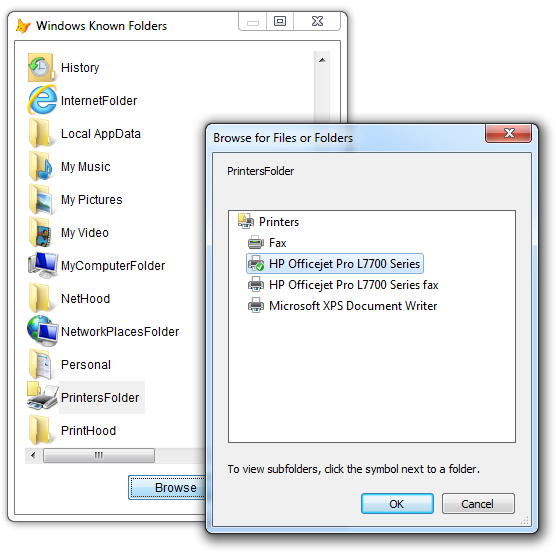

[ Home ](https://github.com/VFPX/Win32API)  

# Browsing Windows Known Folders (Special Folders)

## Before you begin:
Special Folders are folders which are presented to the user through an interface as an abstract concept, instead of an absolute folder path.   

As of Windows Vista, those folders are referenced by a new set of GUID values called [Known Folder IDs](http://msdn.microsoft.com/en-us/library/bb776911(v=vs.85).aspx), replacing  the older system of referring to standard folders by a CSIDL value.  

  

See also:

* [How to get the path to a Special Folder](sample_415.md)  
* [Obtaining the System and Windows folder names](sample_005.md)  
  
***  


## Code:
```foxpro  
PUBLIC oForm As Explorer
oForm = CREATEOBJECT( "SpecialFoldersForm" )
oForm.Visible=.T.
* end of main

DEFINE CLASS SpecialFoldersForm As Form
	Width=520
	Height=380
	MinButton=.F.
	AutoCenter=.T.
	Caption="Windows Known Folders"
	ShowTips=.T.
	Backcolor=RGB(255,255,255)
	ShowWindow=2

	ADD OBJECT lst As SpecialFolderList WITH;
	Left=10, Top=10, Width=500, Height=320,;
	Anchor=15

	ADD OBJECT cmdBrowse As CommandButton WITH;
	Left=210, Top=340, Width=100, Height=27,;
	Caption="Browse", Anchor=260

PROCEDURE cmdBrowse.Click
	ThisForm.lst.BrowseFolder

ENDDEFINE

DEFINE CLASS SpecialFolderList As OleControl
#DEFINE GWL_STYLE -16
#DEFINE MAX_PATH 260
#DEFINE LVM_FIRST 0x1000
#DEFINE LVM_GETIMAGELIST (LVM_FIRST + 2)
#DEFINE LVM_SETIMAGELIST (LVM_FIRST + 3)
#DEFINE LVM_SETITEM (LVM_FIRST + 6)
#DEFINE LVIF_IMAGE 0x0002
#DEFINE LVS_SHAREIMAGELISTS 0x0040
#DEFINE LVSIL_SMALL 1
#DEFINE LVSIL_NORMAL 0
#DEFINE SHGFI_SMALLICON 0x000000001
#DEFINE SHGFI_LARGEICON 0
#DEFINE SHGFI_SHELLICONSIZE 0x00000004
#DEFINE SHGFI_ICON 0x000000100
#DEFINE SHGFI_TYPENAME 0x000000400
#DEFINE SHGFI_SYSICONINDEX 0x000004000
#DEFINE SHGFI_LINKOVERLAY 0x00008000
#DEFINE SHGFI_USEFILEATTRIBUTES 0x000000010
#DEFINE SHGFI_PIDL 0x00000008
#DEFINE SHGFI_SELECTED 0x00010000
#DEFINE SHGSI_ICONLOCATION 0
#DEFINE SHGSI_ICON SHGFI_ICON
#DEFINE SHGSI_SYSICONINDEX SHGFI_SYSICONINDEX
#DEFINE SHGSI_LINKOVERLAY SHGFI_LINKOVERLAY
#DEFINE SHGSI_SELECTED SHGFI_SELECTED
#DEFINE SHGSI_LARGEICON SHGFI_LARGEICON
#DEFINE SHGSI_SMALLICON SHGFI_SMALLICON
#DEFINE SHGSI_SHELLICONSIZE SHGFI_SHELLICONSIZE
#DEFINE BIF_RETURNONLYFSDIRS 1
#DEFINE BIF_DONTGOBELOWDOMAIN 2
#DEFINE BIF_STATUSTEXT 4
#DEFINE BIF_RETURNFSANCESTORS 8
#DEFINE BIF_EDITBOX 16
#DEFINE BIF_VALIDATE 32
#DEFINE BIF_NEWDIALOGSTYLE 64
#DEFINE BIF_NONEWFOLDERBUTTON 0x200
#DEFINE BIF_BROWSEFORCOMPUTER 0x1000
#DEFINE BIF_BROWSEFORPRINTER 0x2000
#DEFINE BIF_BROWSEINCLUDEFILES 0x4000
#DEFINE BIF_SHAREABLE 0x8000
#DEFINE BIF_UAHINT 0x00000100
#DEFINE BROWSEINFO_SIZE 32

	OleClass="MSComctlLib.ListViewCtrl"

PROCEDURE Init
	WITH THIS
		.View=3
		.LabelEdit=1
		.HideColumnHeaders=1
		.BorderStyle=0
		.Appearance=0
		.HideSelection=.F.
		.AddColumnHeader("Folder", 300)
		.AddColumnHeader("Path", 340)
		.declare
		.PopulateList
	ENDWITH
	= BINDEVENT(ThisForm, "GotFocus",;
		THIS, "SwitchToSystemList")

PROCEDURE AddColumnHeader(cCaption, nWidth)
	WITH THIS.ColumnHeaders.Add()
		.Text=cCaption
		.Width=nWidth
	ENDWITH

PROCEDURE SwitchToSystemList
* switches ListItem control to using icons
* from the system image list
	LOCAL nWStyle, hSysImgList, nResult,;
		cBuffer, nIconFlags, nImgListType
		
	nIconFlags = BITOR(SHGFI_SYSICONINDEX, SHGFI_ICON,;
		SHGFI_TYPENAME, SHGFI_USEFILEATTRIBUTES)

	WITH THIS
		nImgListType = LVSIL_NORMAL
		nIconFlags = BITOR(nIconFlags, SHGFI_LARGEICON)

		* check if the system list is already assigned
		IF SendMessage(.HWND, LVM_GETIMAGELIST,;
			nImgListType, 0) = 0

			nWStyle = GetWindowLong(.HWND, GWL_STYLE)
			SetWindowLong(.HWND, GWL_STYLE,;
				BITOR(m.nWStyle, LVS_SHAREIMAGELISTS))

			cBuffer = REPLICATE(CHR(0), 1024)
			hSysImgList = SHGetFileInfo("", 0,;
				@cBuffer, LEN(cBuffer), nIconFlags)

			= SendMessage(.HWND, LVM_SETIMAGELIST,;
				LVSIL_SMALL, 0)

			= INKEY(0.1) && a small delay may be required

			= SendMessage(.HWND, LVM_SETIMAGELIST,;
				LVSIL_SMALL, hSysImgList)
		ENDIF
	ENDWITH

PROCEDURE BrowseFolder
	LOCAL nFolderId, nRootPIDL, cBuffer,;
		oReturnedName, oDlgTitle, nFlags,;
		hPidl, cSelectedItem

	IF VARTYPE(THIS.SelectedItem) <> "O"
		RETURN
	ENDIF

	nFolderId = VAL( THIS.SelectedItem.Tag )
	nRootPIDL = 0

	nResult = SHGetSpecialFolderLocation(;
		0, nFolderId, @nRootPIDL )

	oReturnedName = CREATEOBJECT("PChar",;
		REPLICATE(CHR(0),MAX_PATH))

	oDlgTitle = CREATEOBJECT("PChar",;
		THIS.SelectedItem.Text+CHR(0) )

	nFlags = BIF_NEWDIALOGSTYLE + BIF_UAHINT + ;
		BIF_NONEWFOLDERBUTTON + BIF_BROWSEINCLUDEFILES

	cBuffer = num2dword(ThisForm.HWnd) +;
		num2dword(m.nRootPIDL) +;
		num2dword(oReturnedName.GetAddr()) +;
		num2dword(oDlgTitle.GetAddr()) +;
		num2dword(nFlags)

	cBuffer = PADR(cBuffer, BROWSEINFO_SIZE, CHR(0))
	hPidl = SHBrowseForFolder(@cBuffer)
	
	IF hPidl <> 0
		cSelectedItem = oReturnedName.GetValue()
		cSelectedItem = SUBSTR(cSelectedItem,;
			1, AT(CHR(0),cSelectedItem)-1)
		WAIT WINDOW NOWAIT m.cSelectedItem

		= CoTaskMemFree( m.hPidl )
	ENDIF

	= CoTaskMemFree( m.nRootPIDL )

PROCEDURE PopulateList
* CSIDL (constant special item ID list)

	WITH THIS
		.AddLstItem( "AddNewProgramsFolder", 0x8000 )
		.AddLstItem( "Administrative Tools", 0x0030 )
		.AddLstItem( "AppData", 0x001a )
		.AddLstItem( "Cache", 0x0020 )
		.AddLstItem( "CD Burning", 0x003b )
		.AddLstItem( "Common Administrative Tools", 0x002f )
		.AddLstItem( "Common AppData", 0x0023 )
		.AddLstItem( "Common Desktop", 0x0019 )
		.AddLstItem( "Common Documents", 0x002e )
		.AddLstItem( "Common Programs", 0x0017 )
		.AddLstItem( "Common Start Menu", 0x0016 )
		.AddLstItem( "Common Startup", 0x0018 )
		.AddLstItem( "Common Templates", 0x002d )
*		.AddLstItem( "CommonDownloads", 0 )
		.AddLstItem( "CommonMusic", 0x0035 )
		.AddLstItem( "CommonPictures", 0x0036 )
*		.AddLstItem( "CommonRingtones", 0 )
		.AddLstItem( "CommonVideo", 0x0037 )
*		.AddLstItem( "ConnectionsFolder", 0 )
*		.AddLstItem( "Contacts", 0 )
		.AddLstItem( "ControlPanelFolder", 0x0003 )
		.AddLstItem( "Cookies", 0x0021 )
*		.AddLstItem( "CredentialManager", 0 )
*		.AddLstItem( "CryptoKeys", 0 )
*		.AddLstItem( "CSCFolder", 0 )
*		.AddLstItem( "Default Gadgets", 0 )
		.AddLstItem( "Desktop", 0 )
*		.AddLstItem( "Device Metadata Store", 0 )
		.AddLstItem( "DocumentsLibrary", 0x0005 )
*		.AddLstItem( "Downloads", 0 )
*		.AddLstItem( "DpapiKeys", 0 )
		.AddLstItem( "Favorites", 0x0006 )
		.AddLstItem( "Fonts", 0x0014 )
*		.AddLstItem( "Gadgets", 0 )
*		.AddLstItem( "Games", 0 )
*		.AddLstItem( "GameTasks", 0 )
		.AddLstItem( "History", 0x0022 )
*		.AddLstItem( "HomeGroupFolder", 0 )
*		.AddLstItem( "ImplicitAppShortcuts", 0 )
		.AddLstItem( "InternetFolder", 0x0001 )
*		.AddLstItem( "Libraries", 0 )
*		.AddLstItem( "Links", 0 )
		.AddLstItem( "Local AppData", 0x001c )
*		.AddLstItem( "LocalAppDataLow", 0 )
*		.AddLstItem( "MAPIFolder", 0 )
*		.AddLstItem( "MusicLibrary", 0 )
		.AddLstItem( "My Music", 0x000d )
		.AddLstItem( "My Pictures", 0x0027 )
		.AddLstItem( "My Video", 0x000e )
		.AddLstItem( "MyComputerFolder", 0x0011 )
		.AddLstItem( "NetHood", 0x0013 )
		.AddLstItem( "NetworkPlacesFolder", 0x0012 )
		.AddLstItem( "Personal", 0x0005 )
*		.AddLstItem( "PicturesLibrary", 0 )
		.AddLstItem( "PrintersFolder", 0x0004 )
		.AddLstItem( "PrintHood", 0x001b )
		.AddLstItem( "Profile", 0x0028 )
		.AddLstItem( "ProgramFiles", 0x0026 )
*		.AddLstItem( "ProgramFilesCommon", 0x002b )
		.AddLstItem( "ProgramFilesCommonX86", 0x002b )
*		.AddLstItem( "ProgramFilesX86", 0 )
		.AddLstItem( "Programs", 0x0002 )
*		.AddLstItem( "Public", 0 )
*		.AddLstItem( "PublicGameTasks", 0 )
*		.AddLstItem( "PublicLibraries", 0 )
*		.AddLstItem( "Quick Launch", 0 )
		.AddLstItem( "Recent", 0x0008 )
*		.AddLstItem( "RecordedTVLibrary", 0 )
		.AddLstItem( "RecycleBinFolder", 0x000a )
*		.AddLstItem( "ResourceDir", 0 )
*		.AddLstItem( "Ringtones", 0 )
*		.AddLstItem( "SampleMusic", 0 )
*		.AddLstItem( "SamplePictures", 0 )
*		.AddLstItem( "SampleVideos", 0 )
*		.AddLstItem( "SavedGames", 0 )
*		.AddLstItem( "Searches", 0 )
*		.AddLstItem( "SearchHomeFolder", 0 )
		.AddLstItem( "SendTo", 0x0009 )
		.AddLstItem( "Start Menu", 0x000b )
		.AddLstItem( "Startup", 0x0007 )
		.AddLstItem( "System", 0x0025 )
*		.AddLstItem( "SystemCertificates", 0 )
*		.AddLstItem( "SystemX86", 0 )
		.AddLstItem( "Templates", 0x0015 )
*		.AddLstItem( "User Pinned", 0 )
*		.AddLstItem( "UserProfiles", 0x003e )
*		.AddLstItem( "UsersFilesFolder", 0 )
*		.AddLstItem( "UsersLibrariesFolder", 0 )
*		.AddLstItem( "VideosLibrary", 0 )
		.AddLstItem( "Windows", 0x0024 )

	ENDWITH

PROCEDURE AddLstItem( cFolderName As String,;
	nFolderId As Number )

	LOCAL hPidl, nTypeIndex, cFileType

	hPidl = 0
	nResult = SHGetSpecialFolderLocation(;
		0, nFolderId, @hPidl )
		
	IF nResult = 0
		nTypeIndex = 0
		cFileType = ""
		THIS.GetFileTypeInfo(hPidl, @nTypeIndex, @cFileType)

		oItem = THIS.ListItems.Add(,, cFolderName ) && m.cFileType

		WITH oItem
			THIS.SetIcon(.Index, m.nTypeIndex)
			.Subitems(1) = THIS.PathFromPIDL(m.hPidl)
			.Tag = TRANSFORM( m.nFolderId ) && CSIDL
		ENDWITH

		= CoTaskMemFree( m.hPidl )
	ENDIF
	
PROCEDURE PathFromPIDL( nPIDL As Number ) As String
	LOCAL cBuffer
	cBuffer = REPLICATE(CHR(0), MAX_PATH)
	SHGetPathFromIDList( nPIDL, @cBuffer )
RETURN STRTRAN(m.cBuffer, CHR(0), "")

PROCEDURE GetFileTypeInfo(hPidl, nTypeIndex, cFileType)
* Obtains icon and description for the specified file type
	LOCAL nBufsize, cBuffer, nFlags, hIcon

	nBufsize=0x200
	cBuffer = REPLICATE(CHR(0), nBufsize)
	
	nFlags = BITOR(SHGFI_PIDL, SHGFI_SYSICONINDEX,;
		SHGFI_SMALLICON, SHGFI_ICON, SHGFI_TYPENAME )

	= SHGetFileInfoN(m.hPidl, 0, @cBuffer, nBufsize, nFlags)
	
	hIcon = buf2dword(SUBSTR(cBuffer, 1, 4))
	nTypeIndex = buf2dword(SUBSTR(cBuffer,5, 4))
	cFileType = STRTRAN(SUBSTR(m.cBuffer,13+MAX_PATH), CHR(0),"")

	IF hIcon <> 0
		= DestroyIcon(hIcon)
	ENDIF

PROCEDURE SetIcon(nItemIndex, nImgIndex)
* makes ListItem #nItemIndex display an icon
* stored under index #nImgIndex in the system image list

    LOCAL cItemBuffer  && LVITEM structure

    cItemBuffer = num2dword(LVIF_IMAGE) +;
    	num2dword(nItemIndex-1) + num2dword(0) +;
    	num2dword(0) + num2dword(0) +;
    	num2dword(0) + num2dword(0) +;
    	num2dword(nImgIndex) + num2dword(0)

    = SendMessageS(THIS.hWnd, LVM_SETITEM,;
    	0, @cItemBuffer)

PROCEDURE declare
	DECLARE INTEGER DestroyIcon IN user32 INTEGER hIcon
	DECLARE CoTaskMemFree IN ole32 INTEGER hPtr

	DECLARE INTEGER SHGetFileInfo IN shell32;
		STRING pszPath, LONG dwFileAttributes,;
		STRING @psfi, LONG cbFileInfo, LONG uFlags

	DECLARE INTEGER SHGetFileInfo IN shell32;
	AS SHGetFileInfoN;
		INTEGER ppidl, LONG dwFileAttributes,;
		STRING @psfi, LONG cbFileInfo, LONG uFlags

	DECLARE INTEGER SHGetPathFromIDList IN shell32;
		INTEGER pidl, STRING @pszPath

	DECLARE INTEGER SHGetSpecialFolderLocation IN shell32;
		INTEGER hwndOwner, INTEGER nFolder,;
		INTEGER @ppidl

	DECLARE INTEGER SendMessage IN user32;
		INTEGER hWindow, INTEGER Msg,;
		INTEGER wParam, INTEGER lParam

	DECLARE INTEGER SendMessage IN user32;
	AS SendMessageS;
		INTEGER hWindow, INTEGER Msg,;
		INTEGER wParam, STRING @lParam

	DECLARE INTEGER SetWindowLong IN user32;
		INTEGER hWindow, INTEGER nIndex,;
		INTEGER dwNewLong

	DECLARE INTEGER GetWindowLong IN user32;
		INTEGER hWindow, INTEGER nIndex

	DECLARE INTEGER SHBrowseForFolder IN shell32;
		STRING @lpbi

ENDDEFINE

DEFINE CLASS PChar As Session
PROTECTED hMem

PROCEDURE Init(cString As String)
	THIS.hMem = 0
	THIS.setValue(cString)

PROCEDURE Destroy
	THIS.ReleaseString

FUNCTION GetAddr
RETURN THIS.hMem

FUNCTION GetValue
	LOCAL nBufsize, cBuffer
	nBufsize = THIS.GetAllocSize()
	cBuffer = REPLICATE(CHR(0), m.nBufsize)

	IF THIS.hMem <> 0
		DECLARE RtlMoveMemory IN kernel32 As MemToStr;
			STRING @, INTEGER, INTEGER
		= MemToStr(@cBuffer, THIS.hMem, nBufsize)
	ENDIF
RETURN m.cBuffer

FUNCTION GetAllocSize
	DECLARE INTEGER GlobalSize IN kernel32 INTEGER hMem
RETURN Iif(THIS.hMem=0, 0, GlobalSize(THIS.hMem))

PROCEDURE SetValue(cString)
#DEFINE GMEM_FIXED 0
#DEFINE GMEM_MOVEABLE 2
#DEFINE GMEM_ZEROINIT 0x0040

	THIS.ReleaseString

	DECLARE INTEGER GlobalAlloc IN kernel32;
		INTEGER, INTEGER

	DECLARE RtlMoveMemory IN kernel32 As StrToMem;
		INTEGER, STRING @, INTEGER

	LOCAL nBufsize
	nBufsize = LEN(cString)
	THIS.hMem = GlobalAlloc(0x0040, nBufsize)
	IF THIS.hMem <> 0
		= StrToMem(THIS.hMem, @cString, nBufsize)
	ENDIF

PROCEDURE ReleaseString
	IF THIS.hMem <> 0
		DECLARE INTEGER GlobalFree IN kernel32 INTEGER
		= GlobalFree (THIS.hMem)
		THIS.hMem = 0
	ENDIF

ENDDEFINE

************** library functions **************
FUNCTION buf2dword(cBuffer)
RETURN Asc(SUBSTR(cBuffer, 1,1)) + ;
	BitLShift(Asc(SUBSTR(cBuffer, 2,1)),  8) +;
	BitLShift(Asc(SUBSTR(cBuffer, 3,1)), 16) +;
	BitLShift(Asc(SUBSTR(cBuffer, 4,1)), 24)

FUNCTION buf2word(lcBuffer)
RETURN Asc(SUBSTR(lcBuffer, 1,1)) + ;
       Asc(SUBSTR(lcBuffer, 2,1)) * 256

FUNCTION num2dword(lnValue)
#DEFINE m0 0x0000100
#DEFINE m1 0x0010000
#DEFINE m2 0x1000000
	IF lnValue < 0
		lnValue = 0x100000000 + lnValue
	ENDIF
	LOCAL b0, b1, b2, b3
	b3 = Int(lnValue/m2)
	b2 = Int((lnValue - b3*m2)/m1)
	b1 = Int((lnValue - b3*m2 - b2*m1)/m0)
	b0 = Mod(lnValue, m0)
RETURN Chr(b0)+Chr(b1)+Chr(b2)+Chr(b3)  
```  
***  


## Listed functions:
[CoTaskMemFree](../libraries/ole32/CoTaskMemFree.md)  
[DestroyIcon](../libraries/user32/DestroyIcon.md)  
[GetWindowLong](../libraries/user32/GetWindowLong.md)  
[GlobalAlloc](../libraries/kernel32/GlobalAlloc.md)  
[GlobalFree](../libraries/kernel32/GlobalFree.md)  
[GlobalSize](../libraries/kernel32/GlobalSize.md)  
[SHBrowseForFolder](../libraries/shell32/SHBrowseForFolder.md)  
[SHGetFileInfo](../libraries/shell32/SHGetFileInfo.md)  
[SHGetPathFromIDList](../libraries/shell32/SHGetPathFromIDList.md)  
[SHGetSpecialFolderLocation](../libraries/shell32/SHGetSpecialFolderLocation.md)  
[SendMessage](../libraries/user32/SendMessage.md)  
[SetWindowLong](../libraries/user32/SetWindowLong.md)  

## Comment:


The Known Folders can be enumerated through call to GetFolderIds method of a class that implements IKnownFolderManager interface.  
  
***  

