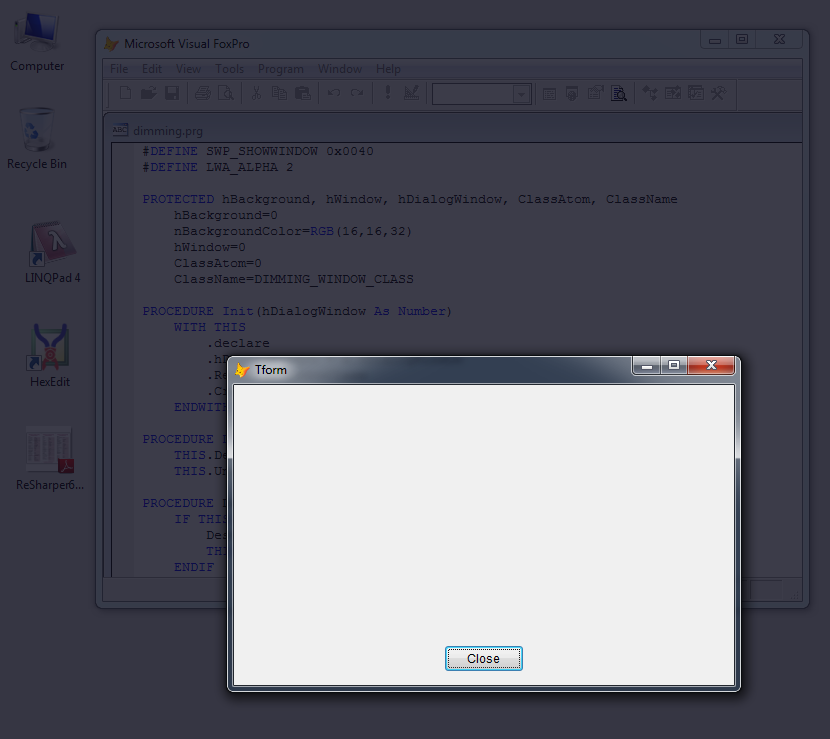
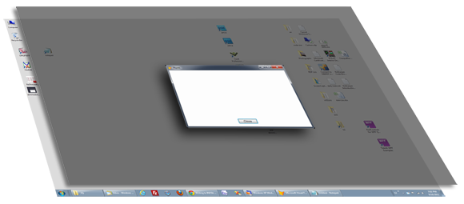

[ Home ](https://github.com/VFPX/Win32API)  

# Displaying dimmed window behind VFP top-level form

## Before you begin:
This code sample explains how to create a *dimmed* window covering the whole desktop, and position it behind a VFP *top level* form -- creating so called "Lightbox effect".  

  

  
***  


## Code:
```foxpro  
oForm = CREATEOBJECT("TForm")
oForm.Show(1)
READ EVENTS
* end of main

DEFINE CLASS TForm As Form
	Width=500
	Height=300
	AutoCenter=.T.
	Caption="Top-level form"
	MaxButton=.F.
	MinButton=.F.
	BorderStyle=2
	AlwaysOnTop=.T.  && the must
	ShowWindow=2     && the must
	
	DimmedWindow=NULL
	
	ADD OBJECT Edit1 As EditBox WITH;
	Left=10, Top=10, Width=480, Height=240

	ADD OBJECT cmdClose As CommandButton WITH;
	Left=210, Top=260, Width=80, Height=27,;
	Caption="Close", Default=.T.

PROCEDURE Destroy
	THIS.DimmedWindow = NULL
	CLEAR EVENTS

PROCEDURE Init
	THIS.DimmedWindow =;
		CREATEOBJECT("DimmedWindow", THIS.HWnd)

PROCEDURE cmdClose.Click
	ThisForm.Release

ENDDEFINE

DEFINE CLASS DimmedWindow As Container
#DEFINE DIMMED_WINDOW_CLASS "DimmedWindowClass"
#DEFINE WNDCLASSEX_SIZE 48
#DEFINE WINDOWPLACEMENT_SIZE 44
#DEFINE GWL_WNDPROC -4
#DEFINE GWL_HINSTANCE -6
#DEFINE WS_VISIBLE 0x10000000
#DEFINE WS_DISABLED 0x08000000
#DEFINE WS_POPUP 0x80000000
#DEFINE WS_CLIPSIBLINGS 0x04000000
#DEFINE WS_CLIPCHILDREN 0x02000000
#DEFINE WS_EX_LAYERED 0x00080000
#DEFINE WS_EX_NOACTIVATE 0x08000000
#DEFINE SWP_SHOWWINDOW 0x0040
#DEFINE LWA_ALPHA 2

PROTECTED hBackground, hWindow, hTopLevelWindow, BgColor,;
	OpacityCurrent, OpacityStep, TimerInterval

	hWindow=0
	ClassName=DIMMED_WINDOW_CLASS
	hBackground=0
	TimerInterval=20

	* dimmed window settings
	BgColor=RGB(16,16,32) && bgcolor
	OpacityStart=160      && initial opacity
	OpacityEnd=220        && final opacity
	Timespan=500         && initial to final time
	
	ADD OBJECT Timer1 As Timer WITH Interval=0

PROCEDURE Init(hTopLevelWindow As Number)

	WITH THIS
		.declare
		.hTopLevelWindow = m.hTopLevelWindow
		.RegisterWindowClass
		.CreateDimmedWindow
	ENDWITH
	* in some cases the cursor disappears
	* todo: find resolution
	SET MOUSE ON

PROCEDURE Destroy
	THIS.DestroyDimmedWindow
	THIS.UnregisterWindowClass

PROCEDURE DestroyDimmedWindow
	IF THIS.hWindow <> 0
		DestroyWindow(THIS.hWindow)
		THIS.hWindow = 0
	ENDIF

PROCEDURE OpacityStart_ASSIGN(vValue)
	IF NOT BETWEEN(nValue, 0, 255)
		THROW "Invalid parameter!"
	ENDIF

PROCEDURE OpacityEnd_ASSIGN(vValue)
	IF NOT BETWEEN(nValue, 0, 255)
		THROW "Invalid parameter!"
	ENDIF

PROCEDURE Timespan_ASSIGN(vValue)
	IF NOT BETWEEN(nValue, 0, 10000)
		THROW "Invalid parameter!"
	ENDIF

PROCEDURE UnregisterWindowClass
	IF THIS.hBackground <> 0
		= UnregisterClass(THIS.ClassName,;
			GetModuleHandle(0))

		= DeleteObject(THIS.hBackground)
		THIS.hBackground=0
	ENDIF

PROCEDURE RegisterWindowClass
* registers window class for a dimmed window
	IF THIS.IsClassRegistered()
		RETURN
	ENDIF

	LOCAL cWndClassEx, oClassName As PChar,;
		oWndClassEx As PChar, nResult, nClassAtom

	* creating solid color brush
	THIS.hBackground = CreateSolidBrush(THIS.BgColor)

	* WNDCLASSEX structure requires a pointer to class name
	oClassName = CREATEOBJECT("PChar", THIS.ClassName+CHR(0))
	
	* populating WNDCLASSEX structure
	cWndClassEx =;
		num2dword(WNDCLASSEX_SIZE) +;
		num2dword(0) +;
		num2dword( GetWindowLong(THIS.hTopLevelWindow, GWL_WNDPROC) ) +;
		num2dword(0) +;
		num2dword(0) +;
		num2dword( GetModuleHandle(0) ) +;
		num2dword(0) +;
		num2dword(0) +;
		num2dword(THIS.hBackground) +;
		num2dword(0) +;
		num2dword( oClassName.GetAddr() ) +;
		num2dword(0)

	oWndClassEx = CREATEOBJECT("PChar", cWndClassEx)
	nClassAtom = RegisterClassEx( oWndClassEx.GetAddr() )
RETURN m.nClassAtom <> 0

PROCEDURE CreateDimmedWindow
	LOCAL nStyle, nExStyle, hParent, cBuffer,;
		nLeft, nTop, nWidth, nHeight

	* window style
	nStyle = BITOR(WS_VISIBLE, WS_DISABLED, WS_POPUP,;
				WS_CLIPSIBLINGS, WS_CLIPCHILDREN )

	* window extended style
	nExStyle = BITOR(WS_EX_LAYERED, WS_EX_NOACTIVATE)

	hParent = GetDesktopWindow()

	* fetching windows desktop coordinates
	cBuffer = PADR(CHR(WINDOWPLACEMENT_SIZE),;
		WINDOWPLACEMENT_SIZE, CHR(0))

	= GetWindowPlacement(hParent, @cBuffer)

	nLeft = buf2dword(SUBSTR(cBuffer, 29, 4))
	nTop = buf2dword(SUBSTR(cBuffer, 33, 4))
	nWidth = buf2dword(SUBSTR(cBuffer, 37, 4)) - m.nLeft
	nHeight = buf2dword(SUBSTR(cBuffer, 41, 4)) - m.nTop

	WITH THIS
		.hWindow = CreateWindowEx(;
			nExStyle,;
			.ClassName,;
			NULL, nStyle,;
			0, 0, 1, 1,;
			hParent, 0, GetModuleHandle(0), 0)

		IF IsWindow(.hWindow) = 0
			* 1407 = Cannot find window class
			ACTIVATE SCREEN
			? GetLastError()
			CANCEL
		ENDIF

		* calculating opacity settings
		.OpacityCurrent = .OpacityStart
		.OpacityStep = IIF(.Timespan=0, 0,;
		(.OpacityEnd - .OpacityStart)/.Timespan) * .TimerInterval

		* setting initial opacity
		.ChangeOpacity(.T.)

		* showing a dimmed window		
		= SetWindowPos( .hWindow,;
			.hTopLevelWindow,;
			m.nLeft, m.nTop, m.nWidth, m.nHeight,;
			SWP_SHOWWINDOW )

		* starting opacity timer
		.Timer1.Interval = .TimerInterval
	ENDWITH
	
PROCEDURE ChangeOpacity(lForce As Boolean)
	WITH THIS
		IF (.OpacityEnd = .OpacityStart OR .Timespan = 0);
			AND NOT lForce
			.Timer1.Interval = 0
		ENDIF
		IF .OpacityCurrent >= .OpacityEnd AND .OpacityStep > 0
			.Timer1.Interval = 0
		ENDIF
		IF .OpacityCurrent <= .OpacityEnd AND .OpacityStep < 0
			.Timer1.Interval = 0
		ENDIF

		= SetLayeredWindowAttributes( .hWindow,;
			.BgColor, .OpacityCurrent, LWA_ALPHA)
			
		.OpacityCurrent = .OpacityCurrent + .OpacityStep
	ENDWITH

PROCEDURE IsClassRegistered() As Boolean
	LOCAL cBuffer, nResult
	cBuffer = REPLICATE(CHR(0), 128)
	nResult = GetClassInfo( GetModuleHandle(0),;
		THIS.ClassName, @cBuffer )
RETURN m.nResult <> 0

PROCEDURE Timer1.Timer
	THIS.Parent.ChangeOpacity
	DOEVENTS

PROCEDURE declare
	DECLARE INTEGER RegisterClassEx IN user32 INTEGER lpwcx
	DECLARE INTEGER GetLastError IN kernel32
	DECLARE INTEGER SetCapture IN user32 INTEGER hWindow

	DECLARE INTEGER UnregisterClass IN user32;
		STRING lpClassName, INTEGER hInstance

	DECLARE INTEGER GetModuleHandle IN kernel32 INTEGER lpModuleName
	DECLARE INTEGER DeleteObject IN gdi32 INTEGER hObject

	DECLARE INTEGER GetWindowLong IN user32;
		INTEGER hWindow, INTEGER nIndex

	DECLARE INTEGER CreateSolidBrush IN gdi32 INTEGER crColor
	DECLARE INTEGER DestroyWindow IN user32 INTEGER hWindow
	DECLARE INTEGER GetDesktopWindow IN user32
	DECLARE INTEGER IsWindow IN user32 INTEGER hWindow

	DECLARE INTEGER GetWindowPlacement IN user32;
		INTEGER hWindow, STRING @lpwndpl

	DECLARE INTEGER CreateWindowEx IN user32;
		INTEGER dwExStyle, STRING lpClassName, STRING lpWindowName,;
		INTEGER dwStyle, INTEGER x, INTEGER y,;
		INTEGER nWidth, INTEGER nHeight, INTEGER hWndParent,;
		INTEGER hMenu, INTEGER hInstance, INTEGER lpParam

	DECLARE INTEGER SetWindowPos IN user32;
		INTEGER hWindow, INTEGER hWndInsertAfter,;
		INTEGER x, INTEGER y, INTEGER cx, INTEGER cy,;
		INTEGER wFlags

	DECLARE INTEGER SetLayeredWindowAttributes IN user32;
		INTEGER hWindow, INTEGER crKey,;
		SHORT bAlpha, INTEGER dwFlags

	DECLARE INTEGER GetClassInfo IN user32;
		INTEGER hInstance, STRING lpClassName,;
		STRING @lpWndClass
ENDDEFINE

****** library functions ******

FUNCTION buf2dword(cBuffer)
RETURN Asc(SUBSTR(cBuffer, 1,1)) + ;
	BitLShift(Asc(SUBSTR(cBuffer, 2,1)),  8) +;
	BitLShift(Asc(SUBSTR(cBuffer, 3,1)), 16) +;
	BitLShift(Asc(SUBSTR(cBuffer, 4,1)), 24)

FUNCTION num2dword(lnValue)
#DEFINE m0 0x0000100
#DEFINE m1 0x0010000
#DEFINE m2 0x1000000
	IF lnValue < 0
		lnValue = 0x100000000 + lnValue
	ENDIF
	LOCAL b0, b1, b2, b3
	b3 = Int(lnValue/m2)
	b2 = Int((lnValue - b3*m2)/m1)
	b1 = Int((lnValue - b3*m2 - b2*m1)/m0)
	b0 = Mod(lnValue, m0)
RETURN Chr(b0)+Chr(b1)+Chr(b2)+Chr(b3)

DEFINE CLASS PChar As Session
PROTECTED hMem

PROCEDURE Init(cString As String)
	THIS.hMem = 0
	THIS.setValue(cString)

PROCEDURE Destroy
	THIS.ReleaseString

FUNCTION GetAddr
RETURN THIS.hMem

FUNCTION GetValue
	LOCAL nBufsize, cBuffer
	nBufsize = THIS.GetAllocSize()
	cBuffer = REPLICATE(CHR(0), m.nBufsize)

	IF THIS.hMem <> 0
		DECLARE RtlMoveMemory IN kernel32 As MemToStr;
			STRING @, INTEGER, INTEGER
		= MemToStr(@cBuffer, THIS.hMem, nBufsize)
	ENDIF
RETURN m.cBuffer

FUNCTION GetAllocSize
	DECLARE INTEGER GlobalSize IN kernel32 INTEGER hMem
RETURN Iif(THIS.hMem=0, 0, GlobalSize(THIS.hMem))

PROCEDURE SetValue(cString)
#DEFINE GMEM_FIXED 0
#DEFINE GMEM_MOVEABLE 2
#DEFINE GMEM_ZEROINIT 0x0040

	THIS.ReleaseString

	DECLARE INTEGER GlobalAlloc IN kernel32;
		INTEGER, INTEGER

	DECLARE RtlMoveMemory IN kernel32 As StrToMem;
		INTEGER, STRING @, INTEGER

	LOCAL nBufsize
	nBufsize = LEN(cString)
	THIS.hMem = GlobalAlloc(0x0040, nBufsize)
	IF THIS.hMem <> 0
		= StrToMem(THIS.hMem, @cString, nBufsize)
	ENDIF

PROCEDURE ReleaseString
	IF THIS.hMem <> 0
		DECLARE INTEGER GlobalFree IN kernel32 INTEGER
		= GlobalFree (THIS.hMem)
		THIS.hMem = 0
	ENDIF

ENDDEFINE  
```  
***  


## Listed functions:
[CreateSolidBrush](../libraries/gdi32/CreateSolidBrush.md)  
[CreateWindowEx](../libraries/user32/CreateWindowEx.md)  
[DeleteObject](../libraries/gdi32/DeleteObject.md)  
[DestroyWindow](../libraries/user32/DestroyWindow.md)  
[GetClassInfo](../libraries/user32/GetClassInfo.md)  
[GetDesktopWindow](../libraries/user32/GetDesktopWindow.md)  
[GetLastError](../libraries/kernel32/GetLastError.md)  
[GetModuleHandle](../libraries/kernel32/GetModuleHandle.md)  
[GetWindowLong](../libraries/user32/GetWindowLong.md)  
[GetWindowPlacement](../libraries/user32/GetWindowPlacement.md)  
[GlobalAlloc](../libraries/kernel32/GlobalAlloc.md)  
[GlobalFree](../libraries/kernel32/GlobalFree.md)  
[GlobalSize](../libraries/kernel32/GlobalSize.md)  
[IsWindow](../libraries/user32/IsWindow.md)  
[RegisterClassEx](../libraries/user32/RegisterClassEx.md)  
[SetCapture](../libraries/user32/SetCapture.md)  
[SetLayeredWindowAttributes](../libraries/user32/SetLayeredWindowAttributes.md)  
[SetWindowPos](../libraries/user32/SetWindowPos.md)  
[UnregisterClass](../libraries/user32/UnregisterClass.md)  

## Comment:
The effect is achieved by placing a semi-transparent window below a top-level VFP form. By appying a combination of window styles and extended styles such window is made borderless and inactive.  



VFP application can change window`s transparency and color.  
  
***  

