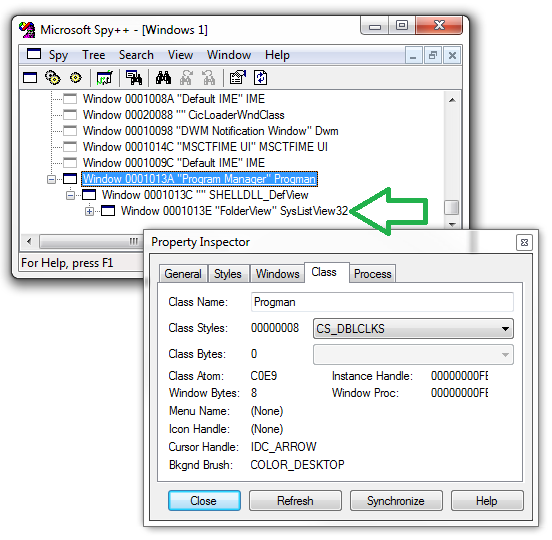

[ Home ](https://github.com/VFPX/Win32API)  

# Obtaining names and positions for shortcuts located on the Windows Desktop

## Before you begin:
This code sample shows how to retrieve names and positions of the shortcuts located on the Windows Desktop.    

The VFP version of this code sample works with no changes on either 32-bit or 64-bit systems.  

See also:

* [Moving shortcut to a specified position on the Windows Desktop](sample_581.md)  
* [How to create a desktop shortcut ](sample_583.md)  
  
***  


## Code:
```foxpro  
#DEFINE GW_CHILD 5
#DEFINE MEM_COMMIT 0x1000
#DEFINE MEM_RELEASE 0x8000
#DEFINE PAGE_READWRITE 4
#DEFINE PROCESS_ALL_ACCESS 0x1F0FFF

#DEFINE POINT_SIZE 8
#DEFINE MAX_PATH 260

#DEFINE LVM_FIRST 0x1000
#DEFINE LVM_GETITEMCOUNT LVM_FIRST + 4
#DEFINE LVM_GETITEMPOSITION LVM_FIRST + 16
#DEFINE LVM_GETITEMTEXT LVM_FIRST + 45

#DEFINE LVITEM_SIZE 60
#DEFINE LVITEM_SIZE_64 88

DO declare
DO EnumerateDesktopItems
* end of main

PROCEDURE EnumerateDesktopItems
	LOCAL nHwndListView, nProcessId, nProcess
	
	nHwndListView = GetDesktopListViewHandle()
	IF IsWindow(nHwndListView) <> 1
		RETURN
	ENDIF
	
	nProcessId = 0
	GetWindowThreadProcessId(;
		nHwndListView, @nProcessId)
	
	* obtain handle to a process that owns the ListView control
	* displayed on the Windows desktop
	nProcess = OpenProcess(;
		PROCESS_ALL_ACCESS, 0, nProcessId)
	
	IF (nProcess = 0)
		RETURN
	ENDIF
	
	LOCAL nItemCount, nItemIndex, nMemLVItem,;
			nMemItemText, nMemSubitemText, nMemPoint,;
			cLVItem, cTextBuffer, cPointBuffer, LVItemSize

	LVItemSize = GetLVItemSize()
	
	* allocate memory in the address space
	* of an external process that owns the ListView control
	* displayed on the Windows desktop
	nMemLVItem = AllocProcessMem(m.nProcess, m.LVItemSize)
	nMemItemText = AllocProcessMem(m.nProcess, MAX_PATH)
	nMemSubitemText = AllocProcessMem(m.nProcess, MAX_PATH)
	nMemPoint = AllocProcessMem(m.nProcess, POINT_SIZE)
	
	* the number of shortcuts located on the desktop
	nItemCount = SendMessage(nHwndListView,;
					LVM_GETITEMCOUNT, 0, 0)
	
	FOR nItemIndex=0 TO nItemCount-1
	
		* allocate and clear buffer for shortcut title
		cTextBuffer = REPLICATE(CHR(0), MAX_PATH)

		* copy shortcut title buffer
		* to external process memory
		WriteProcessMemory(m.nProcess, nMemItemText,;
			@cTextBuffer, MAX_PATH, 0)

		* allocate and populate buffer
		* for LVITEM structure
		cLVItem = GetLVItem(nItemIndex, nMemItemText)
		
		* copy LVITEM buffer
		* to external process memory
		WriteProcessMemory(m.nProcess, nMemLVItem,;
			@cLVItem, m.LVItemSize, 0)

		* request shortcut title
		SendMessage(nHwndListView, LVM_GETITEMTEXT,;
			m.nItemIndex, nMemLVItem)
		
		* copy shortcut title from external process memory
		* to local buffer
		ReadProcessMemory(m.nProcess, m.nMemItemText,;
			@cTextBuffer, MAX_PATH, 0)
		
		* display shortcut title
		cTextBuffer = STRTRAN(cTextBuffer, CHR(0), "")
		? TRANSFORM(nItemIndex+1) + ".", cTextBuffer

		* request shortcut position
		SendMessage(nHwndListView, LVM_GETITEMPOSITION,;
			m.nItemIndex, nMemPoint)

		* allocate local buffer for shortcut position
		cPointBuffer = REPLICATE(CHR(0), POINT_SIZE)
		
		* copy shortcut position from external process memory
		* to local buffer
		ReadProcessMemory(m.nProcess, m.nMemPoint,;
			@cPointBuffer, POINT_SIZE, 0)

		* display shortcut position
		? CHR(9) + "x = " +;
			TRANSFORM(buf2dword(SUBSTR(m.cPointBuffer, 1, 4))),;
			" y = " +;
			TRANSFORM(buf2dword(SUBSTR(m.cPointBuffer, 5, 4)))
	NEXT
	
	* release memory allocated in the address space
	* of external process
	FreeProcessMem(m.nProcess, nMemPoint)
	FreeProcessMem(m.nProcess, nMemSubitemText)
	FreeProcessMem(m.nProcess, nMemItemText)
	FreeProcessMem(m.nProcess, m.nMemLVItem)	

FUNCTION GetDesktopListViewHandle As Number
	LOCAL nHwndProgman, nHwndChild, nHwndListView
	
	nHwndProgman = FindWindow("Progman", NULL)
	nHwndChild = GetWindow(nHwndProgman, GW_CHILD)
	nHwndListView = GetWindow(nHwndChild, GW_CHILD)

RETURN m.nHwndListView

FUNCTION AllocProcessMem(nProcess As Number,;
			nSize As Number) As Number
RETURN VirtualAllocEx(m.nProcess, 0,;
	m.nSize, MEM_COMMIT, PAGE_READWRITE)

PROCEDURE FreeProcessMem(nProcess As Number,;
			nAddress As Number)
	VirtualFreeEx(m.nProcess,;
		m.nAddress, 0, MEM_RELEASE)

FUNCTION GetLVItem(nItemIndex As Number,;
			nTextAddress As Number) As Character

	LOCAL cBuffer, nLVItemSize
	
	IF IsWow64()
	* LVItem structure has to be tweaked
	* when this code is executed on 64-bit system
		cBuffer =;
			num2dword(0) +;
			num2dword(m.nItemIndex) +;
			num2dword(0) +;
			num2dword(0) +;
			num2dword(0) +;
			num2dword(0) +;
			num2dword(nTextAddress) +;
			num2dword(0) +;
			num2dword(MAX_PATH)
	ELSE
	* regular LVItem layout on 32-bit system
		cBuffer =;
			num2dword(0) +;
			num2dword(m.nItemIndex) +;
			num2dword(0) +;
			num2dword(0) +;
			num2dword(0) +;
			num2dword(nTextAddress) +;
			num2dword(MAX_PATH)
	ENDIF
	
	nLVItemSize = GetLVItemSize()
	
RETURN PADR(cBuffer, m.nLVItemSize, CHR(0))

FUNCTION GetLVItemSize() As Number
RETURN IIF(IsWow64(), LVITEM_SIZE_64, LVITEM_SIZE)

FUNCTION IsWow64 As Boolean
	LOCAL nHandle, lWow64Process
	nHandle = GetCurrentProcess()
	lWow64Process = 0
	IsWow64Process(nHandle, @lWow64Process)
	CloseHandle(nHandle)
RETURN lWow64Process <> 0

PROCEDURE declare
	DECLARE INTEGER IsWindow IN user32 INTEGER hWindow
	
	DECLARE INTEGER GetWindowThreadProcessId IN user32;
		INTEGER hWindow, INTEGER @lpdwProcId
	
	DECLARE INTEGER GetWindow IN user32;
		INTEGER hwnd, INTEGER wFlag

	DECLARE INTEGER FindWindow IN user32;
		STRING lpClassName, STRING lpWindowName

	DECLARE INTEGER VirtualAllocEx IN kernel32;
		INTEGER hProcess, INTEGER lpAddress,;
		LONG dwSize, INTEGER flAllocationType,;
		INTEGER flProtect

	DECLARE INTEGER VirtualFreeEx IN kernel32;
		INTEGER hProcess, INTEGER lpAddress,;
		LONG dwSize, INTEGER dwFreeType
		
	DECLARE INTEGER OpenProcess IN kernel32;
		INTEGER dwDesiredAccessas, INTEGER bInheritHandle,;
		INTEGER dwProcId

	DECLARE INTEGER SendMessage IN user32;
		INTEGER hWindow, INTEGER Msg,;
		INTEGER wParam, INTEGER lParam

	DECLARE INTEGER ReadProcessMemory IN kernel32;
		INTEGER hProcess, INTEGER lpBaseAddress,;
		STRING @lpBuffer, LONG nSize,;
		LONG @lpNumberOfBytesRead

	DECLARE INTEGER WriteProcessMemory IN kernel32;
		INTEGER hProcess, INTEGER lpBaseAddress,;
		STRING @lpBuffer, LONG nSize,;
		LONG @ lpNumberOfBytesWritten

	DECLARE INTEGER GetCurrentProcess IN kernel32
	
	DECLARE INTEGER CloseHandle IN kernel32 INTEGER hObject	
	
	DECLARE INTEGER IsWow64Process IN kernel32;
		INTEGER hProcess, INTEGER @Wow64Process

FUNCTION buf2dword(cBuffer)
RETURN Asc(SUBSTR(cBuffer, 1,1)) + ;
	BitLShift(Asc(SUBSTR(cBuffer, 2,1)),  8) +;
	BitLShift(Asc(SUBSTR(cBuffer, 3,1)), 16) +;
	BitLShift(Asc(SUBSTR(cBuffer, 4,1)), 24)

FUNCTION num2dword(lnValue)
#DEFINE m0 0x0000100
#DEFINE m1 0x0010000
#DEFINE m2 0x1000000
	IF lnValue < 0
		lnValue = 0x100000000 + lnValue
	ENDIF
	LOCAL b0, b1, b2, b3
	b3 = Int(lnValue/m2)
	b2 = Int((lnValue - b3*m2)/m1)
	b1 = Int((lnValue - b3*m2 - b2*m1)/m0)
	b0 = Mod(lnValue, m0)
RETURN Chr(b0)+Chr(b1)+Chr(b2)+Chr(b3)  
```  
***  


## Listed functions:
[CloseHandle](../libraries/kernel32/CloseHandle.md)  
[FindWindow](../libraries/user32/FindWindow.md)  
[GetCurrentProcess](../libraries/kernel32/GetCurrentProcess.md)  
[GetWindow](../libraries/user32/GetWindow.md)  
[GetWindowThreadProcessId](../libraries/user32/GetWindowThreadProcessId.md)  
[IsWindow](../libraries/user32/IsWindow.md)  
[IsWow64Process](../libraries/kernel32/IsWow64Process.md)  
[OpenProcess](../libraries/kernel32/OpenProcess.md)  
[ReadProcessMemory](../libraries/kernel32/ReadProcessMemory.md)  
[SendMessage](../libraries/user32/SendMessage.md)  
[VirtualAllocEx](../libraries/kernel32/VirtualAllocEx.md)  
[VirtualFreeEx](../libraries/kernel32/VirtualFreeEx.md)  
[WriteProcessMemory](../libraries/kernel32/WriteProcessMemory.md)  

## Comment:
On the picture below, the window with title "FolderView" and class "SysListView32" is actually a ListView control. The OS uses this ListView control for displaying shortcuts on the Windows desktop.  
  
  
For manipulating ListViews, Windows has an exhaustive set of [LVM macros](http://msdn.microsoft.com/en-us/library/windows/desktop/ff485961(v=vs.85).aspx). Each LVM macro wraps a call to the SendMessage API function.  
  
Take in account that the Desktop ListView belongs to a different process. That makes calling the LVM macros a bit more complex than if both a caller and a ListView had shared the same process. Some memory needs to be allocated directly in the address space of that process, and some data moved back and forth.  
  
And here is one more thing. On 64-bit system the Desktop ListView obviously belongs to a 64-bit process. And remember that Visual FoxPro is a 32-bit application.   
  
That 32 to 64-bit issue makes LVM calls that use the LVITEM structure even more convoluted. The structure clearly cannot be used as is. Instead some of its members (the pointers) must  be "padded" with extra bytes to fit a pattern recognizable by 64-bit OS.  
  
***  

