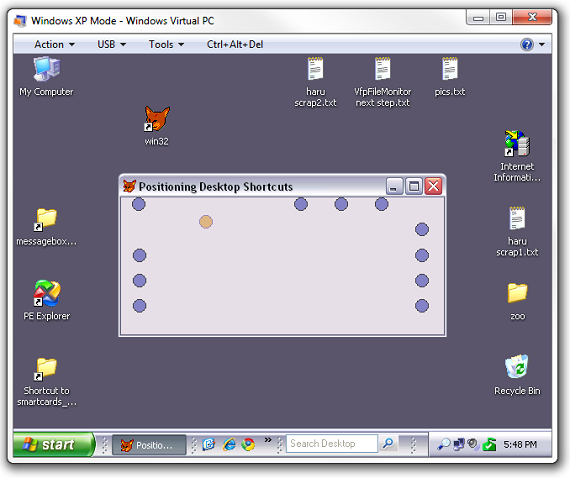

[ Home ](https://github.com/VFPX/Win32API)  

# Moving shortcut to a specified position on the Windows Desktop

## Before you begin:
Before testing this code sample, uncheck "Auto arrange icons" and "Align icons to grid" options in the context menu on the Windows desktop.  

  

On the VFP form, each round *Shape* control corresponds to a shortcut  located on the Windows Desktop.   

On initialization, the form reads the desktop shortuct locations and then arranges the shapes accordingly. Moving a shape on the form also moves the corresponding desktop shortcut (not otherwise, though it is also achievable).   

See also:

* [Obtaining names and positions for shortcuts located on the Windows Desktop](sample_579.md)  
* [How to create a desktop shortcut ](sample_583.md)  
  
***  


## Code:
```foxpro  
LOCAL oForm As TestForm
oForm = CREATEOBJECT("TestForm")
oForm.Visible = .T.
READ EVENTS
* end of main

DEFINE CLASS TestForm As Form
#DEFINE GW_CHILD 5

#DEFINE MEM_COMMIT 0x1000
#DEFINE MEM_RELEASE 0x8000
#DEFINE PAGE_READWRITE 4
#DEFINE PROCESS_ALL_ACCESS 0x1F0FFF

#DEFINE POINT_SIZE 8
#DEFINE LVM_FIRST 0x1000
#DEFINE LVM_GETITEMCOUNT LVM_FIRST + 4
#DEFINE LVM_GETITEMPOSITION LVM_FIRST + 16
#DEFINE LVM_SETITEMPOSITION32 LVM_FIRST + 49

	Caption="Positioning Desktop Shortcuts"
	ShowWindow=2
	ShowTips=.T.
	hListViewHwnd=0
	hProcess=0
	
PROCEDURE Init
	THIS.Width = SYSMETRIC(1)* 0.6
	THIS.Height = SYSMETRIC(2) * 0.34
	THIS.AutoCenter = .T.
	_screen.Visible = .F.
	
	THIS.declare
	THIS.EnumerateShortcuts

PROCEDURE Destroy
	IF THIS.hProcess <> 0
		CloseHandle(THIS.hProcess)
		THIS.hProcess = 0
	ENDIF
	
	_screen.Visible = .T.
	CLEAR EVENTS

PROCEDURE RemoveShortcuts
	LOCAL nShortcutIndex, oShape As DesktopShortcutShape
	nShortcutIndex = 0
	
	DO WHILE .T.
		oShape = THIS.GetShapeObject(nShortcutIndex)

		IF ISNULL(m.oShape)
			RETURN
		ELSE
			cShapeName = THIS.GetShapeName(m.nShortcutIndex)
			THIS.RemoveObject(THIS.GetShapeName(m.nShortcutIndex))
		ENDIF

		nShortcutIndex = nShortcutIndex + 1
	ENDDO

PROCEDURE EnumerateShortcuts
	THIS.RemoveShortcuts
	THIS.GetDesktopListViewHandle
	
	LOCAL nShortcutCount, nShortcutIndex
	
	nShortcutCount = SendMessage(THIS.hListViewHwnd,;
					LVM_GETITEMCOUNT, 0, 0)

	FOR nShortcutIndex=0 TO nShortcutCount-1
		THIS.GetShortcutPosition(nShortcutIndex)
	NEXT

FUNCTION GetShapeName(nShortcutIndex As Number)
RETURN "ShortcutShape" + TRANSFORM(nShortcutIndex)

FUNCTION GetShapeObject(nShortcutIndex As Number) As DesktopShortcutShape
	LOCAL cObject, cType
	cObject = "ThisForm." + THIS.GetShapeName(nShortcutIndex)
	cType = TYPE("ThisForm." + THIS.GetShapeName(nShortcutIndex))
RETURN IIF(m.cType = "O", EVALUATE(cObject), NULL)

PROCEDURE GetShortcutPosition(nShortcutIndex As Number)
	LOCAL cPointBuffer, nMemPoint, X, Y, oShape As DesktopShortcutShape
	
	cPointBuffer = REPLICATE(CHR(0), POINT_SIZE)
	nMemPoint = THIS.AllocProcessMem(POINT_SIZE)

	SendMessage(THIS.hListViewHwnd,;
		LVM_GETITEMPOSITION,;
		nShortcutIndex, nMemPoint)

	ReadProcessMemory(THIS.hProcess, m.nMemPoint,;
		@cPointBuffer, POINT_SIZE, 0)

	THIS.FreeProcessMem(nMemPoint)

	X = buf2dword(SUBSTR(m.cPointBuffer, 1, 4))
	Y = buf2dword(SUBSTR(m.cPointBuffer, 5, 4))
	
	THIS.AddObject(THIS.GetShapeName(nShortcutIndex),;
		"DesktopShortcutShape")
	
	oShape = THIS.GetShapeObject(nShortcutIndex)
	
	WITH oShape
		.ShortcutIndex = nShortcutIndex
		.Left = (m.X * THIS.Width) / SYSMETRIC(1)
		.Top = (m.Y * THIS.Height) / SYSMETRIC(2)
		.Visible = .T.
	ENDWITH

PROCEDURE SetShortcutPosition(nShortcutIndex, X As Number, Y As Number)
	LOCAL cPointBuffer, nMemPoint, nResult
	
	cPointBuffer = num2dword(m.X) +;
		num2dword(m.Y)
		
	nMemPoint = THIS.AllocProcessMem(POINT_SIZE)
	
	WriteProcessMemory(THIS.hProcess, nMemPoint,;
			@cPointBuffer, POINT_SIZE, 0)

	SendMessage(THIS.hListViewHwnd,;
		LVM_SETITEMPOSITION32,;
		nShortcutIndex, nMemPoint)

	THIS.FreeProcessMem(nMemPoint)

PROCEDURE GetDesktopListViewHandle
	LOCAL nHwndProgman, nHwndChild, nProcessId
	
	nHwndProgman = FindWindow("Progman", NULL)
	nHwndChild = GetWindow(nHwndProgman, GW_CHILD)

	THIS.hListViewHwnd = GetWindow(nHwndChild, GW_CHILD)

	nProcessId = 0
	GetWindowThreadProcessId(;
		THIS.hListViewHwnd, @nProcessId)

	THIS.hProcess = OpenProcess(;
		PROCESS_ALL_ACCESS, 0, nProcessId)

FUNCTION AllocProcessMem(nSize As Number) As Number
RETURN VirtualAllocEx(THIS.hProcess, 0,;
	m.nSize, MEM_COMMIT, PAGE_READWRITE)

PROCEDURE FreeProcessMem(nAddress As Number)
	VirtualFreeEx(THIS.hProcess,;
		m.nAddress, 0, MEM_RELEASE)

PROCEDURE declare
	DECLARE INTEGER CloseHandle IN kernel32;
		INTEGER hObject	
	
	DECLARE INTEGER GetWindowThreadProcessId IN user32;
		INTEGER hWindow, INTEGER @lpdwProcId
	
	DECLARE INTEGER GetWindow IN user32;
		INTEGER hwnd, INTEGER wFlag

	DECLARE INTEGER FindWindow IN user32;
		STRING lpClassName, STRING lpWindowName

	DECLARE INTEGER VirtualAllocEx IN kernel32;
		INTEGER hProcess, INTEGER lpAddress,;
		LONG dwSize, INTEGER flAllocationType,;
		INTEGER flProtect

	DECLARE INTEGER VirtualFreeEx IN kernel32;
		INTEGER hProcess, INTEGER lpAddress,;
		LONG dwSize, INTEGER dwFreeType
		
	DECLARE INTEGER OpenProcess IN kernel32;
		INTEGER dwDesiredAccessas,;
		INTEGER bInheritHandle,;
		INTEGER dwProcId

	DECLARE INTEGER SendMessage IN user32;
		INTEGER hWindow, INTEGER Msg,;
		INTEGER wParam, INTEGER lParam

	DECLARE INTEGER ReadProcessMemory IN kernel32;
		INTEGER hProcess, INTEGER lpBaseAddress,;
		STRING @lpBuffer, LONG nSize,;
		LONG @lpNumberOfBytesRead

	DECLARE INTEGER WriteProcessMemory IN kernel32;
		INTEGER hProcess, INTEGER lpBaseAddress,;
		STRING @lpBuffer, LONG nSize,;
		LONG @ lpNumberOfBytesWritten

ENDDEFINE

DEFINE CLASS DesktopShortcutShape As Shape
	Width=16
	Height=16
	Curvature=99
	
	ShortcutIndex=0
	LastX=0
	LastY=0

PROCEDURE Init
	THIS.SetSelected(.F.)

PROCEDURE SetSelected(lSelected As Boolean)
	WITH THIS
		IF m.lSelected
			.Backcolor = RGB(220,180,128)
			.BorderColor = RGB(156,128,180)
		ELSE
			.Backcolor = RGB(128,128,192)
			.BorderColor = RGB(64,64,64)
		ENDIF
	ENDWITH

PROCEDURE MouseDown
LPARAMETERS nButton, nShift, nXCoord, nYCoord
	IF nButton = 1
		WITH THIS
			.LastX = nXCoord
			.LastY = nYCoord
			.ZOrder(0)
			.SetSelected(.T.)
		ENDWITH
	ENDIF

PROCEDURE MouseUp
LPARAMETERS nButton, nShift, nXCoord, nYCoord
	IF nButton = 1
		WITH THIS
			.SetSelected(.F.)
		ENDWITH
	ENDIF

PROCEDURE MouseMove
LPARAMETERS nButton, nShift, nXCoord, nYCoord
	IF nButton <> 1
		RETURN
	ENDIF
	
	WITH THIS
		.Left = .Left - .LastX + nXCoord
		.Top = .Top - .LastY + nYCoord

		.LastX = nXCoord
		.LastY = nYCoord

		ThisForm.SetShortcutPosition(;
			.ShortcutIndex,;
			(.Left * SYSMETRIC(1)) / ThisForm.Width,;
			(.Top * SYSMETRIC(2)) / ThisForm.Height)
	ENDWITH

ENDDEFINE

FUNCTION buf2dword(cBuffer)
RETURN Asc(SUBSTR(cBuffer, 1,1)) + ;
	BitLShift(Asc(SUBSTR(cBuffer, 2,1)),  8) +;
	BitLShift(Asc(SUBSTR(cBuffer, 3,1)), 16) +;
	BitLShift(Asc(SUBSTR(cBuffer, 4,1)), 24)

FUNCTION num2dword(lnValue)
#DEFINE m0 0x0000100
#DEFINE m1 0x0010000
#DEFINE m2 0x1000000
	IF lnValue < 0
		lnValue = 0x100000000 + lnValue
	ENDIF
	LOCAL b0, b1, b2, b3
	b3 = Int(lnValue/m2)
	b2 = Int((lnValue - b3*m2)/m1)
	b1 = Int((lnValue - b3*m2 - b2*m1)/m0)
	b0 = Mod(lnValue, m0)
RETURN Chr(b0)+Chr(b1)+Chr(b2)+Chr(b3)  
```  
***  


## Listed functions:
[CloseHandle](../libraries/kernel32/CloseHandle.md)  
[FindWindow](../libraries/user32/FindWindow.md)  
[GetWindow](../libraries/user32/GetWindow.md)  
[GetWindowThreadProcessId](../libraries/user32/GetWindowThreadProcessId.md)  
[OpenProcess](../libraries/kernel32/OpenProcess.md)  
[ReadProcessMemory](../libraries/kernel32/ReadProcessMemory.md)  
[SendMessage](../libraries/user32/SendMessage.md)  
[VirtualAllocEx](../libraries/kernel32/VirtualAllocEx.md)  
[VirtualFreeEx](../libraries/kernel32/VirtualFreeEx.md)  
[WriteProcessMemory](../libraries/kernel32/WriteProcessMemory.md)  

## Comment:
On the Internet one can find utility software that allows user save and restore desktop shortcut layout in Windows. Using this code sample you can write your own Visual FoxPro shortcut layout utility that will work on 32- and 64-bit Windows from XP and up.  
  
***  

