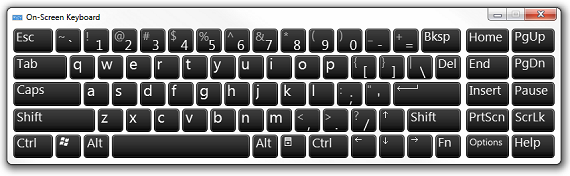
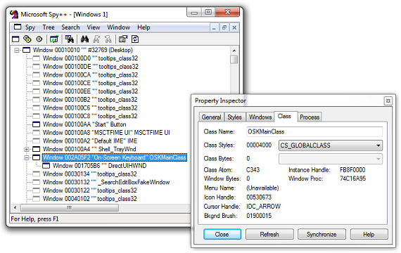

[ Home ](https://github.com/VFPX/Win32API)  

# How to display Windows On-Screen Keyboard

## Before you begin:
  
For data entry, instead of relying on the physical keyboard, user may choose using Windows On-Screen Keyboard instead. This virtual keyboard gives access to all standard keys.  

On-Screen Keyboard executable file, *osk.exe*, resides in System32 directory. Note that on 64-bit systems this file cannot be launched from 32-bit process. ["File System Redirector"](http://msdn.microsoft.com/en-us/library/aa384187(v=vs.85).aspx) article on MSDN explains why:  

> 32-bit applications can access the native system directory by substituting %windir%\Sysnative for %windir%\System32. WOW64 recognizes Sysnative as a special alias used to indicate that the file system should not redirect the access.

***  


## Code:
```foxpro  
#DEFINE MAX_PATH 260
#DEFINE OSK_EXE "osk.exe"

DO declare
= ShellExecute(0, "open", GetOskPath(), "", "", 1)
* end of main

FUNCTION GetOskPath() As String
	LOCAL cPath

	cPath = PathCombine(;
		GETENV("windir"),;
		"sysnative",;
		OSK_EXE )

	IF FILE(cPath)
		RETURN m.cPath
	ENDIF
	
	cPath = PathCombine(;
		GetSysDir(),;
		OSK_EXE )

RETURN IIF(FILE(cPath), m.cPath, OSK_EXE)

FUNCTION GetSysDir
	LOCAL cBuffer, nBufsize
	cBuffer=REPLICATE(CHR(0), MAX_PATH)
	nBufsize= GetSystemDirectory(@cBuffer, LEN(cBuffer))
RETURN SUBSTR(cBuffer, 1, nBufsize)

FUNCTION PathCombine(p1, p2, p3, p4, p5) As String
	LOCAL cBuffer, cPath1, cPath2, nIndex, nCount
	nCount = PCOUNT()
	
	DO CASE
	CASE nCount = 0
		RETURN ""
	CASE nCount = 1
		RETURN p1
	ENDCASE

	cBuffer = m.p1
	
	FOR nIndex=2 TO nCount
		cPath1 = STRTRAN(m.cBuffer, CHR(0), "")
		cPath2 = EVALUATE("m.p" + TRANSFORM(m.nIndex))
		cBuffer = REPLICATE(CHR(0), MAX_PATH)
		PathCombineApi(@cBuffer, cPath1, cPath2)
	NEXT
RETURN STRTRAN(m.cBuffer, CHR(0), "")

PROCEDURE declare
	DECLARE INTEGER GetSystemDirectory IN kernel32;
		STRING @lpBuffer, INTEGER nSize
		
	DECLARE INTEGER ShellExecute IN shell32;
		INTEGER hWindow, STRING lpOperation,;
		STRING lpFile, STRING lpParameters,;
		STRING lpDirectory, INTEGER nShowCmd
		
	DECLARE INTEGER PathCombine IN shlwapi;
	AS PathCombineApi;
		STRING @lpszDest, STRING lpszDir,;
		STRING lpszFile  
```  
***  


## Listed functions:
[GetSystemDirectory](../libraries/kernel32/GetSystemDirectory.md)  
[PathCombine](../libraries/shlwapi/PathCombine.md)  
[ShellExecute](../libraries/shell32/ShellExecute.md)  

## Comment:


On-Screen Keyboard's window class name is "OSKMainClass". Knowing this, a VFP application can test the visibility of the On-Screen Keyboard by calling the FindWindow. By calling the SetWindowPos or similar API function, the virtual keyboard can be shown, hidden, or positioned at a specified point on the screen.  
  
***  

