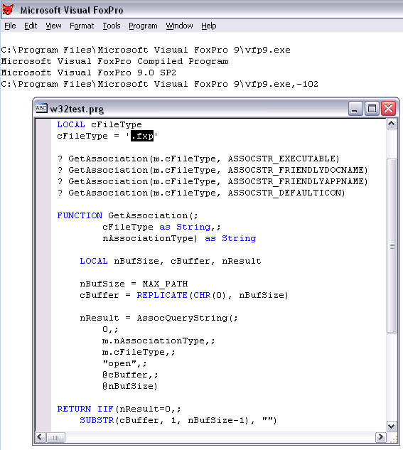

[ Home ](https://github.com/VFPX/Win32API)  

# Finding the application, icon and friendly names associated with a file name

## Before you begin:
See also:

* [How to find the application associated with a file name](sample_138.md)  
* [Displaying the associated icons and descriptions for files and folders](sample_530.md)  
* [How to view system icons for the classes installed on the local machine](sample_544.md)  
* [How to obtain Content-Type value for a file type from the System Registry](sample_468.md)  
  
***  


## Code:
```foxpro  
#DEFINE MAX_PATH 260

#DEFINE ASSOCSTR_EXECUTABLE 2
#DEFINE ASSOCSTR_FRIENDLYDOCNAME 3
#DEFINE ASSOCSTR_FRIENDLYAPPNAME 4
#DEFINE ASSOCSTR_DEFAULTICON 15

DO declare

LOCAL cFileType
cFileType = ".fxp"

? GetAssociation(m.cFileType, ASSOCSTR_EXECUTABLE)
? GetAssociation(m.cFileType, ASSOCSTR_FRIENDLYDOCNAME)
? GetAssociation(m.cFileType, ASSOCSTR_FRIENDLYAPPNAME)
? GetAssociation(m.cFileType, ASSOCSTR_DEFAULTICON)

FUNCTION GetAssociation(;
		cFileType as String,;
		nAssociationType) as String
		
	LOCAL nBufSize, cBuffer, nResult

	nBufSize = MAX_PATH
	cBuffer = REPLICATE(CHR(0), nBufSize)

	nResult = AssocQueryString(;
		0,;
		m.nAssociationType,;
		m.cFileType,;
		"open",;
		@cBuffer,;
		@nBufSize)

RETURN IIF(nResult=0,;
	SUBSTR(cBuffer, 1, nBufSize-1), "")

PROCEDURE declare

	DECLARE INTEGER AssocQueryString IN Shlwapi;
		INTEGER queryFlags, INTEGER queryString,;
		STRING pszAssoc, STRING pszExtra,;
		STRING @pszOut, INTEGER @pcchOut  
```  
***  


## Listed functions:
[AssocQueryString](../libraries/shlwapi/AssocQueryString.md)  

## Comment:


***  

