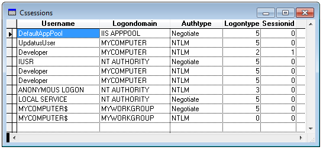

[ Home ](https://github.com/VFPX/Win32API)  

# How to enumerate logon sessions on local computer

## Before you begin:
  

See also:

* [How to enumerate sessions and processes on a specified terminal server](sample_519.md)  
* [Enumerating network sessions established on a server](sample_505.md)  
  
***  


## Code:
```foxpro  
#DEFINE STATUS_SUCCESS 0
#DEFINE SIZE_OF_LUID 8
#DEFINE SIZE_OF_LSA_STRING 8
DO declare

LOCAL nResult, nSessionCount, nSessionListPtr,;
	nIndex, nSessionListOffset, nSessionDataPtr,;
	cDataBuffer, nDataSize
	
STORE 0 TO nSessionCount, nSessionListPtr

nResult = LsaEnumerateLogonSessions(;
	@nSessionCount, @nSessionListPtr)

IF nResult <> STATUS_SUCCESS
	? "Call to LsaEnumerateLogonSessions failed:", nResult
	RETURN
ENDIF

? "Session count:", nSessionCount
CREATE CURSOR csSessions (;
	UserName C(50),;
	LogonDomain C(100),;
	AuthType C(50),;
	LogonType I,;
	SessionId I;
)

FOR nIndex=1 TO nSessionCount
	nSessionDataPtr = 0
	
	nSessionListOffset = nSessionListPtr +;
		(nIndex - 1) * SIZE_OF_LUID
		
	nResult = LsaGetLogonSessionData(;
		nSessionListOffset, @nSessionDataPtr)
		
	IF nResult = STATUS_SUCCESS
		cDataBuffer = REPLICATE(CHR(0), 32)
		MemToStr(@cDataBuffer, nSessionDataPtr, 4)
		nDataSize = buf2dword(SUBSTR(cDataBuffer, 1, 4))
		
		IF nDataSize > 0
			cDataBuffer = REPLICATE(CHR(0), nDataSize)
			MemToStr(@cDataBuffer, nSessionDataPtr, nDataSize)
			
			INSERT INTO csSessions VALUES (;
				GetLsaString(cDataBuffer, 13),;
				GetLsaString(cDataBuffer, 21),;
				GetLsaString(cDataBuffer, 29),;
				buf2dword(SUBSTR(cDataBuffer, 37, 4)),;
				buf2dword(SUBSTR(cDataBuffer, 41, 4));
			)
		ENDIF
	ENDIF
		
	IF nSessionDataPtr <> 0
		LsaFreeReturnBuffer(nSessionDataPtr )
	ENDIF
NEXT

LsaFreeReturnBuffer(nSessionListPtr)

SELECT csSessions
GO TOP
BROWSE NORMAL NOWAIT
* end of main

FUNCTION GetLsaString(cDataBuffer, nOffset)
	LOCAL nStringLen, nStringPtr
	nStringLen = buf2word(SUBSTR(m.cDataBuffer, nOffset, 4))
	nStringPtr = buf2dword(SUBSTR(m.cDataBuffer, nOffset + 4, 4))

	IF nStringLen = 0
		RETURN ""
	ENDIF
	
	LOCAL cBuffer
	cBuffer = REPLICATE(CHR(0), nStringLen)
	MemToStr(@cBuffer, nStringPtr, nStringLen)
RETURN STRCONV(cBuffer, 6)

FUNCTION buf2dword(cBuffer)
RETURN Asc(SUBSTR(cBuffer, 1,1)) + ;
	BitLShift(Asc(SUBSTR(cBuffer, 2,1)),  8) +;
	BitLShift(Asc(SUBSTR(cBuffer, 3,1)), 16) +;
	BitLShift(Asc(SUBSTR(cBuffer, 4,1)), 24)

FUNCTION buf2word(lcBuffer)
RETURN Asc(SUBSTR(lcBuffer, 1,1)) + ;
       Asc(SUBSTR(lcBuffer, 2,1)) * 256

PROCEDURE declare
	DECLARE INTEGER LsaEnumerateLogonSessions IN secur32;
		INTEGER @LogonSessionCount,;
		INTEGER @LogonSessionList

	DECLARE INTEGER LsaGetLogonSessionData IN secur32;
		INTEGER LogonId,;
		INTEGER @ppLogonSessionData

	DECLARE INTEGER LsaFreeReturnBuffer IN secur32;
		INTEGER Buffer

	DECLARE RtlMoveMemory IN kernel32 As MemToStr;
		STRING @, INTEGER, INTEGER  
```  
***  


## Listed functions:
[LsaEnumerateLogonSessions](../libraries/secur32/LsaEnumerateLogonSessions.md)  
[LsaFreeReturnBuffer](../libraries/secur32/LsaFreeReturnBuffer.md)  
[LsaGetLogonSessionData](../libraries/secur32/LsaGetLogonSessionData.md)  

## Comment:
Enumerating logon sessions on a computer allows to see authenticated users.  
  
* * *  
Logon Types:  
```txt
typedef enum _SECURITY_LOGON_TYPE {   
  Interactive              = 2,  
  Network,  
  Batch,  
  Service,  
  Proxy,  
  Unlock,  
  NetworkCleartext,  
  NewCredentials,  
  RemoteInteractive,  
  CachedInteractive,  
  CachedRemoteInteractive,  
  CachedUnlock  
} SECURITY_LOGON_TYPE, *PSECURITY_LOGON_TYPE;
```
  
***  

