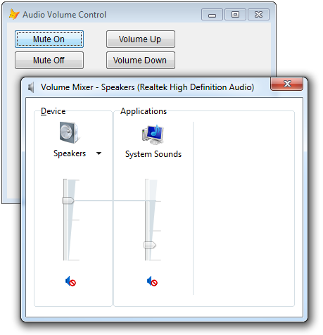

[ Home ](https://github.com/VFPX/Win32API)  

# Controlling master audio volume by sending WM_APPCOMMAND messages

## Short description:
The WM_APPCOMMAND message allows to acquire medium level of control over several OS areas: speakers, microphone, media, browser, mail, default applications. This code sample shows how to mute, unmute and change the volume of the speakers. This technique provides no means of reading the volume level or the mute status.  
***  


## Before you begin:
  

The [WM_APPCOMMAND message](http://msdn.microsoft.com/en-us/library/windows/desktop/ms646275(v=vs.85).aspx) allows to acquire medium level of control over several OS areas: *speakers, microphone, media, browser, mail, default applications.*  

The code sample below shows how to mute, unmute and change the volume of the speakers. This technique provides no means of reading the volume level or the mute state.  

See also:

* [WAV file player](sample_417.md)  
* [WAV file recorder](sample_421.md)  
* [Playing WAV sounds simultaneously](sample_523.md)  
* [How to play MIDI notes](sample_537.md)  

  
***  


## Code:
```foxpro  
LOCAL oForm as TForm
oForm = CREATEOBJECT("TForm")
oForm.Show(1)
* end of main

DEFINE CLASS TForm as Form
#DEFINE WM_APPCOMMAND 0x319
#DEFINE APPCOMMAND_VOLUME_MUTE 0x80000
#DEFINE APPCOMMAND_VOLUME_UP 0xA0000
#DEFINE APPCOMMAND_VOLUME_DOWN 0x90000

	Caption="Audio Volume Control"
	
	ADD OBJECT CommandMuteOn as CommandButton WITH;
	Caption="Mute On", Width=100, Height=27,;
	Left=10, Top=10

	ADD OBJECT CommandMuteOff as CommandButton WITH;
	Caption="Mute Off", Width=100, Height=27,;
	Left=10, Top=40

	ADD OBJECT CommandVolumeUp as CommandButton WITH;
	Caption="Volume Up", Width=100, Height=27,;
	Left=140, Top=10

	ADD OBJECT CommandVolumeDown as CommandButton WITH;
	Caption="Volume Down", Width=100, Height=27,;
	Left=140, Top=40

	ADD OBJECT CommandBeep as CommandButton WITH;
	Caption="Beep", Width=100, Height=27,;
	Left=10, Top=100

PROCEDURE Init
	THIS.declare

PROCEDURE CommandMuteOn.Click
	ThisForm.VolumeMuteOn

PROCEDURE CommandMuteOff.Click
	ThisForm.VolumeMuteOff

PROCEDURE CommandVolumeUp.Click
	ThisForm.VolumeUp

PROCEDURE CommandVolumeDown.Click
	ThisForm.VolumeDown

PROCEDURE CommandBeep.Click
	Beep(360, 600)

PROCEDURE VolumeMuteOn
	* a volume change unmutes the speaker
	THIS.SendAppCommand(APPCOMMAND_VOLUME_UP)
	THIS.SendAppCommand(APPCOMMAND_VOLUME_DOWN)
	
	* APPCOMMAND_VOLUME_MUTE command does not mute
	* but flips the Mute state
	THIS.SendAppCommand(APPCOMMAND_VOLUME_MUTE)

PROCEDURE VolumeMuteOff
	* a volume change unmutes the speaker
	THIS.SendAppCommand(APPCOMMAND_VOLUME_UP)
	THIS.SendAppCommand(APPCOMMAND_VOLUME_DOWN)

PROCEDURE VolumeUp
	THIS.SendAppCommand(APPCOMMAND_VOLUME_UP)

PROCEDURE VolumeDown
	THIS.SendAppCommand(APPCOMMAND_VOLUME_DOWN)

PROCEDURE SendAppCommand
PARAMETERS nCommand
	LOCAL hWindow

	* other candidates:
	* _screen.hWnd, ThisForm.hWnd
	hWindow = _vfp.hWnd

	SendMessage(;
		hWindow,;
		WM_APPCOMMAND,;
		hWindow,;
		m.nCommand)

PROCEDURE declare
	DECLARE INTEGER SendMessage IN user32;
		INTEGER hWindow, INTEGER Msg,;
		INTEGER wParam, INTEGER lParam

	DECLARE INTEGER Beep IN kernel32;
		INTEGER dwFreq, INTEGER dwDuration
		
ENDDEFINE  
```  
***  


## Listed functions:
[Beep](../libraries/kernel32/Beep.md)  
[SendMessage](../libraries/user32/SendMessage.md)  

## Comment:
The WM_APPCOMMAND message needs to be sent to either of three: *_vfp.hWnd, _screen.hWnd, ThisForm.hWnd*.  
  
  
***  

