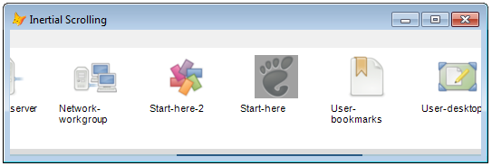
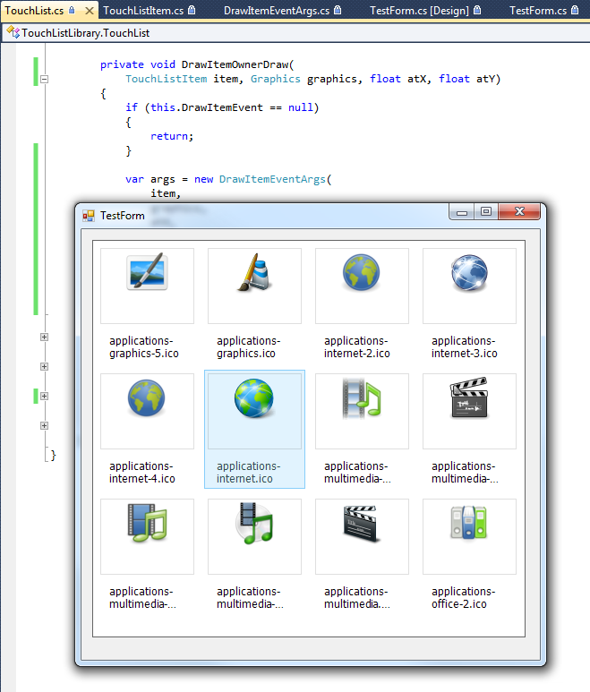
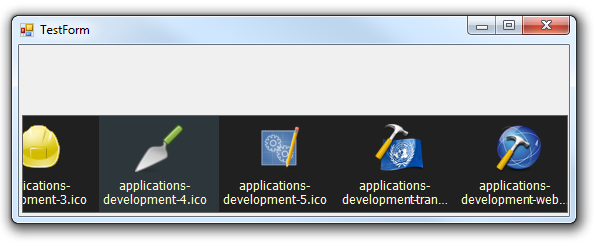

[ Home ](https://github.com/VFPX/Win32API)  

# GDI+: Implementing image scrolling with inertia


## Before you begin:


The inertial scrolling can be described as below:

After releasing the mouse button, the image scrolling coninues while decelerating slowly, simulating the presence of inertia. The level of the deceleration depends on the momentum the mouse cursor obtains at the button release.*

The code is based on [custom GDI+ class](sample_450.md). Download the class module first and save it in **gdiplus.prg** file. 

Download [image file (10,000 x 64 pixels)](../downloads/widetext005.zip) to be used with this code sample.   

Otherwise use any wide image, preferrably 24-bit bitmap. I have no explanation yet, but the code sample works a bit different with PNG, JPEG, and 16-bit bitmaps. Even when they are directly converted from an original 24-bit bitmap file.  

Visualization is implemented for the boundaries and the relative position.  
  

See also:

* [GDI+: Scrolling through large image using the mouse](sample_546.md)  
* [Creating thumbnails to preview images in a directory](sample_547.md)  
  
***  


## Code:
```foxpro  
oForm = CREATEOBJECT(;
	"ImageScrollForm",;
	"C:\myimages\widetext005.bmp") && change the path

oForm.Visible=.T.
READ EVENTS
* end of main

DEFINE CLASS ImageScrollForm As Form
#DEFINE BOUNDARY_WIDTH 10
#DEFINE SCROLLBAR_HEIGHT 2
#DEFINE BOUNDARY_COLOR RGB(0,128,255)
#DEFINE SCROLLBAR_BGCOLOR RGB(255,255,255)
#DEFINE THUMB_BGCOLOR RGB(0,64,255)

	Width= 1100
	Height=34
	Autocenter=.T.
	
	gdiplus=0
	oImg=0
	hDC=0
	hCapture=0
	formgraphics=NULL
	
	ImageOffsetX=0
	SavedMouseOffsetX=0
	MouseOffsetX=0
	
	oPoints=NULL
	TimerTicks=0
	
	ADD OBJECT Label1 As Label WITH;
		Caption="The image file is invalid",;
		Left=10, Top=10, Autosize=.T.
	
	ADD OBJECT Timer1 as Timer WITH;
		Interval=16, Enabled=.F.

PROCEDURE Init(cImageFile As String)
	SET PROCEDURE TO gdiplus ADDITIVE
	
	WITH THIS
		.declare
		.gdiplus = CREATEOBJECT("gdiplusinit")
		.oImg = CREATEOBJECT("gdiimage", m.cImageFile)
		.Label1.Caption = "Image file " +;
			m.cImageFile + " is invalid or missing"
			
		THIS.Height = MAX(THIS.Height, .oImg.imgheight)
	ENDWITH
	
	= BINDEVENT(_screen, "Activate", THIS, "Activate")
	= BINDEVENT(_screen, "Resize", THIS, "Resize")

PROCEDURE Destroy
	WITH THIS  && the order of release is important
		.formgraphics=NULL
		.oImg=NULL
		.gdiplus=NULL
		= ReleaseDC(.HWnd, .hDC)
	ENDWITH
	CLEAR EVENTS

PROCEDURE Refresh
	THIS.AdjustClippingRegion
	THIS.DrawImage

PROCEDURE Activate
	THIS.Refresh

PROCEDURE Resize
	THIS.Refresh

PROCEDURE AdjustClippingRegion
	IF THIS.oImg = NULL OR THIS.oImg.imgwidth = 0
		RETURN
	ENDIF
	
	WITH THIS
		.LockScreen=.F.

		IF .hDC <> 0
			.formgraphics=NULL
			= ReleaseDC(.HWnd, .hDC)
		ENDIF

		.hDC = GetDC(.HWnd)
		.formgraphics = CREATEOBJECT("graphics", .hDC)

		STORE 0 TO .ImageOffsetX,;
			.SavedMouseOffsetX,;
			.MouseOffsetX
	
		.LockScreen=.T.
	ENDWITH

PROCEDURE Timer1.Timer
	ThisForm.OnTimer

PROCEDURE StartTimer
	THIS.oPoints.CurrentSpeedX = THIS.oPoints.SpeedX
	THIS.TimerTicks = 0
	THIS.Timer1.Enabled = .T.

PROCEDURE StopTimer
	THIS.Timer1.Enabled = .F.
	THIS.TimerTicks = 0
	THIS.DrawImage

PROCEDURE OnTimer
* implements inertial scrolling
* by drawing the image at new offset
* at each Timer event
	IF THIS.oPoints = NULL
		THIS.StopTimer
		RETURN
	ENDIF
	
	LOCAL nDeltaX

	THIS.TimerTicks = THIS.TimerTicks + 1
	
	* with each timer tick
	* the inertial scrolling speed is decreased
	* by a value calculated as below
	THIS.oPoints.CurrentSpeedX =;
		THIS.oPoints.CurrentSpeedX * 0.95
		
	* the timer stops once the speed
	* reaches zero
	IF THIS.oPoints.CurrentSpeedX <= 0.05
		THIS.StopTimer
		RETURN
	ENDIF

	* image drawing offset is incremented
	nDeltaX = THIS.oPoints.CurrentSpeedX *;
		THIS.Timer1.Interval
	
	IF nDeltaX > 0.5
		THIS.DrawImage(;
			ROUND(nDeltaX * THIS.oPoints.DirectionX, 0),;
			THIS.TimerTicks)
	ELSE
		THIS.StopTimer
	ENDIF

PROCEDURE MouseOffsetX_ASSIGN(nValue)
	THIS.MouseOffsetX = nValue

	THIS.DrawImage(THIS.MouseOffsetX -;
		THIS.SavedMouseOffsetX)

	THIS.SavedMouseOffsetX = THIS.MouseOffsetX

PROCEDURE MouseUp
LPARAMETERS nButton, nShift, nXCoord, nYCoord
	IF nButton <> 0
		THIS.ReleaseMouseCapture
		THIS.StartInertialScrolling
	ENDIF
	
PROCEDURE MouseDown
LPARAMETERS nButton, nShift, nXCoord, nYCoord
	IF nButton <> 0
		THIS.StopTimer
		THIS.SavedMouseOffsetX = nXCoord
		THIS.SetMouseCapture
	ENDIF
	
PROCEDURE MouseMove
LPARAMETERS nButton, nShift, nXCoord, nYCoord
	IF nButton <> 0
		THIS.MouseOffsetX = nXCoord
	ENDIF

PROCEDURE SetMouseCapture
	IF GetCapture() <> THIS.HWnd
		THIS.hCapture = SetCapture(THIS.HWnd)
	ENDIF

PROCEDURE ReleaseMouseCapture
	ReleaseCapture()
	
	IF THIS.hCapture <> 0 AND;
		IsWindow(THIS.hCapture) = 1
		SetCapture(THIS.hCapture)
		THIS.hCapture = 0
	ENDIF

PROCEDURE StartInertialScrolling
	* calculates the speed and the direction
	* of the cursor
	THIS.oPoints = CREATEOBJECT("MouseMovePoints")
	
	IF THIS.oPoints.Count > 0
		* starts inertial scrolling
		THIS.StartTimer
	ENDIF
	
PROCEDURE DrawImage(nDeltaX as Number, nTick as Number)
* draws the image at new offset
	IF VARTYPE(THIS.oImg) <> "O" OR;
		THIS.oImg.imgwidth = 0
		RETURN
	ENDIF
	
	LOCAL nMaxOffset
	nMaxOffset = -(THIS.oImg.imgwidth - THIS.Width)

	IF VARTYPE(nDeltaX) = "N"
		LOCAL nNewImageOffsetX
		nNewImageOffsetX = THIS.ImageOffsetX + nDeltaX
		
		IF nNewImageOffsetX > 0
			nNewImageOffsetX = 0
		ENDIF
		
		IF nNewImageOffsetX < nMaxOffset
			nNewImageOffsetX = nMaxOffset
		ENDIF
		
		THIS.ImageOffsetX = nNewImageOffsetX
	ENDIF

	LOCAL oCanvas as gdibitmap, oBoundary as gdibitmap
	
	* double-buffering canvas
	oCanvas = CREATEOBJECT("gdibitmap",;
		THIS.Width, THIS.oImg.imgheight)

	* visualize a boundary if one is reached
	IF VARTYPE(m.nTick) = "N" AND;
		(THIS.ImageOffsetX >= -BOUNDARY_WIDTH OR;
			THIS.ImageOffsetX <= nMaxOffset)

		oBoundary = CREATEOBJECT("gdibitmap",;
			BOUNDARY_WIDTH, THIS.oImg.imgheight)
		
		WITH oBoundary
			.graphics.FillRectangle(;
				ColorToARGB(BOUNDARY_COLOR,;
					192 * (0.90 ^ nTick)),;
				0, 0, .imgwidth, .imgheight)
		ENDWITH

		* draw main image with dynamic offset (diminishing)
		oCanvas.graphics.DrawImage(;
			THIS.oImg,;
			THIS.ImageOffsetX + (10 * (0.90 ^ nTick)) *;
				IIF(THIS.ImageOffsetX > -BOUNDARY_WIDTH, 1, -1),;
			0)

		* draw a boundary with dynamic transparency (fading)
		oCanvas.graphics.DrawImage(;
			oBoundary,;
			IIF(THIS.ImageOffsetX > -BOUNDARY_WIDTH,;
				0, THIS.Width - BOUNDARY_WIDTH), 0)
			
		oBoundary = NULL
	ELSE
		oCanvas.graphics.DrawImage(;
			THIS.oImg, THIS.ImageOffsetX, 0)
	ENDIF
	
	* visualize the relative position
	IF GetAsyncKeyState(1) <> 0 OR VARTYPE(m.nTick) = "N"
		LOCAL oScrollbar as gdibitmap,;
			oThumb as gdibitmap, nThumbWidth, nThumbX
			
		IF VARTYPE(m.nTick) <> "N"
			nTick = 0
		ENDIF
		
		nThumbWidth = (THIS.Width ^ 2) / THIS.oImg.imgwidth
		
		nThumbX = (ABS(THIS.ImageOffsetX) * THIS.Width)/;
			THIS.oImg.imgwidth
		
		oScrollbar = CREATEOBJECT("gdibitmap",;
			THIS.Width, SCROLLBAR_HEIGHT)

		oThumb = CREATEOBJECT("gdibitmap",;
			nThumbWidth, SCROLLBAR_HEIGHT)

		* fill scrollbar background
		WITH oScrollbar
			.graphics.FillRectangle(;
				ColorToARGB(SCROLLBAR_BGCOLOR,;
					255 * (0.975 ^ nTick)),;
				0, 0, .imgwidth, .imgheight)
		ENDWITH

		* fill scrollbar thumb background
		WITH oThumb
			.graphics.FillRectangle(;
				ColorToARGB(THUMB_BGCOLOR,;
					255 * (0.975 ^ nTick)),;
				0, 0, .imgwidth, .imgheight)
		ENDWITH

		* draw scrollbar background
		oCanvas.graphics.DrawImage(;
			oScrollbar,;
			0, THIS.oImg.imgheight - SCROLLBAR_HEIGHT)

		* draw scrollbar thumb
		oCanvas.graphics.DrawImage(;
			oThumb,;
			nThumbX, THIS.oImg.imgheight - SCROLLBAR_HEIGHT)
			
		oScrollbar = NULL
		oThumb = NULL
	ENDIF
	
	* copy the canvas on the form
	THIS.formgraphics.DrawImage(oCanvas, 0, 0)
	oCanvas = NULL

PROCEDURE declare
	DECLARE INTEGER GetWindowDC IN user32 INTEGER hWindow
	DECLARE INTEGER GetDC IN user32 INTEGER hWindow
	DECLARE INTEGER ReleaseDC IN user32 INTEGER hwnd, INTEGER dc

	DECLARE INTEGER SetCapture IN user32 INTEGER hWindow
	DECLARE INTEGER ReleaseCapture IN user32
	DECLARE INTEGER GetCapture IN user32
	DECLARE INTEGER IsWindow IN user32 INTEGER hWindow
	DECLARE INTEGER GetCursorPos IN user32 STRING @ lpPoint
	
	DECLARE INTEGER GetMouseMovePointsEx IN user32;
		INTEGER cbSize, STRING @lppt,;
		STRING @lpptBuf, INTEGER nBufPoints,;
		INTEGER resolution
		
	DECLARE LONG GetTickCount IN kernel32
	DECLARE INTEGER GetAsyncKeyState IN user32 INTEGER vKey
ENDDEFINE

DEFINE CLASS MouseMovePoints as Collection
* implements collection of MOUSEMOVEPOINT structures
#DEFINE MOUSEMOVEPOINT_SIZE 16
#DEFINE TIMESPAN_MAX 200

	DirectionX=0
	SpeedX=0
	OffsetX=0
	TimeSpan=0
	CurrentSpeedX=0

PROCEDURE Init()
	THIS.GetPoints(64)

PROCEDURE GetPoints(nCount as Number)
	STORE 0 TO THIS.DirectionX,;
		THIS.SpeedX, THIS.TimeSpan, THIS.OffsetX
	
	DO WHILE THIS.Count > 0
		THIS.Remove(1)
	ENDDO

	LOCAL nTicks, cBuffer, oColTemp as Collection
	nTicks = GetTickCount()
	oColTemp = CREATEOBJECT("Collection")
	cBuffer = REPLICATE(CHR(0), 8)
	GetCursorPos(@cBuffer)
	
	LOCAL cIn, cOut, nCount, nResult, nIndex
		
	cIn = PADR(cBuffer, 16, CHR(0))
	cOut = REPLICATE(CHR(0), MOUSEMOVEPOINT_SIZE * nCount)
	
	* retrieves a history of
	* 64 previous coordinates of the mouse
	nResult = GetMouseMovePointsEx(;
		MOUSEMOVEPOINT_SIZE,;
		@cIn,;
		@cOut,;
		nCount,;
		1)
	
	FOR nIndex=1 TO nResult
		LOCAL oPoint as MouseMovePoint
		oPoint = CREATEOBJECT("MouseMovePoint", cOut, nIndex)
		
		IF oPoint.TStamp > 0
			oColTemp.Add(oPoint)
		ENDIF
	NEXT
	
	* not enough history,
	* or the whole history has expired
	IF oColTemp.Count <= 1 OR;
		nTicks - oColTemp.Item(1).TStamp > TIMESPAN_MAX
		RETURN
	ENDIF
	
	LOCAL nTBase, nTimeSpan, nXPosBase, nIndex
	nTBase = oColTemp.Item(1).TStamp
	nTimeSpan = 0
	nXPosBase = oColTemp.Item(1).XPos
	nIndex = 0
	
	* evaluates the history
	* removes expired elements
	FOR EACH oPoint IN m.oColTemp
		nIndex = nIndex + 1
		oPoint.TDiff = nTBase - oPoint.TStamp

		DO CASE
		CASE nIndex = oColTemp.Count
			oPoint.DirectionX = 0
		CASE oPoint.XPos = oColTemp.Item(nIndex+1).XPos
			oPoint.DirectionX = 0
		CASE oPoint.XPos < oColTemp.Item(nIndex+1).XPos
			oPoint.DirectionX = -1
		CASE oPoint.XPos > oColTemp.Item(nIndex+1).XPos
			oPoint.DirectionX = 1
		ENDCASE		
		
		nTBase = oPoint.TStamp
		nTimeSpan = nTimeSpan + oPoint.TDiff
		
		IF nTimeSpan > TIMESPAN_MAX
		* exit if the rest of the history has expired
			EXIT
		ENDIF
		
		IF oPoint.DirectionX <> 0
			IF THIS.DirectionX = 0
				THIS.DirectionX = oPoint.DirectionX
			ELSE
				IF THIS.DirectionX <> oPoint.DirectionX
				* exit if the direction changes
				* through the history
					EXIT
				ENDIF
			ENDIF
		ENDIF
		
		THIS.Add(oPoint)
	NEXT
	
	DO WHILE oColTemp.Count > 0
		oColTemp.Remove(1)
	ENDDO
	RELEASE oColTemp

	IF THIS.Count <= 1
		RETURN
	ENDIF

	THIS.TimeSpan = THIS.Item(1).TStamp -;
		THIS.Item(THIS.Count).TStamp

	THIS.OffsetX = THIS.Item(1).XPos -;
		THIS.Item(THIS.Count).XPos
	
	THIS.SpeedX = IIF(THIS.TimeSpan > 0,;
		ABS(THIS.OffsetX/THIS.TimeSpan), 0)

ENDDEFINE

DEFINE CLASS MouseMovePoint as Relation
* implements MOUSEMOVEPOINT structure
	XPos=0
	YPos=0
	TStamp=0
	
	TDiff=0
	DirectionX=0

PROCEDURE Init(cBuffer as String, nIndex as Number)
	LOCAL cSub
	
	cSub = SUBSTR(;
		cBuffer,;
		((nIndex) * MOUSEMOVEPOINT_SIZE) + 1,;
		MOUSEMOVEPOINT_SIZE)

	WITH THIS
		.XPos = buf2dword(SUBSTR(cSub, 1, 4))
		.YPos = buf2dword(SUBSTR(cSub, 5, 4))
		.TStamp = buf2dword(SUBSTR(cSub, 9, 4))
	ENDWITH

ENDDEFINE

FUNCTION buf2dword(cBuffer)
RETURN Asc(SUBSTR(cBuffer, 1,1)) + ;
	BitLShift(Asc(SUBSTR(cBuffer, 2,1)),  8) +;
	BitLShift(Asc(SUBSTR(cBuffer, 3,1)), 16) +;
	BitLShift(Asc(SUBSTR(cBuffer, 4,1)), 24)  
```  
***  


## Listed functions:
[GetAsyncKeyState](../libraries/user32/GetAsyncKeyState.md)  
[GetCapture](../libraries/user32/GetCapture.md)  
[GetCursorPos](../libraries/user32/GetCursorPos.md)  
[GetDC](../libraries/user32/GetDC.md)  
[GetMouseMovePointsEx](../libraries/user32/GetMouseMovePointsEx.md)  
[GetTickCount](../libraries/kernel32/GetTickCount.md)  
[GetWindowDC](../libraries/user32/GetWindowDC.md)  
[IsWindow](../libraries/user32/IsWindow.md)  
[ReleaseCapture](../libraries/user32/ReleaseCapture.md)  
[ReleaseDC](../libraries/user32/ReleaseDC.md)  
[SetCapture](../libraries/user32/SetCapture.md)  

## Comment:
GDI+ provides adequate rendering as long as the image height stays below 100 pixels. For larger sizes as well as for some backgrounds the <a href="http://en.wikipedia.org/wiki/Screen_tearing">image tearing</a> becomes more noticeable.  
  
* NetworkWorld: [The iPhone patent Steve Jobs particularly cared about - inertial scrolling](http://www.networkworld.com/community/blog/iphone-patent-steve-jobs-particularly-cared-about-intertial-scrolling)  
* Wikipedia: [Scrolling](http://en.wikipedia.org/wiki/Scrolling)  

  
*Scrolling deceleration* algorithm used in this code sample produces comparatively good rendering, but still can be improved.  
  
stackoverflow: [Duration for Kinetic Scrolling (Momentum) Based On Velocity?](http://stackoverflow.com/questions/4262221/duration-for-kinetic-scrolling-momentum-based-on-velocity)  
Provides a simple recipe for the rendering:  
* choose ticking frequency close to 16.7 msec (targeting 60 fps)  
* on each tick decrease the speed by 5%  
* stop scrolling either after a certain number of ticks or when the speed gets below a specified limit  
  
Also called *Kinetic Scrolling*.  
  
* * *  
*2013-December*  
  
I am working on a prototype of *mouse-oriented* ListView control. It will implement inertial scrolling, simple page flipping, ownerdraw items and more.   
  
Most likely the final control will be an ActiveX control. VCX or PRG version is also feasible. I did some prototyping in VFP using GDI+ class library with good results.  
  
  
  
The content of the control -- *uniform-size* items -- is positioned in rows and columns, and can be scrolled either vertically or horizontally.   
  
Two modes of scrolling are available. When the *free scrolling* is selected, the control moves its content matching the moves of the cursor. While selecting the *page flipping* makes the control display a specified number of rows and columns with fluid transition from page to page.  
  
One-row horizontal free scrolling example:  

  
  
***  

