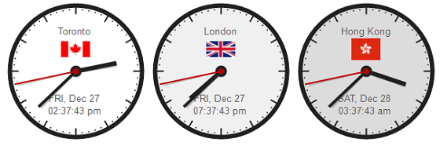
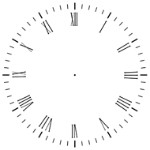
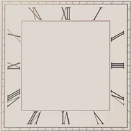

[ Home ](https://github.com/VFPX/Win32API)  

# GDI+: custom Clock Control

## Before you begin:
  

On each timer tick, an instance of control creates a temporary bitmap and draws on it the clock face, then calculates hand angles and draws the hands. Once all drawing is complete the temporary bitmap (the back buffer) is copied to the control rectangle (the front buffer).   

Such [double buffering](http://en.wikipedia.org/wiki/Multiple_buffering) allows drawing graphics with less flicker and tearing.  

The code is based on:  
* [custom GDI+ class](sample_450.md)  
* [base GDI+ control](sample_599.md)  

Download both classes and save them as **gdiplus.prg** and **BaseControl.prg** respectively.  

  
***  


## Code:
```foxpro  
SET PROCEDURE TO gdiplus ADDITIVE
SET PROCEDURE TO basecontrol ADDITIVE

_screen.AddObject("CustomClock1", "CustomClock")

WITH _screen.CustomClock1
	.BackStyle=0
	.Left=5
	.Top=5
	.ClockfaceCaption="London"
	.IsLocalTime=.F.
	.StandardBias=0
	.ClockfaceColor=RGB(255,255,255)
	.Visible = .T.
	.StartClock
ENDWITH
* end of main

DEFINE CLASS CustomClock as GdiplusControl
PROTECTED ClockfaceImage, hIcon,;
	ClockfaceIcon, BodyFont

	BorderWidth=0
	Width=160
	Height=160

	ClockfaceCaption=""
	ClockfaceFile=""
	ClockfaceIconFile=""
	
	CurrentTime=DTOT(DATE())
	IsLocalTime=.T.
	StandardBias=0
	
	hIcon=0
	ClockfaceIcon=NULL
	BodyFont=NULL
	ClockfaceImage=NULL

	ClockfaceColor=RGB(255,255,255)
	RimColor=RGB(32,32,32)
	HandColor=RGB(32,32,32)
	SecondHandColor=RGB(192,0,0)
	HandShadowColor=RGB(96,96,96)
	TimeTextColor=RGB(96,96,96)
	
	DIMENSION InfoStrings(3, 2)

	ADD OBJECT Timer1 as Timer WITH;
		Enabled=.F., Interval=200

PROCEDURE Init
	GdiplusControl::Init

	WITH THIS
		.InitClockIcon
	ENDWITH

PROCEDURE ReleaseGdiplusObjects
	WITH THIS
		.StopClock
		.ClockfaceImage=NULL
		.ClockfaceIcon=NULL
		.BodyFont=NULL
		.ReleaseClockIcon
	ENDWITH

PROCEDURE ClockfaceFile_ASSIGN(cFilename)
	THIS.ClockfaceFile = FULLPATH(m.cFilename)
	THIS.ClockfaceImage = NULL

PROCEDURE ClockfaceIconFile_ASSIGN(cFilename)
	WITH THIS
		.ClockfaceIconFile = cFilename
		.InitClockIcon
	ENDWITH
	
PROCEDURE StartClock
	THIS.BindEvents
	THIS.Timer1.Enabled=.T.

PROCEDURE StopClock
	THIS.Timer1.Enabled=.F.

PROCEDURE Timer1.Timer
	THIS.Parent.DrawFrame
	
PROCEDURE GetCurrentTime
RETURN IIF(THIS.IsLocalTime, DATETIME(),;
	THIS.GetSysTime() + THIS.StandardBias * 3600)

PROCEDURE GetClockIconHandle
#DEFINE MAX_PATH 260
	LOCAL cBuffer, nBufsize, nIconIndex, hIcon
	
	IF FILE(THIS.ClockfaceIconFile)
		hIcon = ExtractAssociatedIcon(0, THIS.ClockfaceIconFile, 0)
		IF hIcon <> 0
			RETURN hIcon
		ENDIF
	ENDIF

	cBuffer = REPLICATE(CHR(0), MAX_PATH)
	nBufsize = GetModuleFileName(0, @cBuffer, MAX_PATH)
	cBuffer = LEFT(cBuffer, nBufsize)
	nIconIndex = 1  && try from 0 and up
RETURN ExtractAssociatedIcon(0, cBuffer, @nIconIndex)

PROCEDURE ReleaseClockIcon
	WITH THIS
		.ClockfaceIcon=NULL
		IF .hIcon <> 0
			DestroyIcon(.hIcon)
			.hIcon = 0
		ENDIF
	ENDWITH

PROCEDURE InitClockIcon
* icon to be displayed on clockface
	THIS.ReleaseClockIcon

	LOCAL hIcon
	hIcon = THIS.GetClockIconHandle()
	
	IF hIcon = 0
		RETURN
	ENDIF

	WITH THIS
		.hIcon = m.hIcon
		.ClockfaceIcon = CREATEOBJECT("gdibitmap")
		.ClockfaceIcon.CreateFromHICON(.hIcon)
		.ClockfaceIcon.graphics.SmoothingMode = 4
	ENDWITH

FUNCTION GetSysTime()
	LOCAL cBuffer, nYear, nMonth, nDay,;
		nHour, nMinute, nSecond,;
		vStoredSet, cDate, cTime, tResult
	
	cBuffer = REPLICATE(CHR(0), 16)
	= GetSystemTime(@cBuffer)

	nYear = THIS.buf2word(SUBSTR(m.cBuffer,  1, 2))
	nMonth = THIS.buf2word(SUBSTR(m.cBuffer,  3, 2))
	nDay = THIS.buf2word(SUBSTR(m.cBuffer,  7, 2))
	nHour = THIS.buf2word(SUBSTR(m.cBuffer,  9, 2))
	nMinute = THIS.buf2word(SUBSTR(m.cBuffer, 11, 2))
	nSecond = THIS.buf2word(SUBSTR(m.cBuffer, 13, 2))

	vStoredSet = SET("DATE")
	SET DATE TO MDY

	cDate = STRTRAN(STR(nMonth,2) + "/" + STR(nDay,2) +;
		"/" + STR(nYear,4), " ","0")

	cTime = STRTRAN(STR(nHour,2) + ":" + STR(nMinute,2) +;
		":" + STR(nSecond,2), " ","0")

	tResult = CTOT(m.cDate + " " + m.cTime)
	SET DATE TO (m.vStoredSet)
RETURN m.tResult

PROCEDURE declare
	GdiplusControl::declare
	
	DECLARE INTEGER ExtractAssociatedIcon IN shell32;
		INTEGER hInst, STRING lpIconPath, INTEGER @lpiIcon

	DECLARE INTEGER GetModuleFileName IN kernel32;
		INTEGER hModule, STRING @lpFilename, INTEGER nSize

	DECLARE INTEGER DestroyIcon IN user32 INTEGER hIcon
	DECLARE GetSystemTime IN kernel32 STRING @ lpSystemTime

PROCEDURE InitBuffers
	IF VARTYPE(THIS.oBackBuffer) = "O"
		RETURN
	ENDIF

	THIS.InitClockface
	GdiplusControl::InitBuffers

PROCEDURE InitClockface
	IF NOT EMPTY(THIS.ClockfaceFile) AND;
		FILE(THIS.ClockfaceFile)
		THIS.ClockfaceImage =;
			CREATEOBJECT("gdiimage", THIS.ClockfaceFile)
	ENDIF
	
	IF VARTYPE(THIS.ClockfaceImage) <> "O" OR;
		THIS.ClockfaceImage.imgwidth = 0
		THIS.CreateGenericClockface
	ENDIF
	
	IF VARTYPE(THIS.ClockfaceImage) = "O";
		AND THIS.ClockfaceImage.imgwidth > 0
		THIS.Width = THIS.ClockfaceImage.imgwidth
		THIS.Height = THIS.ClockfaceImage.imgheight
	ENDIF

PROCEDURE CreateGenericClockface
	THIS.ClockfaceImage = CREATEOBJECT(;
		"gdibitmap", THIS.Width, THIS.Height)
		
	WITH THIS.ClockfaceImage
		.graphics.SmoothingMode = 2

		.graphics.FillEllipse(;
			ColorToARGB(ThisForm.BackColor, 255),;
			0, 0,;
			THIS.Width,;
			THIS.Height)

		.graphics.FillEllipse(;
			ColorToARGB(THIS.ClockfaceColor, 255),;
			1, 1,;
			THIS.Width - 2,;
			THIS.Height - 2)
	
		* the outer circle
		LOCAL objPen
		
		objPen = CREATEOBJECT(;
			"gdipen", ColorToARGB(THIS.RimColor, 255), 6)
		
		.graphics.DrawEllipse(;
			objPen,;
			4, 4,;
			THIS.Width - 8,;
			THIS.Height - 8)

		FOR nMinute=0 TO 59
			THIS.DrawMinuteDot(nMinute)
		ENDFOR

		.graphics.FillEllipse(;
			ColorToARGB(THIS.ClockfaceColor, 255),;
			16, 16,;
			THIS.Width - 32,;
			THIS.Height - 32)

	ENDWITH

PROCEDURE DrawMinuteDot(nMinute)
	LOCAL nRad, nX, nY, nColor, nSize, objPen

	nRad = DTOR(nMinute * 6 + 90)
	nColor = ColorToARGB(THIS.RimColor, 255)
	
	IF MOD(nMinute, 5) = 0
	* larger dot
	
		nY = SIN(nRad) * (this.Height / 2) * 0.95
		nX = COS(nRad) * (this.Width / 2) * 0.95

		objPen = CREATEOBJECT(;
			"gdipen", nColor, 2)
		
		WITH THIS.ClockfaceImage
			.graphics.DrawLine(;
				objPen,;
				this.Width/2, this.Height/2,;
				(this.Width/2) + nX,;
				(this.Height/2) + nY)
		ENDWITH
	
	ELSE
	* regular dot
		nY = SIN(nRad) * (this.Height / 2) * 0.9
		nX = COS(nRad) * (this.Width / 2) * 0.9
		nSize = 2
	
		WITH THIS.ClockfaceImage
			.graphics.FillEllipse(;
				nColor,;
				(this.Width/2) + nX - (nSize/2),;
				(this.Height/2) + nY - (nSize/2),;
				nSize,;
				nSize)
		ENDWITH
	ENDIF

PROCEDURE DrawHourHand
	LOCAL nAngle
	
	nAngle = (60 * HOUR(THIS.CurrentTime) +;
		MINUTE(THIS.CurrentTime)) / 2
		
	THIS.DrawHand(;
			6,;
			ColorToARGB(THIS.HandColor, 255),;
			nAngle, 0.6)

PROCEDURE DrawMinuteHand
	LOCAL nAngle
	
	nAngle= (MINUTE(THIS.CurrentTime) +;
		(SEC(THIS.CurrentTime)/60)) * 6

	THIS.DrawHand(;
			4,;
			ColorToARGB(THIS.HandColor, 255),;
			nAngle, 0.75)

PROCEDURE DrawSecondHand
	LOCAL nColor
	nColor = ColorToARGB(THIS.SecondHandColor, 255)
	
	THIS.DrawHand(;
			2,;
			nColor,;
			SEC(THIS.CurrentTime) * 6, 0.90)

	WITH THIS.oBackBuffer
		.graphics.FillEllipse(;
			m.nColor,;
			this.Width/2-4,;
			this.Height/2-4,;
			8, 8)

		.graphics.FillEllipse(;
			ColorToARGB(THIS.RimColor, 255),;
			this.Width/2-1,;
			this.Height/2-1,;
			2, 2)
	ENDWITH

PROCEDURE DrawHand(nWidth, nColor,;
			nAngle, nRadius)

	LOCAL nRad, nX, nY, objPen, objPen1
	nRad = DTOR(nAngle + 90)
	
	nY = SIN(nRad) * (this.Height / 2) * nRadius
	nX = COS(nRad) * (this.Width / 2) * nRadius
	
	objPen = CREATEOBJECT(;
		"gdipen", nColor, nWidth)

	objPen1 = CREATEOBJECT(;
		"gdipen", ColorToARGB(THIS.HandShadowColor, 96), nWidth)

	WITH THIS.oBackBuffer
		* casts a shadow
		.graphics.DrawLine(;
			objPen1,;
			this.Width/2, this.Height/2,;
			(this.Width/2) - nX * 0.975 + 2,;
			(this.Height/2) - nY * 0.975 + 2)

		.graphics.DrawLine(;
			objPen,;
			this.Width/2, this.Height/2,;
			(this.Width/2) - nX,;
			(this.Height/2) - nY)
	ENDWITH

PROCEDURE DrawClockface
	IF VARTYPE(THIS.ClockfaceImage) = "O" AND;
		THIS.ClockfaceImage.imgwidth > 0
	* draws clock face image on the back buffer
		WITH THIS.oBackBuffer
			.graphics.DrawImage(;
				THIS.ClockfaceImage,;
				0, 0)
		ENDWITH
	ELSE
		WITH THIS.oBackBuffer
			.graphics.FillRectangle(;
				ColorToARGB(THIS.ClockfaceColor, 255),;
				0, 0, THIS.Width, THIS.Height)
		ENDWITH
	ENDIF

PROCEDURE DrawClockfaceIcon
	IF VARTYPE(THIS.ClockfaceIcon) <> "O";
		OR THIS.ClockfaceIcon.imgwidth = 0
		RETURN
	ENDIF

	WITH THIS.oBackBuffer
		LOCAL nIconX, nIconY
		nIconX = THIS.Width/2 -;
			(THIS.ClockfaceIcon.imgwidth/2)

		nIconY = THIS.Height/2 -;
			THIS.ClockfaceIcon.imgheight - 10
		
		.graphics.DrawImage(;
			THIS.ClockfaceIcon,;
			nIconX,;
			nIconY)
	ENDWITH

PROTECTED PROCEDURE FillInfoStrings()
	THIS.InfoStrings[1, 1] =;
		UPPER(PADR(CDOW(THIS.CurrentTime), 3)) + ", " +;
		PADR(CMONTH(THIS.CurrentTime), 3) + " " +;
		TRANSFORM(DAY(THIS.CurrentTime))

	cTime = TRANSFORM(THIS.CurrentTime)
	
	THIS.InfoStrings[2, 1] =;
		LOWER(SUBSTR(cTime, AT(" ", cTime) + 1))
	
	THIS.InfoStrings[3, 1] = THIS.ClockfaceCaption

PROCEDURE DrawInfoStrings
	LOCAL oRect, nStartX, nStartY, cStr

	THIS.FillInfoStrings()

	IF VARTYPE(THIS.BodyFont) <> "O"
		THIS.BodyFont = CREATEOBJECT(;
				"gdifont", "Arial", 8, 0,;
				ColorToARGB(THIS.TimeTextColor, 255))
	ENDIF

	WITH THIS.oBackBuffer
		* measures the string
		* before centering it horizontally
		THIS.InfoStrings[1, 2] = .graphics.MeasureString(;
			THIS.InfoStrings[1, 1], THIS.BodyFont)

		THIS.InfoStrings[2, 2] = .graphics.MeasureString(;
			THIS.InfoStrings[2, 1], THIS.BodyFont)

		THIS.InfoStrings[3, 2] = .graphics.MeasureString(;
			THIS.InfoStrings[3, 1], THIS.BodyFont)

		nStartY = THIS.Height/2 +;
			(THIS.Height/2 -;
			 THIS.InfoStrings[1, 2].rheight * 2) / 2

		cStr = THIS.InfoStrings[1, 1]
		oRect = THIS.InfoStrings[1, 2]
		nStartX = THIS.Width/2 - oRect.rwidth/2
		
		.graphics.DrawText(;
			m.cStr,;
			THIS.BodyFont,;
			nStartX,;
			nStartY,;
			oRect.rwidth,;
			oRect.rheight)

		cStr = THIS.InfoStrings[2, 1]
		oRect = THIS.InfoStrings[2, 2]
		nStartX = THIS.Width/2 - oRect.rwidth/2
		
		.graphics.DrawText(;
			m.cStr,;
			THIS.BodyFont,;
			nStartX,;
			nStartY + oRect.rheight,;
			oRect.rwidth,;
			oRect.rheight)

		cStr = THIS.InfoStrings[3, 1]
		oRect = THIS.InfoStrings[3, 2]
		nStartX = THIS.Width/2 - oRect.rwidth/2
		
		.graphics.DrawText(;
			m.cStr,;
			THIS.BodyFont,;
			nStartX,;
			oRect.rheight * 2,;
			oRect.rwidth,;
			oRect.rheight)
	ENDWITH

PROCEDURE DrawHands
	WITH THIS
		* center dot
		.oBackBuffer.graphics.FillEllipse(;
			ColorToARGB(THIS.HandColor, 255),;
			THIS.Width/2-8, THIS.Height/2-8,;
			16, 16)

		.DrawHourHand
		.DrawMinuteHand
		.DrawSecondHand
	ENDWITH

PROCEDURE DrawOnBackBuffer(lEnabled as Boolean)
	WITH THIS
		.CurrentTime = .GetCurrentTime()
		.DrawClockface
		.DrawClockfaceIcon
		.DrawInfoStrings
		.DrawHands
	ENDWITH

ENDDEFINE  
```  
***  


## Listed functions:
[DestroyIcon](../libraries/user32/DestroyIcon.md)  
[ExtractAssociatedIcon](../libraries/shell32/ExtractAssociatedIcon.md)  
[GetModuleFileName](../libraries/kernel32/GetModuleFileName.md)  
[GetSystemTime](../libraries/kernel32/GetSystemTime.md)  

## Comment:
Wikipedia: <a href="http://en.wikipedia.org/wiki/Clock_angle_problem">Clock angle problem</a>  
  
By default the drawing procedure produces a generic picture of a clock. Otherwise set the *ClockfaceFile* parameter to a valid image file of a clock face.  
  
Download one of these images and use it as a clock face (the ClockfaceFile parameter). Otherwise the instance will create a generic image of clock face.  
  
  
  

Such background image should be well centered and with sufficiently good symmetry.  
  
* * *  
For a generic clock face, ideally all sizes and dimensions should derive from the radius. That would provide better scalability comparing to what this particular code sample can do having all sizes hard-coded.  
  
Ideally the clock image should be drawn by a dedicated thread, which requires FLL or ActiveX implementation.  
  
With VFP implementation, whenever the VFP process becomes busy with  a task, this immediately affects the clock drawing procedure -- the movement of the seconds hand becomes less regular with some jumps and stops.  
  
Lower Timer Interval values, for example 16 milliseconds,  may allow implementing completely smooth movement of the seconds hand.  I.e. the hand does not jump from one second mark to the next one  but rather rotates with a constant speed. But again this can only be done in ActiveX or FLL implementation, one that allows creating  a dedicated drawing thread.  
  
***  

