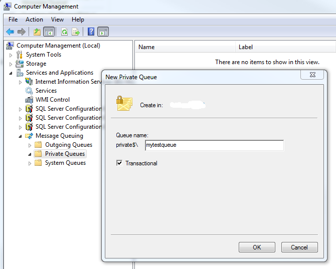

[ Home ](https://github.com/VFPX/Win32API)  

# MSMQ: how to open a queue

## Code:
```foxpro  
#DEFINE MQ_OK 0

#DEFINE MQ_ERROR_FORMATNAME_BUFFER_TOO_SMALL 0xC00E001F
#DEFINE MQ_ERROR_QUEUE_NOT_FOUND 0xC00E0003
#DEFINE MQ_ERROR_INVALID_HANDLE 0xC00E0007

#DEFINE MQ_RECEIVE_ACCESS 1
#DEFINE MQ_SEND_ACCESS 2
#DEFINE MQ_PEEK_ACCESS 32

#DEFINE MQ_DENY_NONE 0
#DEFINE MQ_DENY_RECEIVE_SHARE 1
DO declare

LOCAL cQueueName, cFormatName, nLength, nResult

* MQPathNameToFormatName fails if a queue name is invalid etc.
cQueueName = STRCONV(".\private$\mytestqueue" + CHR(0),5)

nLength = 0
nResult = MQPathNameToFormatName(cQueueName, NULL, @nLength)

IF nLength = 0
	? "MQPathNameToFormatName failed:", TRANSFORM(nResult, "@0")
	RETURN
ENDIF

cFormatName = REPLICATE(CHR(0), nLength * 2)
nResult = MQPathNameToFormatName(cQueueName, @cFormatName, @nLength)

IF nResult = MQ_OK
	* DIRECT=OS:[server name]\private$\mytestqueue
	? STRTRAN(cFormatName, CHR(0), "")
ELSE
	? "MQPathNameToFormatName failed:", TRANSFORM(nResult, "@0")
	RETURN
ENDIF

LOCAL hQueue

hQueue = 0
nResult = MQOpenQueue(cFormatName,;
	MQ_PEEK_ACCESS, MQ_DENY_NONE, @hQueue)

IF nResult <> MQ_OK
	? "MQOpenQueue failed:", TRANSFORM(nResult, "@0")
ENDIF

IF hQueue <> 0
	? "Queue opened:", hQueue
	? "Queue closed:", MQCloseQueue(hQueue)
ENDIF
* end of main

PROCEDURE declare
	DECLARE INTEGER MQPathNameToFormatName IN mqrt;
		STRING lpwcsPathName, STRING @lpwcsFormatName,;	
		INTEGER @lpdwCount

	DECLARE INTEGER MQOpenQueue IN mqrt;
		STRING lpwcsFormatName, INTEGER dwAccess,;
		INTEGER dwShareMode, INTEGER @phQueue

	DECLARE INTEGER MQCloseQueue IN mqrt;
		INTEGER hQueue  
```  
***  


## Listed functions:
[MQCloseQueue](../libraries/mqrt/MQCloseQueue.md)  
[MQOpenQueue](../libraries/mqrt/MQOpenQueue.md)  
[MQPathNameToFormatName](../libraries/mqrt/MQPathNameToFormatName.md)  

## Comment:
Same functionality can be accessed via [MSMQ.MSMQQueueInfo COM components](https://msdn.microsoft.com/en-us/library/ms704064(v=vs.85).aspx)  
  
```foxpro
#DEFINE MQ_PEEK_ACCESS 32  
#DEFINE MQ_DENY_NONE 0  
  
LOCAL oQueueInfo as MSMQ.MSMQQueueInfo  
oQueueInfo = CREATEOBJECT("MSMQ.MSMQQueueInfo")  
  
oQueueInfo.FormatName = "DIRECT=OS:[computer name]\private$\samplequeue"  
oQueueInfo.Open(MQ_PEEK_ACCESS, MQ_DENY_NONE)  
  
? oQueueInfo.QueueGuid  
? oQueueInfo.ServiceTypeGuid  
? oQueueInfo.IsTransactional2  
? oQueueInfo.PathName  
? oQueueInfo.PathNameDNS  
? oQueueInfo.CreateTime  
? oQueueInfo.ModifyTime  
? oQueueInfo.Label  
? oQueueInfo.Quota  
? oQueueInfo.Journal  
? oQueueInfo.JournalQuota  
? oQueueInfo.MulticastAddress
```
  
 
  
  
***  

